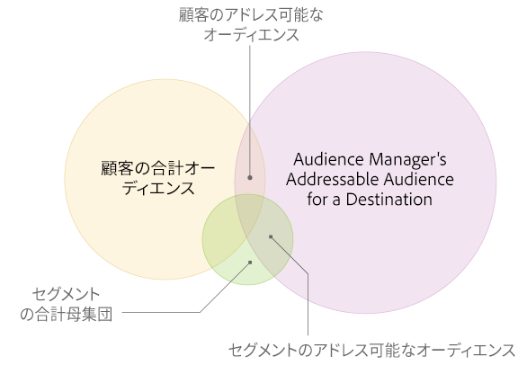

# [!UICONTROL Addressable Audiences] {#addressable-audiences}

[!UICONTROL Addressable Audience]の機能およびユースケースの概要です。

##  [!UICONTROL Addressable Audience]とは {#addressable-audience-description}

[!UICONTROL Addressable Audiences]では、[!DNL Audience Manager] がデータを収集している御社のすべてのシステムと選択された宛先との間のオーディエンスの重複を表示します。この概念を理解するには、次の図を参照してください。各円の重複は、各種のアドレス可能なオーディエンスを示します。

| 指標 | 説明 |
|---|---|
| [!UICONTROL Destination] の [!UICONTROL Audience Manager Addressable Audience] | プラットフォームレベルにおいて、レポートのルックバック期間に [!DNL Audience Manager] のお客様とのやり取りがあり、選択した[!UICONTROL destination]と一致するデバイスの総数。  この指標は次の情報が得られるため便利です。 <ul><li>[!DNL Audience Manager] がターゲットとする特定の[!UICONTROL destination]に到達できる[!UICONTROL addressable audience]の合計サイズ。</li><li>ターゲットプラットフォームについての [!DNL Audience Manager] のプロファイルプールの規模、およびそのオーディエンスのサイズ。</li></ul> |
| [!UICONTROL Customer Total Audience] | ルックバック期間に、御社のシステムにおける[!UICONTROL rule-based trait]、またはオフラインファイルからの[!UICONTROL onboarded trait]に適合したデバイスの数。 |
| [!UICONTROL Addressable Audience Match Rate] | ルックバック期間に[!UICONTROL rule-based trait]または[!UICONTROL onboarded trait]に適合したデバイスと、同期のタイミングを問わず、選択した[!UICONTROL destination]との ID 同期がおこなわれたデバイスの間の重複数。  この指標は次のようなデバイスを表しています。<ul><li>ルックバック期間中に、[!UICONTROL rule-based]または[!UICONTROL onboarded trait]が適合されている`AND`</li><li>同期の時間に関係なく、選択した[!UICONTROL destination]と ID が同期している。</li> |
| [!UICONTROL Customer Match Rate] | [!UICONTROL Customer Addressable Audience] ÷ [!UICONTROL Customer Total Audience] は、割合で表されます。 |
| [!UICONTROL Total Segment Population] | レポートのルックバック期間内に[!UICONTROL segment]に属していたすべてのデバイスの数。 |
| [!UICONTROL Segment Addressable Audience] | レポートのルックバック期間中に[!UICONTROL segment]に属しており、サイト上で ID 同期がアクティブとなっているユーザーの数。[!UICONTROL Segments]には、[Audience Marketplace](../features/audience-marketplace/marketplace-data-buyers/marketplace-data-buyers.md) で取得した[!UICONTROL traits]経由で、自社のファーストパーティデータと、セカンドパーティおよびサードパーティデータを含めることができます。  ヒント：ルックバック期間を 1 日にした場合、この指標は[!UICONTROL segments]の現在の状態を把握するのに役立ちます。これは、[!UICONTROL Segment Addressable Audience]の指標が、前日の 1 日を通して[!UICONTROL segment]に適合したユーザー数を示すためです。このことと、[!DNL Audience Manager] では[!UICONTROL Addressable Audiences]が毎日更新されることを踏まえて、この指標とルックバック期間を組み合わせれば、[!UICONTROL segments]に関する最新のスナップショットを得ることができます。 |
| [!UICONTROL Segment Match Rate] | [!UICONTROL Segment Addressable Audience] ÷ [!UICONTROL Total Segment Population] は、割合で表されます。 |

## [!UICONTROL Addressable Audiences] インターフェイス {#addressable-audience-interface}

[!UICONTROL Addressable Audience]機能は、この抽象的な概念を定量化可能データに変換します。[!DNL Audience Manager] は、一目でわかる視覚化された情報と表形式の数値データによってオーディエンスの重複を表示します。

[!UICONTROL Addressable Audiences]は&#x200B;**[!UICONTROL Audience Data > Destinations]**&#x200B;にあります。「**[!UICONTROL Integrated Platforms > Device-Based]**」を選択して、アドレス可能なオーディエンス指標を表示します。

[!UICONTROL Addressable Audiences]のランディングページには、次の 3 つの指標が表示されます。

| 指標 | 説明 |
---------|----------|
| **[!UICONTROL Addressable Audience (Device)]** | この指標は、*過去 30 日間*&#x200B;のお客様の[!UICONTROL Customer Addressable Audience]（上記の表で説明）を表します。 |
| **[!UICONTROL Match Rate]** | この指標は、*過去 30 日間*&#x200B;のお客様の[!UICONTROL Addressable Audience Match Rate]（上記の表で説明）を表します。 |
| **[!UICONTROL Lifetime Addressable Audience (Device)]** | プラットフォームレベルにおいて、レポートのルックバック期間に [!DNL Audience Manager] のお客様とのやり取りがあり、この[!UICONTROL destination]と一致するデバイスの総数。詳しくは、[プラットフォームレベルの指標](/help/using/features/addressable-audiences.md#platform-level-metrics)を参照してください。 |

[!UICONTROL server-to-server destination] の名前をクリックし、アドレス可能なオーディエンスデータを表示します。この機能は [!UICONTROL server-to-server destinations] のデータのみを返し、アクセスには管理者権限が必要です。

このデータは以下の目的に使用できます。

* **予測と計画：**[!UICONTROL Segment Addressable Audience]データは、オーディエンスのターゲティングおよびアクティベーションをおこなうために、宛先に送ろうとしているセグメントに関する、より詳細な情報を提供します。

* **パフォーマンスのレビュー：**[!UICONTROL Addressable Audiences]機能は、トラブルシューティングのツールでもあります。キャンペーンのパフォーマンスをレビューしてキャンペーンでリーチできた範囲を把握し、期待した結果が得られなかった場合は、ターゲティング／アクティベーションパートナーも含めて多角的に確認することができます。

### サードパーティデータの予測およびマッチ率に対する示唆

オーディエンスを獲得するためにサードパーティデータを購入する前に、他のデータプロバイダーとの重複を検証することができます。これにより、新しいデータを購入する前に、十分な情報に基づいた意思決定が可能になります。購入したサードパーティデータの ID 同期は、データの重複だけでなく、サードパーティプロバイダーと [!DNL Audience Manager] の他のあらゆるお客様との関連にも影響されます。[!DNL Adobe]の担当コンサルタントは、関連性のある他のデータソースを特定し、今後見込まれるキャンペーンを最適化するお手伝いをします。

### モバイルユーザーとマッチ率

サードパーティの [!DNL cookies] が存在しない [!DNL Safari] やモバイルアプリのユーザーとの同期では、数値の不一致が生じます。メディアの配信ログでは、同期されたサードパーティの [!DNL cookies] に対する [!DNL Adobe] ID のみが提供されるので、パートナーによってはユーザーとの同期が困難になります。この結果、[!UICONTROL destinations]の[マッチ率が低下](../features/addressable-audiences.md#low-match-rates)する可能性があります。

## [!UICONTROL Addressable Audiences] および [!UICONTROL Destinations] の日付範囲 {#date-ranges}

以下のセクションを読み、使用可能な日付範囲について、および [!UICONTROL Addressable Audience] または [!UICONTROL Destination] のレポートのそれぞれの間隔からのデータ経過時間を確認します。

## 利用可能な日付範囲およびタイムゾーン {#available-date-ranges}

<!-- addressable-audience-dates.xml -->

[!UICONTROL Addressable Audiences]と[宛先](../features/destinations/destinations.md)のレポートでは、同じ日付範囲の間隔が使用されます。日付範囲には以下のオプションがあります。

* [!UICONTROL Last 1 Day]（直前の 24 時間の午前 0 時から午前 0 時までがこの期間となります。実際の時刻または現在の時刻に基づく指標ではありません）。
* [!UICONTROL Last 7 Days]
* [!UICONTROL Last 14 Days]
* [!UICONTROL Last 30 Days]
* [!UICONTROL Last 60 Days]
* [!UICONTROL Last 90 Days]
* [!UICONTROL Lifetime]

すべての日付および日付範囲は [!DNL UTC] タイムゾーンで設定されます。[Audience Manager のタイムゾーン](../reference/aam-time-zones.md)を参照してください。

## 日付範囲の期間内のデータ {#date-range-intervals}

[!UICONTROL Addressable Audience]および[!UICONTROL Destination]指標は、選択した時間間隔内に訪れた個別ユーザーの数を返します。例えば、1 人の訪問者は複数回サイトに訪れた場合でも、1 回のみカウントされます。初回の訪問が一意の訪問となり、これが記録されます。それ以降の訪問は再訪問となり、一意ではないためカウントされません。

選択した時間間隔内かそれより古いデータが日付範囲に含まれ、時間の経過に伴い、それぞれのレポート期間から外れていきます。例えば、[!UICONTROL Last 30 Days]オプションを選択した後、2 人の訪問者が訪れたとします。レポートでは、これらの訪問者は：

* これより長い期間（60 日、90 日、全期間）に対して返される結果に&#x200B;*含まれます*。
* [!UICONTROL Last 30 Day]より短い期間のオプション（現在、7 日、14 日）には&#x200B;*含まれません*。

また、31 日目には、これらの訪問者は 60 日、90 日、[!UICONTROL Lifetime]の結果にのみ含められます。これは、30 日の期間を超えたからです。訪問者は[!UICONTROL Lifetime]より古くなることはありません。

## [!UICONTROL Addressable Audiences] 指標 {#addressable-audience-metrics}

ここでは、[!UICONTROL Addressable Audiences] で提供される指標のタイプについて説明します。

### お客様レベルの指標 {#customer-level-metrics}

<!-- addressable-audience-metrics.xml -->

これらの指標は訪問者がサイトに訪れたとき、または [!DNL Audience Manager] にインバウンドデータファイルを送信したときに適合した特性のデータを返します。これらの指標は、お客様のアカウントに対応するオーディエンスサイズに関し、包括的な情報を提供します。

| 指標 | 説明 |
|---|---|
| [!UICONTROL Customer Addressable Audience] | ルックバック期間に[!UICONTROL rule-based trait]または[!UICONTROL onboarded trait]に適合したデバイスと、同期のタイミングを問わず、選択された宛先との ID 同期がおこなわれたデバイスの間の重複数。  この指標は次のようなデバイスを表しています。<ul><li>ルックバック期間中に、[!UICONTROL rule-based]または[!UICONTROL onboarded trait]が適合されている`AND`</li><li>同期の時間に関係なく、選択した[!UICONTROL destination]と ID が同期している。</li></ul> |
| [!UICONTROL Customer Total Audience] | ルックバック期間に、御社のシステムにおける[!UICONTROL rule-based trait]、またはオフラインファイルからの[!UICONTROL onboarded trait]に適合したデバイスの数。 |
| [!UICONTROL Customer Match Rate] | [!UICONTROL Customer Addressable Audience] ÷ [!UICONTROL Customer Total Audience] は、割合で表されます。 |

### セグメントレベルのマッチ率の指標  {#segment-level-metrics}

これらの指標は[!UICONTROL segment]のメンバーシップについてのデータを返します。これらは各[!UICONTROL segments]について、オーディエンスサイズに関するより詳細で正確な情報を提供します。

>[!NOTE]
>
>[!UICONTROL segment]レベルとお客様レベルでは、ルックバック期間の適用のされ方が異なります。10 日前に訪問者がサイトに訪れてある[!UICONTROL trait]に適合した場合、その後[!UICONTROL segment]適合状態を維持し、2 日前に[!UICONTROL segment]の適合が解除されます。7 日間のルックバック期間が適用された場合、これらの訪問者は[!UICONTROL segment]レベルではカウントされますが、お客様レベルではカウントされません。

| 指標 | 説明 |
|---|---|
| [!UICONTROL Segment Addressable Audience] | レポートのルックバック期間中に[!UICONTROL segment]に属しており、サイト上で ID 同期がアクティブとなっているユーザーの数。セグメントには、[Audience Marketplace](../features/audience-marketplace/marketplace-data-buyers/marketplace-data-buyers.md) で取得した[!UICONTROL traits]経由で、自社のファーストパーティデータと、セカンドパーティおよびサードパーティデータを含むことができます。  ヒント：ルックバック期間を 1 日にした場合、この指標は[!UICONTROL segments]の現在の状態を把握するのに役立ちます。これは、[!UICONTROL Segment Addressable Audience]の指標が、前日の 1 日を通して[!UICONTROL segment]に適合したユーザー数を示すためです。このことと、[!DNL Audience Manager] では[!UICONTROL Addressable Audiences]が毎日更新されることを踏まえて、この指標とルックバック期間を組み合わせれば、[!UICONTROL segments]に関する最新のスナップショットを得ることができます。 |
| [!UICONTROL Total Segment Population] | レポートのルックバック期間内に[!UICONTROL segment]に属していたすべてのデバイスの数。 |
| [!UICONTROL Segment Match Rate] | [!UICONTROL Segment Addressable Audience] ÷ [!UICONTROL Total Segment Population] は、割合で表されます。 |

### プラットフォームレベルの指標 {#platform-level-metrics}

この指標は、[!DNL Audience Manager] のすべてのお客様から収集したアクティビティについてのデータを返します。[!DNL Audience Manager] のお客様全体と比較することで、オーディエンスに関するより広い視野が得られます。

| 指標 | 説明 |
|---|---|
| [!DNL Audience Manager] [!UICONTROL Addressable Audience] | プラットフォームレベルにおいて、レポートのルックバック期間に [!DNL Audience Manager] のお客様とのやり取りがあり、選択した[!UICONTROL destination]と一致するデバイスの総数。  この指標は次の情報が得られるため便利です。<ul><li>[!DNL Audience Manager] がターゲットとする特定のターゲットとする宛先に到達できる[!UICONTROL total addressable audience]のサイズ。</li><li>ターゲットプラットフォームについての [!DNL Audience Manager] のプロファイルプールの規模、およびそのオーディエンスのサイズ。</li></ul> |

## [!UICONTROL Customer] と [!UICONTROL Segment Addressable Audiences] の比較 {#comparing-metrics}

1 つの指標が大幅に他と異なる場合、[!UICONTROL Customer Addressable Audience] と [!UICONTROL Segment Addressable Audience] の指標を比較しないでください。これらは個々に異なる独立した指標です。上記の説明のとおり、これらはそれぞれ異なるデータセットから引き出されるものです。そのため、一方の指標がもう一方の指標より大きくても、何も結論付けるべきではありません。これらの比較を通して言えるのは以下のことのみとなります。

* [!UICONTROL Customer Addressable Audiences]は、*自社のファーストパーティデータ*[!UICONTROL trait]の認定に基づきます。この指標からは、データパートナーとの統合に関して幅広い包括的な情報が得られます。

* [!UICONTROL Segment Addressable Audiences]は、*自社のファーストパーティデータとセカンドパーティおよびサードパーティデータのセグメント認定*&#x200B;に基づきます。この指標からは、ターゲットプラットフォームの[!UICONTROL addressable audiences]に関してより詳細で正確な情報が得られます。

## [!UICONTROL Addressable Audiences] のマッチ率の低下の原因 {#low-match-rates}

[!UICONTROL Addressable Audience]のマッチ率の低下またはレポートされる数値の不一致を引き起こす原因となる一般的な要素。

| 原因 | 説明 |
|---|---|
| モバイルトラフィック | [!UICONTROL server-to-server]統合の大半はサードパーティ [!DNL cookies] によって促進される同期プロセスに依拠しています。しかし、モバイル環境においては、サードパーティ [!DNL cookies] は使用されません。その結果、[!UICONTROL Addressable Audiences]の数は[!UICONTROL segment]サイズに対して少なく見えます。  2018 年 1 月以降 [!UICONTROL cookie-based]のオーディエンス用に設定された [!DNL Google] および [!DNL Adobe Advertising Cloud] の同じ宛先において、モバイルオーディエンスをアクティブ化することができるようになりました。これにより、[!DNL cookie] とモバイル ID のメンバーシップを組み合わせた[!UICONTROL segments]を [!DNL Google] および [!DNL Advertising Cloud] の宛先に送信できますが、[!UICONTROL Addressable Audiences]においては [!DNL cookie] ID と宛先の間の重複のみが表示されることに注意してください。[!DNL Audience Manager] はすべてのモバイルオーディエンスを[!UICONTROL destinations]に送信しますが、モバイルオーディエンスは[!UICONTROL Addressable Audience]の指標では測定されません。  **注意**：例えば、母集団が 1,000,000 の[!UICONTROL segment]があったとします。この[!UICONTROL segment]を [!DNL Google] または [!DNL Adobe Advertising Cloud] の宛先にマッピングすると、700,000個のデバイスを持つ[!UICONTROL Match Rate]が 70%の[!UICONTROL Addressable Audience]デバイスが表示される場合があります。700,000 を構成するメンバーシップは、[!UICONTROL destination]との ID 同期がおこなわれた [!DNL cookie] ID となります。アドレス可能なモバイル ID はこの指標では表示されないので、実際の[!UICONTROL Addressable Audience]はこれよりも大きい可能性があります。 |
| [!DNL Safari] トラフィック | [!DNL Safari] はサードパーティ [!DNL cookies] をブロックします。そのため、[!DNL Audience Manager] はと[!UICONTROL destination]の ID 同期をおこなうことができません。[ITP 2.0](https://webkit.org/blog/8311/intelligent-tracking-prevention-2-0/) の導入によって、[!UICONTROL addressable audiences]に [!DNL Safari] ユーザーが含まれなくなります。 |
| 追跡されたメディアのインプレッション | 広告サーバーにおいて推奨される慣例により、ID 同期は広告タグ内でおこなわれません。大規模なオフサイト広告をおこなう場合、これらの環境ではユーザーとサードパーティの統合先は同期されません。また、収集された大量のメディアインプレッションデータによって、[!UICONTROL addressable audience]の数が少なくなることがあります。 |

## [!UICONTROL Addressable Audiences] でのトラブルシューティング {#troubleshooting}

[!UICONTROL Addressable Audiences]はマッチ率を割り出すだけでなく、トラブルシューティングのツールとしても使用できます。

例えば、[!UICONTROL destination]にセグメントを送ったところ、その[!UICONTROL destination]についてレポートされた数値が低かったとします。[!UICONTROL Addressable Audience]の結果を確認することで、これが技術的な問題なのか、または単にマッチ率が低いだけなのかがわかります。低いマッチ率は、選択したセグメントに対して[!UICONTROL destination]が適切でないことを示します。しかし、[!DNL Audience Manager] との間で[!UICONTROL total addressable audience]の数に違いがある場合、[!UICONTROL destination]は統合や同期などの技術的問題を示しています。その場合、担当のアカウントマネージャーにお問い合わせください。
