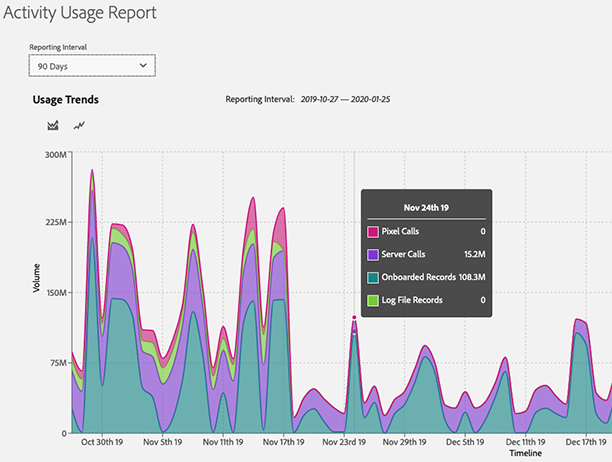

# [!UICONTROL Activity Usage Reporting] {#activity-usage-reporting}

## 概要 {#overview}

[!UICONTROL Activity Usage Report] を使用すれば、アクティビティの使用状況と契約上のコミットメントとの比較方法を明確に把握でき、Audience Manager インスタンスのアクティビティの使用状況を表示および追跡するのに役立ちます。

また、記録管理とカスタム分析のために、必要に応じていつでも [!UICONTROL Activity Usage Report] をダウンロードできます。

## 注意点 {#considerations}

[!UICONTROL Activity Usage Report] は、[管理者権限](edit-account-settings.md)を持つすべての Audience Manager ユーザーが使用できます。

>[!IMPORTANT]
>
>[!UICONTROL Activity Usage Report] は、Audience Manager インスタンスのアクティビティ使用量の統計を示します。アクティビティ使用量に関する請求のお問い合わせは、Adobe 担当者にお問い合わせください。

## ユースケース {#use-cases}

[!UICONTROL Activity Usage Report] の主な使用例は次の 2 つです。

* **アクティビティ使用量コミットメントに対する実際のインスタンスアクティビティ使用量の追跡**：ほとんどのお客様は、Audience Manager インスタンスごとに毎月のアクティビティのコミットメントを見積もった後、すべてのインスタンスをまたいだ年間のアクティビティのコミットメントに集計します。このレポートは請求レポートではありませんが、コミットされたアクティビティ使用量を超過しているかどうかを把握するのに役立ちます。
* **実装の変更の検証**：[!DNL Adobe Analytics] サーバーサイド転送の設定や サーバーコールの設定変更などの実装を最近更新した場合、このレポートを使用すれば、新しいアクティビティの量が期待したアクティビティ量と一致しているかどうかを確認できます。[!DNL Adobe Target]

## デフォルト PCID の代わりに [!UICONTROL Activity Usage Report]> {#using}

[!UICONTROL Activity Usage Report] を表示するには、Audience Manager アカウントにログインして、**[!UICONTROL Administration]**／**[!UICONTROL Usage]** に移動します。

次に、**[!UICONTROL Reporting Interval]** フィルターを使用して、レポートを生成する時間間隔を選択します。30 日、60 日、90 日、またはカスタムの日付範囲を選択できます。

レポートが読み込まれると、選択した期間の [!UICONTROL Activities] の内訳を確認できます。

[!UICONTROL Activities] では、オンサイトとオフサイトにおける Audience Manager との全インタラクションの集計を定義し、次のカテゴリに分けます。

* **[!UICONTROL Server Calls]**：Web サイト、サーバー、電子メール、モバイルアプリケーション、その他のシステムから Audience Manager に送信されるデータ収集または取得イベント。
* **[!UICONTROL Pixel Calls]（旧称 [!UICONTROL Impression Server Calls]）**：広告から収集されたデータ（ターゲットプラットフォームのインプレッション数など）または Audience Manager に対する電子メールインプレッション呼び出し。クエリ文字列内に `d_event` パラメーターが必要です。
* **[!UICONTROL On-Boarded Records]**：自社の顧客関係管理システム（CRM）や、その他のオフラインデータファイル（例：コールセンターレコード、デバイス ID、外部データプロバイダーからのカスタムデータフィード）から取り込んだ一意のレコード。
* **[!UICONTROL Log File Records]**：ターゲットプラットフォームから Audience Manager に取り込まれたログファイルの一意のレコード。

>[!NOTE]
>
>ある一意のレコードは、Audience Manager の顧客に代わってアドビが保存するファイル内のデータの個別レコードを定義します。

また、[!UICONTROL Activity Usage Trends]グラフタイプを使用して、2 種類のグラフを切り替えることもできます。

タイムラインの特定の日付にカーソルを合わせて、その日の詳細な使用状況を確認することもできます。

## [!UICONTROL Activity Usage Reports] の書き出し {#export}

Audience Manager のアクティビティの使用状況レベルをより詳細に把握するために、含めるレコードのタイプに基づいて [!UICONTROL Activity Usage Report] を書き出すことができます。

**[!UICONTROL Onboarded Records Breakdown]** レポートと **[!UICONTROL Onsite Server Calls Breakdown]** レポートは、これらのアクティビティで使用できるソースデータの最もきめ細かいインサイトを提供します。これらの分類に属するボリュームは、実装に基づきます。

### [!UICONTROL Onboarded Records Breakdown] {#onboarded-breakdown}

このレポートには、データソース別に分類されたオンボードレコードが含まれています。

### [!UICONTROL Onsite Server Calls Breakdown] {#onsite-breakdown}

このレポートには、3 つのソース（[!UICONTROL Analytics]、[!UICONTROL Target]、[!UICONTROL Other]）からのサーバーコールの分類が含まれます。

* **[!UICONTROL Analytics]**：すべての [!UICONTROL Adobe Analytics]インスタンスから Audience Manager に渡される課金対象のサーバーコール。サーバーサイド転送も含まれます。セカンダリサーバーコールまたは重複したサーバーコール（例：複数のレポートスイートからのサーバーサイド転送の場合）は課金対象のアクティビティではないので、この分類には含まれません。
* **[!UICONTROL Target]**：[!UICONTROL Adobe Target] から Audience Manager へのサーバーサイド呼び出し。サーバー間統合の一環として Audience Manager のセグメントデータを取得します。
* **[!UICONTROL Other]**：他の Web サイトまたはシステム（パートナーサイト、ダイレクトサーバーコールなど）からの呼び出し、[!DNL SDK]、[!DNL DIL]、イベント呼び出し、[!DNL DCS] 呼び出し経由でのモバイルブラウザー／アプリケーション呼び出しが含まれます。また、cookie 統合（サーバー間ではなく）として設定されている場合は [!DNL Target] 呼び出しも含まれます。
