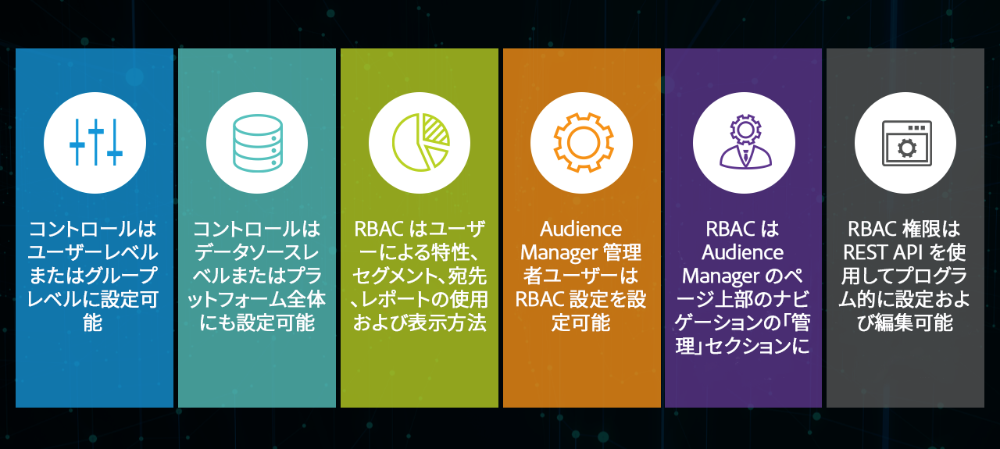
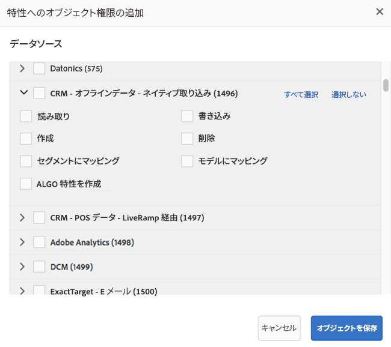

# [!UICONTROL Administration]（RBAC の制御）{#administration}

>[!IMPORTANT]
>
> ユーザーアカウント管理は [Admin Console](https://helpx.adobe.com/jp/enterprise/using/admin-console.html) に移行されます。 ユーザーの移行を開始するには、すべての Audience Manager のお客様は、『[Admin Console への Audience Manager ユーザーの移行](admin-console-migration.md)』で説明されている必要な措置を直ちに取る必要があります。
> 
> すべてのお客様が移行した後、この文書の「ユーザー管理」節は廃止されます。

[!UICONTROL Administration] メニューのオプションを使用すると、Audience Manager ユーザーを作成してグループに割り当てることができます。また、制限（特性、セグメント、宛先、モデル）を表示することもできます。

[!DNL Audience Manager] をご使用のエンタープライズのお客様が必要としているのは、すべてのデータを 1 つのデータ管理プラットフォームで管理しながら、ビジネスユニットに応じて異なるデータ要素を表示できる機能です。グループ権限を使用してこれを実現でき、[!UICONTROL Role-Based Access Control]（[!UICONTROL RBAC]）とも呼ばれます。

[!DNL Audience Manager] は権限の割り当てにグループを使用します。権限はユーザー単位では割り当てられません。グループ権限はオブジェクト（[!UICONTROL traits]やセグメントなど）、また、これらのオブジェクトに対して実行するアクション（編集や表示など）に関連付けられます。これらのコントロールは、Audience Manager REST API からも利用できます。[ユーザー管理](/help/using/api/rest-api-main/aam-api-user-group-permission/aam-api-user.md)、[グループ管理](/help/using/api/rest-api-main/aam-api-user-group-permission/aam-api-group.md)、および[権限管理](/help/using/api/rest-api-main/aam-api-user-group-permission/aam-api-permissions.md) API メソッドを参照してください。

## ユーザーの作成 {#create-users}

<!-- t_create_users.xml -->

>[!IMPORTANT]
>
> ユーザーアカウント管理は [Admin Console](https://helpx.adobe.com/jp/enterprise/using/admin-console.html) に移行されます。 ユーザーの移行を開始するには、すべての Audience Manager のお客様は、『[Admin Console への Audience Manager ユーザーの移行](admin-console-migration.md)』で説明されている必要な措置を直ちに取る必要があります。
> 
> すべてのお客様が移行した後、この文書の「ユーザー管理」節は廃止されます。

[!DNL Audience Manager] でユーザーを作成し、ユーザーの詳細、ログインステータスを指定し、ユーザーをグループに割り当てます。

1. **[!UICONTROL Administration]**／**[!UICONTROL Users]** をクリックします。
1.  をクリックして、[!UICONTROL Create New User] ページを表示します。
1. 「**[!UICONTROL User Details]**」で、以下のフィールドに入力します。
   * **[!UICONTROL Username]：** Audience Manager での一意のユーザー名を指定します。
   * **[!UICONTROL First Name]：**&#x200B;ユーザーの名を指定します。
   * **[!UICONTROL Last Name]：**&#x200B;ユーザーの姓を指定します。
   * **[!UICONTROL Email Address]：**&#x200B;ユーザーの電子メールアドレスを指定します。[!DNL Audience Manager] は標準の通知をユーザーに送信しません。[!DNL Audience Manager] 管理者はユーザーの電子メールアドレスにアクセスできるので、必要に応じて手動でユーザーに電子メールを送信できます。例えば、ユーザーが自分のパスワードを忘れてしまった場合、このフィールドで指定された電子メールアドレスに、臨時のパスワードと、パスワードをリセットするための手順が送信されます。
   * **[!UICONTROL Phone Number]：**&#x200B;ユーザーの電話番号を指定します。
   * **[!UICONTROL Is Admin]：**&#x200B;このユーザーが [!DNL Audience Manager] 管理者であるかどうかを指定します。管理ユーザーはユーザーの管理（作成や編集など）とグループの管理（作成、権限の割り当てなど）ができます。管理者でないユーザーは、自分の電子メールアドレスの編集やパスワードのリセットなど、自分のユーザープロファイルのみ制御できます。詳しくは、[アカウント設定の編集](../../features/administration/edit-account-settings.md)を参照してください。
1. 「**[!UICONTROL Login]**」で、目的のステータスを選択します。
   * **[!UICONTROL Active]：**&#x200B;アクティブなユーザーは [!DNL Audience Manager] にアクセスでき、グループメンバーシップによる権限が付与されます。
   * **[!UICONTROL Deactivated]：**&#x200B;非アクティブなユーザーは [!DNL Audience Manager] にアクセスできず、権限もありません。ユーザーを非アクティブ化しても、ユーザー情報は [!DNL Audience Manager] に残るので、必要があれば再アクティブ化できます。ユーザーを削除すると、そのユーザーが将来 [!DNL Audience Manager] を使用する必要が出た場合は、ユーザーを作成し直さなければなりません。
   * **[!UICONTROL Expired]：**&#x200B;ユーザーのパスワードが作成から 90 日を超えています。
   * **[!UICONTROL Pending]：**&#x200B;パスワードのリセット後、またはアカウントの新規作成時の臨時パスワードがユーザーに対して発行されており、まだ正式なパスワードが設定されていません。
   * **[!UICONTROL Locked Out]：**&#x200B;ログインの試行に 5 回失敗したので、ユーザーがロックアウトされています。
1. 「**[!UICONTROL Assigned Groups]**」の下のドロップダウンリストから、このユーザーを割り当てるグループを選択します。グループと権限について詳しくは、[グループの作成](../../features/administration/administration-overview.md#create-group)を参照してください。
1. 「**[!UICONTROL Save]**」をクリックします。

## [!UICONTROL Group]の作成 {#create-group}

>[!IMPORTANT]
>
> ユーザーアカウント管理は [Admin Console](https://helpx.adobe.com/jp/enterprise/using/admin-console.html) に移行されます。 ユーザーの移行を開始するために、すべての Audience Manager のお客様には、『[Admin Console への Audience Manager ユーザーの移行](admin-console-migration.md)』で説明する必要な措置を直ちに取ることをお勧めします。
> 
> すべてのお客様が移行した後、このセクションは廃止されます。

*グループ*&#x200B;とは[!UICONTROL destination]、[!UICONTROL segment]および[!UICONTROL trait]の各オブジェクトに対するアクセス権を共有するユーザーの集まりです。グループのアクセス権を 1 つのオブジェクトのみに制限することも、様々なオブジェクトの組み合わせに対して幅広く付与することもできます。

<!-- t_create_groups.xml -->

グループを作成するには：

1. **[!UICONTROL Administration]**／**[!UICONTROL Groups]** をクリックします。
2.  をクリックして、[!UICONTROL Group Settings] ページを開きます。
3. [!UICONTROL Group Details]：
   * グループの名前を指定します。
   * グループについての簡単な説明を入力します。
4. 「[!UICONTROL Group Members]」で、「**[!UICONTROL Add Users]**」オプションからユーザーをクリックし、グループに追加します。
5. [!UICONTROL Group Permissions] で、[ から](../../features/traits/trait-details-page.md)特性[、](../../features/segments/segments-purpose.md)セグメント[、または](../../features/destinations/destinations.md)宛先 **[!UICONTROL Add Object]** を選択します。
選択したオブジェクトの権限ウィンドウが開きます。
6. グループメンバーに付与する権限のチェックボックスをオンにします。
7. *（オプション）*[ワイルドカード権限](../../features/administration/administration-overview.md#wild-card-permissions)をグループに割り当てます。
8. 「**[!UICONTROL Save Group]**」をクリックします。

## [!UICONTROL Wild Card Permissions]について {#wild-card-permissions}

>[!IMPORTANT]
>
> ユーザーアカウント管理は [Admin Console](https://helpx.adobe.com/jp/enterprise/using/admin-console.html) に移行されます。 ユーザーの移行を開始するために、すべての Audience Manager のお客様には、『[Admin Console への Audience Manager ユーザーの移行](admin-console-migration.md)』で説明する必要な措置を直ちに取ることをお勧めします。
> 
> すべてのお客様が移行した後、このセクションは廃止されます。

[!UICONTROL Wild Card Permissions] でグループ権限を簡略化します。

<!-- c_wildcard_permissions.xml -->

[!UICONTROL Wild Card Permissions] では、[!UICONTROL segment]、[!UICONTROL destination]、[!UICONTROL trait]のいずれかに関連付けられた各データソースにグループメンバーが自動的にアクセスできます。比較すると、通常の権限では、特定の[!UICONTROL data sources]をこれらのオブジェクトのいずれかに割り当てることができるだけです。新規[!UICONTROL data sources]を追加しても、グループメンバーはこれらの新規ソースにアクセスできません。

グループ権限を開き、これらの新規[!UICONTROL data sources]をグループに割り当てる必要があります。[!UICONTROL Wild Card Permissions] を使用すると、手動によるこの[!UICONTROL data source]更新プロセスを回避できます。[!UICONTROL Wild Card Permissions]を持つグループは、明示的な認証をおこなわずに新規[!UICONTROL data sources]にアクセスできます。

以下に、各[!UICONTROL wildcard permission]について説明します。

**[!UICONTROL Trait]**

* `MAP_ALL_TRAITS_TO_MODELS`：ユーザーは、[!UICONTROL models]のベースラインとして[!UICONTROL traits]を選択できます。
* `EDIT_ALL_TRAITS`：ユーザーは、会社アカウント内で設定されているすべての[!UICONTROL traits]を編集できます。
* `VIEW_ALL_TRAITS`：ユーザーは、会社アカウント内で設定されているすべての[!UICONTROL traits]を閲覧できます。
* `DELETE_ALL_TRAITS`：ユーザーは、会社アカウント内で設定されているすべての[!UICONTROL traits]を削除できます。
* `CREATE_ALL_ALGO_TRAITS`：ユーザーは、[!UICONTROL algorithmic traits]を作成できます。
* `MAP_ALL_TO_SEGMENTS`：ユーザーは、会社に属する任意の[!UICONTROL traits]を[!UICONTROL segments]に追加できます。
* `CREATE_ALL_TRAITS`：ユーザーは、[!UICONTROL traits]を作成できます。

**[!UICONTROL Reports]**

* `PTRREPORTS`：この[!UICONTROL wildcard permission]は、まもなく Audience Manager ユーザーインターフェイスから削除される、古くなった機能を表します。

**[!UICONTROL Models]**

* `VIEW_MODELS`：ユーザーは、会社に属する[!UICONTROL models]を表示する権限を持っています。

**[!UICONTROL Derived Signals]**

* `VIEW_DERIVED_SIGNALS`：ユーザーは、会社に属するすべての[!UICONTROL derived signals]を表示できます。
* `CREATE_DERIVED_SIGNALS`：ユーザーは、[!UICONTROL derived signals]を作成できます。
* `EDIT_DERIVED_SIGNALS`：ユーザーは、会社に属するすべての[!UICONTROL derived signals]を編集できます。
* `DELETE_DERIVED_SIGNALS`：ユーザーは、会社に属する任意の[!UICONTROL derived signals]を削除できます。

**[!UICONTROL Destination]**

* `EDIT_ALL_DESTINATIONS`：ユーザーは、会社アカウント内で設定されているすべての[!UICONTROL destinations]を編集できます。
* `CREATE_DESTINATIONS`：ユーザーは、[!UICONTROL destinations]を作成できます。
* `VIEW_ALL_DESTINATIONS`：ユーザーは、会社アカウント内で設定されているすべての[!UICONTROL destinations]を表示できます。
* `DELETE_ALL_DESTINATIONS`：ユーザーは、会社アカウント内で設定されているすべての[!UICONTROL destinations]を削除できます。

**[!UICONTROL Tags]**

* `VIEW_TAGS`：ユーザーは[!UICONTROL Tag Containers]ですべての操作（表示、作成、編集、削除）をおこなうことができます。

**[!UICONTROL Audience Lab]**

* `MANAGE_SEGMENT_TEST_GROUPS`：ユーザーは、[!UICONTROL Audience Lab] テストグループですべての操作（表示、作成、編集、削除）を実行できます。

**[!UICONTROL Segment]**

* `CREATE_ALL_SEGMENTS`：ユーザーはセグメントを作成できます。
* `DELETE_ALL_SEGMENTS`：ユーザーは、会社アカウント内で設定されているすべてのセグメントを削除できます。
* `MAP_ALL_TO_DESTINATIONS`：ユーザーは、会社に属する任意のセグメントを宛先にマッピングできます。
* `EDIT_ALL_SEGMENTS`：ユーザーは、会社アカウント内で設定されているすべてのセグメントを編集できます。
* `MAP_ALL_SEGMENTS_TO_MODELS`：ユーザーは、モデルのベースラインとしてセグメントを選択できます。
* `VIEW_ALL_SEGMENTS`：ユーザーは、会社アカウント内で設定されているすべてのセグメントを表示できます。

**[!UICONTROL Signals]**

* `VIEW_ALL_SIGNALS`：ユーザーは、[Data Explorer](/help/using/features/data-explorer/data-explorer-overview.md) でキャプチャされたすべてのシグナルを表示できます。

## ユースケース {#use-cases}

### ユーザーアクセスの監視 {#monitoring-user-access}

[!UICONTROL Role-Based Access Control] は、Audience Manager インスタンスにアクセスできるユーザー像を提供し、ユーザーのログインステータスを監視する際に役立ちます。

ビジネス要件に応じて、必要なときにユーザーアカウントを有効または無効にできます。

### 機密性の高い[!UICONTROL Data Sources]に対するアクセス保護の確保 {#protect-sensitive-data-sources}

各ユーザーグループに対し、[!UICONTROL trait]、セグメント、および[!UICONTROL destination]レベルで、[!UICONTROL Role-Based Access Control]を設定できます。

この機能は、特定のデータセットの表示、作成、読み取り、書き込み、編集の方法を管理する場合や、ユーザーが使用できないデータセットへのアクセスを制限する場合に役立ちます。

