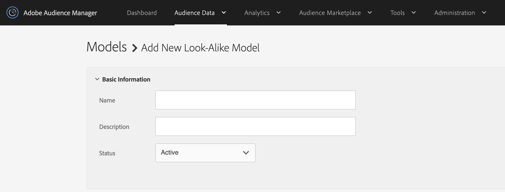

# 類似（look-alike）モデルの作成 {#create-an-algorithmic-model}

[!UICONTROL Look-Alike Model] を作成するための必須手順とオプションの手順について説明します。

## モデルビルダーのセクション

[!UICONTROL Model Builder]は、「[!UICONTROL Basic Information]」セクションと「[!UICONTROL Configuration]」セクションで構成されます。モデルを作成するには、この 2 つのセクションの必須フィールドに入力します。モデルを保存して、アルゴリズムを開始します。[!DNL Audience Manager] は、最初のデータ実行が完了した後に自動通知を送信します。この通知の受信後、[特性ビルダー](../../features/traits/about-trait-builder.md)を開いてアルゴリズム特性を作成できるようになります。

>[!NOTE]
>
>* モデルの作成時に、そのモデルの特性を作成しなかった場合、モデリング処理は 1 回しか実行されません。
>* 有意な量の情報があるデータソースからモデルを作成します。データが不十分なモデルも実行はできますが、結果は返されません。
>* 他のアルゴリズム特性やセグメントを使用してモデルを&#x200B;*作成しない*&#x200B;でください。
>* 自動電子メール通知は 1 回しか送信されません（最初のデータ実行の後）。

## モデルの作成

次の手順に従って、[!UICONTROL Look-Alike Model] を構築します。

1. **[!UICONTROL Audience Data]**／**[!UICONTROL Models]** に移動して、「[!UICONTROL Look-Alike Modeling]」セクションの **[!UICONTROL Add New]** をクリックします。
   
1. 「[基本情報](../../features/algorithmic-models/create-model.md#basic-information)」セクションで、以下の操作をおこないます。
   * モデルの名前を指定します。
   * *（オプション）*&#x200B;モデルについての簡単な説明を入力します。
   * モデルのステータスを **[!UICONTROL Active]** または **[!UICONTROL Inactive]** に設定します。非アクティブなモデルは実行されず、データの生成もおこないません。
      
1. 「[Configuration](../../features/algorithmic-models/create-model.md#configuration)」セクションで次の操作をおこないます。
   * 「**[!UICONTROL Browse All Traits]**」または「**[!UICONTROL Browse All Segments]**」をクリックして、モデルの作成対象となる特性またはセグメントを選択します。名前、ID、説明またはデータソースによる特性の検索。検索中にフォルダーをクリックすると、検索範囲をそのフォルダーおよびサブフォルダーに限定できます。特性タイプ（[!UICONTROL Folder Trait]、[!UICONTROL Rule-based]、[!UICONTROL Onboarded] および [!UICONTROL Algorithmic]）や母集団タイプ（[デバイス ID](../../reference/ids-in-aam.md) および[クロスデバイス ID](../../reference/ids-in-aam.md)）で特性をフィルタリングできます。
      
   * 30 日、60 日または 90 日のルックバック期間を選択します。これにより、モデルの時間範囲が設定されます。
   * デフォルトでは [!UICONTROL TraitWeight] アルゴリズムが選択されています。
   * 「[!UICONTROL Available Data]」リストからデータソースを選択します。
   * 終了したら、「**[!UICONTROL Save]**」をクリックします。
      

クロスデバイス指標のしくみについて詳しくは、以下のビデオをご覧ください。

>[!VIDEO](https://experienceleague.adobe.com/docs/audience-manager-learn/tutorials/build-and-manage-audiences/profile-merge/understanding-cross-device-metrics-in-audience-manager.html)

## アルゴリズムの基本情報 {#basic-information}

<!-- r_model_basic.xml -->

[!UICONTROL Model Builder]では、[!UICONTROL Basic Information]設定を使用して、新しいモデルを作成したり、既存のモデルを編集したりできます。新しいモデルを作成するには、名前を指定し、[!UICONTROL Configuration] 設定に移動します。説明フィールドはオプションです。

| フィールド | 説明 |
|---|---|
| **[!UICONTROL Name]** | モデルには、機能や目的を表す、短く論理的な名前を設定します。省略語、特殊文字、アクセント記号は使用しないでください。 |
| **[!UICONTROL Description]** | モデルに関する追加の説明情報のフィールド。 |
| **[!UICONTROL Status]** | モデルをアクティブまたは非アクティブにします（デフォルトではアクティブです）。 |

## 設定 {#configuration}

[!UICONTROL Model Builder] では、[!UICONTROL Configuration]セクションを使用して、特性やセグメントをモデルに追加できます。ここでは、基準となる特性またはセグメント、ルックバック期間およびファーストパーティおよびサードパーティデータソースからのデータを選択します。

<!-- r_model_configuration.xml -->

### 前提条件

最初に「[!UICONTROL Basic Information]」セクションの必須フィールドに入力します。

<table id="table_7A6BE5E5498D4776A30323B743954150"> 
 <thead> 
  <tr> 
   <th colname="col1" class="entry"> フィールド </th> 
   <th colname="col2" class="entry"> 説明 </th> 
  </tr> 
 </thead>
 <tbody> 
  <tr> 
   <td colname="col1"> 
<b>ベースラインとなる特性またはセグメントを選択する（1）</b> 
 </td> 
   <td colname="col2"> 
特性またはセグメントのボタンをクリックすると、すべての特性またはセグメントのリストが表示されます。選択したセグメントと特性は、システムアルゴリズムがモデリングに使用するシステムのベースラインとなります。 
 
 
<b>注意：</b>オンボードの特性、ルールベースの特性、またはセグメントをベースラインとして選択します。それ以外のものを選択すると、モデルは実行されません。 
 
 </td> 
  </tr> 
  <tr> 
   <td colname="col1"> 
<b>ルックバック期間を選択する（2）</b> 
 </td> 
   <td colname="col2"> 
モデルの時間範囲を設定します。アルゴリズムではこの選択に基づいて、過去 30 日、60 日または 90 日のデータを対象とし、評価をおこないます。 
 </td> 
  </tr> 
  <tr> 
   <td colname="col1"> 
<b>アルゴリズムを選択する（3）</b> 
 </td> 
   <td colname="col2"> 
現在、モデルビルダーでは特性の重み付けアルゴリズムしか使用できません。Audience Manager の今後のリリースでは他のアルゴリズム機能が追加される可能性があります。 
 </td>
  </tr>
  <tr> 
   <td colname="col1"> 
<b>データソースからモデルデータを選択する（4）</b> 
 </td> 
   <td colname="col2"> 
モデルで使用するファーストパーティおよびサードパーティのデータソースを選択できます。 
 </td>
  </tr> 
  <tr> 
   <td colname="col1"> 
<b>除外（5）</b> 
 </td> 
   <td colname="col2"> 
モデリングで選択したデータソースから特性を除外できます。除外する特性の指定には除外リストを使用します。詳しくは、<a href="../../features/algorithmic-models/trait-exclusion-algo-models.md">アルゴリズムモデル：特性の除外</a>を参照してください。 
 </td>
  </tr> 
 </tbody>
</table>

ファーストパーティの類似（look-alike）モデルを作成し、コンバーターに似た独自の訪問者をより多く見つける方法については、以下のビデオをご覧ください。

>[!VIDEO](https://video.tv.adobe.com/v/23504/)

>[!MORELIKETHIS]
>
>* [TraitWeight について](../../features/algorithmic-models/understanding-models.md#understanding-traitweight)

