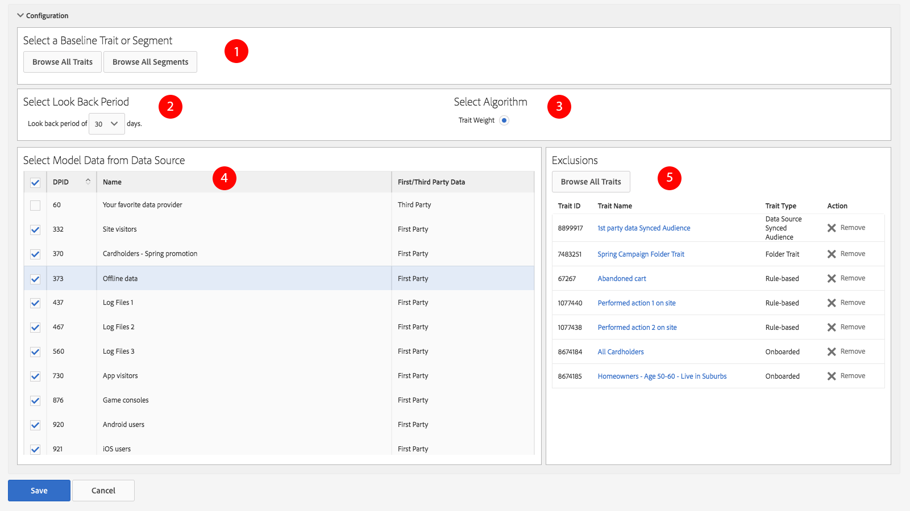

# アルゴリズムモデルの作成 {#create-an-algorithmic-model}

Describes the required and optional steps that let you create an algorithmic model in [!UICONTROL Model Builder].

## モデルの作成 {#build-model}

<!-- t_model_build.xml -->

### モデルビルダーのセクション

[!UICONTROL Model Builder][!UICONTROL Basic Information][!UICONTROL Configuration] で構成されます。モデルを作成するには、この 2 つのセクションの必須フィールドに入力します。モデルを保存して、アルゴリズムを開始します。[!DNL Audience Manager] は、最初のデータ実行が完了した後に自動通知を送信します。この通知の受信後、[特性ビルダー](../../features/traits/about-trait-builder.md)を開いてアルゴリズム特性を作成できるようになります。

>[!NOTE]
>
>* モデルの作成時に、そのモデルの特性を作成しなかった場合、モデリング処理は 1 回しか実行されません。
>* 有意な量の情報があるデータソースからモデルを作成します。データが不十分なモデルも実行はできますが、結果は返されません。
>* 他のアルゴリズム特性やセグメントを使用してモデルを&#x200B;*作成しない*&#x200B;でください。
>* 自動電子メール通知は 1 回しか送信されません（最初のデータ実行の後）。

### モデルの作成

モデルを作成するには、「[!UICONTROL Models]」セクションで「**[!UICONTROL Add New]**」をクリックしてから、以下の手順に従ってください。

1. 「[Basic Information](../../features/algorithmic-models/create-model.md#basic-information)」セクションで、以下の操作をおこないます。
   * モデルの名前を指定します。
   * *（オプション）*&#x200B;モデルについての簡単な説明を入力します。
   * Set the status for the model to **[!UICONTROL Active]** or **[!UICONTROL Inactive]**. 非アクティブなモデルは実行されず、データの生成もおこないません。
1. 「[Configuration](../../features/algorithmic-models/create-model.md#configuration)」セクションで次の操作をおこないます。
   * Click **[!UICONTROL Browse All Traits]** or **[!UICONTROL Browse All Segments]** to select a trait or segment you want to model against. オンボードの特性、ルールベースの特性、またはセグメントをベースラインとして選択します。それ以外のものを選択すると、モデルは実行されません。
   * 30日、60日または90日のルックバック期間を選択します。これにより、モデルの時間範囲が設定されます。
   * デフォルトでは [!UICONTROL TraitWeight] アルゴリズムが選択されています。
   * Select a data source from the [!UICONTROL Available Data] list.
   * Click **[!UICONTROL Save]** when done.

## アルゴリズムの基本情報 {#basic-information}

<!-- r_model_basic.xml -->

In [!UICONTROL Model Builder], the [!UICONTROL Basic Information] settings let you create new or edit existing models. 新しいモデルを作成するには、名前を指定し、[!UICONTROL Configuration] 設定に移動します。説明フィールドはオプションです。

| フィールド | 説明 |
|---|---|
| **[!UICONTROL Name]** | モデルには、機能や目的を表す、短く論理的な名前を設定します。省略語、特殊文字、アクセント記号は使用しないでください。 |
| **[!UICONTROL Description]** | モデルに関する追加の説明情報のフィールド。 |
| **[!UICONTROL Status]** | モデルをアクティブまたは非アクティブにします（デフォルトではアクティブです）。 |

## 設定 {#configuration}

In [!UICONTROL Model Builder], the [!UICONTROL Configuration] section lets you add traits or segments to the model. ここでは、基準となる特性またはセグメント、ルックバック期間およびファーストパーティおよびサードパーティデータソースからのデータを選択します。

<!-- r_model_configuration.xml -->

### 前提条件

Complete the required fields in the [!UICONTROL Basic Information] section first.

<table id="table_7A6BE5E5498D4776A30323B743954150"> 
 <thead> 
  <tr> 
   <th colname="col1" class="entry"> フィールド </th> 
   <th colname="col2" class="entry"> 説明 </th> 
  </tr> 
 </thead>
 <tbody> 
  <tr> 
   <td colname="col1"> 
<b>ベースライン特性またはセグメントの選択（1）</b> 
 </td> 
   <td colname="col2"> 
特性またはセグメントのボタンをクリックすると、すべての特性またはセグメントのリストが表示されます。選択したセグメントと特性は、システムアルゴリズムがモデリングに使用するシステムのベースラインとなります。 
 
 
<b>注意</b>:オンボーブ特性、ルールベースの特性、またはセグメントをベースラインとして選択します。それ以外のものを選択すると、モデルは実行されません。 
 
 </td> 
  </tr> 
  <tr> 
   <td colname="col1"> 
<b>Select Look Back Period（2）</b> 
 </td> 
   <td colname="col2"> 
モデルの時間範囲を設定します。アルゴリズムではこの選択に基づいて、過去 30 日、60 日または 90 日のデータを対象とし、評価をおこないます。 
 </td> 
  </tr> 
  <tr> 
   <td colname="col1"> 
<b>Select Algorithm（3）</b> 
 </td> 
   <td colname="col2"> 
現在、モデルビルダーでは Trait Weight アルゴリズムしか使用できません。Audience Manager の今後のリリースでは他のアルゴリズム機能が追加される可能性があります。 
 </td>
  </tr>
  <tr> 
   <td colname="col1"> 
<b>Select Model Data from Data Source（4）</b> 
 </td> 
   <td colname="col2"> 
モデルで使用するファーストパーティおよびサードパーティのデータソースを選択できます。 
 </td>
  </tr> 
  <tr> 
   <td colname="col1"> 
<b>Exclusions（5）</b> 
 </td> 
   <td colname="col2"> 
モデリングで選択したデータソースから特性を除外できます。除外する特性の指定には Exclusions リストを使用します。詳しくは、<a href="../../features/algorithmic-models/trait-exclusion-algo-models.md">アルゴリズムモデル：特性の除外</a>を参照してください。 
 </td>
  </tr> 
 </tbody>
</table>

>[!MORE_LIKE_THIS]
>
>* [TraitWeight について](../../features/algorithmic-models/understanding-models.md#understanding-traitweight)

