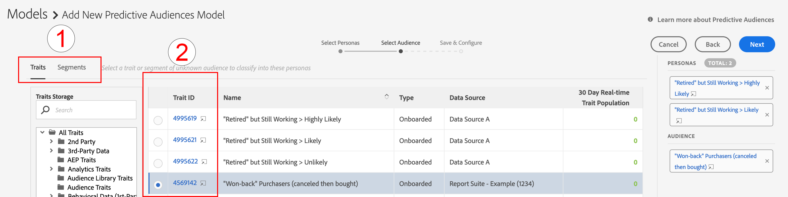

# Predictive Audiences の使用の手引き {#predictive-audiences-getting-started}

>[!IMPORTANT]
>この記事には、この機能の設定と使用方法を説明する製品ドキュメントが含まれています。法的なアドバイスは何も含まれません。法律に関するガイダンスについては、御社の顧問弁護士にアドバイスを求めてください。

## Predictive Audiences モデルの作成 {#create-predictive-audiences}

[!UICONTROL Predictive Audiences] モデルを作成する前に、[!UICONTROL Predictive Audiences] 特性およびセグメントを割り当てたいファーストパーティデータソースを決定する必要があります。既存のファーストパーティデータソースを使用したり、新しく作成したりできます。新しいファーストパーティデータソースの作成方法について詳しくは、[データソースの管理](https://docs.adobe.com/content/help/ja-JP/audience-manager/user-guide/features/data-sources/manage-datasources.html)を参照してください。

どのデータソースを使用するかを把握したら、次の手順に従ってください。

1. **[!UICONTROL Audience Data]**／**[!UICONTROL Models]** に移動します。
1. 「[!UICONTROL Predictive Audiences]」セクションで、「**[!UICONTROL Add New]**」をクリックします。

   

1. 次に、オーディエンスを分類するペルソナを定義します。これをおこなうには、ペルソナを構築するための特性またはセグメントを選択します。画面の左上隅にある「[!UICONTROL Traits]」および「[!UICONTROL Segments]」タブを使用して、特性とセグメントカタログとの間で切り替えます。ペルソナとして使用する特性やセグメントを特定したら、[!UICONTROL Action] 列にある対応する **[!UICONTROL Add]** アイコンをクリックします。
   
   >[!NOTE]
   >最低でもベースライン用に 2 つの特性か 2 つのセグメントのどちらかを選択する必要があります。特性とセグメントの両方を組み合わせて使用することはできません。
1. ペルソナを定義したら、「**[!UICONTROL Next]**」をクリックします。
1. 次に、分類するファーストパーティオーディエンスを選択します。それには、このオーディエンス用のファーストパーティ特性またはセグメントを選択します。画面の左上隅にある「[!UICONTROL Traits]」および「[!UICONTROL Segments]」タブを使用して、特性とセグメントカタログとの間で切り替えます。オーディエンスとして使用するファーストパーティ特性またはセグメントを選択して、モデルに追加します。
   
1. オーディエンスを選択したら、「**[!UICONTROL Next]**」をクリックします。
1. モデルの詳細を入力します。
   * **[!UICONTROL Model Name]**：後で識別するのに役立つ、モデルのわかりやすい名前を入力します。モデルによって生成されたセグメントの名前の先頭には、モデルの名前が付きます。
   * **[!UICONTROL Description]**：ユースケースを識別するのに役立つ、モデルの説明を入力します。
   * **[!UICONTROL Data Source]**：このモデルからの [!UICONTROL Predictive Audiences] セグメントを割り当てるファーストパーティデータソースを選択します。
   * **[!UICONTROL Profile Merge Rule]**:このモデル [!UICONTROL Profile Merge Rule] で作成されるすべての予測に割り当てる対象を選択 [!UICONTROL segments] します。 選択したターゲットオーディエンスが「」の場合 [!UICONTROL segment]は、同じターゲットオーディエンス [!UICONTROL Profile Merge Rule] を選択することをお勧めします。
      
1. 「**[!UICONTROL Save]**」をクリックします。

## 予測オーディエンスモデルのコピーと編集 {#clone-predictive-audiences}

Audience Manager は、既存の [!UICONTROL Predictive Audiences] モデルの編集をサポートしていません。モデルの設定を変更するには、既存のモデルのクローンを作成して編集します。 次の方法で実行できます。

1. **[!UICONTROL Audience Data]**／**[!UICONTROL Models]** に移動します。
2. コピーする [!UICONTROL Predictive Audiences] モデルの名前をクリックします。
3. 画面の左上 **[!UICONTROL Clone]** のボタンをクリックします。
   
4. モデルをコピーすると、コピーされたモデルの [!DNL Save & Configure] ページに移動します。 このページでは、モデルと、モデルの割り当て [!UICONTROL data source] を変更できます[!UICONTROL Profile Merge Rule] 。 クローンモデルのパーソナルとターゲットオーディエンスを編集するには、「 [!UICONTROL Back][!UICONTROL Next] および」ボタンを使用して3つのタブ間を移動するか、3つのタブ名をクリックします

   

5. モデルの編集が完了したら、をクリックし **[!UICONTROL Save]**&#x200B;ます。

## Predictive Audiences の削除 {#delete-predictive-audiences}

[!UICONTROL Predictive Audiences] モデルを削除するには、**[!UICONTROL Audience Data]**／**[!UICONTROL Models]** に移動して、削除するモデルを見つけ、**[!UICONTROL Delete]** アイコンをクリックします。
