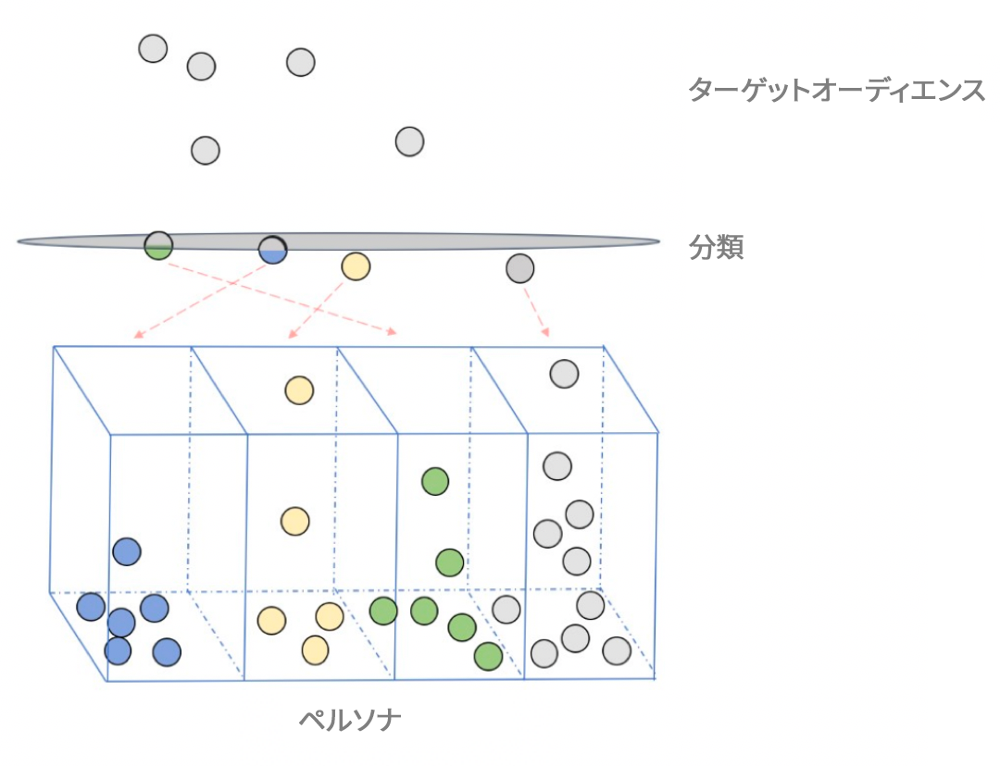

# [!UICONTROL Predictive Audiences] 概要 {#predictive-audiences}

[!UICONTROL Predictive Audiences] は、高度なデータサイエンス技法を使用して、リアルタイムに不明なオーディエンスを個別のペルソナに分類するのに役立ちます。

>[!IMPORTANT]
>この記事には、この機能の設定と使用方法を説明する製品ドキュメントが含まれています。法的なアドバイスは何も含まれません。法律に関するガイダンスについては、御社の顧問弁護士にアドバイスを求めてください。

マーケティングにおいて、ペルソナとは、人口統計、閲覧傾向、買い物履歴など、特定の特性のセットを共有する、訪問者、ユーザーまたは見込み客別に定義されたオーディエンスセグメントです。

[!UICONTROL Predictive Audiences] モデルは、この概念をさらに一歩進めて、Audience Manager の機械学習機能を使用して不明なオーディエンスを個別のペルソナに分類できるようにします。Audience Manager は、既知のファーストパーティオーディエンスのセットに関する不明なファーストパーティオーディエンスの傾向を計算することで、これを実現します。

[!UICONTROL Predictive Audiences] モデルを作成する場合、最初のステップは、ターゲットオーディエンスを分類するためのベースライン特性またはセグメントを選択することです。これらの特性またはセグメントは、ペルソナを定義します。

評価フェーズの間、モデルは、ベースラインとして定義した特性またはセグメントごとに新しい [!UICONTROL Predictive Audiences] セグメントを作成します。次回 Audience Manager がペルソナに分類されていない（どのベースライン特性またはセグメントの条件も満たさなかった）ターゲットオーディエンスの訪問者を確認したら、[!UICONTROL Predictive Audiences] モデルは、その訪問者が属する予測セグメントを決定して、訪問者をそのセグメントに追加します。

[!UICONTROL Segments] ページで、モデルによって作成された予測セグメントを識別できます。各 [!UICONTROL Predictive Audiences] モデルには、[!UICONTROL Predictive Audiences] フォルダーの下に独自のフォルダーがあり、モデルフォルダーをクリックすることで、各モデルのセグメントを確認できます。

## ユースケース {#use-cases}

[!UICONTROL Predictive Audiences] をいつどのように使用できるかを理解しやすくするために、Audience Manager のお客様がこの機能を使用して解決できる、いくつかのユースケースを次に示します。

### ユースケース 1

e コマース会社のマーケティング担当者の場合、ユーザーエクスペリエンスをパーソナライズできるように、すべての Web およびモバイル訪問者を様々なブランド志向カテゴリに分類したい。

### ユースケース 2

メディア会社のマーケティング担当者の場合、すべてのチャネルにわたってパーソナライズされたコンテンツを提案できるように、未認証の Web およびモバイル訪問者を好きなジャンルごとに分類したい。

### ユースケース 3

航空会社向けの広告主の場合、短いリターゲティング期間内にリアルタイムに広告を提示できるように、旅行先への関心に基づいてオーディエンスを確実に分類したい。

### ユースケース 4

広告主の場合、トレンドニュースにすばやく反応できるように、リアルタイムにファーストパーティオーディエンスを分類したい。

### ユースケース 5

マーケティング担当者の場合、フェーズに応じてターゲティングできるように、Web サイト訪問者がいるカスタマージャーニーフェーズ（ディスカバリー、エンゲージメント、購入、定着など）を予測したい。

### ユースケース 6

メディア会社の場合、訪問者に関連性のある広告を提供すると同時に、広告スペースをプレミアム価格で販売できるように、オーディエンスを分類したい。

## モデルの [!UICONTROL Predictive Audiences] 動作 {#how-predictive-audiences-models-work}

[!UICONTROL Predictive Audiences] モデルを作成する場合、次の 3 つの手順を実行します。

1. 最初に、最低でもペルソナを定義する 2 つの特性または 2 つのセグメントを選択します。
1. 次に、分類したいターゲットオーディエンスを定義する特性またはセグメントを選択します。
1. 最後に、モデルの名前、予測セグメントを保存するデータソース、モデルの名前を選択 [!UICONTROL Profile Merge Rule] します。

### ペルソナの選択条件 {#selection-personas}

ペルソナを定義するための任意のファーストパーティ特性またはセグメントを選択できます。ただし、最適な結果を得るには、次に示すベストプラクティスに従ってください。

* 各ペルソナが少なくとも数百の[デバイス ID](../../reference/ids-in-aam.md) を含むようにペルソナの特性またはセグメントを選択します。
* 特性が[クロスデバイス ID](../../reference/ids-in-aam.md) に基づいている場合、[!UICONTROL Device Graph] のように、[デバイス ID](../../reference/ids-in-aam.md) を使用する[プロファイル結合ルール](../profile-merge-rules/merge-rules-overview.md)で特性をセグメントにラップできます。これにより、アルゴリズムが学習するのに十分な[デバイス ID](../../reference/ids-in-aam.md) が確保されます。
* 1 ～ 3個の特性から成る特性または単純なセグメントを、パーソナルに対して選択することをお勧めします。
* 重複が最小のベースライン特性またはセグメントを選択します。
* デジタルプロパティをまたいで詳細な特性をキャプチャしていることを確認します。

### ターゲットオーディエンスの選択条件 {#selection-audience}

Similar to persona selection, you should choose your [!UICONTROL trait] or [!UICONTROL segment] that defines your target audience in such way that it has real time users with rich sets of [!UICONTROL traits], for classification into the right persona.

ターゲットオーディエンスを選択する場合は、使用事例を分析し、分類するIDのタイプを決定します。 [!UICONTROL device IDs] または [!UICONTROL cross-device IDs]。 モデルの作成時 [!UICONTROL Profile Merge Rule] に選択した値によって、各ユーザーを予測に配置するために使用されるデータが定義され [!UICONTROL segments]ます。

ベストプラクティスとして、ターゲットオーディエンスと同じ設定 [!UICONTROL Profile Merge Rule][!UICONTROL Profile Merge Rule]のオーディエンスを選択するか、ターゲットのプロファイルの種類(デバイスプロファイルまたは認証済みプロファイル)を含むを選択することをお勧めします。

### [!UICONTROL Predictive Audiences] モデルトレーニング段階 {#model-training}

アルゴリズムがファーストパーティオーディエンスを適切なペルソナに分類できるようにするには、事前にお客様のデータでアルゴリズム自体をトレーニングする必要があります。

アルゴリズムは、定義するペルソナごとに各オーディエンスを分析し、過去 30 日間のユーザーのリアルタイムの特性アクティビティやオンボーディングされた特性アクティビティを評価します。この手順は、ファーストパーティオーディエンスの変更を考慮して、24 時間ごとに実行されます。

### [!UICONTROL Predictive Audiences] モデル分類段階 {#model-classification}

ターゲットオーディエンスに属する訪問者がリアルタイムに確認されると、モデルは、訪問者が定義されたペルソナに属するかどうかを評価します。どのペルソナにも属さないすべての訪問者に対して、モデルはペルソナ選定スコアを割り当てます。

ファーストパーティオーディエンスを評価してスコアを割り当てると同時に、モデルはお客様のアカウントに定義されたデフォルトの **[!UICONTROL Profile Merge Rule]** を使用します。最後に、訪問者が最も高いスコアを獲得したペルソナに分類されます。

## 考慮事項と制限 {#considerations}

>[!IMPORTANT]
> 実装フェーズに進む前に、この節をよくお読みください。

[!UICONTROL Predictive Audiences] モデルを設定する場合、次の考慮事項および制限に注意してください。

* 最大 10 個の [!UICONTROL Predictive Audiences] モデルを作成できます。
* 各モデルについて、最大 50 個のベース特性／セグメントを選択できます。
* セカンドおよびサードパーティデータは、現在、[!UICONTROL Predictive Audiences] でサポートされていません。
* オーディエンスの分類は、リアルタイムファーストパーティオーディエンスに対してのみおこなわれます。オンボーディングされたファーストパーティオーディエンスの分類は、将来のアップデートでサポートされる可能性があります。
   >[!IMPORTANT]
   > 通常のセグメントに予測特性を追加すると、予測セグメントになります。 その結果、関連するすべてのプロファイルのセグメント化は解除されます。

   >[!IMPORTANT]
   > 現在、予測セグメントはリアルタイムの宛先でのみアクティブ化できます。 The [!UICONTROL Total Segment Population] and [!UICONTROL Addressable Audience] of your predictive segments is displayed as 0, and [Batch Outbound Data Transfers](../../integration/receiving-audience-data/batch-outbound-transfers/batch-outbound-overview.md) are not supported for [!UICONTROL Predictive Audiences]. この動作は、将来のアップデートで変更されます。
* [!UICONTROL Predictive Audiences] は、すべてのファーストパーティデータソースからのファーストパーティ特性に基づいて、オーディエンスの分類を実行します。
* のセグメント評価で [!UICONTROL Predictive Audiences] は、モデル作成時に選択 **[!UICONTROL Profile Merge Rule]** したセグメントが使用されます。 [!UICONTROL Profile Merge Rules] について詳しくは、該当する[ドキュメント](../profile-merge-rules/merge-rules-overview.md)を参照してください。
* 一部の特性およびセグメントは、ベースラインオーディエンスまたはターゲットオーディエンスとしてサポートされません。[!UICONTROL Predictive Audiences] モデルは、次のいずれかをベースラインオーディエンスまたはターゲットオーディエンスとして選択すると、保存に失敗します。
   * 予測特性および予測特性を使用して作成されたセグメント
   * [Adobe Experience Platform](../integration/../../integration/integration-aep/aam-aep-audience-sharing.md) の特性またはセグメント
   * アルゴリズム特性
   * セカンドおよびサードパーティ特性

## [!UICONTROL Data Export Controls] {#dec}

[!UICONTROL Predictive Audiences] モデルで作成された予測セグメントは、次のファーストパーティデータソースから[データ書き出しコントロール](https://docs.adobe.com/content/help/ja-JP/audience-manager/user-guide/features/data-export-controls.html)を継承します。

1. モデルを構築する際に選択するファーストパーティデータソース。
1. ターゲットオーディエンスのファーストパーティデータソース。Specifically, the data export controls of the [!UICONTROL traits] or [!UICONTROL segments] that make up your target audience.
1. モデルに対して選択した [の データエクスポートコントロール [!UICONTROL Profile Merge Rule] ]。

The newly created predictive [!UICONTROL traits] and [!UICONTROL segments] will have the same privacy restrictions as the union of the first-party data sources described above.

[!UICONTROL Predictive Audiences] セグメントのプライバシー制限に含まれない追加の制限を持つ特性は、トレーニングフェーズから除外され、モデルに対して影響力を持つことはありません。

## [!UICONTROL Profile Merge Rules] {#pmr}

すべての予測セグメントに、モデルの作成時に選択し [!UICONTROL Profile Merge Rule] たセグメントが割り当てられます。 選択 [!UICONTROL Profile Merge Rule] する内容は、次の理由で重要です。

* 予測に分類する際に、影響力を分析する際に、どのデバイスや認証済みプロファイルを考慮に入れる [!UICONTROL traits]かを定義し [!UICONTROL segment]ます。
* モデルトレーニング手順で使用し、影響力のある [!UICONTROL trait] タイプとして表示されるタイプ（デバイスレベルまたはデバイス間レベル）を管理 [!UICONTROL traits]します。 予測 [!UICONTROL segments] は、ターゲットオーディエンスのサブセットです。
   * ターゲットオーディエンスがセグメントの場合は、ターゲットオーディエンスに割り当てられたモデルと同じも [!UICONTROL Profile Merge Rule] のを選択するか、ターゲットオーディエンスのプロファイルタイプを含むモデル [!UICONTROL Profile Merge Rule] を選択することをお勧めします。
   * ターゲットオーディエンスがデバイスの場合 [!UICONTROL trait]は、ターゲットオーディエンス特性と同じタイプのデータにアクセスでき [!UICONTROL Profile Merge Rule] るタイプを選択することをお勧めします(デバイスプロファイルデータまたはデバイス間プロファイルデータのいずれか)。

デバイスデータとデバイス間のデータ [!UICONTROL Profile Merge Rule] の両方を使用するデータを選択すると、モデルトレーニング [!UICONTROL traits] やユーザー分類に使用できる予測データの数が最大になり [!UICONTROL segments]ます。

## [!UICONTROL Role-Based Access Controls] {#rbac}

ペルソナおよびオーディエンスの分類用に選択する特性およびセグメントは、Audience Manager の[ロールベースのアクセス制御](https://docs.adobe.com/content/help/ja-JP/audience-manager/user-guide/features/administration/administration-overview.html)の影響を受けます。

Audience Manager ユーザーは、[表示権限](https://docs.adobe.com/content/help/ja-JP/audience-manager/user-guide/features/administration/administration-overview.html#wild-card-permissions)を持つペルソナおよびターゲットオーディエンス用の特性またはセグメントのみ選択できます。
