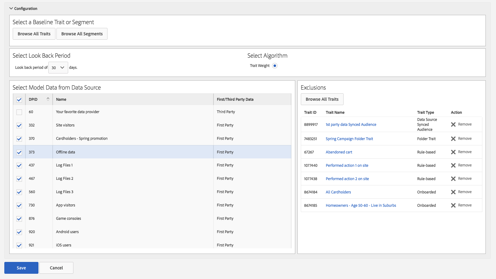

# 類似（look-alike）モデリング：特性の例外 {#algorithmic-models-trait-exclusion}

[!UICONTROL Trait Exclusion]を使用すると、モデリングワークフローをさらに細かく制御し、ドメインに関する知識および規制要件に応じてモデルに含める特性を限定できます。1 つまたは複数のデータソースからモデルを作成するときに、「[!UICONTROL Exclusions]」オプションを使用して、除外する特性を指定します。

## ユースケース {#use-cases}

[!UICONTROL Trait Exclusion]が役立つユースケースの例を以下に示します。

* [!UICONTROL Trait Exclusion]を使用すると、サイト訪問者特性などの汎用特性を除外して、結果を均一化するモデルのバイアスをなくすことができます。
* 未知の特性や信頼性の低い特性をデータソースから除外することで、影響力の強い特性についてより深く理解できます。
* 人口統計的な特性などの特性を除外することで、コンプライアンス義務に対応することができます。

>[!IMPORTANT]
>
>3 番目のユースケースに関する注意事項を次に示します。*モデルの作成後*&#x200B;にサードパーティデータプロバイダーがデータフィードに新しい人口統計的特性を追加した場合、モデルはこの特性を自動的に取得します。モデルの作成後に、モデリングから特性を除外することはできません。詳しくは、[重要な点および制限事項](../../features/algorithmic-models/trait-exclusion-algo-models.md#important-aspects-and-limitations)を参照してください。この機能を使用する場合は細心の注意を払うとともに、データプロバイダーにフィード構造を変更した場合は通知するように依頼してください。

## 特性の除外の使用方法 {#how-to-use}

[モデルの作成](../../features/algorithmic-models/create-model.md#build-model)ワークフローに従って、新しいアルゴリズムモデルを作成します。

1. 「[!UICONTROL Exclusions]」セクションは、モデリング用のデータソースを 1 つ以上選択するまでグレー表示になります。
2. モデリング用のデータソースを 1 つまたは複数選択したら、「**[!UICONTROL Browse All Traits]**」をクリックします。
3. **[!UICONTROL Select Traits to Exclude]** ウィンドウに、選択済みのデータソースに関連付けられているすべての特性が表示されます。除外する特性を選択します。
4. 特性タイプや特性母集団タイプ（[デバイス ID](../../reference/ids-in-aam.md) および[クロスデバイス ID](../../reference/ids-in-aam.md)）で特性をフィルタリングしたり、特性フォルダーを参照したりできます。特性フォルダーには、選択したデータソースに関連付けられている特性のみが表示されます。
5. **[!UICONTROL Exclude Selected Traits]** を押します。

>[!TIP]
>
>特性フォルダー内の特性を 1 つ 1 つ除外するのではなく、フォルダー特性を除外することでフォルダー全体を除外対象にすることもできます。例えば、フォルダーに特性が 20 個含まれている場合、特性を 1 つ 1 つ除外するのではなく、フォルダー特性を除外することをお勧めします。

ビデオチュートリアルを希望する場合は、特性の除外のビデオデモをご覧ください。

>[!VIDEO](https://video.tv.adobe.com/v/25569/?quality=12)

さらに、クロスデバイス指標のしくみについて詳しくは、以下のビデオをご覧ください。

>[!VIDEO](https://video.tv.adobe.com/v/33445/?quality=12)

## 重要な点と制限事項 {#important-aspects-and-limitations}

[!UICONTROL Trait Exclusion]については、以下の点と制限事項に注意してください。

<table id="table_BA5C3545BC9E4717BD567B00C803AA53"> 
 <thead> 
  <tr> 
   <th colname="col1" class="entry"> 項目 </th> 
   <th colname="col2" class="entry"> 説明 </th>
  </tr> 
 </thead>
 <tbody> 
  <tr> 
   <td colname="col1"> 
モデル概要表示での特性の除外 
 </td>
   <td colname="col2"> 
除外した特性は、モデル概要には<i>表示されません</i>。除外した特性は、<b>モデルの編集</b>ワークフローにのみ表示されます。 
 </td>
  </tr> 
  <tr> 
   <td colname="col1"> 
ロールベースのアクセス制御（RBAC） 
 </td>
   <td colname="col2"> 
会社で <a href="../../features/administration/administration-overview.md#administration">RBAC</a> を使用する際には、次の制限事項に注意してください。 
 

     <ul id="ul_38A4056C235B428C822EA4A353893786"> 
      <li id="li_2624FB35581F4807B8530910D63FFDBF">特性の表示アクセス権がない場合、その特性を選択してモデルから除外することは<i>できません</i>。 </li>
      <li id="li_3FD7A12AAAA8462EA84A760C05F20379">特性の表示アクセス権がない場合、除外された特性リストでその特性を表示することは<i>できません</i>。 </li>
     </ul> 
 </td>
  </tr> 
  <tr> 
   <td colname="col1"> 
モデル保存後の除外特性の変更 
 </td>
   <td colname="col2"> 
モデルを作成し保存した後に、除外対象の特性を変更することはできません。結果の調整が必要な場合は、モデルを複製して除外対象の特性を変更してください。 
 </td>
  </tr> 
  <tr> 
   <td colname="col1"> 
除外できる特性の上限数 
 </td>
   <td colname="col2"> 
モデルから除外できる特性の数は 500 個までです。より多くの特性を除外するには、フォルダー特性を使用してください。 
 </td>
  </tr> 
  <tr> 
   <td colname="col1"> 
ベースライン特性の除外 
 </td>
   <td colname="col2"> 
ベースライン特性はデフォルトで除外されるので、モデルの作成時に <b>Exclusions</b> リストには表示されません。 
 </td>
  </tr>
 </tbody>
</table>

[!UICONTROL Look-Alike Model] からの特定の特性を除外する方法と理由については、以下のビデオをご覧ください。

>[!VIDEO](https://video.tv.adobe.com/v/25569/)

## 関連リンク

* [アルゴリズムの特性について](/help/using/features/algorithmic-models/understanding-models.md)
* [特性の例外 - チュートリアル](https://helpx.adobe.com/jp/audience-manager/kt/using/excluding-traits-look-alike-model-feature-video-use.html)