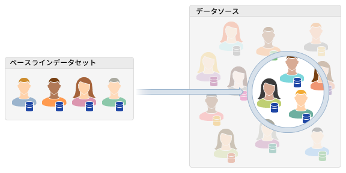

# Understanding [!UICONTROL Look-Alike Modeling] {#about-algorithmic-models}

## 新しいユーザーの検索 [!UICONTROL Look-Alike Modeling] {#find-new-users}

[!UICONTROL Look-Alike Modeling] を使用すると、自動データ分析により、新しいユニークオーディエンスを発見できます。The process starts when you select a [!UICONTROL trait] or [!UICONTROL segment], a time interval, and first and third-party [!UICONTROL data sources]. この選択が、アルゴリズムモデルの入力となります。分析処理が実行されると、選択した母集団と共有する特徴に基づいて、該当するユーザーを検索します。完了すると、このデータは[特性ビルダー](../../features/traits/about-trait-builder.md)で使用可能になります。ここでは、このデータを使用して[精度とリーチ](../../features/traits/trait-accuracy-reach.md)に基づいて特性を作成できます。Additionally, you can build segments that combine algorithmic traits with [!UICONTROL rules-based traits] and add other qualification requirements with [!DNL Boolean] expressions and comparison operators. [!UICONTROL Look-Alike Modeling] を使用すると、使用可能なすべての特性データから価値を動的に抽出できます。

## メリット {#advantages}

[!UICONTROL Look-Alike Modeling] を使用する主なメリットには、次のようなものがあります。

* **データの精度：**&#x200B;アルゴリズムは定期的に実行されるので、結果は常に最新で関連性の高いものになります。
* **自動化：**&#x200B;大規模な静的ルールのセットを管理する必要はありません。アルゴリズムがオーディエンスを特定します。
* **時間を節約し、手間を軽減：** 当社のモデリングプロセスでは、新しいオーディエンスを発見するために、何が役に立つ [!UICONTROL traits][!UICONTROL segments] かを推測したり、キャンペーンに時間を費やしたりする必要はありません。 この作業はモデルによりおこなうことができます。
* **信頼性：**&#x200B;モデリングでは、サーバー側の特定および認証プロセスにより、自分のデータと、選択したアクセス可能なサードパーティデータを評価します。このため、特性についてサイトの訪問者を認定する場合、その全員を把握する必要はありません。

## ワークフロー {#workflow}

**[!UICONTROL Audience Data > Models]**&#x200B;でモデルを管理します。全体的なワークフローとして、以下の処理をおこないます。

* アルゴリズムにより評価するベースラインデータを選択する。This includes a [!UICONTROL trait] or [!UICONTROL segment], time range, and [!UICONTROL data sources] (your own data and third-party data you already have access to through [!DNL Audience Manager]). In the model creation workflow, you can exclude the [!UICONTROL traits] that you don&#39;t want to interfere with your model.
* モデルを保存する。保存したアルゴリズム評価プロセスは、自動的に実行されます。この処理が完了するまで最大 7 日かかります。[!DNL Audience Manager] アルゴリズムが完了し、結果を [!UICONTROL trait] 作成できる場合に電子メールを送信します。
* Build algorithmic [!UICONTROL traits] in [!UICONTROL Trait Builder].
* 組み合わ [!UICONTROL traits] せて [!UICONTROL segments] をインにし [!UICONTROL Segment Builder]ます。
* データを作成し、 [!UICONTROL segment] に送信し [!UICONTROL destination]ます。

## トラブルシューティング {#troubleshooting}

データの生成に 3 回連続で失敗した [!UICONTROL Look-Alike Model] は、非アクティブ化されます。後でモデルのステータスを「Active」に戻すことはできません。To ensure your models generate data, we recommend that you build models from data sources with sufficient [!UICONTROL traits] to accumulate data from.

## Understanding [!UICONTROL TraitWeight] {#understanding-traitweight}

[!UICONTROL TraitWeight] は、新しいを [!UICONTROL traits] 自動的に検出するように設計された独自のアルゴリズムです。 It compares [!UICONTROL trait] data from your current [!UICONTROL traits] and [!UICONTROL segments] against all other first and third-party data that you have access to through [!DNL Audience Manager]. この節では、[!UICONTROL TraitWeight] アルゴリズムの検出プロセスについて説明します。

次の手順は、[!UICONTROL TraitWeight] による評価プロセスを示しています。

### Step 1: Build a Baseline for [!UICONTROL Trait] Comparison

To build a baseline, [!UICONTROL TraitWeight] measures all the [!UICONTROL traits] associated with an audience for a 30, 60, or 90 day interval. Next, it ranks [!UICONTROL traits] according to their frequency and their correlation. 頻度では一般性が測定されます。Correlation measures the likelihood of a [!UICONTROL trait] being present only in the baseline audience. [!UICONTROL Traits] これは多くの場合、共通性が高いと言われています。選択した内容と組み合わせて重み付けスコアを設定するのに使用される重要な特性で [!UICONTROL traits][!UICONTROL data sources]す。

### 手順2:同じも [!UICONTROL Traits] のを [!UICONTROL Data Source]

After it builds a baseline for comparison, the algorithm looks for identical [!UICONTROL traits] in your selected [!UICONTROL data sources]. In this step, [!UICONTROL TraitWeight] performs a frequency count of all discovered [!UICONTROL traits] and compares them to the baseline. However, unlike the baseline, uncommon [!UICONTROL traits] are ranked higher than those that appear more often. Rare [!UICONTROL traits] are said to exhibit a high degree of specificity. [!UICONTROL TraitWeight] は、共通のベースラインと一般的でない（非常に特異的） [!UICONTROL traits] の組み合わせを、両方のデータセットに共通するよりも効果的または望ましいと [!UICONTROL data source][!UICONTROL traits][!UICONTROL traits] 評価します。 In fact, our model recognizes these large, common [!UICONTROL traits] and does not assign excess priority to data sets with high correlations. Rare [!UICONTROL traits] get higher priority because they are more likely to represent new, unique users than [!UICONTROL traits] with high commonality across the board.

### 手順 3：重みを割り当てる

In this step, [!UICONTROL TraitWeight] ranks newly discovered [!UICONTROL traits] in order of influence or desirability. 重みの基準は、0%～100% の割合です。[!UICONTROL Traits] 100%に近いランクは、基準母集団のオーディエンスに近いことを意味します。 Also, heavily weighted [!UICONTROL traits] are valuable because they represent new, unique users who may behave similarly to your established, baseline audience. Remember, [!UICONTROL TraitWeight] considers [!UICONTROL traits] with high commonality in the baseline and high specificity in the compared data sources to be more valuable than [!UICONTROL traits] common in each data set.

### 手順 4：ユーザーにスコアを割り当てる

Each user in the selected [!UICONTROL data sources] is given a user score which is equal to the sum of all the weights of the influential [!UICONTROL traits] on that user&#39;s profile. その後、各ユーザースコアが 0～100％の範囲で正規化されます。

### 手順 5：結果を表示して操作する

[!DNL Audience Manager] 重み付けされたモデルの結果がに表示され [!UICONTROL Trait Builder]ます。 When you want to build an [!UICONTROL algorithmic trait], [!UICONTROL Trait Builder] lets you create [!UICONTROL traits] based on the weighted score generated by the algorithm during a data run. 選択する精度を高くするほど、ユーザースコアが高いユーザー、つまり他のオーディエンスよりもベースラインオーディエンスに近いユーザーのみを認定できます。精度を低くすると、オーディエンス（リーチ）を広げることができます。

### Step 6: Re-evaluate the Significance of a [!UICONTROL Trait] Across Processing Cycles

Periodically, [!UICONTROL TraitWeight] re-evaluates the importance of a [!UICONTROL trait] based on the size and change in the population of that [!UICONTROL trait]. This happens as the number of users qualified for that [!UICONTROL trait] increases or decreases over time. この動作は、非常に大規模になる特性で最も明確に見られます。For example, suppose the algorithm uses [!UICONTROL trait A] for modeling. As the population of [!UICONTROL trait A] increases, [!UICONTROL TraitWeight] re-evaluates the importance of that [!UICONTROL trait] and may assign a lower score or ignore it. In this case, [!UICONTROL trait A] is too common or large to say anything significant about its population. After [!UICONTROL TraitWeight] reduces the value of [!UICONTROL trait A] (or ignores it in the model), the population of the algorithmic trait decreases. The list of influential [!UICONTROL traits] reflects the evolution of the baseline population. Use the list of the influential [!UICONTROL traits] to understand why these changes are occurring.

関連リンク：

* [モデルビルダー](../../features/algorithmic-models/create-model.md)
* [精度とリーチ](../../features/traits/trait-accuracy-reach.md)

## およびのスケジュール [!UICONTROL Look-Alike Models] を更新 [!UICONTROL Traits] {#update-schedule}

新規または既存のおよびのスケジュールを作成および更新 [!UICONTROL algorithmic models] し [!UICONTROL traits]ます。

### [!UICONTROL Look-Alike Model] スケジュールの作成と更新

<table id="table_E75A2B334A7F47ED9DFFBD6DF8636641"> 
 <thead>
  <tr>
   <th colname="col1" class="entry"> アクティビティのタイプ </th>
   <th colname="col2" class="entry"> 説明 </th>
  </tr>
 </thead>
 <tbody>
  <tr> 
   <td colname="col1"> <b>モデルの作成または複製</b> </td>
   <td colname="col2"> 
新規または複製した [!UICONTROL Look-Alike Models] について、作成プロセスは毎日次の時間に 1 回実行されます。 
     <ul id="ul_97333AC409AF4760A91D90A06050122B"> 
      <li id="li_3A43809F924341FCAC3A85E3825E0F61"> 午後 5 時 EST（11 月～3 月） </li> 
      <li id="li_C07D22AB192D4E0191D9EBF6426EC73D"> 午後 6 時 EDT（3 月～11 月） </li> 
     </ul> 
 
作成期日後に構築または複製されたモデルは、翌日に処理されます。 
 
モデルの最初の実行でデータが生成されない場合、2 回目は次の日に実行されます。2 回目でもデータが生成されない場合、3 回目がその次の日に実行されます。3 回目の試行でもデータが生成されない場合、モデルは実行を停止します。この場合、モデルは非アクティブ化されます。詳しくは、<a href="../../features/algorithmic-models/understanding-models.md#troubleshooting">類似（look-alike）モデルのトラブルシューティング</a>を参照してください。 
 </td>
  </tr>
  <tr> 
   <td colname="col1"> <b>モデルの更新</b> </td> 
   <td colname="col2"> 
理想的な状況では、既存のモデルは、少なくとも 7 日に 1 回、平日に実行されます。例えば、モデルを月曜日に作成する（期限により）と、遅くとも翌週の月曜日には更新されます。 
 
以下の条件のいずれかを満たした場合に、モデルは再実行されます。 
 

     <ul id="ul_7B0442F6E840415B82705C7B7419D079"> 
      <li id="li_27DCB92CE61F4388B5D253C13BD030BE">その最後の実行が成功しなかった。 </li> 
      <li id="li_9887E50D291446AC868A8FCE6295536E">以前に実行が成功し、かつ、過去 7 日間にまったく実行されておらず、かつ、モデルに少なくとも 1 つのアクティブな特性が添付されている。 </li>
     </ul> 
 </td>
  </tr>
 </tbody>
</table>

### [!UICONTROL Look-Alike Trait] スケジュールの作成と更新

<table id="table_92A908818C4F4F2287EA56C786CD0BBD"> 
 <thead> 
  <tr> 
   <th colname="col1" class="entry"> アクティビティのタイプ </th> 
   <th colname="col2" class="entry"> 説明 </th> 
  </tr> 
 </thead>
 <tbody> 
  <tr> 
   <td colname="col1"> <b>特性の作成</b> </td> 
   <td colname="col2"> 
特性作成プロセスは、月曜日から金曜日まで、毎日実行されます。通常、新しいアルゴリズム特性は、48 時間以内に UI に表示されます。 
 </td> 
  </tr> 
  <tr> 
   <td colname="col1"> <b>特性の更新</b> </td> 
   <td colname="col2"> 
既存の特性は、少なくとも 7 日に 1 回は更新され、モデル更新のスケジュールに従います。 
 </td> 
  </tr> 
 </tbody> 
</table>

## モデルのリスト表示 {#models-list-view}

リスト表示は、モデルを作成、確認および管理するのに役立つ一元的なワークスペースです。

The [!UICONTROL Models] list page contains features and tools that help you:

* 新しいモデルの作成。
* 既存のモデルの管理（編集、一時停止、削除または複製）。
* 名前によるモデルの検索。
* 任意のモデル [!UICONTROL algorithmic traits] を使用して作成します。

## モデルの概要表示 {#models-summary-view}

The summary page displays model details such as name, reach/accuracy, processing history, and [!UICONTROL traits] created from the model. このページにはまた、モデルを作成および管理するための設定も含まれています。概要リストでモデル名をクリックすると、モデルの詳細が表示されます。

モデル概要ページには、以下のセクションが含まれています。

<table id="table_14AE8B324115442589E3F993101F72EA"> 
 <thead> 
  <tr> 
   <th colname="col1" class="entry"> セクション </th> 
   <th colname="col2" class="entry"> 説明 </th> 
  </tr> 
 </thead>
 <tbody> 
  <tr>
   <td colname="col1"> 
  Basic Information 
 </td>
   <td colname="col2"> 
名前および最終実行日など、モデルに関する基本情報が含まれます。 
 </td>
  </tr> 
  <tr> 
   <td colname="col1"> 
  Model Reach and Accuracy 
 </td> 
   <td colname="col2"> 
前回のモデル実行の<a href="../../features/traits/trait-accuracy-reach.md">精度とリーチ</a>のデータを表示します。 
 </td>
  </tr> 
  <tr> 
   <td colname="col1"> 
  Model Processing History 
 </td> 
   <td colname="col2"> 
過去 10 回の実行の処理日時と、データがそれらの実行で生成されたかどうかを表示します。 
 </td>
  </tr> 
  <tr> 
   <td colname="col1"> 
  Influential Traits 
 </td> 
   <td colname="col2"> 
Influential Traits テーブルには以下が含まれます。 
 
 
     <ul id="ul_FB15A554CADC40D09F9AC6D384D54ECD"> 
      <li id="li_343E25E8B3584D38B1E2BCB211033DBF"> モデルの基準となる母集団で最もよく表される上位 50 個の影響力のある特性のリスト。 </li> 
      <li id="li_44957F46C0744A84A987D8F25D93E24E">Relative Weight ランクの順に各特性をランク付けします。Relative Weight は、新しく検出された特性を影響力または望ましさの順で並べ替えます。重みの基準は、0%～100% の割合です。特性のランクが 100% に近づくと、基準となる母集団のオーディエンスに似ていることを意味します。詳しくは、<a href="../../features/algorithmic-models/understanding-models.md#understanding-traitweight"> TraitWeight について</a>を参照してください。 </li> 
      <li id="li_260151E23B1E484BA06C8494552A04F0">特性ごとに 30 日間の個別および合計特性母集団を表示します。 </li> 
     </ul> 
 </td> 
  </tr> 
  <tr> 
   <td colname="col1"> 
  Traits Using Model 
 </td>
   <td colname="col2"> 
選択したモデルに基づいて、アルゴリズム特性のリストを表示します。特性名または特性 ID をクリックすると、特性に関する詳細情報が表示されます。「<b>Create New Trait with Model</b>」を選択すると、アルゴリズム特性作成プロセスに移動します。 
 
セクションラベルは、モデルの名前に基づいて変更されます。例えば、モデルを作成して名前をモデル A にしたとします。概要ページを読み込むと、このセクションの名前が Traits Using Model A に変更されます。 
 </td>
  </tr>
 </tbody>
</table>

>[!MORELIKETHIS]
>
>* [宛先](../../features/destinations/destinations.md)
>* [特性](../../features/traits/trait-details-page.md)
>* [セグメント](../../features/segments/segments-purpose.md)

