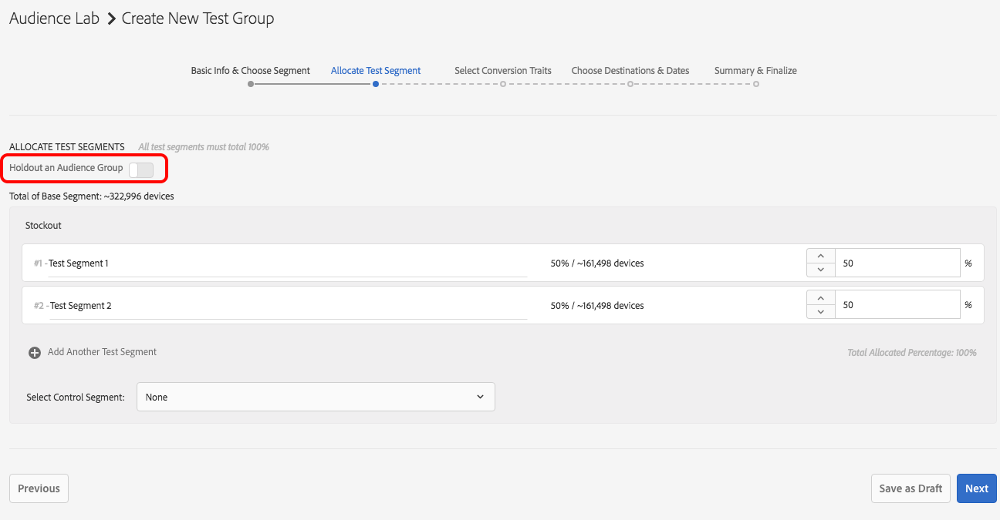

# [!DNL Audience Lab] の高度な機能 {#audience-lab-advanced-functionality}

この記事では、[!DNL Audience Lab] の高度な機能である、[!DNL Duplicate Allocation Template] および [!DNL Segment Holdout] の 2 つの機能について説明します。

## 割り当てテンプレートの複製 {#duplicate-allocation-template}

<!-- 

The <b>Allocation Template</b> represents how you split a test group into test segments and the way the test segments are mapped to destinations. 

 -->

[!DNL Audience Lab] の [!DNL Allocation Template] は、テストグループ作成時の様々な選択内容を表します。

* テストセグメント間でのデバイスの分布。
* 宛先へのテストセグメントのマッピング。
* テストグループで使用するコンバージョン特性。
* 選択した宛先へテストグループを公開する日付範囲。

割り当てテンプレートを複製すると、テストセグメントと宛先の分布を、新しいテストグループで別のベースセグメントに再利用できます。割り当てテンプレートの例を下図に示します。この画像は、**テストグループの作成**&#x200B;ワークフローの[!UICONTROL Summary & Finalize]手順のものです。

<!--
With the option to duplicate allocation templates, you can increase your productivity when running multivariate tests as part of multivariate campaigns.
-->

### 割り当てテンプレートの複製の使用方法

複数のテストグループで同じ設定を再利用するには、複製元のテストグループを作成してから、「**[!UICONTROL Duplicate Allocation Template]**」を選択します。例えば、この機能を使用すると、複数のセグメントについていくつかの宛先をテストして有効性を判断することができます。

1. Audience Lab のメイン表示で、新しいテストグループで再利用する割り当てテンプレートがあるテストグループを検索します。ドロップダウンボックスで「**[!UICONTROL Duplicate Allocation Template]**」を選択します。

   

2. [!UICONTROL Create Test Group] ウィザードでベースセグメントを指定し、必要に応じてテストセグメントの名前を変更します。
3. 以下は変更&#x200B;*できません*。

   * テストセグメント間でのデバイスの分布。
   * コンバージョン特性。
   * 宛先へのテストセグメントのマッピング。マッピングキーが必要な宛先については、このキーを入力することのみ可能です。
   * 選択した宛先へテストグループを公開する日付範囲。

4. 前の手順で追加した情報を確認し、「**[!UICONTROL Finalize Group]**」を選択します。

## テストセグメントの除外 {#test-segment-holdout}

>[!NOTE]
>
>[!UICONTROL Test Segment Holdout]は、顧客リクエストアクティブ化される高度な機能です。この機能を有効化するには、[!DNL Customer Care] または [!DNL Adobe Consulting] にお問い合わせください。

この機能を使用すると、オーディエンスの一部をテスト対象から除外することができます。選択した割合がテストから除外されます。これにより、ターゲットにした（宛先でアクティブにした）オーディエンスとターゲット外のオーディエンス（除外グループ）のそれぞれでコンバージョン数を測定し、比較することができます。

<!--

Note that this option is different to the control segment because it subtracts the percentage ................. You can withhold an audience group and still use a control segment. 

-->

### テストセグメントの除外の使用方法

1. [!UICONTROL Create Test Group] ウィザードを使用して新しいテストグループを作成します。
1. **[!UICONTROL Allocate Test Segment]**&#x200B;手順で、テストから除外するオーディエンスの割合を選択します。

   

1. スライダーを使用して、テストから除外するデバイス数を選択します。以下の例では、Test Segment 1 と Test Segment 2 に含めるデバイス数を全体の 70％にしています。

   

1. **[!UICONTROL Create Test Group]**&#x200B;ワークフローの残りの手順を完了し、選択内容に問題がなければ、「**[!UICONTROL Finalize Group]**」を選択します。これで、指定したオーディエンスの一部がテスト対象から除外されたテストグループが作成されます。
