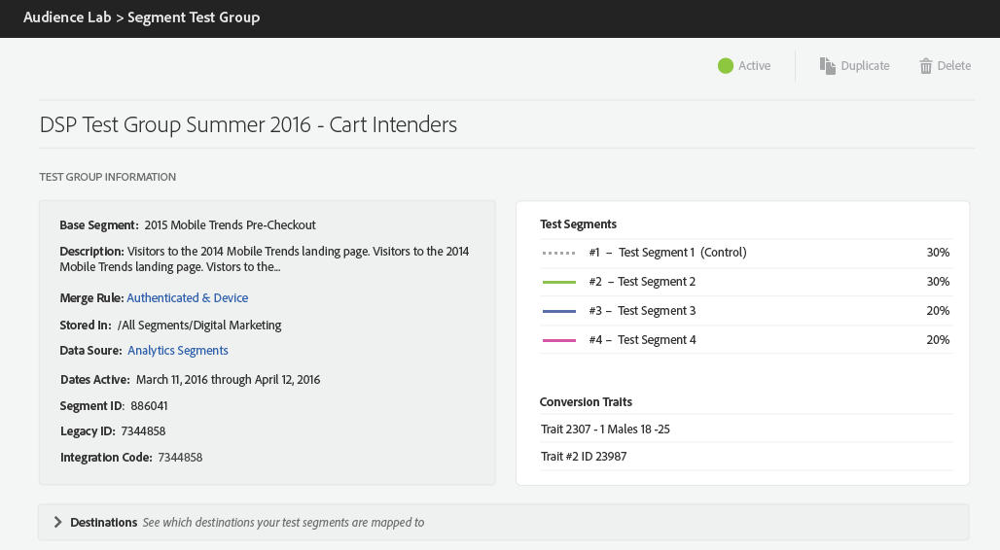

# テストグループの情報 {#test-group-information}

このセクションには、テストグループとそれを分割したテストセグメントに関する一般情報、選択したコンバージョン特性、マッピングされた宛先が表示されます。また、テストグループの複製や削除をおこなえるコントロールも用意されています。

また、テストグループに使用したベースラインセグメントおよびテストセグメントの分割方法についても確認できます。

The **[!UICONTROL Test Segments]** are populated randomly with users from the baseline segment you used for the test group. 概要では、各テストセグメントに割り当てたユーザーの割合が示されます。

The **[!UICONTROL Conversion Traits]** drive the reporting for the test groups. To designate a trait as a conversion, when creating or editing traits in the [!UICONTROL Trait Builder], select **Conversion** as **[Event Type](../../features/traits/create-onboarded-rule-based-traits.md).**

**[!UICONTROL Destinations]** カードは折りたたみ可能です。個々の送信先を開くまたは閉じるには矢印を押します。マッピング先の送信先ごとに、テストセグメントに関する次の情報を取得できます。

* 各送信先に割り当てられたベースセグメントの合計母集団数から取得されたデバイス数
* マッピングキー
* マッピング値
* [!DNL URL] 宛先 [!DNL URL] の [!DNL URL] セキュリティ保護（&amp;セキュア）

>[!NOTE]
>
>完了したテストグループは編集できません。一時停止、削除または複製のみ可能です。

