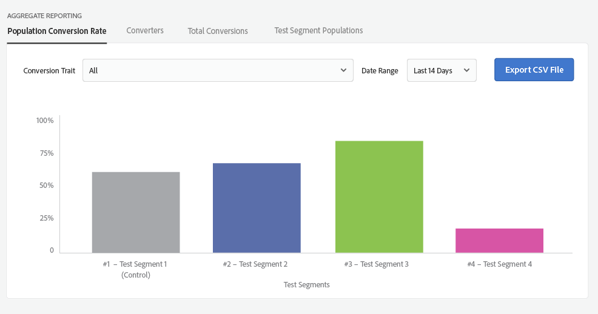
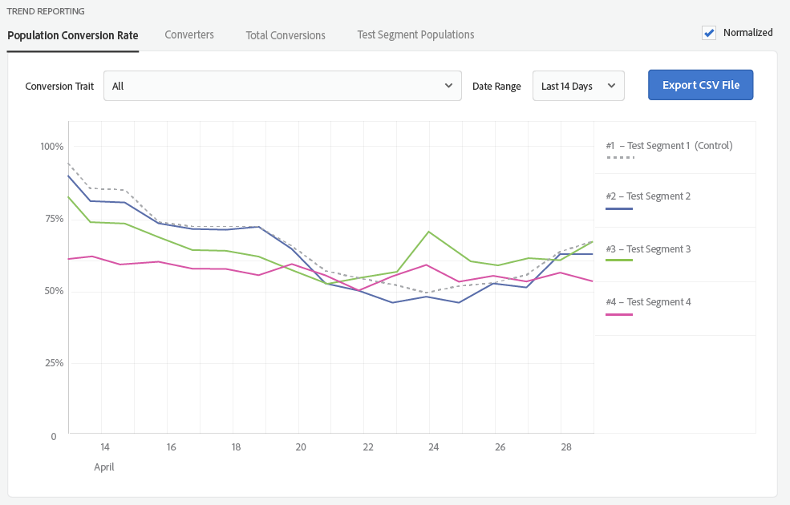

# テストグループのレポート {#test-group-reporting}

テストグループのレポートセクションには、テストグループのコンバージョンに関する情報が返されます。これにより、テストセグメントの効果を簡単に比較できます。いくつものフィルターやディメンションを使用してデータを視覚化できます。

[!UICONTROL Audience Lab]は作成したテストセグメントに関する詳細なレポート情報を返します。また、レポートデータは [!DNL CSV] ファイルとして保存できます。**[!UICONTROL Aggregate Reporting]** と **[!UICONTROL Trend Reporting]** から選択できます。

**[!UICONTROL Aggregate Reporting]**&#x200B;は、テストセグメントの絶対数を返します。**[!UICONTROL Trend Reporting]**&#x200B;は、*特定の期間にわたる*&#x200B;トレンドのグラフを返します。4 つのタブを使用してレポートをカスタマイズできます。

<table id="table_446384AE9A36408A9C570CB7DB72C3D6"> 
 <thead> 
  <tr> 
   <th colname="col1" class="entry"> パラメーター </th> 
   <th colname="col2" class="entry"> 説明 </th> 
  </tr> 
 </thead>
 <tbody> 
  <tr> 
   <td colname="col1"> 
 <b> 母集団コンバージョン率</b> 
 </td> 
   <td colname="col2"> 
コンバージョンにつながった特定のテストセグメントに属するデバイスの割合を返します。 
 </td> 
  </tr> 
  <tr> 
   <td colname="col1"> 
 <b> Converters</b> 
 </td> 
   <td colname="col2"> 
テストグループにおいて選択したコンバージョン特性を示したデバイス数を返します。コンバージョン特性の作成方法については、<a href="https://helpx.adobe.com/jp/audience-manager/kt/using/creating-conversion-traits-feature-video-use.html" format="https" scope="external">こちらのビデオをご覧ください</a>。 
 </td> 
  </tr> 
  <tr> 
   <td colname="col1"> 
 <b>総変換数</b> 
 </td> 
   <td colname="col2"> 
テストセグメントにおいてコンバージョンに至った数を返します。 
 </td> 
  </tr> 
  <tr> 
   <td colname="col1"> 
 <b> テストセグメント母集団</b> 
 </td> 
   <td colname="col2"> 
テストセグメントに属するデバイス数を返します。<b>合計母集団</b>と<b>リアルタイム母集団</b>間を切り替えることができます。違いについては、<a href="../../faq/faq-reporting.md">レポートの FAQ</a> で説明しています。 
 </td>
  </tr>
 </tbody>
</table>

レポートを生成するために特定のコンバージョン特性を選択することも、すべての特性をまとめて選択することもできます。また、返される情報の日付範囲を定義し、レポートを [!DNL CSV] ファイルとしてエクスポートすることができます。

>[!NOTE]
>
>* テストグループに関するレポートは、開始日以降に実施されます。
>* テストの開始日後で、かつデバイスがテストセグメントに追加された後のコンバージョンのみがカウントされます。そのデバイスがテストグループに割り当てられる前に発生したコンバージョンについてはカウントされません。

次のような&#x200B;**[!UICONTROL Aggregate Reporting]**&#x200B;チャートが返されます。

次のような&#x200B;**[!UICONTROL Trend Reporting]**&#x200B;チャートが返されます。絶対数を無視し、テストセグメントのトレンドにのみ注目したい場合は、「**[!UICONTROL Normalized]**」チェックボックスをオンにしてください。

