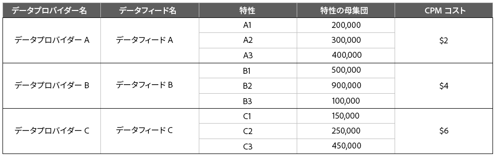
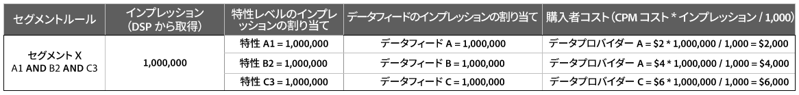
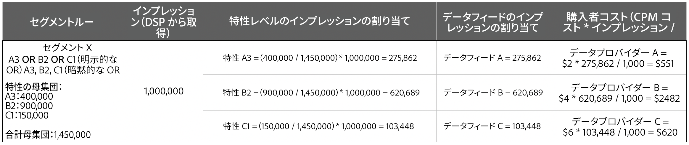
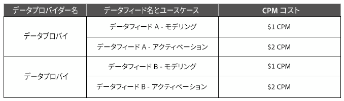
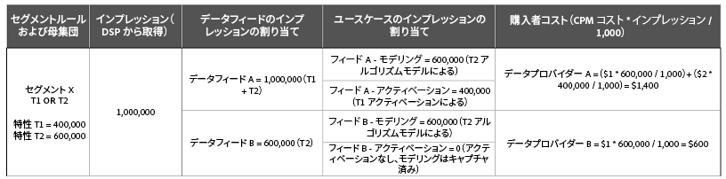

# データフィード購入者に対する請求 {#billing-for-data-feed-buyers}

Audience Marketplace データ購入者は、広告インプレッション数 1,000 回あたりのコスト（[!DNL CPM]）単位の価格で、データフィードに含まれる特性を使用して提供されたすべての広告インプレッション数をレポートすることに同意します。[!DNL CPM] 使用は、毎月 5 日を期限とし、前月のデータが含まれます。定額サブスクリプション購入者は、使用をレポートする必要はありません。

  

## CPM の使用状況の報告方法 {#report-cpm-usage}

<!-- t_marketplace_report_cpm_usage.xml -->

[!UICONTROL Audience Marketplace] データ購入者は、広告インプレッション数 1,000 回あたりのコスト（[!DNL CPM]）単位の価格で、データフィードに含まれる特性を使用して提供されたすべての広告インプレッション数をレポートすることに同意します。[!DNL CPM] の使用状況は毎月 5 日を期限とし、前月のデータが含まれます。定額サブスクリプション購入者は、使用をレポートする必要はありません。

[!UICONTROL Audience Marketplace] では、次の 2 種類の方法で [!DNL CPM] の使用状況をレポートできます。

* **セグメントレベルのレポート**：こちらが推奨される [!DNL CPM]の使用状況のレポート方法です。セグメントレベルで [!DNL CPM] の使用状況をレポートする場合、データフィードレベルのレポートセクションには、[CPM データフィードのコスト配分](#cost-attribution)で説明しているアルゴリズムに基づいて、対応する使用量が自動で入力されます。
* **データフィードレベルのレポート**：この方法では、[ データフィードのコスト配分](#cost-attribution)で説明しているアルゴリズムに基づいて、データフィードごとに [!DNL CPM] 使用状況を個別にレポートする必要があります。ただし、この方法はセグメントレベルのレポートに比べて煩雑であり、エラーが生じやすくなります。

  

## セグメントレベルでの CPM 使用状況のレポート {#segment-level-report}

「[!UICONTROL Segment Usage]」タブには、セグメントがマッピング先の宛先ごとにグループ化されて表示され、セグメントレベルでの使用状況をレポートすることができます。

セグメントレベルで [!DNL CPM] の使用状況を報告すると、[!UICONTROL Audience Marketplace] により、[CPM データフィードのコスト配分](#cost-attribution)に基づいて、対応するデータフィードに正確な使用状況が自動的に割り当てられます。

セグメントレベルで [!DNL CPM] 使用状況をレポートするには：

1. **[!UICONTROL Audience Marketplace > Payables]** へ移動します。
1. 「**[!UICONTROL Segment Usage]**」タブを選択します。
1. セグメントの使用状況を入力します。使用状況をレポートする必要があるセグメントが一部に限られている場合は、「[!UICONTROL Search]」ボックスを使用して、セグメントをフィルタリングできます。
1. 「**[!UICONTROL Edit Segments Usage]**」をクリックします。
1. [!UICONTROL Usage] 列に [!DNL CPM] の使用量を入力します。
1. 入力が完了したら「**[!UICONTROL Save]**」をクリックして、確認ダイアログで内容を確認します。

   

1. 「**[!UICONTROL Confirm]**」をクリックします。

セグメントレベルの使用状況をレポートする方法についてのデモビデオもご覧ください。

>[!VIDEO](https://video.tv.adobe.com/v/25522/)

 

## データフィードレベルでの CPM 使用状況のレポート {#feed-level-report}

データフィードレベルのレポートは、データフィードごとに [!DNL CPM] の使用量を個別に計算する必要があるので、煩雑でありエラーが発生しやすくなります。代わりに、[セグメントレベルでの CPM 使用状況のレポート](#segment-level-report)をお勧めします。

セグメントレベルで [!DNL CPM] 使用状況をレポートするには：

1. **[!UICONTROL Audience Marketplace > Payables]** へ移動します。
2. 「**[!UICONTROL Feed Usage]**」タブを選択します。
3. 「[!UICONTROL Search]」ボックスを使用してデータフィードをフィルタリングし、使用状況をレポートするデータフィードを見つけます。
4. 「**[!UICONTROL Edit Feeds Usage]**」をクリックします。
5. [データフィードのコスト配分](#cost-attribution)に基づいて各データフィードの [!DNL CPM] 使用量を計算し、計算結果を [!UICONTROL Usage] 列に入力します。
6. 入力が完了したら「**[!UICONTROL Save]**」をクリックして、確認ダイアログで内容を確認します。

   

7. 「**[!UICONTROL Confirm]**」をクリックします。

  

## 一括レポート

一括レポートオプションを使用すると、データフィードとセグメントが含まれる [!DNL CSV] ファイルをダウンロードし、このファイルに使用量を記入して [!DNL Audience Manager] にアップロードすることで、[!DNL CPM] 使用状況をレポートする際のエラーとオーバーヘッドを抑えることができます。一括レポートは、フィードの使用量およびセグメントの使用量の両方に使用できます。

[!DNL CPM] の使用状況を一括で更新するには：

1. **[!UICONTROL Audience Marketplace > Payables]** へ移動します。
1. 更新するレポートの種類に応じて、「**[!UICONTROL Feed Usage]**」タブまたは「**[!UICONTROL Segment Usage]**」タブを選択します。
1. 「**[!UICONTROL Edit Feeds Usage]**」または「**[!UICONTROL Edit Segments Usage]**」をクリックします。
1. 「**[!UICONTROL download the current usage]**」をクリックして、有効な CSV ファイルを取得します。
1. ダウンロードしたファイルをコンピューター上で開き、使用状況レポートに入力します。
1. 「**[!UICONTROL Choose a CSV file]**」をクリックして、更新した使用状況レポートをアップロードします。

   

1. ファイルはアップロード後すぐに [!DNL Audience Manager] により検証され、エラーが検出された場合はメッセージが表示されます。

  

### 一括レポートの検証エラー

| エラーメッセージ | 説明 | 対策 |
| ------------- | -------------| -----|
| Invalid Input | [!DNL Audience Manager] で、列の不足や列タイトルの変更など、[!DNL CSV] ファイルスキーマの変更が検出されました。 | テーブルの構造は変更しないでください。 |
| Not Found | [!UICONTROL Segment Level Reporting] の場合、[!DNL Audience Manager] は [!UICONTROL Segment ID] と [!UICONTROL Destination ID] の組み合わせを特定できませんでした。[!UICONTROL Feed Level Reporting] の場合、[!DNL Audience Manager] は [!UICONTROL Data Provider Name] と、[!UICONTROL Feed Name]、[!UICONTROL Use Case] の組み合わせを特定できませんでした。 | [!UICONTROL Segment Level Reporting] の場合は、[!UICONTROL Segment ID] と [!UICONTROL Destination ID] の組み合わせの有効性を確認してください。[!UICONTROL Feed Level Reporting] の場合は、[!UICONTROL Data Provider Name] と [!UICONTROL Feed Name]、[!UICONTROL Use Case] の組み合わせの有効性を確認してください。 |
| Duplicate Records Found | [!DNL Audience Manager] で、インプレッションの値が異なる重複したレコードが検出されました。 | レポートをチェックして、同じデータフィードまたはセグメントについて複数の使用量の値をレポートしていないか確認してください。 |
| Values Not Supported | [!DNL Audience Manager] で、[!DNL Audience Manager] 列に数字以外の値が検出されました。 | レポートをチェックして、[!DNL Audience Manager] 列に数値のみを入力していることを確認してください。 |
| Headers for Mandatory Fields Missing | [!DNL Audience Manager] で、必須フィールドのテーブルヘッダーが不足していることが検出されました。[!UICONTROL Segment Level Reporting] の場合、必須フィールドは [!UICONTROL Segment ID] と [!UICONTROL Destination ID] です。[!UICONTROL Feed Level Reporting] の場合、必須フィールドは [!UICONTROL Data Provider Name]、[!UICONTROL Data Feed Name]、[!UICONTROL Use Case] です。 | レポートをチェックして、テーブルヘッダーが変更されていないことを確認してください。 |

>[!NOTE]
>[!DNL CSV] 使用状況レポートの行を削除しても、既存の使用状況レポートには影響しません。[!DNL Audience Manager] では、レポートに含まれているフィールドのみが処理されます。

  

## [!DNL CPM] レポートのベストプラクティス

<table id="table_E68FA2130D1C495FAB8982DFB6A31FD9"> 
 <thead> 
  <tr> 
   <th colname="col1" class="entry"> 推奨事項 </th> 
   <th colname="col2" class="entry"> 説明 </th> 
  </tr>
 </thead>
 <tbody> 
  <tr> 
   <td colname="col1"> 
<b>常にインプレッションの合計数をレポートする</b> 
 </td> 
   <td colname="col2"> 
CPM インプレッションの合計数の場合： 

   
 小数を使用せずに、インプレッションの合計数をレポートします。Audience Managerは、レポートした合計数に基づいて CPM が自動で計算されます。

1,234,567 個のインプレッションをレポートする場合は、この数字をそのままレポートしてください。インプレッションの合計数を 1,000 で割って、CPM を算出する必要はありません。

Adobe Target や Analytics の宛先などのツールで、Web またはアプリのコンテンツを最適化するための特性（コンテンツ最適化）は、CPM プランの使用量の合計には影響しません。データプロバイダーは通常、定額プランを使用してコンテンツ最適化による報酬を得ています。

詳しくは、<a href="#cost-attribution">CPM データフィードのコスト配分</a>を参照してください。 
 </td>
  </tr>
  <tr> 
   <td colname="col1"> 
<b>毎月の報告期限を順守する</b> 
 </td> 
   <td colname="col2"> 
レポートシステムは、毎月 5 日にクローズします。この日までに CPM の使用状況を報告できなかった場合、その分を翌月のレポートに追加しなければなりません。例えば、10 月に 1000 件のインプレッションを使用して、10 月分の締め切りまでに報告できず、11 月には 1000 件のインプレッションを使用したとします。この場合、10 月と 11 月の合計（2000）を、12 月 1 日から 5 日までの間に報告します。

<b>ヒント</b>：前月分の CPM の使用状況は、翌月の 1 日から 5 日までの間に報告するようにしてください。

CPM の使用状況の報告締切日は翌月 5 日ですが、推奨はされていません。毎月 5 日までに CPM の使用状況を報告すると、Audience Manager でデータの確認と処理をおこなう時間ができます。
 </td>
  </tr> 
 </tbody> 
</table>

  

## CPM データフィードのコスト配分 {#cost-attribution}

[!UICONTROL Audience Marketplace] では、ユーザーがセグメントごとに各月のインプレッションの量を自己申告する必要があります。コスト配分が自動的におこなわれる、セグメントレベルでの [!DNL CPM] 使用状況のレポートをお勧めします。

<!-- marketplace_cpm_billing.xml -->

### 請求の概要 {#billing-summary}

各月の 1 日から 5 日までに、[!DNL CPM] データフィードのインプレッションの量を報告する必要があります。これを適切におこなうために、[セグメントレベルでの CPM 使用状況のレポート](#segment-level-report)をお勧めします。

>[!TIP]
>セグメントレベルで [!DNL CPM] の使用状況をレポートする場合、データフィードレベルのレポートセクションには、対応する使用量が自動で入力されます。

[!UICONTROL Report CPM Usage at Data Feed Level] が必要な場合は、前月に各フィードで配信されたすべてのインプレッション数をそれぞれ合計し、この記事で説明する請求配分に応じてレポートする必要があります。

前月の [!DNL CPM] 数の報告を受けた後、[!DNL Adobe] は次の作業をおこないます。

* 請求書を作成し、購読されているデータフィードごとの [!DNL CPM] 価格に基づいて請求します。
* 報告された [!DNL CPM] の使用状況に基づいて、データプロバイダー（販売者）に料金を支払います。

>[!IMPORTANT]
>
>購入者として報告するインプレッションの合計は、真実かつ正確でなければなりません。インプレッションの合計を毎月 5 日までに報告しない場合、報告されていない分の月の合計は翌月に報告しなければなりません。

  

## 特性認定ルールに基づくフィードレベルでのインプレッションの配分 {#assign-impressions}

[!UICONTROL Activation] ユースケースでは、[セグメントビルダー](../../../features/segments/segment-builder.md)で対応するデータフィードの特性を使用してセグメントを作成し、宛先にマッピングすることができます。ブール演算子 [!UICONTROL AND]、[!UICONTROL OR]、および [!UICONTROL NOT] を使用すると、特性とセグメントの認定の条件を設定できます。

[データフィードレベルで CPM 使用状況をレポートする](#feed-level-report)場合は、特性の認定ルールで使用する [!DNL Boolean] 演算子に従い、各データフィードにインプレッションを比例配分する必要があります。次の表は、ブール演算ルールまたは特性タイプによりインプレッションを適切に配分する方法を示しています。

>[!TIP]
>[セグメントレベルでの CPM 使用状況のレポート](#segment-level-report)では、Audience Manager により、データフィードレベルでのレポートが自動でおこなわれます。

<table id="table_BF00FE6740D2459DAFA62F2478492586"> 
 <thead> 
  <tr> 
   <th colname="col1" class="entry"> ルール認定のロジックまたはタイプ </th> 
   <th colname="col2" class="entry"> 請求配分 </th> 
  </tr> 
 </thead>
 <tbody> 
  <tr> 
   <td colname="col1"> 
 AND 
 </td> 
   <td colname="col2"> 
配信されたインプレッション合計の 100％を、ブール演算子 AND 条件を使用するルールベースのセグメントのすべてのプロバイダー特性に適用します。 
 </td> 
  </tr> 
  <tr> 
   <td colname="col1"> 
 OR 
 </td> 
   <td colname="col2"> 
配信されたインプレッション合計の重み付け配分を、ブール演算子 OR 条件を使用するルールベースのセグメントのすべてのプロバイダー特性に適用します。重み付け配分は次の数式で計算します。

<code>(Trait Population / Segment Population) * Number of Impressions * Cost of CPM</code>
 </td> 
  </tr>
  <tr> 
   <td colname="col1"> 
NOT 
 </td> 
   <td colname="col2"> 
配信されたインプレッション合計の 100％を、ブール演算子 NOT 条件を使用するルールベースのセグメントのすべてのプロバイダー特性に適用します。 
 </td> 
  </tr> 
  <tr> 
   <td colname="col1"> 
アルゴリズムセグメント 
 </td> 
   <td colname="col2"> 
配信されたインプレッション合計の 100％を、アルゴリズム特性を含むセグメントのすべてのプロバイダーフィードに適用します。 
 </td> 
  </tr>
 </tbody>
</table>

  

## 請求例 {#billing-examples}

以下の例で、データフィードレベルでの [!DNL CPM] の使用量の配分方法について説明します。

>[!IMPORTANT]
>この方法の代わりに、処理が自動でおこなわれる[セグメントレベルでの CPM 使用状況のレポート](#segment-level-report)をお勧めします。

次のシナリオについて考えます。

  

### ケース 1：AND 認定ルールを使用するセグメント

このセグメントには、別々のデータプロバイダーからの特性が 3 件あります。セグメント認定は [!UICONTROL AND] 条件に基づいているので、訪問者がセグメントの対象として認定されるには、3 つすべてのフィードからの特性を適合する必要があります。

[!UICONTROL AND] 条件を使用する場合、月内に受け取ったインプレッションの 100％を、3 つすべてのデータプロバイダーに割り当てる必要があります。[!UICONTROL Audience Marketplace > Payables]セクションで、各プロバイダーに 1,000,000 件のインプレッションを計上します。

この例は、[!DNL Boolean] [!UICONTROL NOT] 演算子を使用するセグメント、またはアルゴリズム特性を含むセグメントに該当します。

  

### ケース 2：OR 認定ルールを使用するセグメント

このセグメントには、別々のデータプロバイダーからの特性が 3 件あります。セグメント認定は [!UICONTROL OR] 条件に基づいているので、訪問者がセグメントの対象として認定されるには、3 つのフィードのうち少なくとも 1 つからの特性を適合する必要があります。

認定は [!UICONTROL OR] 条件に基づいているので、どちらの特性がインプレッションに対応しているかは判別できません。このため、[!UICONTROL Audience Marketplace > Payables] セクションで、特性の母集団に基づいて、インプレッションの合計数を各プロバイダーに重み付け配分し、計上します。

  

### ケース 3：モデリングとアクティベーションを使用したセグメントのユースケース

この例では、2 つのデータフィードのユースケース（モデリングとアクティベーション）に基づいたアトリビューションについて説明します。この例では、次の情報を使用して 2 つのデータプロバイダーを見ていきます。

次の表では、セグメント X にはセグメントルール T1 OR T2 を使用する、T1 と T2 の 2 つの特性があります。ここで、

* T1 は、データフィード A の特性です。
* T2 は、データフィード A とデータフィード B のサードパーティ特性の後にモデル化されたアルゴリズム特性です。

セグメントが宛先にマッピングされ、[セグメントレベルのレポート](#segment-level-report)を使用して、1 か月でこのセグメントに 1,000,000 のインプレッションが入力さあれます。

これらの 1,000,000 インプレッションのうち、

* T1 は、セグメント母集団の 40％を占めます。これは、フィード A の 400,000 インプレッションに変換されます。
* T2 は、セグメント母集団の 60%を占めます。これは、フィード A およびフィード B の 600,000 インプレッションに変換されます。

データフィードレベルでは、インプレッションの配分方法は次のとおりです。

* データフィード A は、特性 T2 から 600,000 インプレッション（データフィード A とデータフィード B の特性をモデル化したもの。両方がインプレッションを受け取る）、特性 T1 から 400,000 インプレッション（データフィード A からの特性）、合計 1,000,000 のインプレッションを受け取ります。
* データフィード B は、特性 T2 から 600,000 インプレッション（上述の説明を参照）、特性 T1 から 0 インプレッションを受け取ります。

データフィード別の一目でわかる分類と使用例は次のとおりです。

  

## 定額データフィードに関する請求およびインプレッションの割り当て {#billing-flat-fee}

定額料金のデータフィードでは、サブスクリプションの開始日や使用するインプレッションの数にかかわらず、毎月一定額が請求されます。1 か月未満の使用または未使用期間について、費用は日割り計算されません。CPM 請求と同様に、アドビは、請求書を生成し、登録されたデータフィードに対して定額料金で毎月請求します。

例えば、月の半ばで特定の特性を有効にするとします。この場合、購読を開始した時点や特定の特性を有効にした時点にかかわらず、月額の全額が請求されます。