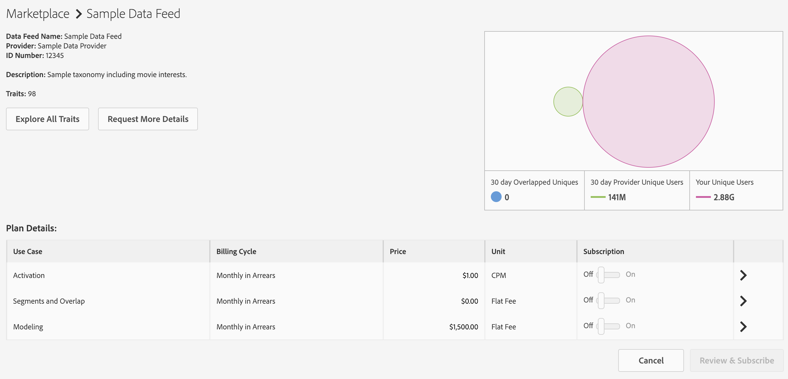
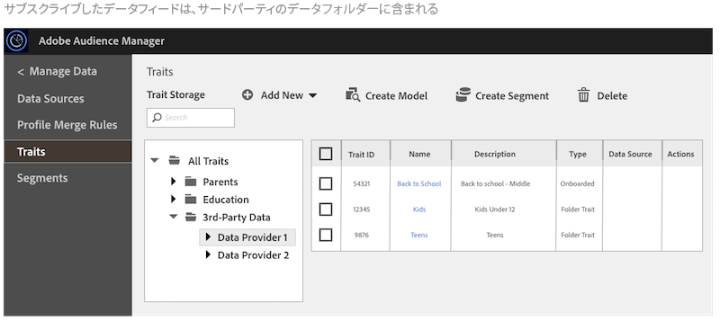

# データフィードのサブスクリプションの管理 {#manage-data-feed-subscriptions}

[!UICONTROL Marketplace] は、データ購入者が公開および非公開データフィードの調査およびサブスクリプション購入をおこなう場所です。公開データフィードのサブスクリプションを購入するには、以下の手順に従います。

## 公開データフィードのサブスクリプション購入 {#subscript-public-data-feed}

[!UICONTROL Marketplace] は、データ購入者が公開および非公開データフィードの調査およびサブスクリプション購入をおこなう場所です。公開データフィードのサブスクリプションを購入するには、以下の手順に従います。

<!-- t_subscribe_feed.xml -->

公開データフィードのサブスクリプションを購入するには：

1. **[!UICONTROL Audience Marketplace > Marketplace]** へ移動します。検索機能を使用するか、リストを参照して、データフィードを特定します。

   

1. 使用するデータフィードの名前をクリックします。選択したフィードの[プラン詳細ページ](../../../features/audience-marketplace/marketplace-data-buyers/marketplace-manage-subscriptions.md#marketplace-buyer-details)が開きます。

   

1. 購読テーブルからユースケースを選択し、以下の操作をおこないます。
   * **[!UICONTROL Subscription]** スライダーを「**[!UICONTROL On]**」にします。
   * 「**[!UICONTROL Review & Subscribe]**」をクリックします。[!UICONTROL Terms and Conditions] ウィンドウが開きます。

   

1. [!UICONTROL Terms and Conditions] ウィンドウで、以下の手順に従ってください。

   * **重要：** チェックボックスはオンのまま&#x200B;**[!UICONTROL ID sync]**&#x200B;にしておきます。この設定により、データプロバイダーとの一致率が高くなります。
   * 利用条件チェックボックスをオンにしてから&#x200B;**[!UICONTROL Accept]**&#x200B;をクリックし、購読手続きを完了します。

   

### 次の手順

データフィードの購読手続きの後、以下の手順に従ってください。

* [!UICONTROL Traits] フォルダーを確認して、購読の内容を検証します。[購読データフィードのストレージ](../../../features/audience-marketplace/marketplace-data-buyers/marketplace-manage-subscriptions.md#find-subscribed-data-fee)を参照してください。

* 請求と支払いについてのドキュメントを確認します。後述の関連リンクを参照してください。

### ベストプラクティス {#best-practices}

[!UICONTROL Audience Marketplace] を使用する際に推奨されるベストプラクティスを以下に示します。

[!UICONTROL Audience Marketplace] を通じて新しいサードパーティおよびセカンドパーティのデータセットを調べる場合は、最初に、[!UICONTROL Segments & Overlap] のデータフィードを有効にすることをお勧めします。これによりユーザーは、セグメントを作成してオーディエンスサイズを評価し、重複レポートを実行して初期オーディエンスのインサイトを得ることで、データを調査できます。ほとんどのデータプロバイダーは、このユースケースを無料で提供しており、追加費用なしでこの分析を実行できます。

重複レポートを実行する場合は、次のベストプラクティスに従って、有益な結果が得られるようにします。

1. 重複するデータセットで、次のようなデータタイプや収集方法が類似していることを確認します。
   * 訪問者の地域
   * cookie とモバイル ID
   * ルックバックウィンドウ
   * オフラインのアクティビティとオンラインのアクティビティ
   * データプロバイダーがデータを更新する頻度

1. 重複は時間の経過に伴ってわずかに増加する可能性があるので、重複レポートを実行する前に最大 30 日間経過してからデータを同期するようにしてください。
1. 複数のマーケティングキャンペーンとイニシアチブでデータプロバイダーのデータを使用すると、重複が増える可能性があります。これにより、2 つのデータセットのユーザーが同期する機会が増えます。
1. データセット間で重複が生じる保証はありません。重複を有効にするには、レポート期間中に、顧客のデータセットのユーザーをデータプロバイダーデータセットに関連付ける必要があります。顧客のメディアデータがデータプロバイダーのデータセット内のユーザーに提供されなかった場合、重複は発生しません。
1. 重複の少なさは悪いことではありません。見込み客に対する重複率の低さを利用して、新しいユーザーを惹きつけます。

## 非公開データフィードのサブスクリプション購入 {#subscript-private-data-feed}

購入者は、**[!UICONTROL Audience Marketplace > Marketplace]** で、非公開データフィードおよびプランのサブスクリプションを購入します。

<!-- t_private_feed.xml -->

>[!TIP]
>
>データプロバイダーが、非公開データフィードの割引を実施していることがあります。購読リクエストを送信する際に、利用可能な割引について質問することができます。

非公開データフィードのサブスクリプションを購入するには：

1. [!UICONTROL Marketplace] でデータフィード名をクリックします。
1. 「**[!UICONTROL Request Access]**」をクリックします。リクエストダイアログボックスが開きます。
1. リクエストダイアログボックスで、プロバイダー向けに、データフィードに興味があることを記したメモを記入し、**[!UICONTROL Send]**&#x200B;をクリックします。販売者はメッセージを確認し、リクエストを承認または拒否します。承認されるまでの間、「[!UICONTROL Marketplace]」リストではそのリクエストについて「Requested」と表示されます。

   * **[!UICONTROL Request approved]**：「[!UICONTROL Marketplace]」リストのステータスが「Access Granted」になり、自動通知が送信されます。この時点で、フィードを購読することができます。詳しくは、[公開データフィードのサブスクリプション購入](../../../features/audience-marketplace/marketplace-data-buyers/marketplace-manage-subscriptions.md#subscript-public-data-feed)を参照してください。
   * **[!UICONTROL Request denied]**：「[!UICONTROL Marketplace]」リストでそのフィードについて「Requested」の表示が削除されます。もう一度サブスクリプションの購入を試みるか、別のフィードを選択することができます。

## 購入者向けのデータフィードの割引 {#buyer-discount}

[!UICONTROL Audience Marketplace] では、プロバイダーは、[!DNL CPM] または定額料金データフィードの公表価格の割引を購入者に提案できます。ただし、[!DNL Marketplace] のフィードリストでは、割引額は購入者に表示されません。しかし、非公開データフィードを購読する際、または特定のフィードに関する詳細情報をリクエストする際に、割引を求めることもできます。

## 割引のリクエスト  {#request-discount}

<!-- marketplace-buyer-discounts.xml -->

<table id="table_3C6E58F593BA48EC89ACBD9A26E4E74F"> 
 <thead> 
  <tr> 
   <th colname="col1" class="entry"> 購入者のステータス </th> 
   <th colname="col2" class="entry"> 説明 </th> 
  </tr> 
 </thead>
 <tbody> 
  <tr> 
   <td colname="col1"> 
 <b>Current Subscribers</b> 
 </td> 
   <td colname="col2"> 
非公開データフィードを既に購読している場合に、割引をリクエストするには、次の手順に従います。 
 
    <ol id="ol_A58D419EBB9349E9B1225202535130F6"> 
     <li id="li_D0DDC8AC6E9C4675AA4630D63FE8F071"> <a href="../../../features/audience-marketplace/marketplace-data-buyers/marketplace-manage-subscriptions.md#unsubscribe">データフィードを購読解除</a>します。 </li> 
     <li id="li_05A5379F2A944FB28AB39C196DDE3A1D">データプロバイダーに連絡し、割引価格をリクエストします。 </li> 
     <li id="li_B1B5AA6F6CC64512A02D5E8861A5F266">プロバイダーから割引が承認された場合、翌月の 1 日にフィードを再購読します。 </li> 
    </ol> </td> 
  </tr> 
  <tr> 
   <td colname="col1"> 
 <b>非公開データフィードの新規購読者</b> 
 </td> 
   <td colname="col2"> 
購読リクエストで割引を申請します。詳しくは、<a href="../../../features/audience-marketplace/marketplace-data-buyers/marketplace-manage-subscriptions.md#subscript-private-data-feed">非公開データフィードのサブスクリプション購入</a>を参照してください。 
 </td>
  </tr> 
  <tr> 
   <td colname="col1"> 
 <b>Potential Subscribers</b> 
 </td> 
   <td colname="col2"> 
<a href="../../../features/audience-marketplace/marketplace-private-feeds.md">Potential Subscribers（潜在的な購読者）</a>とは、非公開データフィードへのアクセスをリクエストし、販売者の承認を得ているけれど、その後まだフィードを購読していないデータ購入者を指します。潜在的な購読者として割引をリクエストするには、次の手順に従います。 
 
    <ol id="ol_9CECDA92E7894B20AC8A777D78962188"> 
     <li id="li_618B64160CF24549AFCA73E006DCA35A"><b>Audience Marketplace／Marketplace</b> を開きます。 </li> 
     <li id="li_FE52A06B30FC4858B48AF81954365FE9">承認されているフィードの名前をクリックします。 </li> 
     <li id="li_763C050AC9464BE380D00F6085B6E540">「<b>Request More Details</b>」をクリックします。販売者への詳細リクエストで割引をリクエストします。 </li> 
    </ol> </td> 
  </tr> 
 </tbody> 
</table>

## 割引フィードの確認 {#review-discounted-feeds}

割引フィードを確認するには、次の手順に従います。

1. **[!UICONTROL Audience Marketplace > Marketplace]** へ移動します。
1. 購読済みのフィードの名前をクリックします。
1. [!UICONTROL Plan Details] テーブルの「[!UICONTROL Price]」列と「[!UICONTROL Your Price]」列を確認します。フィードが割引されている場合、次のようになります。

   * 元の価格は赤色の線でマークされています。
   * 「[!UICONTROL Your Price]」列の料金が、「[!UICONTROL Price]」列の料金より安くなっています。

この例では、購入者は、[!UICONTROL Segments and Overlap] の **[!UICONTROL Software Audience Feed]** プランで 10％の割引を受けています。

## 購読しているフィードのデータの確認 {#find-subscribed-data-fee}

データフィードのデータ（特性）は、各自の特性ストレージフォルダーに表示されます。**[!UICONTROL Audience Data > Traits]** を開き、**[!UICONTROL 3rd-Party Data]** フォルダーを展開して、購読フィードの特性の表示や操作をおこないます。利用しているデータプロバイダーの名前のサブフォルダーを探します。これらには、個別のデータフィードにちなんだ名前のフォルダーが含まれており、フィードで提供されている特性が一覧表示されます。

<!-- marketplace-feed-storage.xml -->

## データフィードの購読解除 {#unsubscribe}

データ購入者は、**[!UICONTROL Audience Marketplace > Marketplace]** で、データフィードおよびプランの購読を解除します。

<!-- t_unsubscribe_feed.xml -->

データフィードを購読解除するには：

1. [!UICONTROL Marketplace] でデータフィード名をクリックします。
1. 「[!UICONTROL Use Case]」セクションで、目的のプランを見つけ、**[!UICONTROL Subscription]** スライダーを&#x200B;**[!UICONTROL Off]**&#x200B;にします。

## データフィードの非アクティブ化：発生の理由と対応 {#data-feed-deactivation-reasons}

[!UICONTROL Audience Marketplace] では、購読したデータフィードへのアクセスがデータプロバイダーにより取り消されることがあります。このような事態になっても、あわてることはありません。備えは既にできています。この節では、データフィードの非アクティブ化に関する処理と手順について説明します。

## データフィードの非アクティブ化の一般的な理由 {#reasons-for-deactivation}

<!-- marketplace-subscriber-deactivated.xml -->

購読したフィードが停止されることは購読者にとってあまりよいことではありません。しかし、データプロバイダーはいくつかの理由でデータフィードを非アクティブ化することがあります。よくある理由として以下のようなものがあります。

* **課金：**&#x200B;料金の支払いが常に遅れている場合や、料金の支払いがない場合、データプロバイダーはフィードを非アクティブ化します。
* **フィードの更新：**&#x200B;フィードの分類やコスト構造を更新した場合、データプロバイダーはフィードを非アクティブ化する必要があります。
* **非アクティブな購入者：**&#x200B;購読者が長期間にわたり購入をおこなわない場合に、データプロバイダーはフィードを非アクティブ化する権利を保有します。
* **非アクティブな販売者：**[!UICONTROL Audience Marketplace] の利用を終了するデータプロバイダーは、自分のデータフィードをすべて非アクティブ化して削除します。

>[!TIP]
>
>データフィードが誤って非アクティブ化されたと考えられる場合は、データプロバイダーに直接お問い合わせください。問い合わせ先情報や追加サポートについては、[!DNL Adobe]の担当コンサルタントにお問い合わせください。

## 非アクティブ化電子メール {#deactivation-email}

データプロバイダーがいずれかのデータフィードを非アクティブ化すると、[!DNL Audience Manager] は、[!UICONTROL Administrator]権限を持つ社内ユーザーに電子メールを送信します。場合によっては、電子メールフィルターがこのメッセージをスパムとして分類することがあります。その結果、この重要な通知が見逃されることがあります。非アクティブ化メッセージを識別できるように、この電子メールには次の要素が含まれています。

* **送信者：**&#x200B;この非アクティブ化電子メールは `aam-noreply@adobe.com` から送信されます。ヒント：この電子メールには返信しないでください。

* **件名：** *（データフィード名）*&#x200B;のサブスクリプションはキャンセルされました。

* **添付ファイル**&#x200B;この電子メールには、`list-of-affected-entities-by-feed-revocation.csv` という名前の添付ファイルがあります。これは、キャンセルされたフィードに含まれているすべての特性が添付ファイルに記載されていることを暗示しています。データ購入者は、この添付ファイルを確認する必要があります。このファイルにより、非アクティブ化された特性を検索して、セグメントや[アルゴリズムモデル](../../../features/algorithmic-models/understanding-models.md)から削除することができます。

## 非アクティブ化された特性のリスト {#deactivation-trait-list}

非アクティブ化電子メールに添付されているリストには、次のフィールドがあります。

<table id="table_5C3800F9D8AA43EFAB4690959A721F63"> 
 <thead> 
  <tr> 
   <th colname="col1" class="entry"> フィールド </th> 
   <th colname="col2" class="entry"> 説明 </th> 
  </tr> 
 </thead>
 <tbody> 
  <tr> 
   <td colname="col1"> 
<b> Data Feed ID</b> 
 </td> 
   <td colname="col2"> 
非アクティブ化されたデータフィードの ID。 
 </td> 
  </tr> 
  <tr> 
   <td colname="col1"> 
<b> Data Feed Name</b> 
 </td> 
   <td colname="col2"> 
非アクティブ化されたデータフィードの名前。 
 </td> 
  </tr> 
  <tr> 
   <td colname="col1"> 
<b> Trait SID</b> 
 </td> 
   <td colname="col2"> 
非アクティブ化された特性の ID。 
 </td> 
  </tr> 
  <tr> 
   <td colname="col1"> 
<b> Trait Name</b> 
 </td> 
   <td colname="col2"> 
非アクティブ化された特性の名前。 
 </td> 
  </tr> 
  <tr> 
   <td colname="col1"> 
<b> Segment SID</b> 
 </td> 
   <td colname="col2"> 
非アクティブ化された特性が含まれるセグメントの ID。 
 </td> 
  </tr> 
  <tr> 
   <td colname="col1"> 
<b> Segment Name</b> 
 </td> 
   <td colname="col2"> 
非アクティブ化された特性が含まれるセグメントの名前。 
 </td> 
  </tr> 
  <tr> 
   <td colname="col1"> 
<b> Algo Model ID</b> 
 </td> 
   <td colname="col2"> 
非アクティブ化された特性が含まれるアルゴリズムモデルの ID。 
 </td> 
  </tr> 
  <tr> 
   <td colname="col1"> 
<b> Algo Model Name</b> 
 </td> 
   <td colname="col2"> 
非アクティブ化された特性が含まれるアルゴリズムモデルの名前。 
 </td> 
  </tr> 
 </tbody> 
</table>

## 非アクティブ化された特性を削除  {#remove-deactivated-traits}

データ購入者は、キャンセルされたフィード内の特性を、アクティブ／使用中のセグメント、非アクティブなセグメントを問わず、すべてのセグメントから削除する必要があります。削除については次のオプションがあります。

* 一括削除。[REST API](../../../api/rest-api-main/rest-api-main.md) または[一括管理ツール](../../../reference/bulk-management-tools/bulk-management-intro.md)を使用します。

* [!UICONTROL Segment Builder]を使用して、影響を受けるセグメントを手動で検索し、非アクティブ化された特性を削除します。[セグメントからの特性の削除](../../../features/segments/segment-builder.md#segment-builder-controls-traits)を参照してください。

>[!NOTE]
>
>アクティブなアルゴリズムモデルや宛先から特性を削除すると、スケールやターゲットの精度に影響が生じます。可能であれば、取り消された特性を新しいアクティブな特性と入れ替えてください。

[非アクティブ化されたデータフィードの購読解除](../../../features/audience-marketplace/marketplace-data-buyers/marketplace-manage-subscriptions.md#unsubscribe)を、取り消された特性をすべてアカウントから削除してから実行します。一時的な非アクティブ化の場合は、データプロバイダーが必要な変更をおこなってフィードを再アクティブ化した後に、再購読できます。このプロセスでは、パートナー（データプロバイダーと[!DNL Adobe]）との良好なコミュニケーションが欠かせません。

## Audience Marketplace のプランの詳細ページについて {#marketplace-buyer-details}

[!UICONTROL Marketplace] でデータプランの名前をクリックすると、データフィードのサブスクリプション購入に関する選択を情報に基づいておこなうのに役立つ情報が [!DNL Audience Manager] に表示されます。

<!-- marketplace-buyer-details.xml -->

このページには、次の情報が表示されます。

1. **基本プラン情報**&#x200B;次のようなフィード情報が表示されます。
   * データフィード名。例えば、上記の例では、フィードの名前は「Cross Pixel - Demographics」です。
   * データプロバイダーの名前
   * データフィード ID
   * 説明
   * フィード内の特性の数

1. プラン情報ボタン
   * **[!UICONTROL Explore All Traits]**&#x200B;をクリックすると、選択したデータフィード内のすべての特性に関する詳細が表示されます。
   * **[!UICONTROL Request More Details]**&#x200B;をクリックすると、データプロバイダーに選択したデータフィードについて質問したり、割引をリクエストしたりすることができます。この機能では、コメントや質問を直接データプロバイダーに送信することができます。

1. データフィードレポート指標の呼び出しの後におこなわれる場合です。ベン図（および関連指標）から、直近 30 日間の特性重複データがわかります。詳しくは、[Marketplace について](marketplace-data-buyers.md#about-marketplace)を参照してください。
   * **[!UICONTROL 30 Day Overlapped Uniques]**：プロバイダーのアカウントのユーザーと重複するアカウント内のユニークユーザーの数。一意のユーザーの定義については、「[Audience Manager の ID の インデックス](/help/using/reference/ids-in-aam.md)」の「AAM UUID」を参照してください。
   * **[!UICONTROL 30 Day Provider Unique Users]**：プロバイダーのアカウントからのユニークユーザーの数。
   * **[!UICONTROL Your Unique Users]**：アカウントからのユニークユーザーの数。

1. **[!UICONTROL Plan Details]** 表。次の表に、サブスクリプションを購入できるデータフィードのユースケースとその価格モデルを示します。[データフィードのユースケースについて](#use-cases)を参照してください。

1. プランアクションボタン。
   * **[!UICONTROL Cancel]**&#x200B;をクリックすると、変更せずにページを終了します。
   * データフィードのサブスクリプションを購入するには、**[!UICONTROL Review & Subscribe]**&#x200B;をクリックします。[!UICONTROL Subscription] トグルボタンを [!UICONTROL On] に切り替えるまで、このボタンは灰色に表示されます。[公開データフィードのサブスクリプション購入](#subscript-public-data-feed)および[非公開データフィードのサブスクリプション購入](#subscript-private-data-feed)も参照してください。

## データフィードのユースケースについて {#use-cases}

[!UICONTROL Audience Marketplace] のデータ購入者は、重複、モデリングおよびアクティブ化のユースケースに関するデータを購入します。各ユースケースは、特定の購入用に設計され、データを使用してできることを制限します。これらのユースケースの説明は、購入するデータプランのタイプについて適切な判断を下すうえで役に立ちます。

## セグメントおよび重複プランとの比較  {#comparisons}

<!-- c_use_cases_for_buyers.xml -->

### セグメントと重複

このユースケースでは、[特性間重複レポート](../../../reporting/dynamic-reports/trait-trait-overlap-report.md#trait-to-trait-overlap-report)でご使用の特性とプロバイダー特性を比較できます。また、[セグメント - 特性間](../../../reporting/dynamic-reports/segment-trait-overlap-report.md)レポートおよび[セグメント間](../../../reporting/dynamic-reports/segment-segment-overlap-report.md)レポートで、プロバイダー特性を作成またはセグメントに追加してさらに比較をおこなうこともできます。重複比較は以下に役立ちます。

* **オーディエンスリーチの拡大：**&#x200B;重複が少ない場合は、お使いの特性にこれまでにないユーザーが含まれていることを示唆しています。これらの特性を試して新規ユーザーにリーチするとよいでしょう。
* **既存オーディエンスの強化：**&#x200B;重複が多い場合は、お使いの特性がデータプロバイダー所有の特性と類似していることを示唆しています。既に開拓したオーディエンスをさらに絞り込んでいくのに、これらの特性が役に立ちます。

### アルゴリズムモデル

このユースケースでは、[アルゴリズムモデル](../../../features/algorithmic-models/understanding-models.md#understanding-models)を使用して、ご使用の特性を基準にしてサプライヤー特性を評価することができます。例えば、アドビのアルゴリズムモデリングシステムでは、サプライヤー提供の特性に対する比較の基準として、お使いの特性の 1 つを使用します。モデルを実行すると、サプライヤー特性のオーディエンスが、お使いの特性と類似したコンバージョン属性を共有しているかどうかがわかります。

### アクティベーション

このユースケースでは、[宛先](../../../features/destinations/destinations.md)にデータを送信できます。[!DNL Audience Manager] において、宛先とは、データを共有したいサードパーティシステム（広告サーバー、[!DNL DSP]、[!DNL DMP]、exchange など）のになります。ただし、[!UICONTROL Activation] ユースケースでは、重複レポートを実行したり、データをアルゴリズムモデルでテストしたりすることはできません。

>[!MORELIKETHIS]
>
>* [CPM データフィードの請求とインプレッション割り当て](../../../features/audience-marketplace/marketplace-data-buyers/marketplace-buyer-billing.md#cost-attribution)
>* [定額データフィードに関する請求およびインプレッションの割り当て](../../../features/audience-marketplace/marketplace-data-buyers/marketplace-buyer-billing.md)
>* [CPM の使用状況の報告方法](../../../features/audience-marketplace/marketplace-data-buyers/marketplace-buyer-billing.md#report-cpm-usage)
>* [公開データフィードのサブスクリプション購入](../../../features/audience-marketplace/marketplace-data-buyers/marketplace-manage-subscriptions.md#subscript-public-data-feed)
>* [データ購入者にとっての割引](../../../features/audience-marketplace/marketplace-data-buyers/marketplace-manage-subscriptions.md#buyer-discount)
>* [Marketplace について](../../../features/audience-marketplace/marketplace-data-buyers/marketplace-data-buyers.md#about-marketplace)

