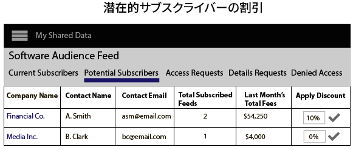
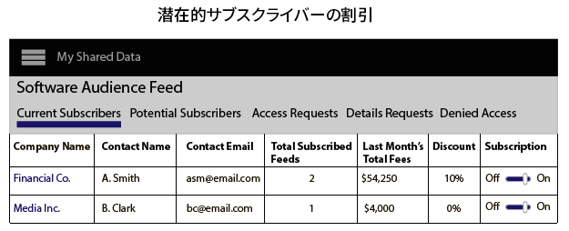

# データフィードの作成、価格設定および管理 {#create-price-and-manage-data-feeds}

## 公開または非公開のデータフィードの作成 {#create-public-private-data-feed}

データフィードには、名前、説明、データソースおよびプランのタイプが必要です。フィードを保存およびアクティブ化するまで、フィードは無効です。**[!UICONTROL Audience Marketplace > My Shared Data]**&#x200B;で公開または非公開のデータフィードを設定します。データ販売者のみ使用できます。

<!-- t_data_feed.xml -->

公開または非公開のデータフィードを作成するには、管理者権限が必要です。データフィードを作成するには：

1. 「**[!UICONTROL New Data Feed]**」をクリックします。
1. データフィードの名前を指定します。データ購入者はこの名前に基づいてフィードを検索できます。
1. わかりやすい説明を入力します（最大 255 文字）。

   説明文はフィードの内容を適切に表すものにすることをお勧めします。例えば、マーケティングカテゴリ、人口統計、地理的範囲（「[!DNL US]」、「北米」など）をテキストに入れることができます。説明文は検索可能なので、これにより購入者はフィードの検索や評価ができるようになります。優れた説明文は、データフィードに購読者を引きつけるために重要です。
1. **[!UICONTROL Data Source]**&#x200B;オプションからデータソースを選択します。データフィードは 1 つのデータソースに制限されます。同じデータフィードに複数のデータソースを割り当てることはできません。

   >[!IMPORTANT]
   >
   >このデータソースに現在および将来属する特性は、このフィードの一部としてデータ購入者と共有されます。

1. 「[!UICONTROL Plan Types]」で使用するオプションを選択し、「**[!UICONTROL Add Plan]**」をクリックします。

   フィードには複数のプランが含まれる場合があります。プランには複数のユースケースが含まれる場合があります。詳しくは、[データフィードのプランタイプ](../../../features/audience-marketplace/marketplace-data-providers/marketplace-create-manage-feeds.md#plan-types)を参照してください。

1. 「**[!UICONTROL Save]**」をクリックすると、データフィードがアクティブ化&#x200B;*されずに*&#x200B;保存されます。
1. データフィードを保存してアクティブ化するには：
   1. **[!UICONTROL Availability]** スライダーを「**[!UICONTROL Active]**」にします。
   1. 「**[!UICONTROL Save]**」をクリックします。

   >[!NOTE]
   >
   >* 保存されてアクティブになったデータフィードは削除できません。
   >* 購入者にはアクティブのフィードしか表示されません。

### オプション：非公開データフィードの作成

「[!UICONTROL Settings]」セクションで、スライダーを以下のように動かします。

* **[!UICONTROL Private]**&#x200B;と&#x200B;**[!UICONTROL Branded]**：購入者の「[!UICONTROL Marketplace]」リストで、販売者の名前がプロバイダー列に表示されますが、その他のデータはすべて非表示になります。

* **[!UICONTROL Private]**&#x200B;と&#x200B;**[!UICONTROL Unbranded]**：購入者の「[!UICONTROL Marketplace]」リストには、データフィードの名前と説明だけが表示されます。データプロバイダーの名前は、[!UICONTROL Private Seller] と表示されます。

非公開フィードが購入者にどのように表示されるかについては、[非公開データフィード](../../../features/audience-marketplace/marketplace-private-feeds.md)を参照してください。

## 購読者のデータフィードを非アクティブ化する {#deactivate-data-feed}

[!UICONTROL Audience Marketplace] のデータプロバイダーは、購読されたデータフィードへの購入者のアクセスを取り消すことができます。料金の支払い遅延や不払いなどが発生した場合や、購入者が特性データを不正に使用した場合は、フィードから購入者を削除することもできます。

<!-- marketplace-deactiva4te-subscribers.xml -->

購読者を取り消すには、次の手順に従います。

1. 「[!UICONTROL My Shared Data]」で、購読者が使用しているフィールドを特定します。

   >[!NOTE]
   >
   >支払期限を過ぎたアカウントがあるデータフィードには、三角形または感嘆符のアイコンでフラグが設定されています。

1. 「[!UICONTROL Subscribers]」列で、そのフィードの購読者数を表す青色の数字をクリックします。購読詳細ページが開きます。
1. **[!UICONTROL Subscription]** スライダーを「**[!UICONTROL Off]**」にします。確認ダイアログウィンドウが開きます。
1. 「[!UICONTROL Confirmation]」で「**[!UICONTROL Yes]**」クリックすると購読が非アクティブ化され、「**[!UICONTROL Cancel]**」をクリックすると購読は変更されずに処理が終了します。

### 購読者を非アクティブ化した後

データフィードへのアクセスを取り消すと、そのデータ購入者のアカウントにあるすべての管理者ユーザーに通知電子メールが送信されます。この電子メールには、取り消された特性のリストが添付されます。このリストにより、購読者は非アクティブ化された特性を検索して、セグメントやモデルから削除することができます。

### 請求とフィードの非アクティブ化

データフィードへのアクセスを削除した後、その時期によって、購読者は前月または当月の料金を支払います。

## データフィードのプランタイプ {#plan-types}

[!DNL Plan types]は、[!UICONTROL Audience Marketplace] データフィードの必須コンポーネントです。これらにより、データプロバイダーはフィードの複数のユースケースや価格オプションを作成できます。さらに、データフィードごとに数個のプランを作成するのがよい戦略です。これにより、モデル化するデータや宛先に送信するデータを探すときに、購入者は様々なオプションから選択することができます。

[データフィードを作成](../../../features/audience-marketplace/marketplace-data-providers/marketplace-create-manage-feeds.md#create-public-private-data-feed)して「[!UICONTROL Plan Types]」を選択します。

## プランタイプおよびユースケースオプション {#plan-types-use-cases}

<!-- c_feed_options.xml -->

[!UICONTROL Use Case] 設定を使用すると、販売者は、購入者によるデータの使用方法を制御できます。

### セグメントと重複

**[!UICONTROL Segments and Overlap]** ユースケースでは、購入者が[特性間重複レポート](../../../reporting/dynamic-reports/trait-trait-overlap-report.md#trait-to-trait-overlap-report)で特性データを比較できるプランが作成されます。また、購入者はデータをセグメントに追加し、[セグメント - 特性間](../../../reporting/dynamic-reports/segment-trait-overlap-report.md)レポートおよび[セグメント間](../../../reporting/dynamic-reports/segment-segment-overlap-report.md)レポートで比較することもできます。

各データフィードには、[!UICONTROL Segments and Overlap] ユースケースを少なくとも 1 つ含める必要があります。単独でも別のユースケースとの組み合わせでも、フィードに [!UICONTROL Segments and Overlap] ユースケースが含まれていない場合は、購入者はデータフィードの他のプランを購読できません。

重複の比較は、購入者にとって以下に役立ちます。

* **オーディエンスリーチの拡大：**&#x200B;重複が少ない場合は、使用している特性にこれまでにないユーザーが含まれていることを示唆しています。結果として、購入者は、これらの特性を使用して、新しいユーザーをオーディエンスセグメントに追加することができます。
* **既存のオーディエンスの強化：**&#x200B;重複が多い場合は、購入者に既知のユーザーと似たユーザーが特性に含まれていることを示唆しています。結果として、購入者は、開拓したオーディエンスに的を絞って徐々に改善していくうえで、これらの特性を役立てることができます。

このユースケースに次のように価格を設定します。

* 単位：定額
* 価格：無償（$0.00）

### モデリング

**[!UICONTROL Modeling]** ユースケースでは、購入者が[アルゴリズムモデル](../../../features/algorithmic-models/understanding-models.md#understanding-models)を使用してお客様の特性と自分の特性を比較できるプランが作成されます。購入者は、モデルの結果を調べて、自分自身のコンバージョン属性と似たコンバージョン属性を持つ新しいオーディエンスをデータに見つけます。このユースケースに次のように価格を設定します。

* 単位：定額
* 価格：割引価格または市場価格

### アクティベーション

**[!UICONTROL Activation]** ユースケースでは、購入者が[宛先](../../../features/destinations/destinations.md)にデータを送信できます。このユースケースでは、購入者は重複レポートやアルゴリズムモデルでデータを比較することはできません。このユースケースに次のように価格を設定します。

* 単位：[!DNL CPM]
* 価格：[!DNL CPM] 市場価格

## 課金および価格関連オプション {#billing}

課金および価格関連オプションは、購入者によるデータ代金の支払い方法を制御します。

<table id="table_CCEAAF24295942EA82F20753827D1A23"> 
 <thead> 
  <tr> 
   <th colname="col1" class="entry"> オプション </th> 
   <th colname="col2" class="entry"> 説明 </th>
  </tr> 
 </thead>
 <tbody> 
  <tr> 
   <td colname="col1"> <b>請求サイクル</b> </td> 
   <td colname="col2"> <b>毎月（後払い）</b> が唯一のオプションです。課金サイクルは、毎月 10 日に終了します。 </td> 
  </tr> 
  <tr> 
   <td colname="col1"> <b>単位</b> </td> 
   <td colname="col2">データ購入者に CPM 価格または定額料金を請求します。 
    <ul id="ul_D5F125E0F7364C568D9F3107E090059D"> 
     <li id="li_A79F47FFC1DC4B9DADC014621A9C12A1"> CPM 価格では、データ購入者は使用量を自己申告する必要があります。 </li> 
     <li id="li_DFED3194854A492F9DD0E7BA1A655E96">定額料金では、固定金額を請求されるので、データ購入者は使用量を申告しません。 </li> 
    </ul> </td>
  </tr> 
  <tr> 
   <td colname="col1"> <b>価格</b> </td>
   <td colname="col2"> 販売者が購入者に CPM 価格または定額料金で請求する金額（ドル単位）。 </td>
  </tr> 
 </tbody> 
</table>

## プランメモ  {#plan-notes}

**[!UICONTROL Additional Notes]**&#x200B;フィールドには、フィードの各データプランの説明を入力します。簡潔で優れた説明は、購入者がデータフィードの各プランの内容や目的を理解するのに役立ちます。購入者は、新しいデータソースを検索したり評価したりする際に、データフィードおよびプランの説明を読むことができます。

## 非公開データフィードのリクエストの管理 {#manage-private-requests}

購入者からの非公開フィード要求を管理するためのプロバイダーのワークフロー。

購入者によるリクエストを確認、承認、拒否するには、「[!UICONTROL My Shared Data]」に移動して、以下の手順に従ってください。

<!-- t_private_feed_workflows.xml -->

1. 非公開データフィードの名前をクリックします。
2. 「**[!UICONTROL Access Requests]**」をクリックして、データフィードへのアクセスを希望しているすべての購入者を確認します。
3. 各リクエストボックスの「[!UICONTROL Allow Access]」セクションで、チェックマークをクリックしてリクエストを承認するか、X 印をクリックしてアクセスを拒否します。
4. 確認ポップアップで、選択したアクションを確定またはキャンセルします。

## データプロバイダーにとっての割引 {#discounts}

[!UICONTROL Audience Marketplace] では、割引によって、個別の加入者に対するデータフィードの公表価格を下げることができます。サブスクリプション購入要求を送信した加入者またはデータフィードの詳細情報を要求した加入者に対して、割引を提案できます。割引は [!DNL CPM] および定額料金のフィードに適用されます。新規顧客のサブスクリプション購入意欲を高める場合や顧客の忠誠度に報いる場合に、割引は役に立ちます。

## 割引をデータフィードに適用  {#apply-discounts}

<!-- marketplace-seller-discounts.xml -->

フィードに割引を適用するには、割引額をパーセント単位で「割引」フィールドに入力し、変更を確定します。データプロバイダーは、[!UICONTROL Audience Marketplace] で次のいずれかの方法でデータフィードに割引を適用できます。

* **[!UICONTROL My Shared Data > Potential Subscribers]**
* **[!UICONTROL My Shared Data > Details Requests]**

次の例では、販売者は [!UICONTROL Software Audience] データフィードに 10％の割引を適用しています。

## 割引フィードの確認 {#review-discounted-feeds}

データプロバイダーは、**[!UICONTROL Audience Marketplace > My Shared Data > Current Subscribers]** ですべての登録者と割引されたフィードを表示できます。

>[!MORELIKETHIS]
>
>* [非公開データフィード](../../../features/audience-marketplace/marketplace-private-feeds.md)

