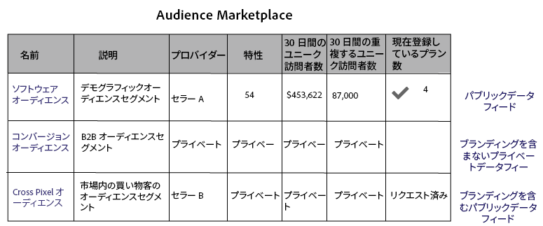

# データプロバイダー向けの Audience Marketplace {#audience-marketplace-for-data-providers}

[!DNL Audience Manager] 内でデータを販売するデータプロバイダーの概要とワークフロー。

<!-- c_marketplace_provider.xml -->

>[!NOTE]
>
>[役割に基づく権限](../../../reporting/reports-dashboard.md)は、[!UICONTROL Audience Marketplace] 機能へのアクセスを制御します。
>
>* 管理者は、データフィードの作成、サブスクライバーの管理、およびデータフィードへのサブスクライブをおこなえます。
>* ユーザーはフィードの検索および表示のみできます。

## マイ共有データについて {#my-shared-data-about}

[!UICONTROL My Shared Data] は、データプロバイダー（販売者）向けの [!UICONTROL Audience Marketplace] 機能です。プロバイダーは、特性をデータフィードにまとめて、[!DNL Audience Manager] 内から定額または [!DNL CPM] 価格で購入者に販売できます。アクティブ化されると、購入者は、数回のマウスクリックでフィードのサブスクリプションを購入できます。さらに、シンプルなレポートツールで、売上高を追跡したり、登録者を管理したりできます。最後に、[!UICONTROL Audience Marketplace] では、[!DNL Adobe] が請求書、請求および費用の支払いを処理します。これらの機能を使用すると、購入者が求める効果的で有益なデータフィードの構築に専念できます。

<!-- c_myshared_data.xml -->

機能には、以下が含まれます。

* **Search：**&#x200B;検索フィールドを使用すると、名前またはテキストの説明でデータフィードを検索できます。
* **Name：**&#x200B;データフィードの名前。ノーブランドの非公開データフィードを使用して、購入者にこれが表示されないようにできます。
* **Description：**&#x200B;データフィードのコンテンツについて購入者に伝えます。
* **Traits：**&#x200B;各データフィード内の特性の数。非公開データフィードを使用して、購入者にこれが表示されないようにできます。
* **Last 30 Day Uniques：**&#x200B;過去 30 日で確認されたユニークユーザーの数。非公開データフィードを使用して、購入者にこれが表示されないようにできます。
* **Last Month&#39;s Total Fees：**&#x200B;サブスクリプションを購入したデータ購入者が支払う金額。レポート期間は、毎月 10 日に終了します。期限切れのアカウントには、三角形と感嘆符のアイコンでフラグが設定されます。データが誤用されていたり、アカウントの期限が切れている場合、[サブスクリプション購入者のデータフィードを非アクティブ化](../../../features/audience-marketplace/marketplace-data-providers/marketplace-create-manage-feeds.md#deactivate-data-feed)できます。
* **Status：**&#x200B;フィードがアクティブ、非アクティブ、非公開または公開のいずれであるかを表示します。
* **Subscribers：**&#x200B;データフィードを使用している購入者の数を表示します。この列の数をクリックすると、購入者の会社名、サブスクリプション、請求およびサブスクリプション状況が表示されます。
* **Requests：**&#x200B;データフィードに対するアクセス要求の数。

## 非公開データフィード {#private-data-feeds}

[!UICONTROL My Shared Data] では、フィードステータスが非公開とマークされていることがあります。これは、非公開データフィードであることを示しています。非公開データフィードを使用すると、販売者は、データへの購入者のアクセスを制限できます（データフィードの名前を含む）。販売者は、特別サービスや割引を提供したり、プライバシーおよびアクセス制御が重要な場合に、フィードを非公開にできます。非公開データフィードでは、プロバイダーは、すべての購入者のアクセス要求を確認および承認できます。詳しくは、[非公開データフィード](../../../features/audience-marketplace/marketplace-private-feeds.md)を参照してください。公開データフィードまたは非公開データフィードの作成方法については、[公開または非公開のデータフィードの作成](../../../features/audience-marketplace/marketplace-data-providers/marketplace-create-manage-feeds.md#create-public-private-data-feed)を参照してください。

>[!MORELIKETHIS]
>
>* [データプロバイダーにとっての割引](../../../features/audience-marketplace/marketplace-data-providers/marketplace-create-manage-feeds.md#discounts)

