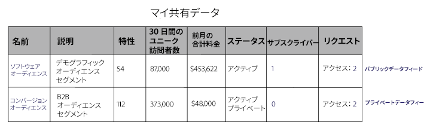
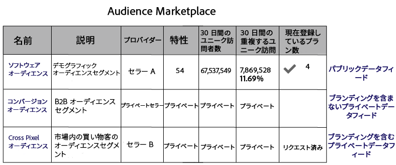

# 非公開データフィード {#private-data-feeds}

非公開データフィードは、プロバイダーがデータへの購入者のアクセスを制限するためのオプションです。データプロバイダーは非公開データフィードを作成する前に、データ購入者は非公開データフィードのサブスクリプションを購入する前に、この情報によく目を通してください。

<!-- c_marketplace_privatefeed.xml -->

## プロバイダーにとっての非公開データフィード {#private-data-feeds-providers}

プロバイダーは、データフィードを公開または非公開にできます。非公開データフィードを使用すると、データへの購入者のアクセスを制限できます（データ販売者の名前を含む）。特別サービスや割引を提供したり、プライバシーおよびアクセス制御が重要な場合に、非公開データフィードを作成することもできます。非公開データフィードでは、購入者の要求を確認および承認できます。要求を承認したら、フィードは、購入者には公開データフィードのように見えます。**[!UICONTROL Audience Marketplace > My Shared Data]** では、すべてのフィードを表示および管理できます。以下に示すように、このタイプのフィードは、ステータス列で「Private」とマークされます。

### フィードリクエストの管理

[!UICONTROL My Shared Data] で非公開データフィードの名前をクリックすると、いくつかのタブを含むページが表示されます。タブをクリックして、非公開データフィードリクエストを管理します。

以下の表に、各アクションタブで提供される役割または関数の定義を示します。

<table id="table_AFB429CA52A34658859448D9A5215F9F"> 
 <thead> 
  <tr> 
   <th colname="col1" class="entry"> タブ </th> 
   <th colname="col2" class="entry"> 説明 </th> 
  </tr> 
 </thead>
 <tbody> 
  <tr> 
   <td colname="col1"> 
 <b> Current Subscribers</b> 
 </td> 
   <td colname="col2"> 
プライベートデータフィードのサブスクリプションを購入した承認済みの購入者を一覧表示します。 
 </td> 
  </tr> 
  <tr> 
   <td colname="col1"> 
 <b> Potential Subscribers</b> 
 </td> 
   <td colname="col2"> 
非公開データフィードのサブスクリプションを購入していない承認済みの購入者を一覧表示します。 
 
承認により、購入者には、データフィードが公開されているかのように表示されます。これにより、フィードを登録前に確認および評価できます。また、潜在的なサブスクリプション購入者として一覧表示された購入者に、データフィードに対する割引を提供することもできます。購入者がサブスクリプションを購入すると、そのプロファイルが <b>Current Subscribers</b> に移動します。 
 </td>
  </tr> 
  <tr> 
   <td colname="col1"> 
 <b> Access Requests</b> 
 </td>
   <td colname="col2"> 
非公開データフィードの新しいサブスクリプション要求を一覧表示します。このタブをクリックして、購入者の要求を確認、承認または拒否できます。 

    <ul id="ul_BE0A835A90B14C05B3F63226B79D052D"> 
     <li id="li_2C5686CEB6F4430BA18AED5AD75C330A">承認された購入者は <b>Potential Subscribers</b> に移動します。 </li>
     <li id="li_929591FCF81E43A3881813BDBD3AC278">拒否された購入者は <b>Denied Access</b> に移動します。 </li>
    </ul> </td>
  </tr>
  <tr> 
   <td colname="col1"> 
 <b> Details Requests</b> 
 </td>
   <td colname="col2"> 
まだデータフィードのサブスクリプションを購入してはいないものの、フィードに関する詳細情報を要求した承認済みの購入者を一覧表示します。 
 
承認により、購入者には、データフィードが公開されているかのように表示されます。これにより、フィードを登録前に確認および評価できます。また、アクセスを要求している購入者に、データフィードに対する割引を提供することもできます。詳細の要求に対応すると、購入者プロファイルがこのタブから削除されます。サブスクリプションを購入していない場合、購入者プロファイルは <b>Potential Subscribers</b> にとどまります。 
 </td>
  </tr>
  <tr> 
   <td colname="col1"> 
 <b> Denied Access</b> 
 </td> 
   <td colname="col2"> 
プライベートデータフィードに関する拒否されたサブスクリプション要求を一覧表示します。 
 
拒否された購入者を再承認するには、Rejection Status を <b>Allow</b> に変更します。これにより、購入者は <b>Potential Subscribers</b> に移動します。 
 </td> 
  </tr> 
 </tbody> 
</table>

### 次の手順

以下のドキュメントは、非公開データフィードを導入するうえで役立ちます。

* [公開または非公開のデータフィードの作成](../../features/audience-marketplace/marketplace-data-providers/marketplace-create-manage-feeds.md#create-public-private-data-feed)
* [非公開フィード要求の確認、承認または拒否](../../features/audience-marketplace/marketplace-data-providers/marketplace-create-manage-feeds.md#manage-private-requests)
* [購入者にとっての非公開データフィード](../../features/audience-marketplace/marketplace-private-feeds.md#private-data-feeds-for-buyers)

## 購入者にとっての非公開データフィード {#private-data-feeds-for-buyers}

[Marketplace](../../features/audience-marketplace/marketplace-data-buyers/marketplace-data-buyers.md#about-marketplace) では、購入者には、非公開データフィードも他のオファーと同様に表示されます。ただし、この場合、フィードリストには、特性、ユニークユーザーおよびユーザーの重複に関する概要情報は表示されません。また、データ販売者には、[!UICONTROL Marketplace] リストの [!UICONTROL Provider] 列で名前を表示または非表示にするオプションがあります。販売者がサブスクリプション要求を承認したら、非公開フィードのすべてのデータが使用可能になります（公開フィードのように機能します）。以下の [!UICONTROL Marketplace] の例に、購入者が使用できる 3 つの異なるフィードタイプを示します。

フィードタイプには次のものがあります。

これらの様々なフィードタイプがデータを表示または非表示にする方法を次の表に示します。

<table id="table_41D4A798ACF548A3A03ACB427CA4652D"> 
 <thead> 
  <tr> 
   <th colname="col1" class="entry"> フィードのタイプ </th> 
   <th colname="col2" class="entry"> 説明 </th> 
  </tr> 
 </thead>
 <tbody> 
  <tr> 
   <td colname="col1"> 
<b> Public</b> 
 </td> 
   <td colname="col2"> 
プロバイダーの名前、特性および一意のデータがリストに表示されます。 
 </td> 
  </tr> 
  <tr> 
   <td colname="col1"> 
<b> Private Without Branding</b> 
 </td> 
   <td colname="col2"> 
プロバイダーの名前が「Private Seller」に設定され、特性数、一意のデータおよび特性の重複データは表示されません。 
 </td> 
  </tr> 
  <tr> 
   <td colname="col1"> 
<b> Private With Branding</b> 
 </td> 
   <td colname="col2"> 
プロバイダーの名前はリストに表示されますが、特性数、一意のデータおよび特性の重複データは表示されません。 
 </td> 
  </tr> 
 </tbody> 
</table>

### 次の手順

アクセスのリクエスト方法について、[非公開データフィードを購読する](../../features/audience-marketplace/marketplace-data-buyers/marketplace-manage-subscriptions.md#subscript-private-data-feed)を参照してください。

## データプロバイダーとデータ購入者の間で共有関係を設定する方法 {#set-up-sharing-relationship}

### ステップ 1：有効化 - データプロバイダーとデータ購入者

プロセスの最初の手順では、アドビコンサルティングまたはカスタマーケアからの介入が必要です。データプロバイダーとデータ購入者は、アドビコンサルティングまたはカスタマーケアに問い合わせ、有効化を依頼してください。

### ステップ 2：データプロバイダー - 新規データソースの作成

Audience Manager アカウントで、以下の設定で新しい cookie データソースを作成します。

* 受信キーに **Audience Manager ID** を設定する。
* 「**Share Enabled**」オプションをオンにする。

「**Save**」をクリックすると、**Traits Storage／3rd Party Data** に新しいサブフォルダーが自動的に作成されます。

### 手順 3：データプロバイダー - 共有の特性の特定

この手順では、パートナーと共有する特性を特定します。新しい特性を作成したり、既存の特性を編集したりできます。いかなる場合でも、特性は以下を満たす必要があります。

* 手順 2 の一貫として作成したデータソースに関連付ける。
* 新しく作成したサブフォルダーの、サードパーティのデータ配下に保存する。

[特性の作成](/help/using/features/traits/create-onboarded-rule-based-traits.md)および[特性の編集](/help/using/features/traits/manage-trait-rules.md#edit-trait)の詳細をお読みください。

### 手順 4：データプロバイダー - データフィードの作成

次に、データフィードを作成して、特性をデータ購入者と共有します。データフィードの作成方法については、[公開または非公開のデータフィードの作成](/help/using/features/audience-marketplace/marketplace-data-providers/marketplace-create-manage-feeds.md)を参照してください。

>[!IMPORTANT]
>
>「Settings」で、「Private」オプションを選択します。このフィールドを「Public」に設定すると、Audience Marketplace のお客様はフィードを購読することができます。

### 手順 5：データ購入者 - アクセス権のリクエスト

**Audience Marketplace／Marketplace** を開きます。前の手順でデータプロバイダーによって作成されたデータフィードを検索します。「**Request Access**」をクリックします。データプロバイダー側の指定された連絡先に電子メール通知が送信されるようになりました。[非公開データフィードを購読](/help/using/features/audience-marketplace/marketplace-data-buyers/marketplace-manage-subscriptions.md#subscript-private-data-feed)も参照してください。

### 手順 6：データプロバイダー - アクセス権の付与

**Audience Marketplace／My Shared Data** にアクセスし、手順 4 で作成したフィードを検索します。新しいアクセスリクエストをクリックしてから、「**Allow Access**」をクリックしてリクエストを承認します。[非公開フィード要求の確認、承認または拒否](/help/using/features/audience-marketplace/marketplace-data-providers/marketplace-create-manage-feeds.md#manage-private-requests)も参照してください。

### 手順 7：データ購入者 - サブスクリプションをオンにする

データプロバイダーがデータフィードへのアクセスを許可すると、**Audience Marketplace／Marketplace** のアカウントにフィードが表示されます。詳細を確認し、サブスクリプションボタンをオンにしてから、「**Review &amp; Subscribe**」をクリックします。サードーパーティの特性をどこで見つけるかについて詳しくは、[購読データフィードのストレージ](/help/using/features/audience-marketplace/marketplace-data-buyers/marketplace-manage-subscriptions.md#find-subscribed-data-fee)を参照してください。

これらの特性は、データプロバイダーのアカウントでのみ編集できます。

