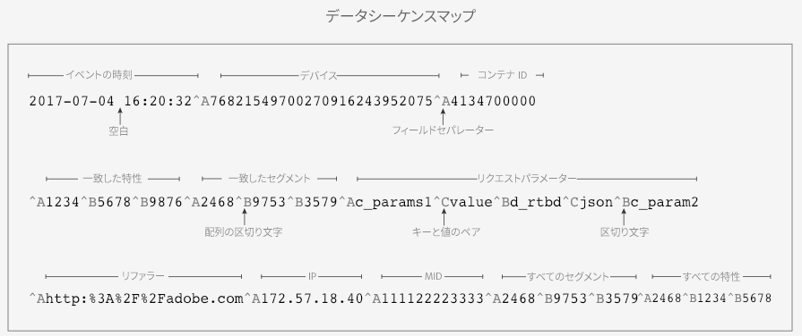
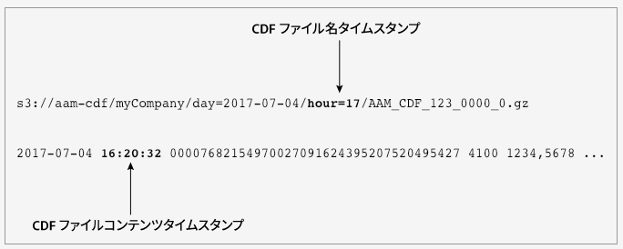

# [!UICONTROL Customer Data Feeds] {#customer-data-feeds}

[!UICONTROL Customer Data Feed]（[!UICONTROL CDF]）ファイルに関する基本情報と導入方法の説明です。[!UICONTROL CDF]ファイルの受信に関心がある場合や詳細を知りたい場合は、ここから始めてください。

## ファイルの内容と目的 {#file-contents-purpose}

[!UICONTROL CDF] ファイルには、[!DNL Audience Manager] イベント呼び出し（`/event`）でサーバーに送信されるデータと同じものが含まれています。ユーザー ID、[!UICONTROL trait IDs] ID、[!UICONTROL segment IDs] など、イベント呼び出しで表されるあらゆるパラメーターが含まれます。[!DNL Audience Manager] の内部システムがイベントデータを処理して [!UICONTROL CDF] ファイルを生成します。このファイルの内容は、所定の順序で出現するフィールドで構成されます。[!DNL Audience Manager] は、時間ごとに [!UICONTROL CDF] ファイルの生成を試み、[!DNL Amazon S3] サーバー上のセキュリティで保護された顧客専用バケットにファイルを保存します。これらのファイルが提供されているのは、ユーザーインターフェイス上の制限を受けずに [!DNL Audience Manager] データを扱えるようにするためです。

>[!IMPORTANT]
>
>CDF ファイルを使用する場合は、次の制限事項に注意してください。
>
>* CDF ファイル配信を設定する前に、サードパーティのデータプロバイダーから、サードパーティの特性の書き出しに関する適切な権限を付与されていることを確認してください。Audience Manager は、現在、サードパーティのデータプロバイダーに対して、CDF ファイル配信の書き出し権限を要求するユーザーインタフェースの機能をサポートしていません。必要な場合は各プロバイダーに個別に連絡してください。
>* ページトラフィックの監視、レポートの相違点の調整、請求などの代わりに [!UICONTROL CDF] ファイルを使用しないでください。


## はじめに {#getting-started}

[!UICONTROL CDF]ファイル配信を開始するためのセルフサービスプロセスはありません。開始するには、担当の [!DNL Audience Manager] コンサルタントまたはカスタマーケアに問い合わせてください。実装時に [!DNL Audience Manager] 担当者は以下をおこないます。

* 使用する [!DNL Amazon S3] ストレージバケットのセットアップ。
* [!DNL S3] ファイルストレージバケットに対する読み取り専用の認証資格情報の提供。他の顧客のディレクトリやファイルを参照したりアクセスしたりすることはできません。

ファイルのダウンロード準備ができたら、ファイル通知と [!UICONTROL CDF] ファイルが [!DNL S3] バケットに表示されます。割り当てられた [!DNL S3] ディレクトリ内のファイルの監視やダウンロードは、ユーザー自身がおこないます。[顧客データフィードファイル処理の通知](#cdf-file-processing-notifications)。

## 次の手順 {#next-steps}

このサービスの詳細については、以下の節および[顧客データフィードの FAQ](../faq/faq-cdf.md) を参照してください。

## [!UICONTROL Customer Data Feed]定義済みコンテンツ {#cdf-defined}

[!UICONTROL CDF]ファイルのデータ要素および配列を出現順に列挙し定義します。定義にはデータタイプが含まれていますが、この情報は [!UICONTROL CDF] ファイルには含まれていません。

## 定義 {#definitions}

[!UICONTROL CDF] ファイルには、以下に定義するフィールドの一部または全部が含まれています。内部ファイル組織について詳しくは、[顧客データフィードファイルの構造](#cdf-file-structure)を参照してください。

<table id="table_46BC897A30C2469AB5911F5B85A3FAA7"> 
 <thead> 
  <tr> 
   <th colname="col1" class="entry"> フィールド </th> 
   <th colname="col2" class="entry"> データタイプ </th> 
   <th colname="col3" class="entry"> 説明 </th> 
  </tr> 
 </thead>
 <tbody> 
  <tr> 
   <td colname="col1"> <p><code> Event Time</code> </p> </td> 
   <td colname="col2"> <p>タイムスタンプ </p> </td> 
   <td colname="col3"> <p><span class="wintitle">データ収集サーバー</span>（DCS）で CDF ファイルが処理された時刻。タイムスタンプは <i>yyyy-mm-dd hh:mm:ss</i> 形式を使用し、UTC タイムゾーンに設定されます。 </p> <p> <p>注意：イベント時刻は、<i> </i> <p> 
       <ul id="ul_41ABC813FAAC4659AC8DA13F4A6DD7EB"> 
        <li id="li_0192D253EA4C49C4BF2E8BA62CEE028E">ページイベントやイベント呼び出しそのものの時刻に近いですが、それらの時刻ではありません。 </li> 
        <li id="li_271DF14395BC495FBF17186588A554A8">ファイル名の DCS 時刻とは関係ありません。詳しくは、<a href="#different-processing-times">顧客データフィードファイル名の時刻とファイルコンテンツの時刻の違い</a>を参照してください。 </li> 
       </ul> </p> </p> </p> </td> 
  </tr> 
  <tr> 
   <td colname="col1"> <p><code> Device</code> </p> </td> 
   <td colname="col2"> <p>文字列 </p> </td> 
   <td colname="col3"> <p>これは<span class="wintitle">一意のユーザー ID</span>（UUID）で、サイト訪問者の 38 桁のデバイス ID です。<a href="../reference/ids-in-aam.md">Audience Manager の ID のインデックス</a>も参照してください。 </p> </td> 
  </tr> 
  <tr> 
   <td colname="col1"> <p><code> Container ID</code> </p> </td> 
   <td colname="col2"> <p>数値 </p> </td> 
   <td colname="col3"> <p>ID の同期を起動するコンテナの ID。 </p> </td> 
  </tr> 
  <tr> 
   <td colname="col1"> <p><code> Realized Traits</code> </p> </td> 
   <td colname="col2"> <p>数値配列 </p> </td> 
   <td colname="col3"> <p>イベント呼び出しで訪問者が満足した（基準を満たした）特性がすべて含まれている特性 ID 配列。 </p> <p>この配列には、訪問者が以前に絞り込まれた特性と、このイベント呼び出しを通じて再度絞り込まれる特性が含まれる可能性があることに注意してください。 </p> </td> 
  </tr> 
  <tr> 
   <td colname="col1"> <p><code> Realized Segments</code> </p> </td> 
   <td colname="col2"> <p>数値配列 </p> </td> 
   <td colname="col3"> <p>イベント呼び出しで訪問者が満足した（基準を満たした）セグメントがすべて含まれているセグメント ID 配列。 </p> </td> 
  </tr> 
  <tr> 
   <td colname="col1"> <p><code> Request Parameters</code> </p> </td> 
   <td colname="col2"> <p>文字列 </p> </td> 
   <td colname="col3"> <p>イベント呼び出しで渡される、すべてのパラメーター（変数、ID、キー値ペア、デバイス広告 ID など）を取り込む文字列。 </p> <p>短縮化した例： </p> <p> <code> d_rtbd:json,c_contextData.a.CarrierName:mobile,c_contextData.a.adid:92D56353-49C5-431E-B474-FC528D585810,c_contextData.a,RunMode:Application,c_contextData.a.DaysSinceLastUpgrade:61,d_cid_ic:xid%01EACB6E40-AC65-4012-9FE9-ABD59965E9C4%011,c_contextData.a.PrevSessionLength:583</code> </p> </td> 
  </tr> 
  <tr> 
   <td colname="col1"> <p><code> Referer Data Type</code> </p> </td> 
   <td colname="col2"> <p>文字列 </p> </td> 
   <td colname="col3"> <p>参照元ページのエンコードされていない URL（参照元ページがある場合）。 </p> </td> 
  </tr> 
  <tr> 
   <td colname="col1"> <p><code> IP Data Type</code> </p> </td> 
   <td colname="col2"> <p>文字列 </p> </td> 
   <td colname="col3"> <p>イベント呼び出しで表現された訪問者の IP アドレス。 </p> </td> 
  </tr> 
  <tr> 
   <td colname="col1"> <p><code> MCDevice </code> </p> </td> 
   <td colname="col2"> <p>文字列 </p> </td> 
   <td colname="col3"> <p>サイト訪問者に割り当てられた <span class="keyword">Experience Cloud</span> ID（MID）。<a href="https://docs.adobe.com/content/help/ja-JP/id-service/using/intro/cookies.html" format="https" scope="external">Cookie と Adobe Experience Platform ID サービス</a>も参照してください。 </p> </td> 
  </tr> 
  <tr> 
   <td colname="col1"> <p><code> All Segments</code> </p> </td> 
   <td colname="col2"> <p>数値配列 </p> </td> 
   <td colname="col3"> <p>訪問者が以前に基準を満たしたセグメントと新たに絞り込まれるセグメントを含んだセグメント ID 配列。 </p> </td> 
  </tr> 
  <tr> 
   <td colname="col1"> <p><code> All Traits</code> </p> </td> 
   <td colname="col2"> <p>数値配列 </p> </td> 
   <td colname="col3"> <p>以前に認識された特性と、最後のデータフィード生成以降に訪問者が認定された新しい特性を含むファーストパーティおよびサードパーティ特性 ID の配列。 </p> </td> 
  </tr> 
 </tbody> 
</table>

## [!UICONTROL Customer Data Feed]ファイル構造 {#cdf-file-structure}

[!UICONTROL CDF] ファイルのデータ構造を一覧表示および定義します。データ列、フィールド区切り文字、データファイルマップ、サンプルファイルが含まれています。

## データフィールド識別子とデータ列 {#identifiers-and-sequence}

[!UICONTROL CDF] ファイルには、ラベル付きの列やフィールドヘッダーは含まれていません。代わりに、[!UICONTROL CDF] ファイルでは非表示の [!DNL ASCII] 文字でフィールドと配列を定義します。また、[!UICONTROL CDF] ファイルでは各フィールドと配列が特定の順序で並んでいます。フィールドの識別子と順序を理解すると、ファイルを適切に解析するうえで役に立ちます。

<table id="table_D2C8786DF7CE47E5ADB8930EC825F8F6"> 
 <thead> 
  <tr> 
   <th colname="col1" class="entry"> CDF ファイル要素 </th> 
   <th colname="col2" class="entry"> 説明 </th> 
  </tr> 
 </thead>
 <tbody> 
  <tr> 
   <td colname="col1"> <p>フィールド区切り文字 </p> </td> 
   <td colname="col2"> <p>次の非表示文字で CDF ファイルの要素と構造が定義されます。 </p> <p> 
     <ul id="ul_056A9B90AC88405CBB5F81A56CD6E4C9"> 
      <li id="li_B9DA15DCB6A445D781B8753C1C4262B0">Ctrl + A（ASCII <code> 001</code> または <code> ^A</code>）：非表示のスペースインジケーターで個々のフィールドを区切ります。 </li> 
      <li id="li_E68D0CC065B34AC9AF91F166CAA2A67C">Ctrl + B（ASCII <code> 002</code> または <code> ^B</code>）：配列やリクエストパラメーターのデータを区切ります。 </li> 
      <li id="li_6C32D927FEF04CDE9887374E8C2688E7">Ctrl + C（ASCII <code> 003</code> または <code> ^C</code>）：キー値ペアを定義します。 </li> 
     </ul> </p> </td> 
  </tr> 
  <tr> 
   <td colname="col1"> <p>フィールド列 </p> </td> 
   <td colname="col2"> <p> <p>重要：<span class="keyword">Audience Manager</span> は、今後のリリースで CDF ファイルの末尾に新規フィールドを追加する権利を留保します。つまり、ファイル解析システムの技術設計では、（既存の列については固定した順序を想定してもかまいませんが）固定した列数を前提としないでください。 </p> </p> <p>CDF ファイル内のデータの順序は次のとおりです。 </p> <p> 
     <ol id="ol_1FDF4A7F089448ED8A724378C23009C8"> 
      <li id="li_CB97D90B54EB4F95861583D4A5F660C7">イベント時刻 </li> 
      <li id="li_C44E8CCB1A964B7A941FD772FB8A7608">デバイス </li> 
      <li id="li_F8AE0D4CA19D411686A240FE06F56147">コンテナ ID </li> 
      <li id="li_660D17989BE54610A01229C47894E8A9">認識済みの特性 </li> 
      <li id="li_1591180564374204852785C6FFCA4F74">認識済みのセグメント </li> 
      <li id="li_FE38DA4969EE4E19B39124E77E2EA5F9">リクエストパラメーター </li> 
      <li id="li_9AC25DA883214FBC902D7CE9DACFAE28">参照元 </li> 
      <li id="li_BA05F1C33B5B4625B450425FF1911B30">IP アドレス </li> 
      <li id="li_08E632FB135F42B5830D5CBFE6EE6BE8">Experience Cloud デバイス ID（MID）。<a href="https://docs.adobe.com/content/help/ja-JP/id-service/using/intro/cookies.html" format="https" scope="external">Cookie と Adobe Experience Platform ID サービス</a>も参照してください。 </li> 
      <li id="li_7A05AF4790A1425A90D019681DF4A595">すべてのセグメント </li> 
      <li id="li_1B5A6F076A354BA0A931CB260E6D2675">すべての特性 </li> 
     </ol> </p> <p>フィールドの説明については、<a href="#cdf-defined"> 顧客データフィードコンテンツの定義</a>を参照してください。 </p> </td> 
  </tr> 
 </tbody> 
</table>

## [!UICONTROL CDF]ファイルマップ {#cdf-file-map}

[!UICONTROL CDF] ファイルデータの出現順序は以下のとおりです。



## 配列の識別

[!UICONTROL CDF] ファイル内の配列は `Ctrl + a` フィールド区切り文字で始まり、同じ区切り文字で終わります。これにより、配列の先頭要素は単独のデータフィールドのように見えます。例えば、適合済み[!UICONTROL traits]の配列は `^A1234` で始まります。このエントリの後に、配列の区切り文字と ID `^B5678` が続きます。そのため、（`^B` で始まっているので）適合済み[!UICONTROL traits]の配列の先頭要素が ID 5678 であると考えてしまうかもしれません。しかし、実際にはそうではありません。だからこそ、データファイルのデータ列と構造に熟知する必要があるのです。適合済み[!UICONTROL trait]の配列（または [!UICONTROL CDF] ファイルに含まれている他の任意の配列）の先頭要素が `^A` で始まっている場合であっても、ファイル内の出現順序や位置によって配列の開始が決まります。また、配列の先頭要素は必ず `^A` で先行エントリと区切られます。

## サンプル [!UICONTROL CDF] ファイル {#sample-file}

サンプル [!UICONTROL CDF] ファイルは例えば次のようになります。このサンプルには、ページに合わせて改行が挿入されています。


## [!UICONTROL Customer Data Feed] ファイル命名規則 {#cdf-naming-conventions}

[!UICONTROL CDF] ファイル名の構成要素を次の表に列挙し定義します。

## [!UICONTROL CDF] ファイル名：構文と例 {#cdf-file-name}

典型的な [!UICONTROL CDF] ファイル名は以下の要素で構成されています。なお、*斜体*&#x200B;の部分には実際の情報が入ります。

### 構文

```
s3://aam-cdf/YOUR-S3-BUCKET-NAME/day=yyyy-mm-dd/hour=hh/AAM-CDF-PARTNER-ID-AAM PROCESS-ID_0.gz
```

### 例

```
s3://aam-cdf/dataCompany/day=2017-09-14/hour=17/AAM_CDF_1234_000058_0.gz
```

[!DNL S3] ストレージバケットでは、ファイルはパートナー ID（[!UICONTROL PID]）、日、時で昇順にソートされます。

## [!UICONTROL CDF] ファイル名要素の定義 {#cdf-file-name-elements}

[!UICONTROL CDF] ファイル名の構成要素を次の表に列挙し定義します。

<table id="table_4AC4F90C1C7D43E2A93CB3B6908D7E94"> 
 <thead> 
  <tr> 
   <th colname="col1" class="entry"> ファイル名要素 </th> 
   <th colname="col2" class="entry"> 説明 </th> 
  </tr> 
 </thead>
 <tbody> 
  <tr> 
   <td colname="col1"> <p> <code> s3://aam-cdf/</code> </p> </td> 
   <td colname="col2"> <p>Amazon S3 サーバーで CDF ファイルに使用されるデフォルトのルートストレージバケット。 </p> </td> 
  </tr> 
  <tr> 
   <td colname="col1"> <p> <code> <i>your S3 bucket name</i> </code> </p> </td> 
   <td colname="col2"> <p>CDF ファイルを格納する読み取り専用の S3 バケットの名前。 </p> </td> 
  </tr> 
  <tr> 
   <td colname="col1"> <p> <code>day=<i>yyyy-mm-dd</i></code> </p> </td> 
   <td colname="col2"> <p>ファイルが処理された日付。 </p> </td> 
  </tr> 
  <tr> 
   <td colname="col1"> <p> <code>hour=<i>hh</i></code> </p> </td> 
   <td colname="col2"> <p>UTC タイムゾーンに設定された 24 時間表記の時刻値。詳しくは、<a href="#different-processing-times">顧客データフィードファイル名の時刻とファイルコンテンツの時刻の違い</a>を参照してください。 </p> </td> 
  </tr> 
  <tr> 
   <td colname="col1"> <p> <code> <i>partner ID</i> </code> </p> </td> 
   <td colname="col2"> <p>ユーザーのパートナー ID。 </p> </td> 
  </tr> 
  <tr> 
   <td colname="col1"> <p> <code> <i>AAM process ID</i>_0</code> </p> </td> 
   <td colname="col2"> <p><span class="keyword">Audience Manager</span> 内部のプロセス ID。 </p> </td> 
  </tr> 
  <tr> 
   <td colname="col1"> <p> <code> .gz</code> </p> </td> 
   <td colname="col2"> <p>gzip ファイルの拡張子。CDF ファイルは gzip で圧縮されています。 </p> </td> 
  </tr> 
 </tbody> 
</table>

## [!UICONTROL Customer Data Feed]ファイル処理の通知 {#cdf-file-processing-notifications}

[!DNL Audience Manager] は、ファイルのダウンロード準備が完了したことを知らせるために、[!UICONTROL Customer Data File]（[!UICONTROL CDF]）のダウンロード準備ができたことを知らせるために、[!DNL S3] ディレクトリに `.info` ファイルを書き込みます。`.info` ファイルには、[!UICONTROL CDF] ファイルの内容に関する [!DNL JSON] 形式のメタデータも含まれています。この通知ファイルで使用されている構文やフィールドについては、このセクションで確認してください。

## サンプル .info ファイル    {#sample-info-file}

各 `.info` ファイルは、`Files` と `Totals` の 2 つのセクションで構成されます。`Files` セクションには、時間ごとのファイルの特定の指標を格納した配列が含まれています。`Totals` セクションには、特定の日のすべての [!UICONTROL CDF] ファイルについて集計した指標が含まれています。`.info` ファイルの内容は、例えば次のようになります。

```js
{
    "Files": [
        {
            "FileByteSize": 2709730,
            "FileChecksumMD5": "a9ea418e79511642cff11c2a898037dc-1",
            "FileName": "AAM_CDF_1109_000000_0.gz",
            "FileSequenceNumber": 1
        },
        {
            "FileByteSize": 2783351,
            "FileChecksumMD5": "7b469485d60274b6991acd0817855840-3",
            "FileName": "AAM_CDF_1109_000001_0.gz",
            "FileSequenceNumber": 2
        }
    ],
    "Totals": {
        "Day": "2017-09-26",
        "Hour": "18",
        "TotalByteSize": 150092997,
        "TotalNumberFiles": 2
    }
}
```

## Info ファイルの各フィールドの定義 {#info-file-fields-defined}

以下の表に、[!UICONTROL CDF] `.info` ファイルの構成要素の一覧と説明を示します。

### Files オブジェクト

<table id="table_582101B414864DA991CE813A7937ECC6"> 
 <thead> 
  <tr> 
   <th colname="col1" class="entry"> フィールド </th> 
   <th colname="col2" class="entry"> 説明 </th> 
  </tr> 
 </thead>
 <tbody> 
  <tr> 
   <td colname="col1"> <p> <code> Files</code> </p> </td> 
   <td colname="col2"> <p>CDF ファイルに関するメタデータを含んだ配列が、この後に始まります。 </p> </td> 
  </tr> 
  <tr> 
   <td colname="col1"> <p> <code> FileByteSize</code> </p> </td> 
   <td colname="col2"> <p>ファイルサイズ（バイト単位）。 </p> </td> 
  </tr> 
  <tr> 
   <td colname="col1"> <p> <code> FileChecksumMD5</code> </p> </td> 
   <td colname="col2"> <p>Amazon S3 の ETag。ハイフンの後の数字は、マルチパートアップロードの際にファイルの作成に使用されたパートの数を示します。<code> ETag</code> はファイルの MD5 チェックサムと同一ではありません。 </p> </td> 
  </tr> 
  <tr> 
   <td colname="col1"> <p> <code> FileName</code> </p> </td> 
   <td colname="col2"> <p>ファイル名。詳しくは、<a href="#cdf-naming-conventions"> 顧客データフィードファイルの命名規則</a>を参照してください。 </p> </td> 
  </tr> 
  <tr> 
   <td colname="col1"> <p> <code> FileSequenceNumber</code> </p> </td> 
   <td colname="col2"> <p>各ファイルのインデックス番号。 </p> </td> 
  </tr> 
 </tbody> 
</table>

### Totals オブジェクト

<table id="table_44F0B2D229E84A5DB3041760B1A50858"> 
 <thead> 
  <tr> 
   <th colname="col1" class="entry"> フィールド </th> 
   <th colname="col2" class="entry"> 説明 </th> 
  </tr> 
 </thead>
 <tbody> 
  <tr> 
   <td colname="col1"> <p> <code> Totals</code> </p> </td> 
   <td colname="col2"> <p>すべての CDF ファイルに関する集計データを含んだオブジェクトが、この後に始まります。 </p> </td> 
  </tr> 
  <tr> 
   <td colname="col1"> <p> <code> Day</code> </p> </td> 
   <td colname="col2"> <p>データが得られた日。<i>yyyy-mm-dd</i> 形式で表されます。 </p> </td> 
  </tr> 
  <tr> 
   <td colname="col1"> <p> <code> Hour</code> </p> </td> 
   <td colname="col2"> <p>データが得られた時刻（時）。UTC タイムゾーンに設定された 24 時間形式で表されます。 </p> </td> 
  </tr> 
  <tr> 
   <td colname="col1"> <p> <code> TotalByteSize</code> </p> </td> 
   <td colname="col2"> <p>その日時のすべての CDF ファイルの合計サイズ（バイト単位）。 </p> </td> 
  </tr> 
  <tr> 
   <td colname="col1"> <p> <code> TotalNumberFiles</code> </p> </td> 
   <td colname="col2"> <p>S3 ディレクトリにアップロードされたファイルの総数。 </p> </td> 
  </tr> 
 </tbody> 
</table>

## [!UICONTROL Customer Data Feed]ファイル名の時間とファイルコンテンツの時間が異なる {#different-processing-times}

[!UICONTROL CDF] ファイルでは、ファイル名とファイルコンテンツにタイムスタンプが含まれています。これらのタイムスタンプは、同じ [!UICONTROL CDF] ファイルに対する異なるイベントプロセスを記録します。同じファイルの名前とコンテンツに異なるタイムスタンプが表示されることは珍しくありません。各タイムスタンプを理解すると、このデータを操作したり時刻でソートしようとしたりするときに、犯しがちなミスを避けるうえで役に立ちます。

## [!UICONTROL CDF] ファイルのタイムスタンプの場所 {#locating-timestamps}

[!UICONTROL CDF] ファイルでは、2 つの別個の場所に異なる時刻を記録します。



## タイムスタンプの違いについて {#understanding-timestamps}

[!UICONTROL CDF] ファイルのタイムスタンプの詳細とそれらの適切な使い方を次の表に示します。

| タイムスタンプの場所 | 説明 |
|--- |--- |
| ファイル名 | [!DNL CDF] ファイル名に含まれているタイムスタンプは、[!DNL Audience Manager] がファイルの配信準備を開始した時刻を示します。このタイムスタンプは [!DNL UTC] タイムゾーンに設定されています。`hour=` パラメーターを使用しており、時刻は 24 時間表記の 2 桁の時で表されています。この時刻は、ファイルコンテンツに記録されているイベント時刻とは異なることがあります。[!DNL CDF] ファイルを処理する際、特定の時間で [!DNL S3] バケットが空となることに気付く場合があります。バケットが空になるのは、次のいずれかの場合が考えられます。<ul><li>その特定の時刻にデータがない。 </li><li> サーバーの負荷が大きく、その時刻のファイルを処理できない。サーバーの処理が追いついたら、過去のバケットに含まれていたはずのファイルが、それより後の時刻のバケットに格納されます。例えば、17 時のバケットに含まれていたはずのファイルが 18 時のバケットに出現する（ファイル名に `hour=18` が含まれている）といった場合です。このような場合、サーバーはおそらく 17 時にファイルの処理を開始したものの、その時間内に処理を完了できなかったと考えられます。その代わり、そのファイルは次の時刻のバケットに入れられます。</li></ul><br>**重要**：ファイル名のタイムスタンプを使用して、イベントを時間別にグループ化しないでください。時間別にグループ化する必要がある場合は、ファイルコンテンツの `EventTime` タイムスタンプを使用します。 |
| ファイルコンテンツ | [!DNL CDF] ファイルコンテンツに含まれているタイムスタンプは、[!DNL Data Collection Servers] がファイルの処理を開始した時刻を示します。このタイムスタンプは [!DNL UTC] タイムゾーンに設定されています。`EventTime` フィールドを使用し、時刻は *`yyyy-mm-dd hh:mm:ss`* 形式で表されます。この時刻は、ページ上のイベントの実際の時刻に近いものの、ファイル名に示される時刻とは異なることがあります。<br> **ヒント**：ファイル名の `hour=` タイムスタンプとは異なり、`EventTime` を使用してデータを時間別にグループ化することができます。 |

>[!MORELIKETHIS]
>
>* [顧客データフィードに関するよくある質問](../faq/faq-cdf.md)

