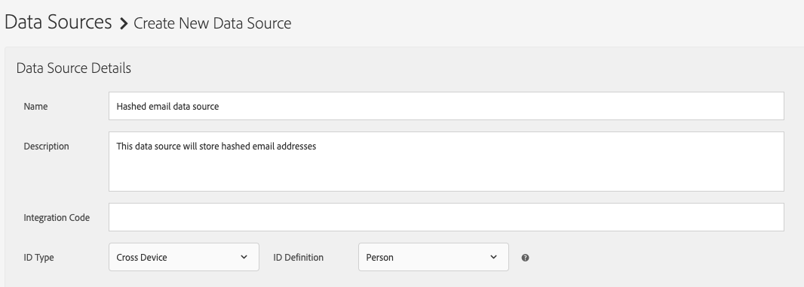
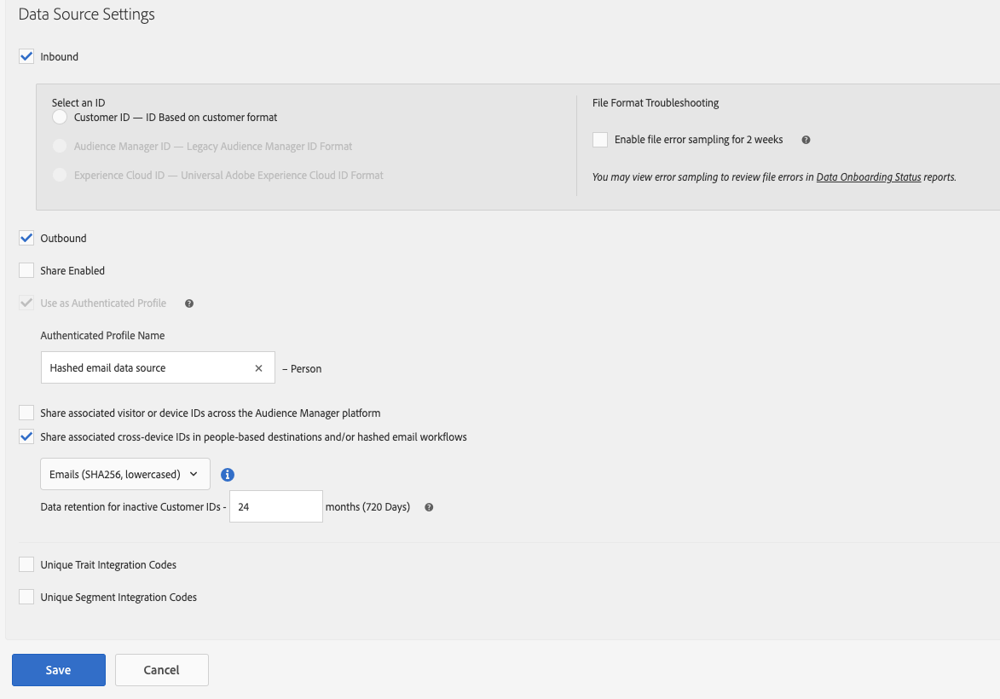

# ハッシュ化されたメールワークフローのデータソースの設定

ピープルベースの宛先などのハッシュ化されたメールワークフローでは、ハッシュ化されたメールアドレスを保存するデータソースを作成する必要があります。

ハッシュ化されたメールのデータソースを作成および設定するには、次の手順に従います。

1. Audience Managerアカウントにログインし、**[!UICONTROL Audience Data]**／**[!UICONTROL Data Sources]** に移動して、**[!UICONTROL Add New]**&#x200B;をクリックします。
1. 新しいデータソースに、**[!UICONTROL Name]** と **[!UICONTROL Description]** を入力します。
1. **[!UICONTROL ID Type]** ドロップダウンメニューで、「**[!UICONTROL Cross Device]**」を選択します。
   データソースの詳細セクションを示す
1. **[!UICONTROL Data Source Settings]** セクションで、**[!UICONTROL Inbound]** と **[!UICONTROL Outbound]** のオプションを両方選択し、**[!UICONTROL Share associated cross-device IDs in people-based destinations]** オプションを有効にします。
1. ドロップダウンメニューを使用して、このデータソースの **[!UICONTROL Emails(SHA256, lowercased)]** ラベルを選択します。

   >[!IMPORTANT]
   >
   >このオプションは、データソースに、特定のアルゴリズムでハッシュ化されたデータを含んでいるというラベルのみを付けます。Audience Manager は、この手順ではデータをハッシュ化しません。このデータソースに保存する予定の電子メールアドレスが、[!DNL SHA256] アルゴリズムで既にハッシュ化されていることを確認してください。そうしなければ、ハッシュ化されたメールワークフローに使用することはできません。

   
