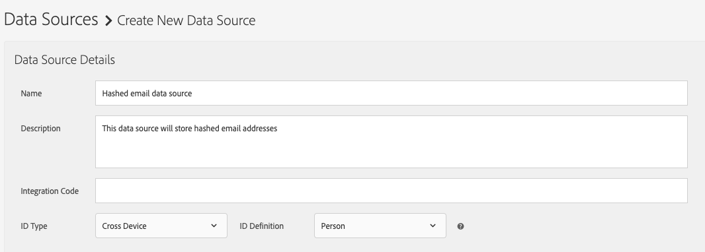

# ハッシュ化された電子メールワークフロー用のデータソースの設定

People-Based Destinations などのハッシュ化された電子メールワークフローでは、ハッシュ化された電子メールアドレスを保存するデータソースを作成する必要があります。

以下の手順に従って、ハッシュ化された電子メールのデータソースを作成し、設定します。

1. Audience Managerアカウントにログインし、**[!UICONTROL Audience Data]**／**[!UICONTROL Data Sources]** に移動して、**[!UICONTROL Add New]**&#x200B;をクリックします。
1. 新しいデータソースに、**[!UICONTROL Name]** と **[!UICONTROL Description]** を入力します。
1. **[!UICONTROL ID Type]** ドロップダウンメニューで、「**[!UICONTROL Cross Device]**」を選択します。
   
1. **[!UICONTROL Data Source Settings]** セクションで、**[!UICONTROL Inbound]** と **[!UICONTROL Outbound]** のオプションを両方選択し、**[!UICONTROL Share associated cross-device IDs in people-based destinations]** オプションを有効にします。
1. ドロップダウンメニューを使用して、このデータソースの **[!UICONTROL Emails(SHA256, lowercased)]** ラベルを選択します。

   >[!IMPORTANT]
   >
   >このオプションは、データソースに、特定のアルゴリズムでハッシュ化されたデータを含んでいるというラベルのみを付けます。Audience Manager は、この手順ではデータをハッシュ化しません。このデータソースに保存する予定の電子メールアドレスが、[!DNL SHA256] アルゴリズムで既にハッシュ化されていることを確認してください。そうしないと、ハッシュ化された電子メールワークフローで使用できなくなります。

   

