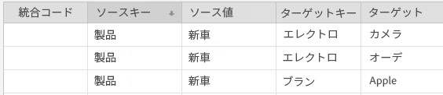

# 派生シグナル {#derived-signals}

[!UICONTROL derived signal]は、認識済みの特性に基づいてサイト訪問者を追加の特性の対象として認定されます。つまり、追加の特性認定は、現在認定されている特性から派生させることができます。これは、ユーザーにとってその別の特性がまったくの新規特性である場合でも同様です。

<!-- c_tb_derived_signal.xml -->

## 派生シグナルの目的

[!DNL Audience Manager] では、指定された他のシグナルまたは特性に対するイベント呼び出し中に渡されたシグナル（または特性ルール）間の関係を作成できます。例えば、キーと値のペア [!DNL "product = new_car"]（`https://<domain alias>/event?product=new_car`）で構成されるシグナルでイベント呼び出しが渡されるとします。[!DNL Audience Manager] は、そのシグナルを、[!UICONTROL derived signals]ツールで作成された他のものに接続します。関連付けられるシグナルには、どのようなキー値ペアを指定してもかまいませんが、[!UICONTROL Trait Builder]ルールとして既にセットアップされている既存のシグナルにリンクすれば、最も役に立ちます。例えば、以下の図では、ユーザー操作でシグナル [!DNL "product = new car"] が発生すると、そのユーザーは、ターゲットのキー値シグナルで定義された特性の対象にも認定されます。

## 派生シグナルの場所

サイドバーナビゲーションの [!UICONTROL derived signals] で&#x200B;**[!UICONTROL Tools > Derived Signals]**&#x200B;を作成および管理します。

## 派生シグナルの作成 {#create}

<!-- t_tb_create_derived.xml -->

[!UICONTROL derived signal]を作成するには：

1. **[!UICONTROL Derived Signals]**&#x200B;メニューから、「[!UICONTROL Tools]」を選択します。
1. 以下の項目を指定します。
   * *（オプション）* [!UICONTROL Integration Code]
   * [!UICONTROL Source Key]
   * [!UICONTROL Source Value]
   * [!UICONTROL Target Key]
   * [!UICONTROL Target Value]
1. 「**[!UICONTROL Add Signal]**」をクリックします。

>[!NOTE]
>
>[!UICONTROL Source Key]、[!UICONTROL Source Value]、[!UICONTROL Target Key]、および [!UICONTROL Target Value] フィールドの文字数は、最大 228 文字に制限されています。

## 派生シグナルの編集 {#edit}

<!-- t_tb_edit_derived.xml -->

[!UICONTROL derived signal] を編集するには：

1. シグナルにカーソルを移動し、「**[!UICONTROL Edit]**」をクリックします。
2. 必要なコード、キーまたは値を変更してから、「**[!UICONTROL Save]**」をクリックします。

## 派生シグナルの削除 {#delete}

<!-- t_tb_delete_derived.xml -->

[!UICONTROL derived signal]を削除するには、シグナルにカーソルを移動し、「**[!UICONTROL Delete]**」をクリックします。
