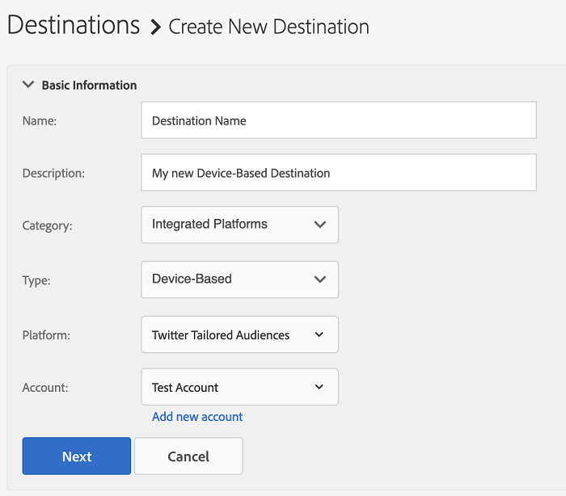

# 新しいデバイスベースの宛先の追加 {#add-new-device-based-destinations}

この記事では、Audience Manager ユーザーインターフェイスから新しいデバイスベースの宛先を設定する方法について説明します。

>[!IMPORTANT]
>
>現在、ほとんどのデバイスベースの宛先では、セルフサービス設定ワークフローを利用できません。追加する必要があるデバイスベースの宛先が宛先リストに表示されない場合は、アドビコンサルタントまたはカスタマーサポートにお問い合わせください。

## 概要 {#overview}

新しいデバイスベースの宛先を追加するプロセスは、2 つの主な手順で構成されます。まず、Audience Manager と宛先パートナーの統合を設定する必要があります。その後、新しいデバイスベースの宛先を作成できます。

## 前提条件 {#prerequisites}

統合プラットフォームを使用して初めてデバイスベースの宛先を作成する場合は、アドビコンサルティングまたはカスタマーケアに連絡して、Audience Manager とアカウントの統合プラットフォームの間の ID 同期を有効にしてください。Audience Manager と宛先プラットフォームの同期を正しくおこなうには必要な操作です。

## 手順 1.宛先プラットフォームを使用した認証 {#step1}

新しいデバイスベースの宛先を作成する前に、Audience Manager と宛先プラットフォームの統合を設定しておく必要があります。手順は次のとおりです。

1. Audience Manager アカウントにログインして、**[!DNL Administration > Integrated Accounts]** に移動します。宛先プラットフォームとの統合を設定したことがある場合は、このページに表示されます。それ以外の場合、ページは空になります。
1. 「**[!DNL Add Account]**」をクリックします。
1. 認証する宛先プラットフォームを選択し、「**[!DNL Confirm]**」をクリックすると、選択したプラットフォームの認証ページにリダイレクトされます。

   

1. 宛先プラットフォームアカウントを認証すると、Audience Manager にリダイレクトされ、関連する広告主アカウントが表示されます。使用する広告主アカウントを選択し、「**[!DNL Confirm]**」をクリックします。

## 手順 2.新しいデバイスベースの宛先を作成する {#step2}

宛先プラットフォーム統合を設定したら、新しい宛先を作成できます。手順は次のとおりです。

>[!NOTE]
>
>既存のデバイスベースの宛先の名前を変更することはできません。宛先を正しく識別するために役立つ名前を指定してください。

1. Audience Manager アカウントにログインし、**[!DNL Audience Data > Destinations]** に移動して、「**[!DNL Create Destination]**」をクリックします。
1. 「**[!DNL Basic Information]**」セクションで、新しい宛先の「**[!DNL Name]**」および「**[!DNL Description]**」を入力し、次のリストの設定を使用します。

   

   * **[!DNL Category]**：[!DNL Integrated Platforms]、
   * **[!DNL Type]**：[!DNL Device-Based]、
   * **[!DNL Platform]**：オーディエンスセグメントを送信する宛先プラットフォームを選択します。
   * **[!DNL Account]**：選択したプラットフォームに関連付けられている広告主アカウントを選択します。
1. 「**[!DNL Next]**」をクリックします。
1. この宛先に設定する[データ書き出しラベル](/help/using/features/data-export-controls.md#controls-labels)を選択します。
1. 「**[!DNL Save]**」をクリックします。
1. 「**[!DNL Segment Mappings]**」セクションで、この宛先に送信するオーディエンスセグメントを選択します。
1. 宛先を保存します。
