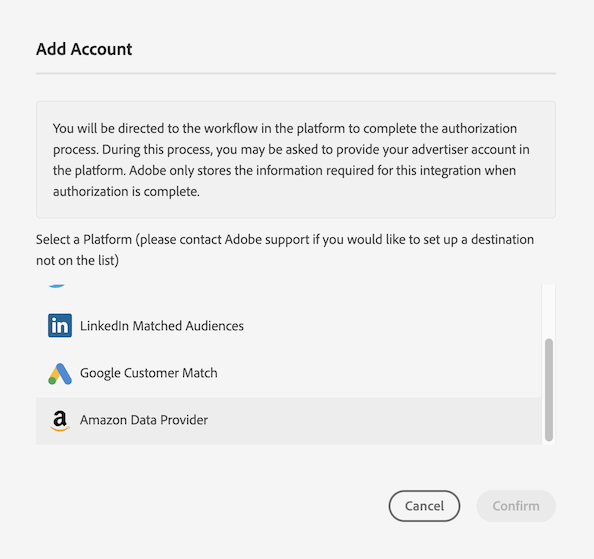
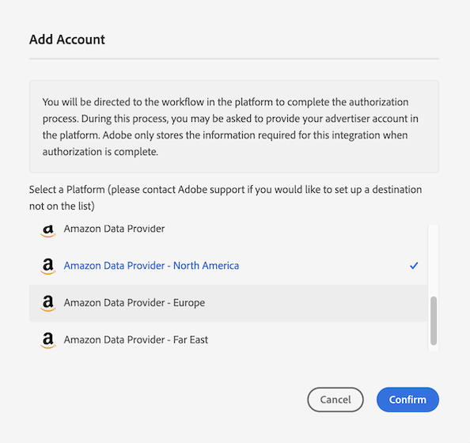
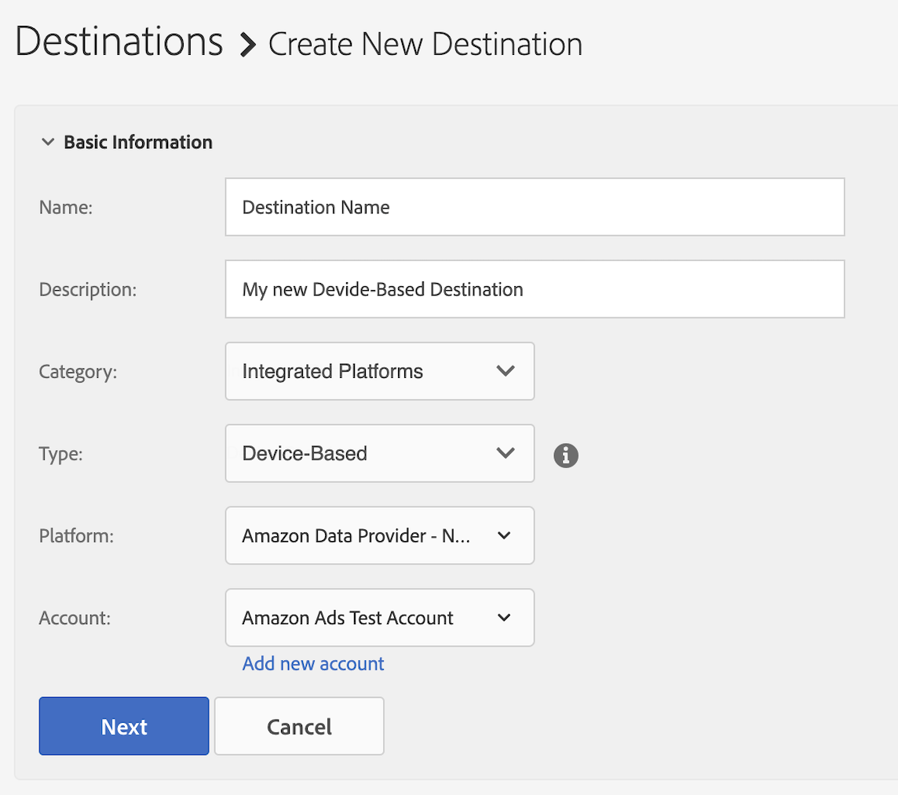

# [!DNL Amazon Advertising] をセルフサービスデバイスベースの宛先として設定する  {#configure-amazon}

この記事では、[Amazon Advertising](https://advertising.amazon.com/API/docs/en-us)との統合を設定する方法について説明します。

## 前提条件 {#prerequisites}

[!DNL Amazon Advertising] 宛先を設定する前に、次の前提条件を満たしていることを確認してください。

* お客様の[!DNL Amazon] アカウントは広告対象である必要があります。
* Audience Manager インスタンスで最初の [!DNL Amazon Advertising] の宛先を作成する場合は、アドビコンサルティングまたはカスタマーケアに連絡して、お使いのアカウントの [!DNL Amazon] ID 同期（データソース ID = 139200）を有効にしてください。これは、Audience Manager と [!DNL Amazon] の間で正しい同期を行うために必要です。
* 新しいデータプロバイダーのオーディエンスを作成したら、[&#x200B; メタデータを更新して](https://advertising.amazon.com/API/docs/en-us/data-provider/openapi#tag/Metadata/paths/~1v2~1dp~1audiencemetadata~1%7BaudienceId%7D/put)を追加する必要があります。 **[!DNL audience fees]**&#x200B;この操作には、[Amazon Ads API](https://advertising.amazon.com/API/docs/en-us/guides/onboarding/apply-for-access)または[Amazon Advertising UI](https://advertising.amazon.com/)を使用できます。

## 新しい [!DNL Amazon Advertising] の宛先の追加 {#add-new-amazon-destination}

ここでは、[!DNL Amazon Advertising] 用に新しいデバイスベースの宛先を設定する際に従う必要のある手順について説明します。このシナリオでは、アドビコンサルタントまたはカスタマーケアによって設定された既存の [!DNL Amazon Advertising] の宛先がないことを前提としています。

### 手順 1.[!DNL Amazon Advertising] での認証  {#step1-authenticate-with-amazon}

デバイスベースの宛先を追加するには、Audience Managerと [!DNL Amazon Advertising] アカウントをリンクさせる必要があります。手順は次のとおりです。

1. Audience Manager アカウントにログインして、**[!UICONTROL Administration > Integrated Accounts]** に移動します。宛先プラットフォームとの統合を設定したことがある場合は、このページに表示されます。それ以外の場合、ページは空になります。
1. **[!UICONTROL Add Account]**&#x200B;を選択します。
1. [!UICONTROL Amazon Data Provider]を選択します。

   

1. **[!UICONTROL Amazon Data Provider]** アカウントが作成される地域（北米、ヨーロッパ、極東）に応じて、[!DNL Amazon Ads] オプションのいずれかを選択し、**[!DNL Confirm]**&#x200B;をクリックして認証ページにリダイレクトします。

   

1. 認証が完了すると、Audience Manager にリダイレクトされ、関連する広告主アカウントが表示されます。使用する広告主アカウントを選択し、**[!UICONTROL Confirm]**&#x200B;をクリックします。 これにより、Audience Managerにアクセスして、オーディエンスに更新情報を送信することを許可しました。

### 手順 2.新しいデバイスベースの宛先を作成する {#step2-create-new-destination}

Audience Managerと[!DNL Amazon Advertising] アカウントをリンクした後、新しい宛先を作成できます。 手順は次のとおりです。

>[!NOTE]
>
>既存のデバイスベースの宛先の名前を変更することはできません。宛先を正しく識別するために役立つ名前を指定してください。

1. Audience Manager アカウントにログインし、**[!UICONTROL Audience Data > Destinations]**&#x200B;に移動し、**[!UICONTROL Create Destination]**&#x200B;を選択します。
1. **[!UICONTROL Basic Information]** セクションで、新しい宛先の&#x200B;**[!UICONTROL Name]**&#x200B;と&#x200B;**[!UICONTROL Description]**&#x200B;を入力し、次の設定を使用します。

   

1. **[!UICONTROL Next]**&#x200B;を選択します。
1. この宛先に設定する[データ書き出しラベル](/help/using/features/data-export-controls.md#controls-labels)を選択します。
1. **[!UICONTROL Save]**&#x200B;を選択します。
1. 「**[!UICONTROL Segment Mappings]**」セクションで、この宛先に送信するオーディエンスセグメントを選択します。
1. 宛先を保存します。

## マッチ率に関する考慮事項 {#match-rates-considerations}

Audience Manager と [!DNL Amazon Advertising] の統合では、履歴オーディエンスのバックフィルがサポートされます。宛先を作成すると、すべてのセグメントの選定が [!DNL Amazon] に送信されます。

## トラブルシューティング {#troubleshooting}

データを[!DNL Amazon Advertising]宛先に設定または送信する際に、以下に説明するエラーが発生する場合があります。 この節では、エラーの原因とその修正方法について説明します。

| エラーメッセージ | 原因／理由 | 解決策 |
|---|---|---|
| `Internal server error` | 古いバージョンのAmazon APIを使用して新しい[!DNL Amazon] アカウントを追加しようとすると、このエラーメッセージがAudience Manager UIに表示されます。 | アドビカスタマーケアに連絡してください。 |
| `Amazon Error: Account XXXXXXXXX was not found` | このエラーメッセージは、宛先用に設定された資格情報が、対応するAudience Manager Ads アカウントにアクセスする権限がない場合に、Amazon UIに表示されます。 | <ul><li>使用しているアカウント資格情報が[前提条件](#prerequisites)を満たしていることを確認してください。</li><li>同じ資格情報を使用してAmazon Ads UIに移動し、対応するアカウントの下に正しいオーディエンスが表示されているかどうかを確認します。 </li></ul> |
