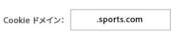

# Cookie の宛先のオプション設定 {#optional-settings-cookies}

[!UICONTROL Destination Builder]では、[!UICONTROL Configuration section]には [!UICONTROL Cookie Domain] フィールドと [!UICONTROL Publish Data To] フィールドが含まれます。これらを使用して、宛先が Cookie を設定しているかどうか、または Cookie を返すかどうかを判定するルールを作成できます。「[!UICONTROL Cookie Domain]」と「[!UICONTROL Publish Data To]」はオプションで、互いに独立して機能します。これらのどちらも使用せずに Cookie の宛先を作成することができます。

## Cookie ドメイン：構文と例 {#cookie-domain-syntax}

<!-- cookie-destination-options.xml -->

<table id="table_4F4F7562AFEE49F8917AAE5712B5CCE4"> 
 <thead> 
  <tr> 
   <th colname="col1" class="entry"> Cookie ドメイン </th> 
   <th colname="col2" class="entry"> 説明 </th> 
  </tr>
 </thead>
 <tbody> 
  <tr> 
   <td colname="col1"> 
<b>構文</b> 
 </td> 
   <td colname="col2"> 
「Cookie Domain」フィールドには、指定したドメインまたはすべてのドメインで Cookie を設定できるようになる単純なテキスト文字列を入力できます。この機能を使用する場合は、次の点に注意してください。 
 
 
     <ul id="ul_473CB59F2C0C4B358201BE5C8B27D73D"> 
      <li id="li_4E7F4691C1B54415963F7D5AA1558C9A">Cookie の宛先ごとに、ドメインを 1 つだけ設定します。「Cookie Domain」フィールドに複数のドメインを入力しないでください。代わりに、別の宛先を作成します。 </li> 
      <li id="li_AEBF5C5F3C264C5EA4A2A6063C3F377D">ワイルドカード文字は使用しないでください。 </li> 
     </ul> 
 
 「Cookie Domain」フィールドを未指定のままにしておくと、すべてのドメインで Cookie が設定されるようになります。これがデフォルト設定です。 
 
特定のドメインおよびサブドメインで Cookie を設定するには、次の点に注意してください。 
 
 
     <ul id="ul_F25BC0D8C40641A2A5CA338E5C258435"> 
      <li id="li_E236D8DEE4F24F9BBA36074F7049C12C">ドメインの名前を「Cookie Domain」フィールドに入力します。 </li> 
      <li id="li_0471C198EE344DE5963A3C2F70B9E78B">ドメイン名をピリオドで始めます。例：<code> .somedomain.com</code> </li> 
      <li id="li_73D06F2BEF45487280C2245E1F6B8ED0"><code> https://www</code> プレフィックスは不要です。 </li> 
     </ul> 
 </td> 
  </tr> 
  <tr> 
   <td colname="col1"> 
<b>例</b> 
 </td> 
   <td colname="col2"> 
簡単な例として、sports.com という架空のサイトがあるとしましょう。sports.com には、ゴルフ、野球、サッカー用のドメインがあります。すべてのスポーツドメインで Cookie を設定するには、「Cookie Domain」ボックスに次のように入力します。 
 
  
 
この結果、Audience Manager は、「<code><i>something</i></code>.sports.com」のパターンを含むすべてのドメインに対して Cookie を設定します。もっと複雑な例については、以下を参照してください。 
 </td> 
  </tr> 
 </tbody> 
</table>

### Cookie ドメインの複雑な例

以下の例は、[!DNL Audience Manager] が「[!UICONTROL Cookie Domain]」オプションの設定に基づいて Cookie を設定するかどうかを示しています。

<table id="table_3A7B9479CDA6493FA8104D8D9841E914"> 
 <thead> 
  <tr> 
   <th colname="col1" class="entry"> Web サイト </th> 
   <th colname="col2" class="entry">Cookie Domain：.sports.com 
Cookie の設定 
 </th> 
   <th colname="col3" class="entry">Cookie Domain：.golf.sports.com 
Cookie の設定 
 </th> 
   <th colname="col4" class="entry">Cookie Domain：未指定 
Cookie の設定 
 </th> 
  </tr> 
 </thead>
 <tbody> 
  <tr> 
   <td colname="col1"> 
 <b>sports.com</b> 
 </td> 
   <td colname="col2"> ○ </td> 
   <td colname="col3"> × </td> 
   <td colname="col4"> ○ </td> 
  </tr> 
  <tr> 
   <td colname="col1"> 
 <b>golf.sports.com</b> 
 </td> 
   <td colname="col2"> ○ </td> 
   <td colname="col3"> ○ </td> 
   <td colname="col4"> ○ </td> 
  </tr> 
  <tr> 
   <td colname="col1"> 
 <b>baseball.sports.com</b> 
 </td> 
   <td colname="col2"> ○ </td> 
   <td colname="col3"> × </td> 
   <td colname="col4"> ○ </td> 
  </tr> 
  <tr> 
   <td colname="col1"> 
 <b>sports.golf.com</b> 
 </td> 
   <td colname="col2"> × </td> 
   <td colname="col3"> × </td> 
   <td colname="col4"> ○ </td> 
  </tr> 
 </tbody> 
</table>

## Publish Data To {#publish-data-to}

「[!UICONTROL Publish Data To]」設定では、選択したオプションで設定した条件にドメインが一致する場合、Cookie を返します。オプションは次のとおりです。

* **[!UICONTROL All of our domains]**：（デフォルト）すべてのドメインに対して [!DNL cookie] を返します。
* **[!UICONTROL Only the selected domains]**：ドメインリストで選択したドメインの場合のみ、Cookie を返します。
* **[!UICONTROL All of our domains except the selected domains]**：選択したドメインが [!DNL cookie] を受信しないよう設定します。それ以外のすべてのドメインは [!DNL cookie] を受信できます。

>[!MORELIKETHIS]
>
>* [Cookie の宛先の作成](../../features/destinations/create-cookie-destination.md)