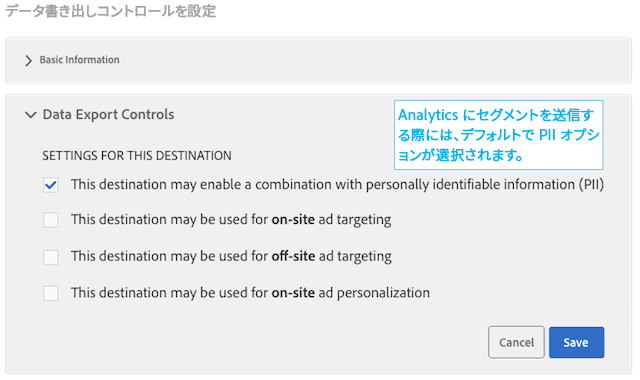
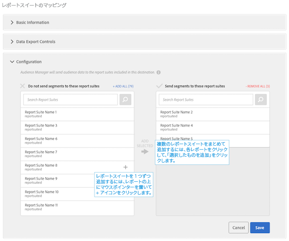

# Analytics の宛先の設定

## 要件 {#requirements}

Analytics の宛先を設定するには、Audience Manager ユーザーが管理者権限を持っている必要があります。管理ガイドの「[ユーザーの作成](/help/using/features/administration/administration-overview.md#create-users)」を参照してください。`CREATE_DESTINATIONS`[ワイルドカード権限](/help/using/features/administration/administration-overview.md#wild-card-permissions)は、Analytics の宛先を作成するには不十分です。要件について詳しくは、[Audience Analytics](https://docs.adobe.com/content/help/ja-JP/analytics/integration/audience-analytics/mc-audiences-aam.html) の前提条件を参照してください。

## Analytics のデフォルトの宛先と新規の宛先

| Analytics の宛先のタイプ | 説明 |
|---|---|
| デフォルト | このデフォルトの宛先は「Adobe Analytics」という名前になっていますが、編集することができます。マッピングされたレポートスイート ID が Audience Manager の特性およびセグメントのフォルダーストレージに表示されます。 アカウントが次の条件を満たす場合、Audience Manager は宛先を 1 つ自動的に作成します。  <ul><li>[オーディエンス分析](https://docs.adobe.com/content/help/en/analytics/integration/audience-analytics/mc-audiences-aam.html)のドキュメントで説明している要件を満たしている。</li><li>Analytics に[レポートスイート](https://docs.adobe.com/content/help/ja-JP/analytics/admin/manage-report-suites/report-suites-admin.html)がある。</li><li>[レポートスイートを組織にマッピングしてある](https://docs.adobe.com/content/help/ja-JP/core-services/interface/about-core-services/report-suite-mapping.html)。</li></ul> |
| 新規 | Analytics の宛先を新規作成するには、Audience Data／Destinations／Create New Destination を選択し、以下で説明している各セクションの手順に従います。 |

## 手順 1：基本情報の提供

このセクションには、Analytics の宛先の作成プロセスを開始するフィールドとオプションが含まれています。このセクションを完了するには：

1. 「**基本情報**」をクリックして、コントロールを表示します。
2. 宛先の名前を入力します。略語や特殊文字は使用しないでください。
3. *（オプション）*&#x200B;宛先の説明を入力します。簡潔な説明は、宛先を定義するのに効果的です。
4. *（オプション）*「**Platform**」リストをデフォルトの「**All**」のままにしておきます。現時点では、このオプションは機能しません。今後追加される可能性のある機能をサポートするために設計されています。
5. 「**Category**」リストで「**Adobe Experience Cloud**」を選択します。
6. 「**Type**」リストで「**Adobe Analytics**」を選択します。
7. 「**Save**」をクリックして「Configuration」セクションに移動するか、「**Data Export Controls**」をクリックして書き出しコントロールを宛先に適用します。

>[!NOTE]
>
>Analytics の宛先の場合は、「**Auto-Fill Destination Mappping**」チェックボックスと「**Segment ID**」オプションはデフォルトで選択されています。これらの設定を変更することはできません。

## 手順 2：データ書き出しコントロールの設定

このセクションには、[データ書き出しコントロール](/help/using/features/data-export-controls.md)を Analytics の宛先に適用するオプションが含まれています。データ書き出しコントロールを使用しない場合は、この手順を省略してください。このセクションを完了するには：

1. 「**Data Export Controls**」をクリックして、コントロールを表示します。
1. 宛先に適用するデータ書き出しコントロールに対応するラベルを選択します（詳しくは[宛先へのデータ書き出しラベルの追加](/help/using/features/destinations/add-data-export-labels.md)を参照してください）。Analytics の宛先の場合は、PII のチェックボックスがデフォルトで選択されています。
1. 「**Save**」をクリックします。

## 手順 3：レポートスイートのマッピング

「Configuration」セクションでは、サーバー側転送が有効になっている Analytics レポートスイートが一覧表示されます。Analytics の宛先が複数ある場合は、それらの宛先に割り当てられたレポートスイートは相互に排他的で、Audience Manager によって実行されます。このセクションを完了するには：

1. 「**Configuration**」をクリックして、コントロールを表示します。
1. セグメントの宛先となるレポートスイートを 1 つ以上選択します。
1. 「**Save**」をクリックします。

## 手順 4：セグメントマッピング

このセクションには、セグメントを自動的にまたは手動でマッピングできるオプションが用意されています。

| マッピングオプション | 説明 |
|---|---|
| Automatically map all current and future segments | デフォルトで選択されています。訪問者が資格を満たすすべてのセグメントが、ヒットごとに Analytics に送信されます。 単一のヒットで訪問者が 150 を超える Audience Manager セグメントに属している場合、最近絞り込まれた 150 個のセグメントのみ Analytics に送信され、残りのリストは切り捨てられます。セグメントリストが切り捨てられたことを示す追加フラグが Analytics に送信されます。このアクションで、Audiences Name ディメンションに「Audience limit reached」と表示され、Audiences ID ディメンションに「1」と表示されます。詳しくは、[FAQ](https://docs.adobe.com/content/help/ja-JP/analytics/integration/audience-analytics/audience-analytics-workflow/mc-audiences-faqs.html) を参照してください。 また、このオプションは、[セグメントビルダー](/help/using/features/segments/segment-builder.md)での宛先の可用性にも影響を与えます。例えば、セグメントが Analytics で宛先に自動的にマッピングされている場合、その宛先はセグメントビルダーの[宛先マッピングセクション](/help/using/features/segments/segment-builder.md#segment-builder-controls-destinations)では利用できません。Analytics の宛先がグレー表示され、宛先ブラウザーの「Type」列に「Analytics」と表示されます。 |
| Manually map segments | このオプションを選択すると、Analytics に送信するセグメントを選択できる検索および参照コントロールが表示されます。 セグメントを検索するには：  <ol><li>セグメント名またはセグメント ID を検索フィールドに入力します。</li><li>「<b>Add</b>」をクリックします。</li><li>セグメントの検索と追加を続けるか、「<b>Done</b>」をクリックします。</li></ol> セグメントを参照するには： <ol><li>「<b>Browse all segments</b>」をクリックします。使用可能なセグメントのリストが表示されます。</li><li>このリストから、使用するセグメントのチェックボックスを選択し、「<b>Add selected segments</b>」をクリックします。</li><li>Add Mappings ウィンドウの「<b>Save</b>」をクリックします。ベータリリースの間は、マッピング、開始日、終了日を変更することはできません。</li><li>セグメントの参照と追加を続けるか、「<b>Done</b>」をクリックします。</li></ol>  |

## 次の手順

宛先を作成して保存したら、そのデータを Analytics で扱うことができます。ただし、選択したレポートスイートでデータが使用可能になるまで、数時間かかることがあります。詳しくは、[Analytics でのオーディエンスデータの使用](https://docs.adobe.com/content/help/ja-JP/analytics/integration/audience-analytics/audience-analytics-workflow/use-audience-data-analytics.html)を参照してください。
