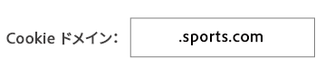

# 宛先の管理 {#manage-destinations}

[!UICONTROL Destination] ランディングページには、すべて [!DNL URL]のCookie、cookieおよびサーバー間宛先が一覧表示されます。ここでは、宛先の作成、編集、検索、レポート作成をおこなえます。The landing page is located in **[!UICONTROL Audience Data > Destinations]**.

## デフォルトのランディングページ {#default-landing-page}

<!-- destinations-home.xml -->

デフォルトのランディングページには、タイプに基づいて宛先が表示されます。次の4つのタブを使用して、宛先をフィルターできます。

* **すべて**:に、すべてのタイプの宛先を表示します。
* **Adobe Experience Cloud**:により、他のAdobe Experience Cloudソリューションにデータを送信する宛先が表示されます。現在、サポートされているオプションはAdobe Analyticsのみです。See [Configure an Analytics Destination](/help/using/features/destinations/create-analytics-destination.md).
* **統合プラットフォーム**:に、ユーザーベースの宛先とデバイスベースの宛先（別名サーバー間宛先）を示します。現在、ユーザーベースの宛先は、選択した顧客のみが利用できる機能です。
* **カスタム**:cookieおよびURLの宛先を表示します。

## アドレス可能なオーディエンスのランディングページ {#audiences-landing-page}

To see audience data and match rates for your server-to-server destination, select **[!UICONTROL Integrated Platforms > Device-Based]**.

For more information about the displayed information, see [Addressable Audiences Interface](/help/using/features/addressable-audiences.md#addressable-audience-interface).

## Destination Builder {#destination-builder}

[!UICONTROL Destination Builder] を使用すると、Cookieベースまたは [!DNL URL] リンク先を作成できます。You cannot create server-to-server ([!DNL S2S]) destinations with [!UICONTROL Destination Builder], but you can manage their segment mappings. Contact your consultant to set up a [!DNL S2S] destination. [!UICONTROL Destination Builder]**[!UICONTROL Audience Data > Destinations]**&#x200B;が配置されていることを確認します。

### Destination Builder の設定 {#destination-builder-settings}

<!-- destination-builder.xml -->

[!UICONTROL Destination Builder] は、以下の節と設定で構成されています。

| [!UICONTROL Destination Builder] セクション | 目的 |
|--- |--- |
| 基本情報 | Used to name the destination, describe it, and select destination type ([!DNL URL] or [!DNL cookie]), and platform (all, [!DNL Android], browser, or [!DNL iOS]). |
| 設定 | 次の用途のコントロールが含まれています。 <ul><li>Passing in key-value data to [!DNL URL] destinations. データは、個々のキー値ペアとして送信することも、シリアル化されたキー値ペアとして送信することもできます。詳しくは、[宛先のシリアル化](../../features/destinations/key-value-pairs.md#destination-serialized) と [標準とシリアルキーの値のペア](../../features/destinations/key-value-pairs.md) </li><li>Cookie の宛先の要素（Cookie の名前、ドメイン、サイズ、有効期間、データ形式など）を指定する。</li></ul> |
| Segment Mappings | レポートを:  <ul><li>宛先のタイプ all に関連するセグメントの検索、追加、管理。 </li><li>Set delivery priorities on individual segments (for [!DNL cookie]-based segments only).</li></ul> |

### データ配信方法 {#data-delivery-methods}

Send information to a destination by passing it in through a [!DNL URL] string, by writing to a browser [!DNL cookie], or through offline server-to-server data transfers.

* [!DNL URL] および Cookie ベースの宛先は、ユーザーがページでアクションをおこなうたびに、データを同期的に送信します。
* サーバー間データ送信は非同期的で、ユーザーがページから移動した後かなり経ってからおこなわれることがあります。選択する配信タイプは、ビジネス要件と特定のデータパートナーによるデータの受信方法によって異なります。

詳しくは、[宛先のタイプを選択する方法](../../features/destinations/destinations.md)を参照してください。

>[!MORE_LIKE_THIS]
>
>* [Cookie の宛先の作成](../../features/destinations/manage-destinations.md#create-cookie-destination)
>* [URL 宛先の作成](../../features/destinations/manage-destinations.md#configure-url-destination)

## Cookie の宛先の設定 {#create-cookie-destination}

Cookie の宛先は、ユーザーのブラウザーの Cookie からデータを返したり、Cookie にデータを書き込んだりします。Cookie には、当該ページにアクセスできる他のプラットフォームで読み取ることができるデータが格納されています。[!UICONTROL Destination Builder] で Cookie の宛先を作成するには、以下の手順に従います。

<!-- create-cookie-destination.xml -->

To create a new cookie destination, go to **[!UICONTROL Audience Data > Destinations > Create New Destination]** and complete the sections as described below.

### Basic Information {#basic-information}

このセクションには、Cookie の宛先の作成プロセスを開始するフィールドとオプションが含まれています。このセクションを完了するには：

1. 「**[!UICONTROL Basic Information]**」をクリックして、コントロールを表示します。
2. 宛先の名前を入力します。略語や特殊文字は使用しないでください。
3. *（オプション）*&#x200B;宛先の説明を入力します。簡潔な説明が、宛先を定義するのに効果的です。
4. **[!UICONTROL Category]** リストで、を選択 **[!UICONTROL Custom]**&#x200B;します。
5. **[!UICONTROL Environment]** リストで、を選択 **[!UICONTROL Browser]**&#x200B;します。AndroidやiOSアプリなど、ネイティブモバイル環境用にcookieの宛先を設定することはできません。
6. **[!UICONTROL Type]** リストで、をクリック **[!UICONTROL Cookie]**&#x200B;します。
7. *（オプション）* を選択 **[!UICONTROL Auto-fill Destination Mapping]**&#x200B;します。オプションは以下のとおりです。
   * **[!UICONTROL Segment ID]**：セグメント ID を自動的に追加して宛先に送信します。
   * **[!UICONTROL Integration Code Value]**:セグメント統合コードを自動的に追加して宛先マッピングに送信します。統合コードは、顧客が作成して使用する一意の識別子です。最大 255 文字に制限されています。
8. Click **[!UICONTROL Next]** to go to the [!UICONTROL Configuration] settings or click **[!UICONTROL Data Export Labels]** to apply export controls to the destination.

### Data Export Labels {#data-export-labels-cookies}

このセクションには、[データ書き出しコントロール](../../features/data-export-controls.md)を Cookie の宛先に適用するオプションが含まれています。データ書き出しコントロールを使用しない場合は、この手順を省略してください。このセクションを完了するには：

1. 「**[!UICONTROL Data Export Labels]**」をクリックして、コントロールを表示します。
2. 宛先に適用するデータ書き出しコントロールに対応するラベルを選択します（詳しくは、[データ書き出しラベルを宛先に追加する](../../features/destinations/manage-destinations.md#add-data-export-labels)を参照してください）。
3. **[!UICONTROL Save]**&#x200B;をクリックします。

### Configuration {#configuration}

このセクションには、宛先の Cookie をセットアップできるフィールドとオプションが含まれています。

>[!NOTE]
>
>宛先の Cookie に書き込まれるデータは [!DNL Audience Manager] でエンコードされます。例えば、スペースは `%20` としてエンコードされ、セミコロンは `%3B` としてエンコードされます。

このセクションを完了するには：

1. 「**[!UICONTROL Configuration]**」をクリックして、コントロールを表示します。
1. Cookie の名前を入力します。略語や特殊文字は使用しないでください。
1. データ形式のオプションを選択します。これらのオプションでは、セグメントデータを宛先に送信するキー値ペアの区切り文字を選択できます。形式のオプションは次のとおりです。
   * **Single key**：キー値ペアのキーを設定できます。以下の「[!UICONTROL Segment Mappings]」セクションでセグメントを選択してから、値を設定します。
   * **Multi key**：キー値ペアのキーと値を設定できます。以下の「Segment Mappings」セクションでセグメントを選択してから、キー値ペアを作成します。これらのデータ要素について詳しくは、[標準およびシリアル化されたキー値ペア](../../features/destinations/key-value-pairs.md)を参照してください。
1. **[!UICONTROL Save]**&#x200B;をクリックします。

他の設定はすべてオプションです。For more information about the **[!UICONTROL Cookie Domain]** and **[!UICONTROL Publish data to]** settings, see [Optional Settings for Cookie Destinations](../../features/destinations/manage-destinations.md#optional-settings-cookies).

### Segment Mappings {#segments-mapping}

このセクションでは、セグメントを検索し宛先に追加することができます。このセクションを完了するには：

1. 「**[!UICONTROL Segment Mappings]**」をクリックして、コントロールを表示します。
1. **[!UICONTROL Search and Add Segments]** ボックスにセグメントの名前を入力するか、をクリック **[!UICONTROL Browse All Segments]** して使用可能なセグメントのリストを参照します。
1. Click **[!UICONTROL Add Selected Segments]** when you find the segment you want to use. Adding a segment opens the [!UICONTROL Edit Mapping] window.
1. [!UICONTROL Edit Mapping] ダイアログ内:
   * **[!UICONTROL Mapping]「**」を使用すると、上記の「Configuration」セクションで指定したキーの値を設定できます。
   * **[!UICONTROL Publish from]「**」を使用すると、宛先の開始日と終了日を設定できます。終了日が未指定の場合、宛先の有効期限は無期限になります。
1. **[!UICONTROL Save]**&#x200B;をクリックします。
1. **[!UICONTROL Done]**&#x200B;をクリックします。

## URL の宛先の設定 {#configure-url-destination}

[!DNL URL] の宛先は、ページから宛先へのピクセル呼び出しをおこないます。[!DNL URL] で [!UICONTROL Destination Builder] の宛先を作成するには、以下の手順に従います。

<!-- create-url-destination.xml -->

[!DNL URL] 新しい宛先を作成するには、以下の説明に従って、セクションに **[!UICONTROL Audience Data > Destinations > Create New Destination]** 移動してください。

### Basic Information {#basic-info}

このセクションには、URL の宛先の作成プロセスを開始するフィールドとオプションが含まれています。このセクションを完了するには：

1. 「**[!UICONTROL Basic Information]**」をクリックして、コントロールを表示します。
1. 宛先の名前を入力します。略語や特殊文字は使用しないでください。
1. *（オプション）*&#x200B;宛先の説明を入力します。簡潔な説明が、宛先を定義するのに効果的です。
1. **[!UICONTROL Category]** リストで、を選択 **[!UICONTROL Custom]**&#x200B;します。
1. In the **[!UICONTROL Environment]** list, select the environment in which to trigger the URL destination.
1. **[!UICONTROL Type]** リストで、をクリック **[!UICONTROL URL]**&#x200B;します。
1. *（オプション）* を選択 **[!UICONTROL Auto-fill Destination Mapping]**&#x200B;します。オプションは以下のとおりです。
   * **[!UICONTROL Segment ID]**：セグメント ID を自動的に追加して宛先に送信します。
   * **[!UICONTROL Integration Code Value]**:セグメント統合コードを自動的に追加して宛先マッピングに送信します。統合コードは、顧客が作成して使用する一意の識別子です。最大 255 文字に制限されています。
1. Click **[!UICONTROL Next]** to go to the [!UICONTROL Configuration] settings or click **[!UICONTROL Data Export Labels]** to apply export controls to the destination.

### Data Export Labels {#data-export-labels-dest}

このセクションには、[データ書き出しコントロール](../../features/data-export-controls.md)を の宛先に適用するオプションが含まれています。[!DNL URL]データ書き出しコントロールを使用しない場合は、この手順を省略してください。このセクションを完了するには：

1. 「**[!UICONTROL Data Export Labels]**」をクリックして、コントロールを表示します。
2. 宛先に適用するデータ書き出しコントロールに対応するラベルを選択します（詳しくは、[データ書き出しラベルを宛先に追加する](../../features/destinations/manage-destinations.md#add-data-export-labels)を参照してください）。
3. **[!UICONTROL Save]**&#x200B;をクリックします。

### Configuration {#configure-base-data}

This section contains options that let you set a base [!DNL URL] and data delimiters passed in by the [!DNL URL] string. このセクションはオプションです。このセクションを完了するには：

1. 「**[!UICONTROL Configuration]**」をクリックして、コントロールを表示します。
1. *（オプション）*「**[!UICONTROL Serialize]**」チェックボックスを選択します。これで、セグメントごとに別個に呼び出しをおこなうのではなく、セグメントを連続して宛先に送信できます。シリアル化はデータ転送の効率化に役立ちます。このチェックボックスを選択すると、URL と区切り文字のフィールドが表示されます。詳しくは、[標準およびシリアル化されたキー値ペア](../../features/destinations/key-value-pairs.md).
1. 「**[!UICONTROL Serialize]**」を選択した場合は、下記の URL フィールドと区切り文字フィールドも設定する必要があります。

| フィールド | 説明 |
|--- |--- |
| Base URL | The base part of a standard `HTTP` [!DNL URL] that does not change. また、ベース URL に`%ALIAS%` [プレースホルダーマクロ](../../features/destinations/destination-macros.md#destination-macros-defined)を配置する必要があります。例: `https://www.myCompany.com/%alias%...` |
| Secure URL | The base part of a secure `HTTPS` [!DNL URL] that does not change. また、ベース URL に`%ALIAS%` [プレースホルダーマクロ](../../features/destinations/destination-macros.md#destination-macros-defined)を配置する必要があります。例: `https://www.myCompany.com/%alias%...` |
| 区切り | [!DNL URL] 文字列内のセグメント変数を区切るシンボル。これは通常、コンマかセミコロンです。これについては、宛先のパートナーに確認してください。 |

### Segment Mappings {#segment-mappings}

このセクションでは、セグメントを検索し宛先に追加することができます。このセクションを完了するには：

1. 「**[!UICONTROL Segment Mappings]**」をクリックして、コントロールを表示します。
1. **[!UICONTROL Search and Add Segments]** ボックスで、セグメントの名前を入力するか、使用可能なセグメントのリスト **[!UICONTROL Browse All Segments]** を参照します。
1. Click **[!UICONTROL Add Selected Segments]** when you find the segment you want to use. Adding a segment opens the [!UICONTROL Edit Mapping] window.
1.  [!UICONTROL Edit Mapping]:
   * **[!UICONTROL Mappings]**：セグメントで使用されるキー値ペアを指定します。
   * **[!UICONTROL Start Date]** および宛先の開始日と終了日を選択します。**[!UICONTROL End Date]**&#x200B;終了日が未指定の場合、宛先の有効期限は無期限になります。
1. **[!UICONTROL Done]**&#x200B;をクリックします。

### Cookie の宛先のオプション設定 {#optional-settings-cookies}

In [!UICONTROL Destination Builder], the [!UICONTROL Configuration section] contains the [!UICONTROL Cookie Domain] and [!UICONTROL Publish Data To] fields. これらを使用して、宛先が Cookie を設定しているかどうか、または Cookie を返すかどうかを判定するルールを作成できます。[!UICONTROL Cookie Domain] また、互いに独立して [!UICONTROL Publish Data To] 動作し、オプションです。これらのどちらも使用せずに Cookie の宛先を作成することができます。

## Cookie ドメイン：構文と例 {#cookie-domain-syntax}

<!-- cookie-destination-options.xml -->

<table id="table_4F4F7562AFEE49F8917AAE5712B5CCE4"> 
 <thead> 
  <tr> 
   <th colname="col1" class="entry"> Cookie ドメイン </th> 
   <th colname="col2" class="entry"> 説明 </th> 
  </tr>
 </thead>
 <tbody> 
  <tr> 
   <td colname="col1"> 
<b>構文</b> 
 </td> 
   <td colname="col2"> 
「Cookie Domain」フィールドには、指定したドメインまたはすべてのドメインで Cookie を設定できるようになる単純なテキスト文字列を入力できます。この機能を使用する場合は、次の点に注意してください。 
 
 
     <ul id="ul_473CB59F2C0C4B358201BE5C8B27D73D"> 
      <li id="li_4E7F4691C1B54415963F7D5AA1558C9A">Cookie の宛先ごとに、ドメインを 1 つだけ設定します。「Cookie Domain」フィールドに複数のドメインを入力しないでください。代わりに、別の宛先を作成します。 </li> 
      <li id="li_AEBF5C5F3C264C5EA4A2A6063C3F377D">ワイルドカード文字は使用しないでください。 </li> 
     </ul> 
 
 「Cookie Domain」フィールドを未指定のままにしておくと、すべてのドメインで Cookie が設定されるようになります。これがデフォルト設定です。 
 
特定のドメインおよびサブドメインで Cookie を設定するには、次の点に注意してください。 
 
 
     <ul id="ul_F25BC0D8C40641A2A5CA338E5C258435"> 
      <li id="li_E236D8DEE4F24F9BBA36074F7049C12C">ドメインの名前を「Cookie Domain」フィールドに入力します。 </li> 
      <li id="li_0471C198EE344DE5963A3C2F70B9E78B">ドメイン名をピリオドで始めます。例えば、<code>.somedomain.com</code> などとします。 </li> 
      <li id="li_73D06F2BEF45487280C2245E1F6B8ED0"><code>https://www</code> プレフィックスは不要です。 </li> 
     </ul> 
 </td> 
  </tr> 
  <tr> 
   <td colname="col1"> 
<b>例</b> 
 </td> 
   <td colname="col2"> 
簡単な例として、sports.com という架空のサイトがあるとしましょう。sports.com には、ゴルフ、野球、サッカー用のドメインがあります。すべてのスポーツドメインで Cookie を設定するには、「Cookie Domain」ボックスに次のように入力します。 
 
  
 
This tells  Audience Manager to set a cookie in any domain that contains the pattern <code><i>something</i></code>.sports.com. もっと複雑な例については、以下を参照してください。 
 </td> 
  </tr> 
 </tbody> 
</table>

### Cookie ドメインの複雑な例

以下の例は、[!DNL Audience Manager] が「[!UICONTROL Cookie Domain]」オプションの設定に基づいて Cookie を設定するかどうかを示しています。

<table id="table_3A7B9479CDA6493FA8104D8D9841E914"> 
 <thead> 
  <tr> 
   <th colname="col1" class="entry"> Web サイト </th> 
   <th colname="col2" class="entry">Cookie Domain：.sports.com 
Cookie の設定 
 </th> 
   <th colname="col3" class="entry">Cookie Domain：.golf.sports.com 
Cookie の設定 
 </th> 
   <th colname="col4" class="entry">Cookie Domain：未指定 
Cookie の設定 
 </th> 
  </tr> 
 </thead>
 <tbody> 
  <tr> 
   <td colname="col1"> 
 <b>sports.com</b> 
 </td> 
   <td colname="col2"> ○ </td> 
   <td colname="col3"> × </td> 
   <td colname="col4"> ○ </td> 
  </tr> 
  <tr> 
   <td colname="col1"> 
 <b>golf.sports.com</b> 
 </td> 
   <td colname="col2"> ○ </td> 
   <td colname="col3"> ○ </td> 
   <td colname="col4"> ○ </td> 
  </tr> 
  <tr> 
   <td colname="col1"> 
 <b>baseball.sports.com</b> 
 </td> 
   <td colname="col2"> ○ </td> 
   <td colname="col3"> × </td> 
   <td colname="col4"> ○ </td> 
  </tr> 
  <tr> 
   <td colname="col1"> 
 <b>sports.golf.com</b> 
 </td> 
   <td colname="col2"> × </td> 
   <td colname="col3"> × </td> 
   <td colname="col4"> ○ </td> 
  </tr> 
 </tbody> 
</table>

## Publish Data To {#publish-data-to}

「[!UICONTROL Publish Data To]」設定では、選択したオプションで設定した条件にドメインが一致する場合、Cookie を返します。オプションは以下のとおりです。

* **[!UICONTROL All of our domains]**:（デフォルト）任意のドメイン [!DNL cookie] に対して、aを返します。
* **[!UICONTROL Only the selected domains]**:ドメインリストで選択したドメインのCookieのみを返します。
* **[!UICONTROL All of our domains except the selected domains]**:選択したドメインが受信しないよう [!DNL cookie]にします。All other domains can receive a [!DNL cookie].

>[!MORE_LIKE_THIS]
>
>* [Cookie の宛先の作成](../../features/destinations/manage-destinations.md#create-cookie-destination)

## サーバー間宛先のセグメントの追加または編集 {#add-edit-segments}

You can only add or edit segments for a server-to-server ([!DNL S2S]) destination. You cannot create [!DNL S2S] destinations with [!UICONTROL Destination Builder]. [!DNL S2S] 宛先を設定するには、コンサルタントにお問い合わせください。[!DNL S2S] リンク先のセグメントを追加または編集するには、次の手順に従います。

<!-- destination-s2s-edit.xml -->

[!DNL S2S] 宛先のセグメントマッピングを追加または編集するには:

1. Go to **[!UICONTROL Audience Data > Destinations]**. **統合プラットフォーム/デバイスベース** を選択し、操作 [!DNL S2S] する宛先を見つけます。
1. 「[!UICONTROL Action]」列で鉛筆アイコンをクリックして、宛先を編集します。
   * **[!UICONTROL Search and Add Segments]** ボックスで、セグメントの名前を入力するか、使用可能なセグメントのリスト **[!UICONTROL Browse All Segments]** を参照します。
   * Click **[!UICONTROL Add Selected Segments]** when you find the segment you want to use. Adding a segment opens the [!UICONTROL Edit Mapping] window.
   *  [!UICONTROL Edit Mapping]:
      * **[!UICONTROL Mappings]**:この宛先で使用される [キーと値のペア](../../features/destinations/key-value-pairs.md) の値を設定します。
      * **[!UICONTROL Start Date]** および宛先の開始日と終了日を選択します。**[!UICONTROL End Date]**&#x200B;終了日が未指定の場合、宛先の有効期限は無期限になります。
1. Click **[!UICONTROL Save]** and then click **[!UICONTROL Done]**.

## 宛先へのデータ書き出しラベルの追加 {#add-data-export-labels}

[!DNL Data Export Labels]はデータソースで設定された [!DNL Export Controls] と連携します。[!DNL Data Export Labels] によって、セグメントへの制限された特性の追加や、宛先へのセグメントデータの送信が防止されます。You can set multiple export labels to a new or existing [!DNL cookie] or [!DNL URL] destination.

>[!NOTE]
>
>書き出しラベルを追加するには、管理者権限&#x200B;*または*&#x200B;宛先の作成や編集をおこなうための十分な権限が必要です。

<!-- t_export_labels.xml -->

書き出しラベルを宛先に追加するには：

1. **[!UICONTROL Audience Data]**&#x200B;クリックします。
   * For new destinations: Click **[!UICONTROL Create New Destination]**. データ書き出しラベルを選択する前に、「[!UICONTROL Basic Information]」セクションに入力します。See [Create a Cookie Destination](../../features/destinations/manage-destinations.md#create-cookie-destination) or [Create a URL Destination](../../features/destinations/manage-destinations.md#configure-url-destination) for information.
   * 既存の宛先の場合：「[!DNL Search]」ボックスを使用して宛先を検索するか、リストをスクロールし、宛先名をクリックして開きます。
1. [!DNL Data Export Label] を選択します。書き出し制限を設定しない場合は、チェックボックスをオフにします。書き出しラベルには次のようなオプションがあります。
   * **[!UICONTROL This destination may enable a combination with personally identifiable information (PII)]**
   * **[!UICONTROL This destination may be used for on-site ad targeting]**
   * **[!UICONTROL This destination may be used for off-site ad targeting]**
   * **[!UICONTROL This destination may be used for on-site ad personalization]**
   >[!IMPORTANT]
   >
   >書き出し制限は、データソースに[書き出しコントロールの照合](../../features/data-export-controls.md)が設定されていないと機能しません。
1. **[!UICONTROL Save]**&#x200B;をクリックします。

>[!MORE_LIKE_THIS]
>
>* [データソースの作成](../../features/manage-datasources.md#create-data-source)

