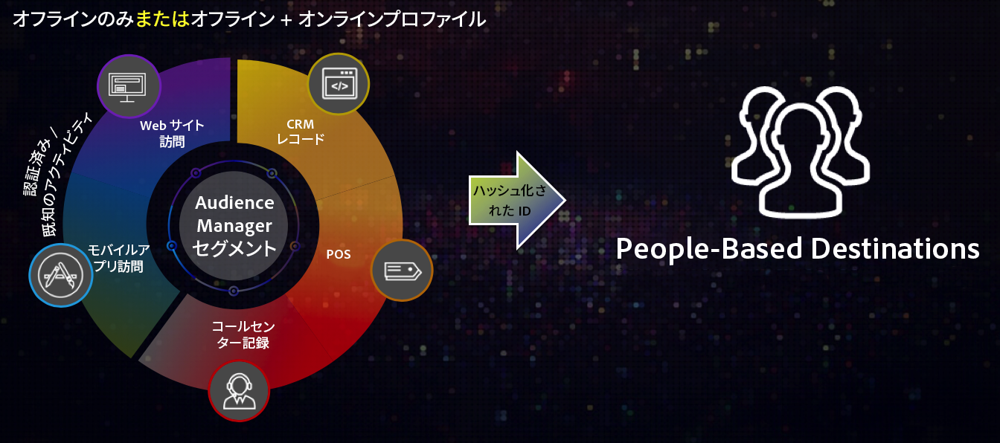
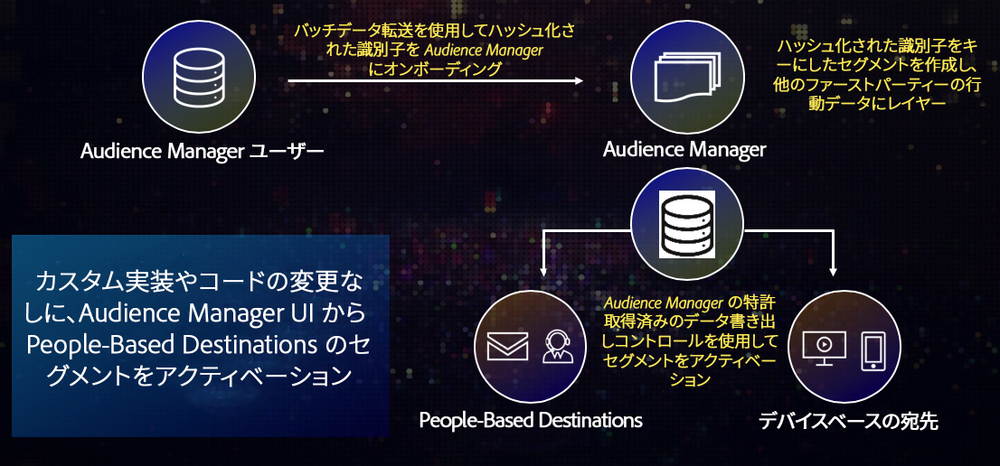

# 概要とユースケース {#overview-use-cases}

[!DNL People-Based Destinations] を使用して、ファーストパーティのオーディエンスセグメントをユーザーベースの環境に送信します。これらの環境は、そこで表示されるコンテンツを制御する 1 つのエンティティに属する、クローズドなシステムです。これには、顧客アカウントに依存して表示するコンテンツをパーソナライズする、[!DNL Facebook] などのソーシャルプラットフォームが含まれます。

>[!IMPORTANT]
>この記事には、この機能の設定と使用方法を説明する製品ドキュメントが含まれています。法的なアドバイスは何も含まれません。法律に関するガイダンスについては、御社の顧問弁護士にアドバイスを求めてください。

## 概要 {#overview}

[!DNL People-Based Destinations] では、オンラインとオフラインのデータにセグメント化を適用し、電子メールアドレスや電話番号などの[ハッシュ化された識別子](people-based-destinations-prerequisites.md#hashing-requirements)に基づいてオーディエンスセグメントを作成できます。次に、これらのセグメントを、ソーシャルプラットフォーム上のオーディエンスをターゲット設定できる「ウォールドガーデン」（[!DNL Facebook] など）に含めます。[!DNL People-Based Destinations] は、次の場合に役立ちます。

* ハッシュ化された電子メールアドレスに基づいて、プラットフォーム（[!DNL Facebook] など）でオフラインとオンラインのオーディエンスのターゲット設定をおこなう
* Audience Manager の既存のデバイスおよび Cookie のターゲティング機能を補完する
* サードパーティ製データオンボードソリューションに関連するコストを排除する
* カスタムデータオンボーディングワークフローの開発に関連するコストを排除します
* Cookie がない環境でオーディエンスのターゲット設定をおこなう
* 顧客 ID と一致する、ハッシュ化された電子メールアドレスの重複を排除してオーディエンスのターゲット設定をおこなう

[!DNL People-Based Destinations] を使用して、Web サイトを訪問したことのない高価値顧客をセグメント化またはターゲット設定をおこなったり、またはオフラインでコンバージョン済みの顧客のターゲティングを停止したりできます。さらに、[!DNL Profile Merge Rules] を活用してオフラインのファーストパーティデータ同士（他の Adobe Experience Cloud ソリューションの顧客データを含む）を組み合わせ、ソーシャルメディアでの広告活動を最適化することもできます。

## 使用可否 {#availability}

[!DNL People-Based Destinations] は、Audience Manager のプレミアム統合です。このプレミアム機能を活用するには、アドビの担当者にお問い合わせください。

## [!UICONTROL People-Based Destinations] を使用する理由 {#why-use}

**Audience Manager 内からオーディエンスセグメント全体を管理することで、一貫性のあるクロスチャネルエクスペリエンスを顧客に提供します。**

Audience Manager から、ユーザーベースのチャネルでオーディエンスセグメントをアクティブ化しなかった場合、Web サイトの訪問時に顧客に表示される内容と、[!DNL Facebook] フィードなどに表示される内容が切り離されます。チャネルをまたいで一貫したターゲティングをおこなうと、広告への投資を最適化すると同時に、広告収入を増やすことができます。

**専用データオンボーディングソリューションやカスタムワークフローを使用してオーディエンスを送信しなくても、ユーザーベースのチャネルでオーディエンスにリーチできます。**

他のユーザーベースのチャネルをまたいでオーディエンスをターゲティングする「従来の」方法では、宣伝したいプラットフォームで許可されている形式で顧客データを書き出し、プラットフォームの専用データオンボード方式を使用して、顧客データを広告主アカウントに取り込みます。この作業は、宣伝したい各プラットフォームで、手動で実行する必要があります。さらに、プラットフォームが異なれば、データ形式の要件も異なることがあり、プロセスの煩雑さも増します。

[!DNL People-Based Destinations] を通じて、Audience Manager は顧客データを一元管理し、オーディエンスセグメントを構築し、複数のユーザーベースのチャネルをまたいでそれらをアクティブ化できます。これらをすべては、Audience Manager ユーザーインターフェイス内から実行できるので、各プラットフォームに手動でデータをアップロードする手間がなくなり、プロセスの貴重な時間を節約できます。

**純粋なオフラインプロファイルからオーディエンスセグメントを作成およびアクティブ化します。**

[!DNL People-Based Destinations] により、デバイスアクティビティに基づいてしかオーディエンスセグメントをアクティブ化できなかった問題が解決されました。[!DNL People-Based Destinations] を使用すれば、独自の [!DNL CRM] の純粋なオフラインデータからセグメントを作成し、ユーザーベースのプラットフォームでアクティブ化することができます。さらに、Audience Manager に既に存在するデバイスデータとオフラインデータを関連付けることもできます。

**Audience Manager のデータガバナンスおよびプライバシーコントロールを活用して、顧客データを安全に処理できます。**

[!DNL People-Based Destinations] では、不可逆的にハッシュ化された識別子のみを使用する必要があります。これにより、顧客データを各宛先プラットフォームに手動で関連付けることに関連するリスクを低減します。

[!UICONTROL People-Based Destinations] を使用する際のデータフローの概要については、以下のビデオをご覧ください。

>[!VIDEO](https://video.tv.adobe.com/v/28968/)

## ユースケース {#use-cases}

[!DNL People-Based Destinations] をいつどのようにして使用するかを理解しやすくするために、Audience Manager のお客様がこの機能を使用して解決できる、2 つのユースケースの例を以下に示します。

### ユースケース 1 {#use-case-1}

オンライン小売業者は、ソーシャルプラットフォームを通じて既存の顧客にリーチし、以前の注文に基づいてパーソナライズされたオファーを表示したいと願っています。[!DNL People-Based Destinations] を使用すれば、オンライン小売業者はハッシュ化された電子メールアドレスを自分の [!DNL CRM] から Audience Manager に取り込み、オフラインデータからセグメントを構築し、これらのセグメントを宣伝したいソーシャルプラットフォームに送信して、広告費用を最適化することができます。

### ユースケース 2 {#use-case-2}

航空会社には異なる顧客階層（ブロンズ、シルバー、ゴールド）があり、ソーシャルプラットフォームを通じてパーソナライズされたオファーを各層に提供したいと考えています。この会社は、Audience Managerを使用してWeb サイトの顧客アクティビティを分析します。ただし、すべての顧客が航空会社のモバイルアプリを使用するわけではなく、会社の Web サイトにログインすらしていない顧客もいます。会社がこれらの顧客に関して持っている識別子は、メンバーシップ ID と電子メールアドレスのみです。

ソーシャルメディアや類似のユーザーベースのチャネルをまたいでターゲットを設定するには、ハッシュ化された電子メールアドレスを識別子として使用して、顧客データを [!DNL CRM] から Audience Manager にオンボーディングできます。

次に、オフラインデータを既存のオンラインアクティビティ特性と組み合わせ、[!DNL People-Based Destinations] を介してターゲットに設定できる新しいオーディエンスセグメントを構築できます。
