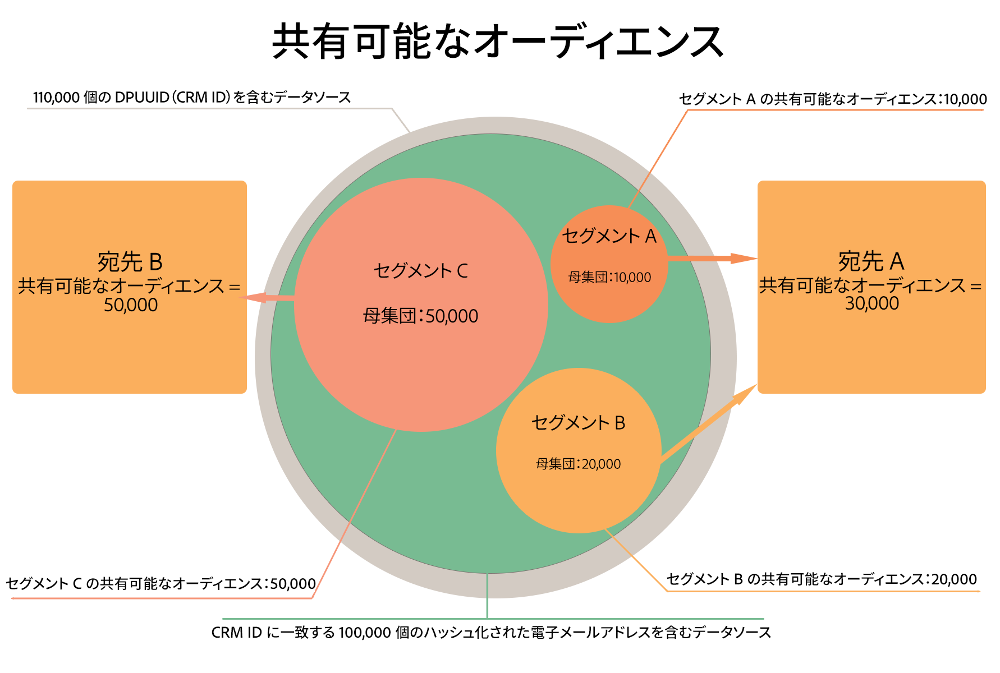

# 共有可能なオーディエンス {#shareable-audiences}

>[!IMPORTANT]
>この記事には、この機能の設定と使用方法を説明する製品ドキュメントが含まれています。法的なアドバイスは何も含まれません。法律に関するガイダンスについては、御社の顧問弁護士にアドバイスを求めてください。

[!DNL People-Based Destinations] は、Audience Manager に、[!DNL Shareable Audiences] の概念を導入します。この指標は、Audience Manager が宛先プラットフォームと共有できる、ハッシュ化された電子メールの数について理解するのに役立ちます。

[!DNL Shareable Audiences] は、[!DNL People-Based Destinations] のコンテキストでオーディエンスデータを解釈するのに役立つ指標です。この指標は、[!UICONTROL Destinations] ページおよび [!UICONTROL Segment] ページ内で確認できます。

## Segment Shareable Audiences {#segment-shareable-audiences}

セグメントページの [!DNL Segment Shareable Audience] 指標は、[DPUUID](../../reference/ids-in-aam.md) が一致し、特定のルックバック期間の定義済みセグメントに適合し、プロファイル結合ルールが適用され、Audience Manager が宛先プラットフォームと共有できるデータソースのハッシュ化された電子メールアドレスの数を示します。

この指標のルックバック期間は 1 日です。これにより、特定の宛先におけるセグメントのオーディエンスリーチを把握できます。

## Destination Shareable Audience {#destination-shareable-audience}

People-Based Destinations ページの [!DNL Destination Shareable Audience] 指標は、[DPUUID](../../reference/ids-in-aam.md) が一致するデータソースのハッシュ化された電子メールアドレスの合計数を示します。Audience Manager は、その DPUUID を、その宛先にマッピングされているすべてのセグメントの宛先プラットフォームと共有できます。

この指標のルックバック期間は全期間です。これにより、ハッシュ化された電子メールアドレスデータソースからリーチできる、オーディエンスの規模を把握するのに役立ちます。

## 例

Audience Manager のお客様には、110,000 の [DPUUID](../../reference/ids-in-aam.md) （CRM ID）を含むデータソースがあります。これらは、100,000 個のハッシュ化された電子メールアドレスを Audience Manager に取り込み、複数のユーザーベースの宛先で使用し、100,000 個のハッシュ化された電子メールアドレスの ID を CRM ID と同期します。顧客は [!DNL All Cross-Device Profiles] 結合ルールを使用して、次の 3 つのオーディエンスセグメントを作成できます。

* セグメント A（訪問者数 10,000、宛先 A にマッピング済み）
* セグメント B（訪問者数 20,000、宛先 A にマッピング済み）
* セグメント B（訪問者数 50,000、宛先 B にマッピング済み）

このシナリオでは、以下の手順に従います。

* セグメント A の Shareable Audience = 10,000
* セグメント B の Shareable Audience = 20,000
* セグメント C の Shareable Audience = 50,000
* 宛先 A の Shareable Audience = セグメント A の Shareable Audience + セグメント B の Shareable Audience =30,000
* 宛先 B の Shareable Audience = セグメント C の Shareable Audience = 50,000。

>[!NOTE]
>
>上記の例では、3 つのセグメントのハッシュ化された電子メールアドレス 80,000 個すべてが、宛先プラットフォームの既存のアカウントと一致しているというわけではありません。Audience Manager が 3 つのセグメントのハッシュ化された識別子を、それぞれの宛先に送信しているということのみを示しています。オーディエンスセグメントをユーザーベースの宛先に送信する際は、パートナー側でオーディエンスの照合がおこなわれます。宛先 A には、一致するユーザーアカウントが最大 30,000 個あります。宛先 B には 50,000 個のユーザーアカウントがありますが、マッチ率は保証されません。アドビは、パートナー固有の指標にはアクセスできません。マッチ率における People-Based Destinations の表示設定関するよく寄せられる質問については、「[マッチ率](../../faq/faq-people-based-destinations.md#match-rates)」を参照してください。
