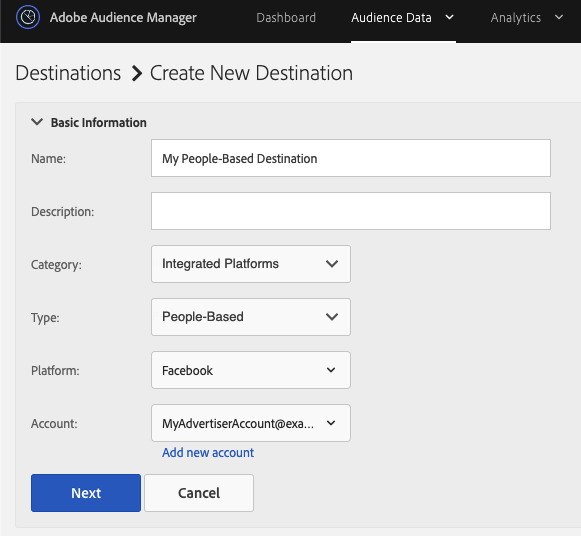

# ワークフローC — オフラインデータと組み合わされた認証済みアクティビティに基づくパーソナライゼーション {#workflow-c}

このページには、認証済みユーザーがオーディエンスセグメントを作成し、これらのオーディエンスセグメントをに送信するためのリアルタイムの行動データとオフラインデータを組み合わせる手順のガイダンスが含まれていま [!DNL CRM][!DNL People-Based Destinations]す。

## 手順1 — データソースの設定 {#configure-data-source-settings}

DPUUIDが小文字のハッシ [ュ化された電子メールアドレスであるかどうかに応じて](../../reference/ids-in-aam.md) 、ハッシュ化された電子メールアドレスを格納するデータソースを設定する必要が生じる場合があります。

 

**シナリオ1:dpuuidは既に小[文字で](../../reference/ids-in-aam.md)、ハッシュ化された電子メールアドレスです。**

この場合は、手順5 — 人物ベースのプ [ラットフォーム認証の設定に進みます](#configure-authentication)。

 

**シナリオ2:dpuuidは小文[字ではなく](../../reference/ids-in-aam.md)、ハッシュ化された電子メールアドレスです。**

この場合、ハッシュされた電子メールアドレスを保存する新しいデバイス間データソースを作成する必要があります。 手順は次のとおりです。

1. Audience Managerアカウントにログインし、-&gt;に移動し **[!UICONTROL Audience Data]** て、をク **[!UICONTROL Data Sources]**&#x200B;リックします **[!UICONTROL Add New]**。
1. 新しいデー **[!UICONTROL Name]** タソー **[!UICONTROL Description]** スの「および」を入力します。
1. ドロップダウ **[!UICONTROL ID Type]** ンメニューで、を選択しま **[!UICONTROL Cross Device]**&#x200B;す。
1. セクション **[!UICONTROL Data Source Settings]** で、との両方のオプション **[!UICONTROL Inbound]** を選 **[!UICONTROL Outbound]** 択し、このオプションを有効に **[!UICONTROL Share associated cross-device IDs in people-based destinations]** します。
1. ドロップダウンメニューを使用して、このデータソ **[!UICONTROL Emails(SHA256, lowercased)]** ースのラベルを選択します。
   >[!IMPORTANT]
   >
   >このオプションは、特定のアルゴリズムでハッシュ化されたデータを含むデータソースとしてのみラベル付けします。 Audience Managerでは、この手順ではデータをハッシュ化しません。 このデータソースに保存する予定の電子メールアドレスが、アルゴリズムで既にハッシュ化されていることを確認し [!DNL SHA256] ます。 そうしないと、それを使用できなくなります [!DNL People-Based Destinations]。

   

   >[!NOTE]
   >
   > オフラ [インデータをAudience Managerに取り込んで人ベースの宛先にする方法に関するよくある質問については、「データオンボーディング](people-based-destinations-prerequisites.md#data-onboarding) 」を参照してください。

## 手順2 — 宣言済みIDを使用して、リアルタイムHTTP呼び出しを使用してハッシュ化された電子メールアドレスにDPUUIDを一致させる {#match-email-addresses}

認証済みユーザーにルールベースの特性の資格を与えるには、宣言済みIDを使用して特性資格を送信する [必要があります](../declared-ids.md)。

### 例

次の2つのデータソースを作成したとします。

| データソースID | データソースのコンテンツ |
| -------------- | -------------------------- |
| 999999 | 既存のDPUUID(CRM ID) |
| 987654 | ハッシュ化された電子メールアドレス |

 

次に、テーブル内の特性に対して、以下のCRM IDを修飾する必要があります。

| DPUUID(CRM ID) | 電子メールアドレス | ハッシュ化された電子メールアドレス | 特性 |
| -------------------------------------- | --------------------- | ---------------------------------------------------------------- | ------------- |
| 68079982765673198504052656074456196039 | `johndoe@example.com` | 55e79200c1635b37ad31a378c39feb12f120f116625093a19bc32fff15041149 | location = US |

 

宣言済みIDは次の構文に従う必要があります。

`https://yourDomain.demdex.net/event?d_cid_ic=HashedEmailDataSourceIntegrationCode%01myHashedEmail&d_cid_ic=CRMDataSourceIntegrationCode%01myCRMID&key=value`

 

上の例では、宣言済みID呼び出しは次のようになります。

`https://yourDomain.demdex.net/event?d_cid_ic=MyHashedEmailDataSource%0155e79200c1635b37ad31a378c39feb12f120f116625093a19bc32fff15041149&d_cid_ic=MyCRMDataSource%0168079982765673198504052656074456196039&location=US`

## 手順3 — セグメント用のプロファイル結合ルールを作成する {#create-profile-merge-rule-segmentation}

次の手順では、送信するオーディエンスセグメントを作成するのに役立つ新しい結合ルールを作成しま [!DNL People-Based Destinations]す。

>[!IMPORTANT]
>
>またはオプションを使用してルールが既に定義されてい **[!UICONTROL Current Authenticated Profiles]** る場合は、手 **[!UICONTROL Last Authenticated Profiles]** 順4 — オーディエンスセグメント [の作成に進むことができます](#create-audience-segments)。

1. Audience Managerアカウントにログインし、-&gt;に移 **[!UICONTROL Audience Data]** 動します **[!UICONTROL Profile Merge Rules]**。
2. 「**[!UICONTROL Add New Rule]**」をクリックします。
3. プロファイル結合ルールとを入 **[!UICONTROL Name]** 力しま **[!UICONTROL Description]**&#x200B;す。
4. セクション **[!UICONTROL Profile Merge Rule Setup]** で、リストからル **[!UICONTROL All Cross-Device Profiles]** ールを選択し **[!UICONTROL Cross-Device Options]** ます。
5. リスト **[!UICONTROL Cross-Device Profile Options]** で、セグメントを実行するデータソースを選択します。 既存のDPUUIDを含むデータソースを指定します。
   

## 手順4 — オーディエンスセグメントを作成する {#create-audience-segments}

新しいセグメントを作成するには、セグメントビル [ダーを使用しま](../segments/segment-builder.md)す。 送信先の既存のオーディエンスセグメントがある場合は、手順5 [!DNL People-Based Destinations]— 人物ベースのプ [ラットフォーム認証の設定に進みます](#configure-authentication)。

## 手順5 — 人ベースのプラットフォーム認証の設定 {#configure-authentication}

1. Audience Managerアカウントにログインし、/に移動し **[!UICONTROL Administration]** ます **[!UICONTROL Integrated Accounts]**。 以前にソーシャルプラットフォームとの統合を設定した場合は、このページにその統合が表示されます。 それ以外の場合、ページは空です。
   
2. 「**[!UICONTROL Add Account]**」をクリックします。
3. ドロップダウ **[!UICONTROL People-Based Platform]** ンメニューを使用して、統合を設定するプラットフォームを選択します。
   
4. クリックす **[!UICONTROL Confirm]** ると、選択したプラットフォームの認証ページにリダイレクトされます。
5. ソーシャルプラットフォームアカウントに対して認証が済むと、Audience Managerにリダイレクトされ、関連する広告主アカウントが表示されます。 使用する広告主アカウントを選択し、をクリックしま **[!UICONTROL Confirm]**&#x200B;す。
6. Audience Managerでは、ページの上部に、アカウントが正常に追加されたかどうかを知らせる通知が表示されます。 また、この通知を使用して、ソーシャルプラットフォーム認証の期限が切れる前に通知を受信する連絡先の電子メールアドレスを追加することもできます。

>[!IMPORTANT]
>
>Udience Managerは、一定時間が経過すると期限切れになる認証トークンを使用して、ソーシャルプラットフォームとの統合を処理します。 期限切れのトークンを更新する方法について詳しくは、「認証トークンの更新」を参照してください。

## 手順6 — 人ベースの宛先の作成 {#create-destination}

1. Audience Managerアカウントにログインし、/に移動して、 **[!UICONTROL Audience Data]** をクリ **[!UICONTROL Destinations]**&#x200B;ックします **[!UICONTROL Create Destination]**。
1. このセクシ **[!UICONTROL Basic Information]** ョンで、新しいデ **[!UICONTROL Name]** ータソー **[!UICONTROL Description]** スのANDを入力し、次の設定を使用します。
   * **[!UICONTROL Category]**:統合プラットフォーム
   * **[!UICONTROL Type]**:人ベース、
   * **[!UICONTROL Platform]**:オーディエンスセグメントの送信先の人ベースのプラットフォームを選択します。
   * **[!UICONTROL Account]**:選択したプラットフォームに関連付ける広告主アカウントを選択します。
      
1. 「**[!UICONTROL Next]**」をクリックします。
1. この宛先 **[!UICONTROL Data Export Labels]** に設定する対象を選択します。
1. セクション **[!UICONTROL Configuration]** で、ハッシュ化されたデータソースを含むデータソースを選択します。
1. セクション **[!UICONTROL Segment Mappings]** で、この宛先に送信するセグメントを選択します。 これは、手順4の「オーディエンスセグメントを作成」 [で作成したセグメントです](#create-audience-segments)。
1. 宛先を保存します。
