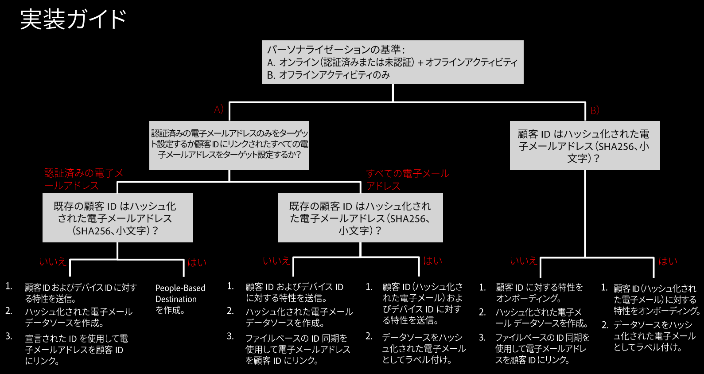

# 実装ガイダンス {#implementation-guidance}

>[!IMPORTANT]
>この記事には、この機能の設定と使用方法を説明する製品ドキュメントが含まれています。法的なアドバイスは何も含まれません。法律に関するガイダンスについては、御社の顧問弁護士にアドバイスを求めてください。

[!DNL People-Based Destinations] では、顧客データの構造に応じて、複数の実装戦略を提供します。この記事では、シナリオに応じて、[!DNL People-Based Destinations] で従う必要のある実装手順の概要について説明します。

## 概要 {#overview}

[!DNL People-Based Destinations] の設定では、Audience Manager に既に存在する顧客データの種類や、実行するオーディエンスターゲティングの種類に応じて、Audience Manager の複数のセクションを使用します。

>[!IMPORTANT]
> [!DNL People-Based Destinations] を設定する前に、必ずこの記事を注意深く読んでください。このガイドを読んだ後、[!DNL People-Based Destinations] で有効にするシナリオについて明確に理解する必要があります。

[!DNL People-Based Destinations] を使用する前に、実装に関する 6 つの側面を明確にしておく必要があります。この記事では、現在の設定を把握し、シナリオの実装手順を正確に進めるのに役立ちます。

## 1. 使用例 {#defining-your-use-case}

[!DNL People-Based Destinations] の実装を始める前に、この機能を使用する使用例を明確に定義する必要があります。[!DNL People-Based Destinations] を使用し、オーディエンスアクティビティに基づいて、2 つの方法でオーディエンスのターゲット設定をおこなうことができます。

**A）オンラインとオフラインのユーザーアクティビティを組み合わせ、それに基づいてオーディエンスのターゲティングをおこなう**。このシナリオでは、Audience Manager の既存のオーディエンスデータを内部 [!DNL CRM] システムのデータと組み合わせ、結果として得られたオーディエンスセグメントを [!DNL People-Based Destinations] に送信します。以下に、このシナリオの例を示します。

あなたが勤める航空会社には、異なる顧客階層（ブロンズ、シルバー、ゴールド）があり、ソーシャルプラットフォームを通じてパーソナライズされたオファーを各層に提供したいと考えています。Audience Manager を使用して、Web サイトの顧客アクティビティを分析します。ただし、すべての顧客が航空会社のモバイルアプリを使用するわけではなく、会社の Web サイトにログインすらしていない顧客もいます。顧客データは、主にメンバーシップ ID と電子メールアドレスに限定されています。

ソーシャルメディアや類似のユーザーベースのチャネルをまたいでターゲットを絞るには、[ハッシュ化された電子メールアドレス](people-based-destinations-prerequisites.md)を Audience Manager に取り込んで、それらを既存のオンラインアクティビティの特性と組み合わせ、新しいオーディエンスセグメントを構築できます。次に、これらのセグメントを使用、[!DNL People-Based Destinations] を通じてオーディエンスをターゲティングできます。

**B）オフラインユーザーアクティビティのみに基づいてオーディエンスのターゲティングをおこなう**。このシナリオでは、[!DNL CRM] システムには顧客の電子メールアドレスやその他の顧客属性が含まれていますが、顧客はお客様の Web サイトでインタラクションをおこなわないので、Audience Manager には顧客アクティビティはありません。以下に、このシナリオの例を示します。

あなたが勤める通信サービスプロバイダーは、社内 [!DNL CRM] に、電子メールアドレスや購入した通信プランなどの顧客データを保持します。ソーシャルプラットフォーム内の既存の顧客をターゲットにして、既存のサブスクリプションに基づいてアップグレードパッケージを提供する場合があります。これをおこなうには、ハッシュ化された顧客電子メールアドレスを Audience Manager に取り込み、既存の顧客サブスクリプションに基づいてセグメントを作成します。その後、これらのセグメントを [!DNL People-Based Destinations] に送信して、パーソナライズされたオファーを用いて顧客のターゲット設定をおこなうことができます。

## 2. ターゲット設定された電子メールアドレスのタイプを定義する {#define-target-email}

実装戦略を定義する 2 つ目の手順では、対象とする顧客電子メールアドレスの種類を決定します。

**A）認証済みの電子メールアドレスに基づいてオーディエンスのターゲティングをおこなう**。このシナリオでは、ユーザーは複数の電子メールアドレスに関連付けられた複数のアカウントを持ち、Web サイト上で認証される電子メールアドレスのみに基づいて、パーソナライズされたオファーを用いて、リアルタイムでターゲット設定をおこなうことができます。

**B）関連付けられたすべての電子メールアドレスに基づいてオーディエンスのターゲティングをおこなう**。このシナリオでは、ユーザーは複数の電子メールアドレスと関連付けられた複数のアカウントを持っており、お客様は、認証されたアクティビティに関係なく、関連するすべての電子メールアドレスをまたいでユーザーをターゲットに設定しようとしています。

## 3. 保有している顧客 ID（CRM ID）のタイプを特定する {#identify-customer-id}

[!DNL People-Based Destinations] でオーディエンスのターゲティングをおこなうには、顧客電子メールアドレスの [SHA256 ハッシュ](people-based-destinations-prerequisites.md) バージョンが必要です。既存の Audience Manager 設定に応じて、次の 2 つのシナリオのいずれかになります。

**A）Audience Manager の顧客 ID（[DPUUID](../../reference/ids-in-aam.md)）が、ハッシュ化された小文字の電子メールアドレスになっている場合**。このシナリオでは、これらの既存の ID を使用して、[!DNL People-Based Destinations] でオーディエンスのターゲット設定をおこないます。

**B）Audience Manager の顧客 ID（[DPUUID](../../reference/ids-in-aam.md)）が、ハッシュ化された小文字の電子メールアドレスでない場合**。このシナリオでは、既存の顧客 ID を [!DNL People-Based Destinations] に送信することはできません。[!DNL People-Based Destinations] を使用するには、既存の顧客 ID と、ハッシュ化された小文字バージョンの顧客電子メールアドレスで ID 同期を実行する必要があります。これは、[ファイルベースの ID 同期](../../integration/sending-audience-data/batch-data-transfer-explained/id-sync-file-based.md)を使用するか、[宣言された ID](../declared-ids.md) を使用して実行します。

## 4. 特性認定 {#trait-qualification}

[!DNL People-Based Destinations] で正確にオーディエンスのターゲットを絞るには、実行するオーディエンスのターゲット設定のタイプに応じて、ルールベースの特性またはオンボード特性のいずれかに適合している必要があります。

**A）ルールベースの特性に対し、リアルタイムで顧客 ID とデバイス ID の適合をおこなう**。このオプションは、「[1.ユースケースの定義](people-based-destinations-workflow.md#defining-your-use-case)」のユースケース Bに適用されます。オンラインとオフラインのアクティビティに基づいてオーディエンスをターゲット設定する予定がある場合は、[ルールベースの特性](../traits/trait-and-segment-qualification-reference.md)について、既にオーディエンスを絞り込んでいる可能性が高くなります。

**B）受信データファイルを介して、顧客 ID に対するインサイトのオンボーディングをおこなう**。このオプションは、「[1.ユースケースの定義](people-based-destinations-workflow.md#defining-your-use-case)」のユースケース Bに適用されます。純粋なオフラインアクティビティに基づいてオーディエンスをターゲット設定する場合、[受信データファイル](../../integration/sending-audience-data/batch-data-transfer-explained/inbound-file-contents.md)を通じてオンボードされた特性の顧客 ID を認定する必要があります。

## 5. データソースを作成およびラベル付けし、ハッシュ化された電子メールアドレスのオンボーディングをおこなう {#create-label-data-sources}

Audience Manager にある顧客 ID のタイプに応じて（「[3.保有している顧客 ID（CRM ID）のタイプを特定する](people-based-destinations-workflow.md#identify-customer-id)」を参照）、次のいずれかのシナリオから、適したものを選択します。

**A）既存のデータソースにラベルを付ける**。このオプションは、Audience Manager の顧客 ID（[DPUUID](../../reference/ids-in-aam.md)）がハッシュ化された小文字の電子メールアドレスの場合に適用されます。この場合は、[!DNL PII] データソースとして ID を保存するデータソースにラベルを付ける必要があります。データソースの設定について詳しくは、「[データソースの設定](../datasources-list-and-settings.md)」を参照してください。「Cannot be tied to personally identifiable information」オプションのチェックがオフになっていることを確認する必要があります。

**B）新しいデータソースを作成する**。このオプションは、Audience Manager の顧客 ID（[DPUUID](../../reference/ids-in-aam.md)）がハッシュ化された小文字の電子メールアドレスでない場合に適用されます。この場合、新しいクロスデバイスデータソースを作成し、ハッシュ化された電子メールアドレスをそのデータに対してオンボーディングする必要があります。これには次の 2 つの方法を使用できます。

* ファイルベースの ID 同期を使用する。ID 同期ファイルの表示形式について詳しくは、「[ID 同期ファイルの名前とコンテンツ要件](../../integration/sending-audience-data/batch-data-transfer-explained/id-sync-file-based.md)」を参照してください。この方法を使用すると、[!DNL CRM] データベースから、すべてのハッシュ化された電子メールアドレスをターゲットにすることができます。
* [宣言された ID](../declared-ids.md) を使用して、認証済みの顧客 ID を渡す際にハッシュ化された電子メールアドレスを宣言します。この方法を使用すると、Audience Manager はお客様に代わって、オンラインで認証されたユーザーの、ハッシュされた電子メールアドレスのみをターゲットに設定します。ユーザーベースのチャネルでターゲット設定される電子メールアドレスは、宣言されている ID イベント呼び出しの電子メールアドレスのみです。顧客 ID に関連付けられているその他の電子メールアドレスは、リアルタイムではアクティブ化されません。

## 6. セグメント化のプロファイル結合ルールを作成する {#use-profile-merge-rules}

ユースケースに応じて（[1.ユースケースの定義](people-based-destinations-workflow.md#defining-your-use-case)を参照）、2 つの方法でセグメント化に [!DNL Profile Merge Rules] を使用できます。

**A）既存の [!DNL Profile Merge Rules]** を使用する。このオプションは、最初のユースケース（オンラインとオフラインのユーザーアクティビティの組み合わせに基づいてオーディエンスのターゲティングをおこなう）に適用されます。このシナリオでは、Audience Manager に既存の顧客アクティビティがあり、セグメント化で使用したプロファイル結合ルールの 1 つ以上を定義済みです。この場合、新しく [!DNL Profile Merge Rules] を作成する必要はありません。

**B）新しい [!DNL All Cross-Device Profiles] 結合ルールを作成する**。このオプションは、2 番目のユースケース（オフラインのユーザーアクティビティのみに基づいてオーディエンスのターゲティングをおこなう）に適用されます。このシナリオでは、オフラインの顧客データを [!DNL CRM] から Audience Manager に取り込み、そのデータからセグメントを作成します。これをおこなうため、[!DNL People-Based Destinations] では、4 つめのプロファイル結合ルールとなる **[!DNL All Cross-Device Profiles]** を導入します。このルールは、純粋なオフラインデータをセグメント化するときに使用する必要があります。
