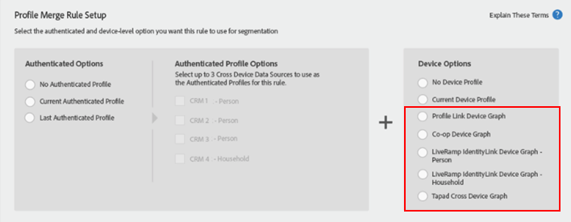

# デバイスグラフを伴うプロファイル結合ルールの重要な考慮事項 {#important-considerations-for-profile-merge-rules-with-device-graphs}

リアルタイムのセグメント母集団がほとんどあるいはまったくないセグメントには、[!UICONTROL Device Graph]を伴う[!UICONTROL Profile Merge Rules]を使用しないでください。

>[!IMPORTANT]
>
>[!UICONTROL Profile Merge Rule]の設定が間違っている場合、バッチ保存先にエクスポートされるセグメント母集団は予想より大幅に小さい可能性があります。

[デバイスグラフを伴うプロファイル結合ルール](../../features/profile-merge-rules/merge-rule-targeting-options.md#device-graph-options)を使用するセグメントは、セグメント作成後に [Audience Manager のエッジサーバー](../../reference/system-components/components-edge.md)でリアルタイムに認識されたデバイスに対してのみ評価されます。

以下のように、[!UICONTROL Device Graph]を伴う[!UICONTROL Profile Merge Rule]には、次のデバイスオプションの 1 つが選択されます。

セグメントの対象としてリアルタイムに認定されるデバイスは、[セグメントのリアルタイム母集団](../../features/segments/segment-builder-data.md#segment-populations)によって測定されます。

リアルタイムのセグメント母集団が小さい場合は、セグメントの対象として認定されるデバイスのうち、リアルタイムに認識されているデバイスがきわめて少ないことになります。F最高のパフォーマンスを得るには、リアルタイムの母集団がほとんどあるいはまったくないセグメントでは、次の図に示すように、*[!UICONTROL Current Device]*&#x200B;を評価するように設定した[!UICONTROL Profile Merge Rule]を使用してください。

*[!UICONTROL Current Device]* を評価するように[!UICONTROL Profile Merge Rule]を設定すると、（リアルタイムに認識されるデバイスだけでなく）すべてのデバイスがセグメントの対象として評価されます。セグメントの対象として認定されたすべてのデバイスは、以下に示すように、合計セグメント母集団で定義されます。

