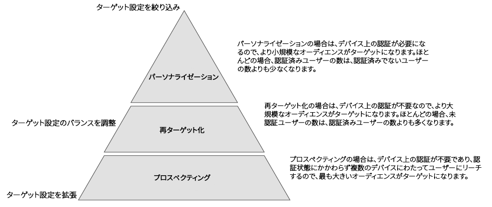

# 外部デバイスグラフのユースケース {#external-device-graph-use-cases}

外部デバイスグラフを使用した、不明なユーザーのプロスペクティング、リターゲティング、パーソナライゼーションの推奨事項とユースケースです。外部デバイスグラフとは、Audience Manager と切り離されているデバイスグラフのことです。これには、[!DNL Adobe Experience Cloud Device Co-op] や、Audience Manager と統合されている他の決定論的または確率的サードパーティデバイスグラフプロバイダーなどが含まれます。

## 推奨事項 {#recommendations}

次のようなキャンペーン向けに、[!DNL Experience Cloud Device Co-op] やサードパーティデバイスグラフオプションを検討します。

* すべてのデジタル資産で低レベルの認証をおこなっている。多数の認証済みユーザーがいる場合、[プロファイルリンクデバイスグラフオプション](../../features/profile-merge-rules/merge-rule-definitions.md#device-options)を使用します。
* 大規模なオーディエンスをターゲットにする。[!DNL Experience Cloud Device Co-op] やサードパーティデバイスグラフには、認証済みデータと未認証データが含まれています。
* 認証済みまたは未認証の訪問者を個人レベルまたは団体レベルでセグメント化する。

## プロスペクティング／ブランディングのユースケース {#prospecting-branding-use-cases}

ブランディングキャンペーンは、できるだけ多くの人々にリーチすることを目的としています。セグメント絞り込みにほとんど制限はありません。しかし、これらのキャンペーンは、コンテンツを何度見てもコンバージョンに至らない人々を絶えずターゲットにしているので、予算とインプレッションを浪費するおそれがあります。[!UICONTROL Profile Merge] やサードパーティオプションを使用する[!DNL Device Co-op]ルールが、効率的なブランディングキャンペーンの作成に役に立ちます。例えば、これらの不明なユーザーを設定済みの頻度キャップの複数のデバイスで確認した後で、「マーケット外」セグメントに追加できます。

<table id="table_00F6EED172574E80A38CADA8A92A23B1"> 
 <thead> 
  <tr> 
   <th colname="col1" class="entry"> ユースケース </th> 
   <th colname="col2" class="entry"> 説明 </th> 
  </tr> 
 </thead>
 <tbody> 
  <tr> 
   <td colname="col1"> 
 <b>条件</b> 
 </td> 
   <td colname="col2">このユースケースでは次の条件を前提にしています。 
 
     <ul id="ul_F5CA7EE525774F7EBA5FBB5F94E4EDC8"> 
      <li id="li_81AE304924724146A24FAB5B6533AD8E">特定の広告キャンペーンの匿名ユーザーに最大 10 件のインプレッションを提供する。 </li> 
      <li id="li_E371F989735245B0B82433DE240D56D0">ユーザーには複数のデバイスがあり、サイトへの認証が完了している場合も完了していない場合もある。 </li> 
      <li id="li_9231ABE15CA249E6B79D8BF0E511FD33">匿名ユーザーが、現在のデバイスおよび外部デバイスグラフでリンクされている最大 3 台までのデバイスで、認証されていない状態で閲覧しながら合計 10 回広告を見る。 </li> 
      <li id="li_8C276C07019C49EFA3A0D0D54CF73C31">匿名ユーザーが 10 件のインプレッションを見た後で、これらのユーザーを適格とする Audience Manager セグメントを定義した。 </li> 
     </ul> 
 </td> 
  </tr> 
  <tr> 
   <td colname="col1"> 
 <b>結果</b> 
 </td> 
   <td colname="col2"> 
これらの条件を前提として、Audience Manager は、以下をおこないます。 
 
 
     <ul id="ul_8E988B1005324526BC6DC6637BBACCFB"> 
      <li id="li_C9DD546754914BACB8F4C92C7D4ED70E">現在のデバイスおよび外部デバイスグラフでリンクされている 3 台のデバイスから収集した認証されていない匿名のアクティビティ（各デバイスからの広告インプレッション）を結合します。 </li> 
      <li id="li_FB55CB9116074525BA30FF062D1136AE">認証されていないユーザーを評価し、外部デバイスグラフでリンクされている 3 台のデバイスすべてと現在のデバイスにわたる匿名アクティビティの組み合わせに基づいてセグメントに絞り込みます。 </li> 
      <li id="li_B28EB32F718145A7ABBDAC0AF75E2AFC">セグメントを任意のリアルタイムの宛先に送信して、現在のデバイスおよび外部デバイスグラフでリンクされている 3 台のデバイスすべてで抑制セグメントとして使用します。 </li> 
     </ul> 
 </td> 
  </tr> 
 </tbody> 
</table>

## リターゲティングまたはサイトパーソナライゼーションのユースケース {#retargeting-use-case}

この戦略は、認証されていないまたは不明なユーザーをサイトに呼び戻したり、それらのユーザーがサイトにいる間に閲覧エクスペリエンスをパーソナライズしたりすることを目的としています。

<table id="table_0EE2052AA3E744B3B76036FC06B5A453"> 
 <thead> 
  <tr> 
   <th colname="col1" class="entry"> ユースケース </th> 
   <th colname="col2" class="entry"> 説明 </th> 
  </tr> 
 </thead>
 <tbody> 
  <tr> 
   <td colname="col1"> 
 <b>条件</b> 
 </td> 
   <td colname="col2">このユースケースでは次の条件を前提にしています。 
 
     <ul id="ul_FD0B869B4AF3453FAEC9BA3A45ABF039"> 
      <li id="li_8E30BAED42E94AB3B81FCB1C7464E5FC">認証されていない状態のまま匿名ユーザーがサイトでおこなうアクティビティに基づいて、パーソナライズしたオンサイト／オフサイトのエクスペリエンスを匿名ユーザーに提供する。 </li> 
      <li id="li_3DBE53BA94324F1BA1C52A37AD4E426C">ユーザーには複数のデバイスがあり、サイトへの認証が完了している場合も完了していない場合もある。 </li> 
      <li id="li_F867AFBDC1A54CD6A68AB0EC196E27C9">現在のデバイスおよび外部デバイスグラフでリンクされている最大 3 台までのデバイスで、認証されていない状態で閲覧しながらユーザーがサイトの複数のページを見る。 </li> 
      <li id="li_7E35D77949CE4E69BD51655AA4C40BEE">認証されていない状態で閲覧しながらユーザーがサイトの複数のページを見た後で、これらのユーザーを適格とする Audience Manager セグメントを定義した。 </li> 
     </ul> 
 </td> 
  </tr> 
  <tr> 
   <td colname="col1"> 
 <b>結果</b> 
 </td> 
   <td colname="col2"> 
これらの条件を前提として、Audience Manager は、以下をおこないます。 
 
 
     <ul id="ul_301339426B0643B295DC5B17E1939CFB"> 
      <li id="li_7E8BC3B179804F4A929497DE81E76911">現在のデバイスおよび外部デバイスグラフでリンクされている 3 台のデバイスから収集した認証されていない匿名のアクティビティ（各デバイスからの複数のページビュー）を結合します。 </li> 
      <li id="li_803EFD58AA124A5BBC8279C4DC695544">認証されていないユーザーを評価し、外部デバイスグラフでリンクされている 3 台のデバイスすべてと現在のデバイスにわたる匿名アクティビティの組み合わせに基づいてセグメントに絞り込みます。 </li> 
      <li id="li_98D749268CC5456CBC9CF3BF5EB91BA8">セグメントを任意のリアルタイムの宛先に送信して、現在のデバイスおよび外部デバイスグラフでリンクされている 3 台のデバイスすべてで、パーソナライズしたオンサイト／オフサイトのエクスペリエンスを提供します。 </li>
     </ul> 
 </td>
  </tr>
 </tbody>
</table>

## 外部デバイスグラフユースケースのプロファイル結合ルールオプション {#profile-merge}

これらのユースケースの結合ルールオプションは、次に示す使用可能なオプションのようになります。[!UICONTROL Authenticated Profile] オプションは、「**[!UICONTROL Current Authenticated Profile]**」または「**[!UICONTROL Last Authenticated Profile]**」を選択した場合にのみ使用可能なので、非アクティブになっています。[!UICONTROL Device Options]は、使用するまたは使用できるデバイスグラフ設定のタイプに応じて変わります。

これらのデバイスグラフ処理の動作について詳しくは、[Audience Manager と外部デバイスグラフ](https://marketing.adobe.com/resources/help/en_US/aam/downloads/AAM_Device_Graphs.pdf)（PDF）をダウンロードしてください。

>[!MORE_LIKE_THIS]
>
>* [プロファイルリンクデバイスグラフのユースケース](../../features/profile-merge-rules/profile-link-use-case.md)
>* [プロファイル結合ルールの一般的なユースケース](../../features/profile-merge-rules/merge-rule-targeting-options.md)
>* [プロファイル結合ルール FAQ](../../faq/faq-profile-merge.md)

