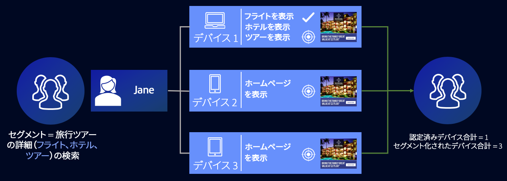
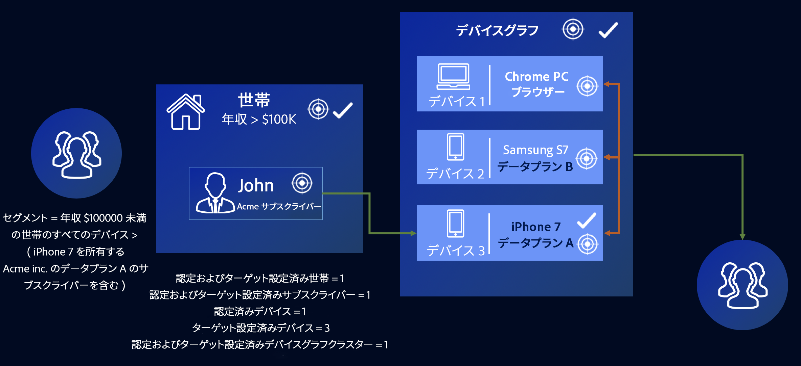

# 外部デバイスグラフのユースケース {#external-device-graph-use-cases}

外部デバイスグラフを使用した、不明なユーザーのプロスペクティング、リターゲティング、パーソナライゼーションの推奨事項とユースケースです。外部デバイスグラフとは、Audience Manager と切り離されているデバイスグラフのことです。これには、[!DNL Adobe Experience Cloud Device Co-op] や、Audience Manager と統合されている他の決定論的または確率的サードパーティデバイスグラフプロバイダーなどが含まれます。

## 推奨事項 {#recommendations}

次のようなキャンペーン向けに、[!DNL Experience Cloud Device Co-op] やサードパーティデバイスグラフオプションを検討します。

* すべてのデジタル資産で低レベルの認証をおこなっている。認証済みユ [!UICONTROL Profile Link Device Graph option] ーザーが多数ある場合は、を使用します。
* 大規模なオーディエンスをターゲットにする。[!DNL Experience Cloud Device Co-op] やサードパーティデバイスグラフには、認証済みデータと未認証データが含まれています。
* 認証済みまたは未認証の訪問者を個人レベルまたは団体レベルでセグメント化する。

<!-- 
## Prospecting/Branding Use Case {#prospecting-branding-use-cases}

A branding campaign is designed to reach as many people as possible. It places few limits on segment qualification. But, these campaigns can waste budget and impressions by constantly targeting people who see your content multiple times and don't convert. A [!UICONTROL Profile Merge] rule that uses the [!DNL Device Co-op] or third-party option can help you create an efficient branding campaign. For example, you can add these unknown users to a "not in-market" segment after seeing them across multiple devices for your set frequency cap.

<table id="table_00F6EED172574E80A38CADA8A92A23B1"> 
 <thead> 
  <tr> 
   <th colname="col1" class="entry"> Use Case </th> 
   <th colname="col2" class="entry"> Description </th> 
  </tr> 
 </thead>
 <tbody> 
  <tr> 
   <td colname="col1"> 
 <b>Conditions</b> 
 </td> 
   <td colname="col2">This use case assumes these conditions: 
 
     <ul id="ul_F5CA7EE525774F7EBA5FBB5F94E4EDC8"> 
      <li id="li_81AE304924724146A24FAB5B6533AD8E">You want to deliver a maximum of 10 impressions to an anonymous user for a specific ad campaign. </li> 
      <li id="li_E371F989735245B0B82433DE240D56D0">A user has 4 devices and may or may not have authenticated on your site. </li> 
      <li id="li_9231ABE15CA249E6B79D8BF0E511FD33">An anonymous user sees the ad a total of 10 times while browsing in an unauthenticated state on their current device and 3 devices linked to the current device by an external device graph. </li> 
      <li id="li_8C276C07019C49EFA3A0D0D54CF73C31">You have defined an  Audience Manager segment to qualify anonymous users after they have seen 10 impressions. </li> 
     </ul> 
 </td> 
  </tr> 
  <tr> 
   <td colname="col1"> 
 <b>Results</b> 
 </td> 
   <td colname="col2"> 
Given these conditions,  Audience Manager: 
 
 
     <ul id="ul_8E988B1005324526BC6DC6637BBACCFB"> 
      <li id="li_C9DD546754914BACB8F4C92C7D4ED70E">Merges the anonymous, unauthenticated activity collected from the current device and the 3 devices linked by the external device graph (the ad impressions from each device). </li> 
      <li id="li_FB55CB9116074525BA30FF062D1136AE">Evaluates the unauthenticated user for segment qualification based on a combination of anonymous activity across all 3 devices linked by the external device graph and the current device. </li> 
      <li id="li_B28EB32F718145A7ABBDAC0AF75E2AFC">Sends the segment to any real-time destination for use as a suppression segment on the current device and all 3 devices linked by the external device graph. </li> 
     </ul> 
 </td> 
  </tr> 
 </tbody> 
</table>

## Retargeting or Site Personalization Use Case {#retargeting-use-case}

These strategies are designed to bring an unauthenticated or unknown user back to your site or personalize their browsing experience while they're on-site.

<table id="table_0EE2052AA3E744B3B76036FC06B5A453"> 
 <thead> 
  <tr> 
   <th colname="col1" class="entry"> Use Case </th> 
   <th colname="col2" class="entry"> Description </th> 
  </tr> 
 </thead>
 <tbody> 
  <tr> 
   <td colname="col1"> 
 <b>Conditions</b> 
 </td> 
   <td colname="col2">This use case assumes these conditions: 
 
     <ul id="ul_FD0B869B4AF3453FAEC9BA3A45ABF039"> 
      <li id="li_8E30BAED42E94AB3B81FCB1C7464E5FC">You want to deliver a personalized on-site and/or off-site experience to an anonymous user based on their activity on your site while in an unauthenticated state. </li> 
      <li id="li_3DBE53BA94324F1BA1C52A37AD4E426C">A user has multiple devices and may or may not have authenticated to your site. </li> 
      <li id="li_F867AFBDC1A54CD6A68AB0EC196E27C9">A user views multiple pages on your site while browsing in an unauthenticated state on their current device and 3 other devices linked by an external device graph. </li> 
      <li id="li_7E35D77949CE4E69BD51655AA4C40BEE">You have defined an  Audience Manager segment to qualify users after they have viewed multiple pages on your site while browsing in an unauthenticated state.</li>
     </ul> 
 </td> 
  </tr> 
  <tr> 
   <td colname="col1"> 
 <b>Results</b> 
 </td> 
   <td colname="col2"> 
Given these conditions,  Audience Manager: 
 
 
     <ul id="ul_301339426B0643B295DC5B17E1939CFB"> 
      <li id="li_7E8BC3B179804F4A929497DE81E76911">Merges the anonymous, unauthenticated activity collected from the current devices and the 3 devices linked by the external device graph (the multiple page views from each device). </li> 
      <li id="li_803EFD58AA124A5BBC8279C4DC695544">Evaluates the unauthenticated user for segment qualification based on a combination of anonymous activity across all 3 devices linked by the external device graph and the current device. </li> 
      <li id="li_98D749268CC5456CBC9CF3BF5EB91BA8">Sends the segment to any real-time destination to deliver a personalized on-site and/or off-site experience across the current device and all 3 devices linked by the external device graph. </li>
     </ul> 
 </td>
  </tr>
 </tbody>
</table> -->

## デバイスのターゲット設定の拡張 {#audience-expansion}

この使用例は、などを使用して、アドレス可能なオーディエンスのサイズを、正確なデバイス間のパーソナライゼーションで拡張する方法を例 [!DNL Adobe Co-Op Device Graph] 示していま [!DNL External Device Graphs]す。

例えば、Janeが定期的に使用する3つのデバイスを所有し、旅行商品を検索しているとします。パソコン([!DNL Device 1])、スマートフォン([!DNL Device 2])、タブレット([!DNL Device 3])。 ジェーンさんはノートパソコンを使いながら、フライト、ホテル、ガイドツアーを探しました。 スマートフォンやタブレットを使っている間、彼女は旅行代理店のホームページだけを訪れた。

旅行代理店は [!UICONTROL No Cross-Device Profile] +ルールを使 [!UICONTROL Adobe Co-op Device Graph][!UICONTROL Adobe Co-op Device Graph]用して、3つのデバイスプロファイルをすべて結合できます。これは、これらのデバイスプロファイルが、

この例では、セグメントの資格を得るために必要な特性がすべて収集されていま [!DNL Device 1]す。 Audience Managerは、プロファイルの結合に参加したすべてのデバイスプロファイルを1つのセグメントに対して修飾するので、Janeの3つのデバイスプロファイルはすべてセグメント化されます。

このルールを通じて、デバイスグラフは、セグメントに適したデバイスプロファイルの数を1から3に拡張し、旅行代理店がジェーンが所有する3つのデバイスすべてに一貫したメッセージを配信できるようにしました。

## 高度なデバイス間ターゲット設定 {#advanced-graph-expansion}

この使用例は、認証された訪問者のターゲットを、外部デバイスグラフまたは+ルールを使用して、認証された訪問者のターゲットを [!DNL Adobe Co-Op Device Graph]拡張する方法を示 **[!UICONTROL Last Authenticated Profiles]** して **[!UICONTROL Adobe Co-Op Device Graph]** います。

次の例では、Acme Inc.社が、デバイスを使用する100.000ドル以上の収入を持つすべての世帯をターゲットにし [!DNL Acme Inc.] てい [!DNL Data Plan A]ると考えてい [!DNL iPhone 7] ます。

Johnは、Data Plan aのiPhone 7を使用して、Acme Inc.のWebサイトで認証を受けます。 同時に、Johnのクラスターには、定期的に使用 [!DNL Co-Op Device Graph] する2つの追加のデバイスが含まれています。パソコン([!DNL Device 1])とセカンダリスマートフォン( [!DNL Device 2] オン [!DNL Samsung S7] ) [!DNL Data Plan B]です。

+を使用すると、 **[!UICONTROL Last Authenticated Profiles]** Johnのデバ **[!UICONTROL Adobe Co-Op Device Graph]**&#x200B;イスグ [!DNL Acme Inc.] ラフクラスターから3つのデバイスすべてにパーソナライズされたメッセージを配信できます。セグメントに最初に該当するのは1つのデバイスだけです。

>[!MORE_LIKE_THIS]
>
>* [プロファイルリンクデバイスグラフのユースケース](profile-link-use-case.md)
>* [プロファイル結合ルールの一般的なユースケース](merge-rule-targeting-options.md)
>* [プロファイル結合ルール FAQ](faq-profile-merge.md)

