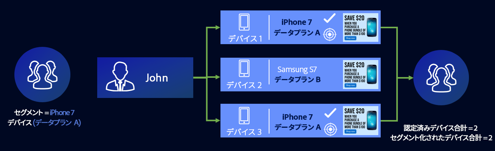
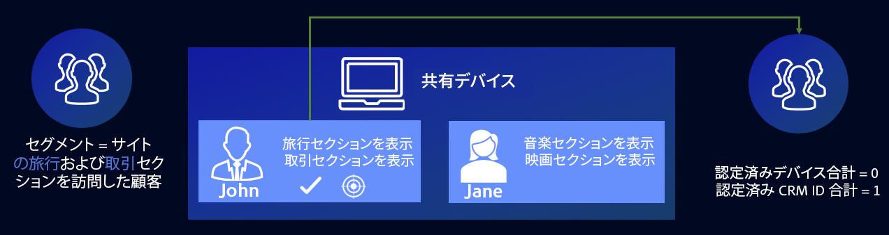
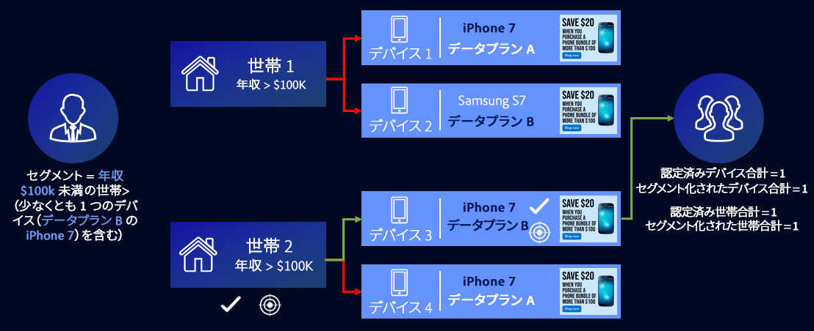

# プロファイル結合ルールの一般的なユースケース {#general-use-cases-for-profile-merge-rules}

[!UICONTROL Profile Merge Rules]オプションを使用すると、オーディエンスを広げることも、ビジネスのニーズや目標に基づいて特定のオーディエンスに的を絞ることもできます。これらの一般的なユースケースでは、使用可能なオプションを使用して個人、団体、クロスデバイスのターゲティングに対応する結合ルールを作成する方法を調べています。[!UICONTROL Profile Merge Rules] は、リアルタイムの宛先と一括での宛先で使用できます。

>[!TIP]
>
>これらの[!UICONTROL Merge Rule]設定の定義と説明については、[定義済みのプロファイルの結合ルールオプション](merge-rule-definitions.md)を参照してください。

## デバイスのターゲティング {#device-personalization}

このシナリオは、ユーザー認証を考慮せずに、デバイス ID（DSP、オンサイトパーソナライゼーションプラットフォーム、その他のデバイスベースのターゲティングプラットフォーム）をサポートするターゲティングプラットフォームを使用して、Audience Manager で定義したオーディエンスセグメントの単一のデバイスプロファイルを評価する場合に適用されます。

デバイスプロファイルのみをターゲットにするルールを作成する場合は、**[!UICONTROL Device Profile]** + **[!UICONTROL No Cross-Device Profile]** を選択します。

ジョンという人物ががスマートフォンを 3 つ台保有しているとします。そのうち 2 台は iPhone 7s（データプラン A ）で、1 台は Samsung（データプラン B）です。ジョンの携帯電話会社は 3 台のデバイスの認証状態を考慮せず、データプラン A で実行する iPhone 7 デバイスに対してのみ、データプランのアップグレードを提供したいと考えています。

**[!UICONTROL No Cross-Device Profile]** ルールと **[!UICONTROL Device Profile]** ルールを使用することで、[!DNL Device 1] と [!DNL Device 3] の両方が対象となりますが、デバイス 2 は無視されます。

## 共有デバイスのターゲティング {#target-shared-devices}

ジョンと妻のジェーンが同じノートパソコンを使ってオンラインストアにアクセスし、様々な商品を注文したとします。

ジョンは自分のアカウントを使用して旅行券や特価でのオファーを予約し、ジェーンも自分のアカウントで音楽や映画を購入します。

店舗のマーケティングチームは、**[!UICONTROL Current Authenticated Profiles]** ルールと **[!UICONTROL No Device Profile]** ルールを使用し、認証されたアクティビティのみに基づいて、特定のオファーでジョンとジェーンをターゲットに設定できます。

このルールを使用すると、Audience Manager は、デバイスプロファイルを完全に無視し、ジョンの CRM ID はセグメントに該当し、ジェーンの CRM ID は該当しません。

## オンライン／オフラインでのターゲティング {#device-household-targeting}

この使用例では、世帯 ID 管理をカバーしています。会社は、**[!UICONTROL Last Authenticated Profiles]** ルール と **[!UICONTROL Device Profile]** ルールを使用して、1 つのデバイスプロファイルを、1 つのデバイスプロファイルを、そのデバイスで最後に認証されたプロファイルと結合できます。

年収が 100.000 ドルを超える世帯で構成されるセグメントに、1 台以上のデバイス（[!DNL iPhone 7]、[!DNL Data Plan B]）が含まれているとします。2 つの世帯プロファイル（クロスデバイス対応プロファイル）があり、それぞれが 2 つの異なるデバイスプロファイルと結び付けられています。セグメントに適合するために必要な特性は、デバイスプロファイルとデバイスプロファイルをまたいで分散されます。

Audience Manager は、すべてのデバイスとクロスデバイスプロファイルのペアを結合して、結合された特性セットがセグメントに該当しているかどうかを確認します。Audience Manager は、結合に含まれるすべてのプロファイルを評価するので、デバイスプロファイルと世帯プロファイルの両方をセグメント化することができます。

デバイスと世帯プロファイルの間をリンクさせることで、Audience Manager は [!DNL Household 2] をセグメントに認定し、[!DNL Household 1] は除外することができます。[!DNL Household 2] からは、[!DNL Device 3] のみがセグメントに該当します。[!UICONTROL Profile Merge Rule] により、マーケターは個人のデバイス（[!DNL Device 3]）や幅広い世帯（[!DNL Household 2]）に一貫したマーケティングメッセージを配信できるようになりました。

## People-Based Destinations のターゲティング {#all-cross-device}

>[!IMPORTANT]
>
>この記事には、この機能の設定と使用方法を説明する製品ドキュメントが含まれています。法的なアドバイスは何も含まれません。法律に関するガイダンスについては、御社の顧問弁護士にアドバイスを求めてください。

このターゲティングシナリオは、[!DNL People-Based Destinations] アドオンを購入した顧客のみが使用できます。このルールを使用すると、マーケターは、独自の認証済みデータに基づいて顧客にリーチすることができます。

あるオンライン小売業者は、ソーシャルプラットフォームを通じて既存の顧客にリーチし、以前の注文に基づいてパーソナライズされたオファーを表示したいと願っています。[!UICONTROL People-Based Destinations] を使用すれば、ハッシュ化された電子メールアドレスを自分の [!DNL CRM] から Audience Manager に取り込み、オフラインデータからセグメントを構築し、ハッシュ化されている ID を使用して これらのセグメントを宣伝したいソーシャルプラットフォームに送信し、広告費用を最適化することができます。

このオプションの詳細については、「[People-Based Destinations](../destinations/people-based-destinations-overview.md)」を参照してください。

## デバイスグラフオプション {#device-graph-options}

[!UICONTROL Profile Merge]ルールの「[!UICONTROL device graph]」オプションの選択は、デジタルプロパティや事業目標に応じた条件によって異なります。ここで紹介する一般的なガイドラインは、どの種類のグラフをどのような場合に使用すればよいか判別するために便利です。これらのオプションを使用するには、[Adobe Experience Cloud Device Co-op](https://docs.adobe.com/content/help/ja-JP/device-co-op/using/home.html) メンバーであるか、外部デバイスグラフとの契約関係があることが必要です。以下の表は、デバイスグラフオプションをどのような場合に選択すればよいかを示しています。具体的なユースケースについては、[プロファイルリンクデバイスグラフのユースケース](profile-link-use-case.md)および[外部デバイスグラフのユースケース](external-graph-use-cases.md)を参照してください。

<table id="table_66D9152D4FF040A186003272D456625D"> 
 <thead> 
  <tr> 
   <th colname="col1" class="entry"> デバイスグラフタイプ </th> 
   <th colname="col2" class="entry"> 説明 </th> 
  </tr>
 </thead>
 <tbody> 
  <tr> 
   <td colname="col1"> 
プロファイルリンクデバイスグラフ 
 </td> 
   <td colname="col2"> 
プロファイルリンクオプションで作成されたプロファイル結合ルールは、次の場合に最適です。 
 
 
     <ul id="ul_FF44FA894BB2448887C8EDA9C8407EF9"> 
      <li id="li_E22505210C664FE6A9AA7C61244B36DA">高レベルなユーザー認証を導入しているデジタルプロパティ。 </li> 
      <li id="li_BE7112EE611E4DEB95B5C0A2852BFA97">集中的な低リーチのキャンペーン。プロファイルリンクデバイスグラフは、決定論的データについてのみ構築されます。このデバイスプロファイルのプールは、必ず未認証のユーザーとデバイスのプールより小さくなります。 </li> 
      <li id="li_5FD9E936A72A4EFE80E694FA2E08E385">ユーザーがセグメント化認定のため未認証状態でなければならない場合。 </li> 
     </ul> 
 </td> 
  </tr> 
  <tr> 
   <td colname="col1"> 
外部デバイスグラフオプション 
 </td> 
   <td colname="col2"> 
<a href="https://docs.adobe.com/content/help/ja-JP/device-co-op/using/about/overview.html" format="https" scope="external">Experience Cloud Device Co-op</a> や、Audience Manager と統合された外部デバイスグラフで作成されたプロファイル結合ルールは、次のものに最適です。 
 
 
     <ul id="ul_D76D773988604A619FA4A3BF37F910F0"> 
      <li id="li_969A0755A9E34CBEB2F7331C137B9A26">低レベルなユーザー認証を導入しているデジタルプロパティ。 </li> 
      <li id="li_AC78C8B4AD5340FFAC44FE851096C6A6">広範囲で高リーチのブランドキャンペーン。 </li> 
      <li id="li_14AEC54CE34440889A3A36324EC6F497">ユーザーがセグメント化認定のために未認証状態である必要がない場合。 </li> 
     </ul> 
 
 
ヒント：低レベルの認証を使用していて、デバイスグラフプロバイダーとは関係がない Experience Cloud ユーザーには、Device Co-op が最適です。 
 
 </td> 
  </tr> 
 </tbody> 
</table>

[!UICONTROL Profile Merge Rules] の使用例の概要については、以下のビデオをご覧ください。

>[!VIDEO](https://video.tv.adobe.com/v/28975/)

>[!MORELIKETHIS]
>
>* [プロファイルリンクデバイスグラフのユースケース](profile-link-use-case.md)
>* [ 外部デバイスグラフのユースケース](external-graph-use-cases.md)
>* [プロファイル結合ルール FAQ](../../faq/faq-profile-merge.md)

