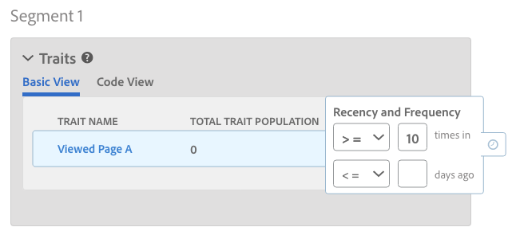

# プロファイル結合ルールとデバイスセグメント化解除プロセス {#profile-merge-rules-and-device-un-segmentation-processes}

セグメント化解除とは、デバイスプロファイルを不適格としてセグメントから削除するプロセスのことです。Your ability to remove a device profile from a segment depends on the device option used to create a [!UICONTROL Profile Merge Rule].

## 使用可能なデバイスオプション {#device-options}

As a reminder, the [!UICONTROL Device Options] are available in the [!UICONTROL Profile Merge Rules Setup] section when you create or edit a [!UICONTROL Profile Merge Rule].

## 「Current Device Profile」オプションとデバイスのセグメント化解除{#current-device-profile-options}

**[!UICONTROL Current Device Profile]** は、a [!UICONTROL Profile Merge Rule]のデフォルトのデバイスプロファイルオプションです。[!DNL Audience Manager] オプション [!UICONTROL Profile Merge Rule] を使用すると、セグメントからデバイスプロファイルを削除 **[!UICONTROL Current Device Profile]** できます。この条件では、次の場合にセグメント化解除が発生します。

* デバイスプロファイルは120日間非アクティブになりました。週ごとのデータクリーンアップ処理により、非アクティブなデバイスプロファイルがセグメントから削除されます。
* デバイスプロファイルに対する更新または変更が原因でデバイスが不承認とされるので、このデバイスがセグメントに認定されることはありません。これは、セグメント認定条件が変更された場合、[!DNL AND NOT] 演算子がセグメントルールに適用された場合、または[最新性と頻度](../../features/segments/recency-and-frequency.md)条件で「次よりも小さいか等しい」設定が使用されている場合に発生します。ユースケースについては、[Instant Cross-Device Suppression](../../features/profile-merge-rules/instant-cross-device-suppression.md) のドキュメントを参照してください。

<!-- 

  Audience Manager can remove a device profile from a segment when your  Profile Merge Rule uses the <b> Current Device Profile</b> option. Under these conditions, unsegmentation happens when: 
 

 
 <ul id="ul_596501272A224228BD330DD56E01D973"> 
  <li id="li_E4FA1A5C722748CD82AE3A49FCBE86F6">The device profile has been inactive for 120-days. A weekly data cleanup process removes inactive device profiles from your segments. </li> 
  <li id="li_DB0CCD28425048D5B35309B8C2C384F9">The device no longer qualifies for a segment because updates or changes to the device profile disqualify it. This happens when segment qualification criteria change, or you apply an AND NOT operator to a segment rule, or specify <a href="../../features/segments/recency-and-frequency.md"> recency and frequency</a> conditions that use the less than/equal to settings. </li> 
 </ul> 
 

  

 -->

## 「No Device Profile」オプションとデバイスのセグメント化解除{#no-device-option}

[!DNL Audience Manager][!UICONTROL Profile Merge Rule]**[!UICONTROL No Device Profile]** &quot;+ **[!UICONTROL Current Authenticated]** 」オプションを使用すると、セグメントからデバイス間のIDを削除できます。これらの条件の下で、クロスデバイスプロファイルの更新や変更によってクロスデバイス ID がセグメントの対象として認定されなくなったときに、セグメント化解除がおこなわれます。これは、セグメント認定条件が変更された場合、[!UICONTROL AND NOT] 演算子がセグメントルールに適用された場合、または[最新性と頻度](../../features/segments/recency-and-frequency.md)条件で「次よりも小さいか等しい」設定が使用されている場合に発生します。ユースケースについては、[Instant Cross-Device Suppression](../../features/profile-merge-rules/instant-cross-device-suppression.md) のドキュメントを参照してください。

## デバイスグラフオプションとデバイスのセグメント化解除 {#device-graph-options-unsegmentation}

[!DNL Audience Manager] デバイスグラフオプション [!UICONTROL Profile Merge Rule] を使用する場合、セグメントから複数のデバイスプロファイルを削除できます。デバイスグラフ内のデバイスの結合済みプロファイルが更新や変更によってセグメントの対象として認定されなくなったら、セグメント化解除がおこなわれます。これは、セグメント認定条件が変更された場合、[!UICONTROL AND NOT] 演算子がセグメントルールに適用された場合、または[最新性と頻度](../../features/segments/recency-and-frequency.md)条件で「次よりも小さいか等しい」設定が使用されている場合に発生します。ユースケースについては、[Instant Cross-Device Suppression](../../features/profile-merge-rules/instant-cross-device-suppression.md) のドキュメントを参照してください。

>[!NOTE]
>
>**セグメントの評価と非選定**[!DNL Audience Manager] の4デバイスの制限は、デバイスグラフを使用するセグメントを評価する際に、4つのデバイス [!UICONTROL Profile Merge Rule] に結合されます。[!DNL Audience Manager] では、*現在のデバイスと、最後にリアルタイムで認識された 3 つの追加デバイス*を評価します。セグメント化解除シグナルが発行された場合、現在のデバイスとリアルタイムに認識された 3 つの追加デバイスが宛先のセグメントから削除されます。例えば、6 つのデバイスから成るクラスターでは、最大 4 つのデバイスが結合され、評価されて、セグメントの対象として認定されます。同様に、最大 4 つのデバイスが結合され、評価されて、セグメント化解除されます。

<!-- 

Currently,  Audience Manager <i>cannot </i> remove a device profile from a segment when your  Profile Merge Rule uses a device graph option. This applies to rules created with these  Device Options settings: 
 

 
 <ul id="ul_0923834C984F464E9AB12FF5A8773214"> 
  <li id="li_731F67B7A07342988B13D7F91ECA5A9E">Profile Link Device Graph. </li> 
  <li id="li_D1EFC6F124124E64A0732DD060F788BE">The  Adobe device graph. </li> 
  <li id="li_CFD4189D4488432D92732532D23B30C7">Other third-party device graph options available that are available to you. </li> 
 </ul> 
 

 Unlike the previous case above, using the AND NOT operator or less than/equal to settings won't remove all of the devices from a segment profile. However, you can unsegment device profiles if you create simple segment rules and apply unsegment logic in the destination that receives your data. The following sections walks you through different unsegmentation use cases. 

 -->

<!-- 

This workaround shows you how to unsegment with Boolean  AND NOT logic when your  Profile Merge Rule uses a device graph option. This procedure uses separate, simple segments mapped to the same destination. In this case, you apply AND NOT logic on the destination rather than creating rules in Segment Builder. To set up unsegment rules for this use case: 
 

 
 <ol id="ol_677F0F9E6CB640079D9021DE66819916"> 
  <li id="li_95F898FDFB2D4F5395201FEA2E60A3AF">Create separate, single-trait segments as shown in the following example. 
 
 </li> 
  <li id="li_3A9F6D8B3CBB4F65B9A06EEC3B265158">Map the segments to the same destination. In this case, we're sending these to  Media Optimizer. </li> 
  <li id="li_092BB5887D0D4EE4B09F4B1C6703D454">Set AND NOT logic on the destination ( Media Optimizer) rather than in  Audience Manager. 
 
 </li> 
 </ol> 
 

 If you're not using  Media Optimizer, apply AND NOT logic on whatever destination receives these segments. 

 -->

<!-- 

This workaround shows you how to unsegment with the < = (less than/equal to) recency and frequency settings when your  Profile Merge Rule uses a device graph option. To set up unsegment rules for this use case: 
 

 
 <ol id="ol_DCBEE004B9FE40A881E4EC17FAEA50C2"> 
  <li id="li_DB8C1B6D5C5546E68769902A4F367966">Create a segment that contains a single trait and apply a > = (greater than/equal to) recency and frequency rule to the trait. 
 
 </li> 
  <li id="li_0DC50960D83B4B27A40F0BC76B944E0B">Map the segment to a destination. In this case, we're sending the segment to  Media Optimizer. </li> 
  <li id="li_FC23194A9FE54296914393F8067A6672">Set NOT logic on the destination ( Media Optimizer) rather than in  Audience Manager. Use NOT logic to exclude all devices that qualify for this segment from your campaign. 
 
 </li> 
 </ol> 
 

 If you're not using  Media Optimizer, apply NOT logic on whatever destination receives these segments. 

 -->

>[!MORE_LIKE_THIS]
>
>* [プロファイル結合ルールおよびデバイスグラフに関するよくある質問](../../faq/faq-profile-merge.md)
>* [Instant Cross-Device Suppression](../../features/profile-merge-rules/instant-cross-device-suppression.md)
>* [デバイスグラフを伴うプロファイル結合ルールの重要な考慮事項](../../features/profile-merge-rules/considerations-pmr-device-graph.md)

