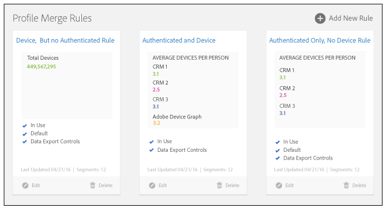

# プロファイル結合ルールダッシュボード {#profile-merge-rules-dashboard}

すべての結合ルールはダッシュボードで作成および管理します。最大4 つの[!UICONTROL Profile Merge Rules]を作成できます。

4 つ目のプロファイル結合ルール（[!UICONTROL All Cross-Device Profiles]）は、[!UICONTROL People-Based Destinations] アドオンを購入したユーザーのみが使用できます。

[!UICONTROL Profile Merge Rules] ダッシュボードには、[!UICONTROL Profile Merge Rules] を管理できる統合ワークスペースが用意されています。ダッシュボードは **[!UICONTROL Audience Data]**／**[!UICONTROL Profile Merge Rules]** にあります。ルールダッシュボードは以下の例のようになっています。

[!UICONTROL Profile Merge Rules] を操作すると、次のことが可能になります。

* クロスデバイス対応データソースから最大 4 つの[!UICONTROL Profile Merge Rules]を作成する。「[クロスデバイス対応データソースの作成](merge-rules-start.md#create-data-source)」を参照してください。
* デフォルトの結合ルールを指定する。[セグメントビルダー](../segments/segment-builder.md)により、作成されるすべての新規セグメントにデフォルトのルールが自動的に適用されます。
* [データエクスポートコントロール](../data-export-controls.md)を結合ルールに適用する。[!UICONTROL Data Export Controls]を使用すると、データの送信がデータのプライバシーや使用契約に違反する場合に、データを宛先に送信できないようになります。
* ユーザーごとのデバイスの平均数を追跡する。
* ルールの作成、編集、削除に使用する基本コントロールを操作する。ルールを管理できるのは管理者のみですが、他のユーザーでもルールを表示したり、セグメントに適用したりできます。「[定義済みのプロファイルの結合ルールオプション](merge-rule-definitions.md)」および「[結合ルールのユースケース](merge-rule-targeting-options.md)」を参照してください。

>[!MORELIKETHIS]
>
>* [プロファイル結合ルール FAQ](../../faq/faq-profile-merge.md)
