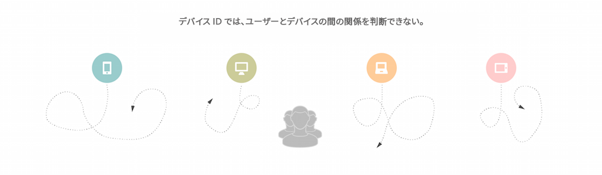
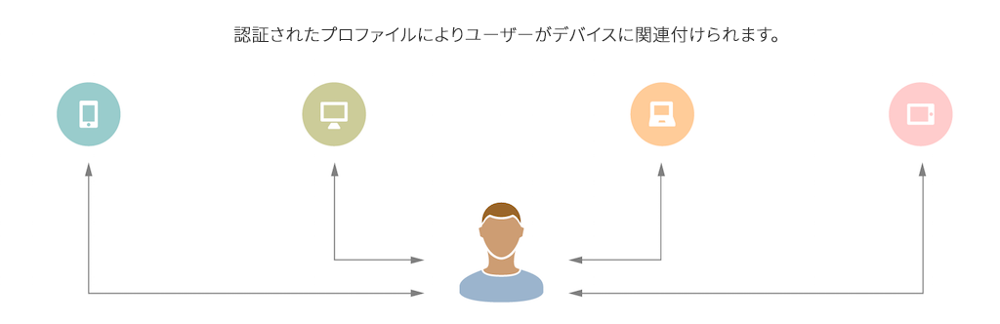

# [!UICONTROL Profile Merge Rules] 概要 {#profile-merge-rules-overview}

[!UICONTROL Profile Merge Rules] を使用すれば、セグメント化に使用するデータセットを制御し、複数のデバイスにわたって正確にユーザーをターゲット設定できます。

>[!VIDEO](https://video.tv.adobe.com/v/28974)

## 匿名プロファイルと認証済みプロファイルによるデータ収集とターゲティング {#data-collection-targeting}

通常、オーディエンスのセグメント化とターゲティングは、デバイス上のすべてのユーザーから収集されたデータに基づいておこないます。デバイスレベルのデータに基づくデータ収集とターゲティングには、いくつかのデメリットがあります。例えば、デバイスを共有する複数のユーザーを区別したり、複数のデバイスにまたがるユーザーを正確にターゲット化することができません。デバイスに基づくデータ収集は、デジタルマーケティングキャンペーンやクロスデバイスターゲティングには十分ではありません。

[!UICONTROL Profile Merge Rules]プロを使用すれば、[!DNL Audience Manager] がデータを収集してユーザーをターゲット化のためにセグメント化する方法が根本的に変わります。これにより、デバイスプロファイルと[認証済みプロファイル](../../reference/visitor-authentication-states.md)の 2 種類のプロファイルを操作できるようになります。

| プロファイルタイプ | 説明 |
|---|---|
| [!UICONTROL Device Profile] | [!UICONTROL device profile]は、特定のデバイスの ID（[!UICONTROL cookie] ID やモバイルデバイス ID など）に関連付けられています。  以下のようなものがあります。<ul><li>ユーザーが認証されていない状態で認識された、[!UICONTROL Rule-based traits]。</li><li>[!UICONTROL Onboarded traits] を、[!UICONTROL cookie-based] やサードパーティデータなどのデバイス ID に関連付けることができます。</li></ul> |
| [!UICONTROL Authenticated Profile] | [!UICONTROL authenticated profile]は、ユーザーがサイトにログインした時点で渡されるユーザー ID に関連付けられています。  以下のようなものがあります。<ul><li>ユーザーが認証されている状態でデバイス間で収集された、[!UICONTROL Rule-based traits]。</li><li>[!UICONTROL Onboarded traits]は、同じユーザー ID にリンクされているオフラインのファイルです。</li></ul> |

これらの各種のプロファイルにより、セグメント化に使用できるデータを制御します。例えば、[認証済みプロファイル](../../reference/visitor-authentication-states.md)を使用すると、複数のデバイスから収集した 1 人のユーザーに関するデータに基づいて正確な[!UICONTROL segments]を生成できます。これにより、複数のデバイスにまたがってユーザーに対し一貫したブランドエクスペリエンスを提供できるようになります。[!DNL Audience Manager] は、個人がオンラインアクティビティに使用する様々なデバイスのマッピングを[認証済みプロファイル](../../reference/visitor-authentication-states.md)に保存することで、これを実現します。これらのマッピングは、[!UICONTROL Profile Link Device Graph] と呼ばれます。

## メリット {#advantages}

[!UICONTROL Profile Merge Rules] では、以下のことが可能です。

* [認証済みプロファイル](../../reference/visitor-authentication-states.md)、匿名プロファイル、またはその両方の組み合わせに基づいて、ユーザーをターゲット化する。
* デバイス間で特定の顧客をターゲット化する。
* 決定論的データに基づいてデバイスグラフを作成する。
* 各種のプロファイルに基づいて[!UICONTROL segments]のデータを微調整する。
* オーディエンスに関する詳細なインサイトを得る。
