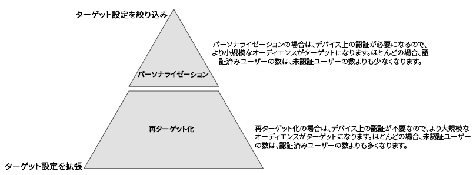
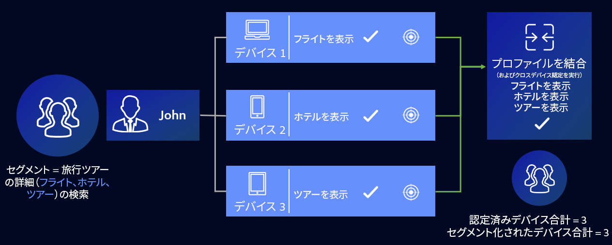

# プロファイルリンクデバイスグラフのユースケース {#profile-link-device-graph-use-cases}

[!UICONTROL Profile Link Device Graph] を使用したセグメントリターゲティングおよびパーソナライズしたセグメント絞り込みの推奨事項とユースケース。

## 推奨事項 {#recommendations}

[!UICONTROL Profile Link] デバイスグラフは、以下に該当するキャンペーンで使用してください。

* デジタルプロパティ間で高度な認証をおこなっている。認証済みユーザーの数が少ない場合に[外部デバイスグラフオプション](merge-rule-definitions.md#device-options)を使用している。
* 既知のオーディエンスについて正確なターゲット化が必要である。[!UICONTROL Profile Link Device Graph] は、認証済みファーストパーティデータを使用して構築されます。
* 認証済み状態と未認証状態の既知のオーディエンスをリアルタイムでターゲット化する。

## クロスデバイスでのターゲティング {#cross-device-personalization}

例えば、ジョンという人物が、旅行ツアーの詳細を調べるため、定期的に使用するデバイスとして、パソコン（[!DNL Device 1]）、スマートフォン（[!DNL Device 2]）、タブレット（[!DNL Device 3]）の 3 台を持っているとします。ただし、ジョンは、デバイスを使用して、ツアーの詳細の異なる項目を調べます。

* 飛行機の便を検索する際はノートパソコンを使用し、
* ホテルの場合はスマートフォン、
* ガイドツアーはタブレットで調べます。

上記の 3 つのデバイスのすべてでジョンが認証されていない場合でも、**[!UICONTROL Last Authenticated Profiles]** と **[!UICONTROL Profile Link Device Graph]** ルールを使用することで、旅行会社は、これらのデバイスをジョンの認証済みプロファイルに関連付け、3 台のデバイスすべてで最後に認証された人物がジョンであると想定します。

Audience Manager は、1 つのセグメントに対し、プロファイルの結合に参加した各デバイスプロファイルを確認するので、3 つのデバイスプロファイルはすべてセグメント化されます。[!UICONTROL Profile Link Device Graph] を使用すれば、Audience Manager は 3 つのデバイスすべてをまたいだ動作を確認し、1 つのデバイスプロファイルだけでは認定されないセグメントに対して、各デバイスを認定することができます。

この [!UICONTROL Profile Merge Rule] により、マーケターは、個々のデバイスアクティビティではなく、ユーザーアクティビティに基づいて、1 人のユーザーが所有するすべてのデバイスで一貫したエクスペリエンスを提供できます。

>[!MORELIKETHIS]
>
>* [外部デバイスグラフのユースケース](external-graph-use-cases.md)
* [プロファイル結合ルールの一般的なユースケース](merge-rule-targeting-options.md)
* [プロファイル結合ルール FAQ](../../faq/faq-profile-merge.md)

