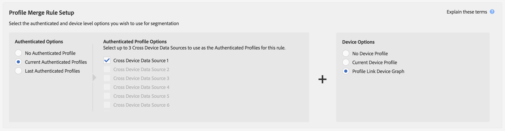

# プロファイルリンクデバイスグラフのユースケース {#profile-link-device-graph-use-cases}

[!UICONTROL Profile Link] デバイスグラフを使用したセグメントリターゲティングおよびパーソナライズしたセグメント絞り込みの推奨事項とユースケース。

## 推奨事項 {#recommendations}

[!UICONTROL Profile Link] デバイスグラフは、以下に該当するキャンペーンで使用してください。

* デジタルプロパティ間で高度な認証をおこなっている。認証済みユーザーの数が少ない場合に[外部デバイスグラフオプション](../../features/profile-merge-rules/merge-rule-definitions.md#device-options)を使用している。
* 既知のオーディエンスについて正確なターゲット化が必要である。[!UICONTROL Profile Link device graph] は、認証済みファーストパーティデータを使用して構築されます。
* 認証済み状態と未認証状態の既知のオーディエンスをリアルタイムでターゲット化する。

## リターゲティングのユースケースとプロファイル結合ルールの設定 {#retargeting-use-cases}

複数のデバイスにまたがって、以前サイトやアプリで認証されことがあるオーディエンスをリターゲティングします。セグメントの構成要素として次のようなプロファイルがあります。

* 最後の既知の認証済みデバイスプロファイル。
* 各デバイスプロファイルでの匿名アクティビティ。

>[!NOTE]
>
>セグメントの作成には、どちらのタイプのプロファイルの特性情報も使用できます。

### リターゲティングの例

クレジットカード会社を例に、仕組みについて説明します。この例では、3 台のデバイスプロファイルで確認された匿名のアクティビティから収集した特性情報を使用します。

<table id="table_8C5ABA47A0634EBA9B1AA1B5C2AABF07"> 
 <thead> 
  <tr> 
   <th colname="col1" class="entry"> ユースケース </th> 
   <th colname="col2" class="entry"> 説明 </th> 
  </tr> 
 </thead>
 <tbody> 
  <tr> 
   <td colname="col1"> 
 <b>条件</b> 
 </td> 
   <td colname="col2"> 
このユースケースでは次の条件を前提にしています。 
 
 
     <ul id="ul_72373D0F304044AE84E4CC055E3E8154"> 
      <li id="li_375DA786ED4D4F18A74C8FE42ABF8448">あるユーザーが 3 台のデバイスを使用しています。このユーザーは 3 台のデバイスすべてでクレジットカード会社のサイトやアプリの認証を受けた最後のユーザーです。 </li> 
      <li id="li_77FDBFAED21B4DE19AB2B6C112E0C64B">最初のデバイスで、未認証状態のユーザーがプレミアムクレジットカードのオファーを表示しました。 </li> 
      <li id="li_D3BE1B30BCCA49EA931AA9D97DD5F86D">2 番目のデバイスで、未認証状態のユーザーがプレミアムクレジットカードのメリットに関するページを表示しました。 </li> 
      <li id="li_39D894624FC44806B6DB2C77F459B39E">3 番目のデバイスで、未認証状態のユーザーがプレミアムクレジットカードの料金と手数料率に関するページを表示しました。 </li> 
     </ul> 
 </td> 
  </tr> 
  <tr> 
   <td colname="col1"> 
 <b>結果</b> 
 </td> 
   <td colname="col2"> 
これらの条件を前提として、Audience Manager は、以下をおこないます。 
 
 
     <ul id="ul_1B6174F5C3AF4C32831D4217C5113789"> 
      <li id="li_98FE54696B604C3C8D93CC1C1FBB48D9">3 台のデバイスすべてから収集した匿名の未認証アクティビティを、現在のデバイスで最後に認証されたプロファイルを使用して結合します。 </li> 
      <li id="li_A73C7DCE36BA42B6BAD26D8A075416C1">次の項目に基づいて、この匿名ユーザーをセグメント認証のために評価します。 
       <ul id="ul_EF66EAFD12CA44F5ACCB66319606D937"> 
        <li id="li_541762056ECF4BC1ABF1F5116B5FED6C">3 台のデバイスすべてをまたいだ匿名アクティビティの組み合わせ。 </li> 
        <li id="li_C386CB62E5234E10AFEDE900ADC0E261">現在のデバイスで最後に認証されたプロファイル。 </li> 
       </ul> </li> 
      <li id="li_5C9BDC8FF886494589F005C9658A923C">3 台のデバイスすべてで、リターゲティングのためセグメントを任意のリアルタイムの宛先に送信します。 </li>
     </ul> 
 </td> 
  </tr> 
 </tbody> 
</table>

### リターゲティング用のプロファイル結合ルールの例

[!UICONTROL Profile Link] を使用したリターゲティングを設定するには、「[!UICONTROL Authenticated Options]」と「[!UICONTROL Device Options]」で次のようなルール設定をおこなう必要があります。[!UICONTROL Authenticated Profile] オプションではクロスデバイスデータソースの名前が使用されるので、実際にはこの例とは異なります。

## パーソナライズ機能のユースケースとプロファイル結合ルールの設定 {#personalization-use-case}

複数のデバイスにまたがるアクティビティに基づいて、サイト上やアプリ内での認証済みオーディエンスのエクスペリエンスをパーソナライズします。セグメントの構成要素として次のようなプロファイルがあります。

* 現在認証されているデバイスプロファイル。
* 匿名デバイスプロファイル。

>[!NOTE]
>
>ユーザーがセグメントの対象として認定されるには、そのユーザーが認証済みでなければなりません。

### パーソナライズ化の例

クレジットカード会社を例に、仕組みについて説明します。

<table id="table_D2F4D5D27EB54224BB2CC1D843DDEDA3"> 
 <thead> 
  <tr> 
   <th colname="col1" class="entry"> ユースケース </th> 
   <th colname="col2" class="entry"> 説明 </th> 
  </tr> 
 </thead>
 <tbody> 
  <tr> 
   <td colname="col1"> 
 <b>条件</b> 
 </td> 
   <td colname="col2"> 
このユースケースでは次の条件が想定されています。 
 
 
     <ul id="ul_C4D2108E7B1C4D3C89411A9CCCDA6DAC"> 
      <li id="li_2F10EB17466B4B91A94DF707C3CB6BE5">あるユーザーが 3 台のデバイスを使用しています。このユーザーは 3 台のデバイスすべてでクレジットカード会社のサイトやアプリの認証を受けた最後のユーザーです。 </li> 
      <li id="li_1559C4DA51254BCF95291133F32A4057">最初のデバイスで、未認証状態のユーザーがプレミアムクレジットカードのオファーを表示しました。 </li> 
      <li id="li_734465E5619C474291C42921160CEC6B">2 番目のデバイスで、未認証状態のユーザーがプレミアムクレジットカードのメリットに関するページを表示しました。 </li> 
      <li id="li_B96ABC0205384B59A1901708505B8BF8">3 番目のデバイスで、未認証状態のユーザーがプレミアムクレジットカードの料金と手数料率に関するページを表示しました。 </li> 
      <li id="li_1A7BDBD546BD4B8EACF4292D885127F2">いずれかのデバイスで、このユーザーは残高を確認するために（サインインにより）認証を受けました。 </li> 
     </ul> 
 </td> 
  </tr> 
  <tr> 
   <td colname="col1"> 
 <b>結果</b> 
 </td> 
   <td colname="col2"> 
これらの条件を前提として、Audience Manager は、以下をおこないます。 
 
 
     <ul id="ul_37DBF5FEABC5463D85C74AD9150EA177"> 
      <li id="li_B60FFA5CF3F64FB69997AA05595900D7">現在の認証済みプロファイルを使用して、3 台のデバイスすべてから収集した匿名の未認証アクティビティを結合します。認証済みプロファイルにより、各デバイスで共通の識別子が生成されます。 </li> 
      <li id="li_AB9FD87DD804474BA33805C364B7B92D">次の項目に基づいて、認証済みユーザーをセグメント認定のため評価します。 
       <ul id="ul_EAF99E72159D4E329052B71344D9C69B"> 
        <li id="li_0B5E52BA6D8B493980291EA7B0AE235A">3 台のデバイスすべてをまたいだ匿名アクティビティの組み合わせ。 </li> 
        <li id="li_07588DEFBEF64F97850CB12CD62D0213">現在の認証済みプロファイル。 </li> 
       </ul> </li> 
      <li id="li_E7CFCEAD7610496189F4486000D7860A">セグメントを任意のリアルタイム宛先に送信して、ユーザーが現在のデバイスで認証されている状態でパーソナライズ化された閲覧操作を実現します。 
注意：これにより、認証状態にかかわらず、セグメントで 3 台のデバイスすべてが認定されます。共有デバイスの場合、プライバシーに関する問題が発生する可能性があります。 
 </li>
     </ul> 
 </td>
  </tr>
 </tbody> 
</table>

### パーソナライズ化用のプロファイル結合ルールの例

[!UICONTROL Profile Link]を使用したパーソナライゼーションを設定するには、「[!UICONTROL Authenticated Options]」と「[!UICONTROL Device Options]」で次のようなルール設定をおこなう必要があります。[!UICONTROL Authenticated Profile] オプションではクロスデバイスデータソースの名前が使用されるので、実際にはこの例とは異なります。

これらのデバイスグラフの処理方法について詳しくは、[Audience Manager と外部デバイスグラフ](https://marketing.adobe.com/resources/help/ja_JP/aam/downloads/AAM_Device_Graphs.pdf)の PDF をダウンロードしてください。

>[!MORE_LIKE_THIS]
>
>* [ 外部デバイスグラフのユースケース](../../features/profile-merge-rules/external-graph-use-cases.md)
>* [プロファイル結合ルールの一般的なユースケース](../../features/profile-merge-rules/merge-rule-targeting-options.md)
>* [プロファイル結合ルール FAQ](../../faq/faq-profile-merge.md)

