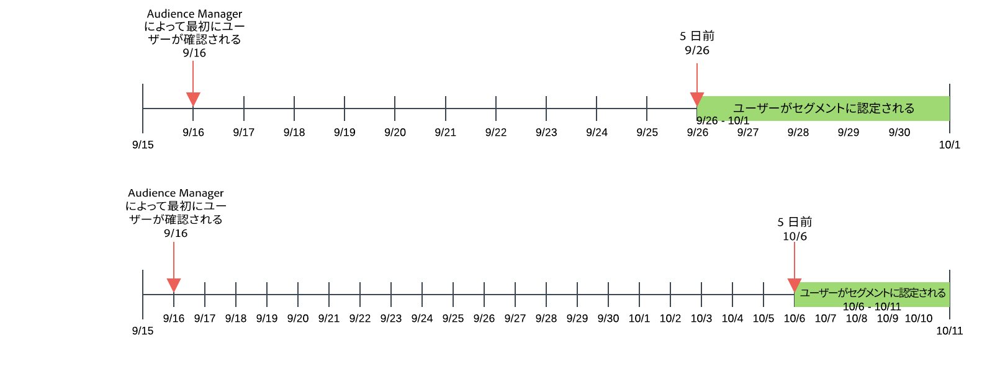
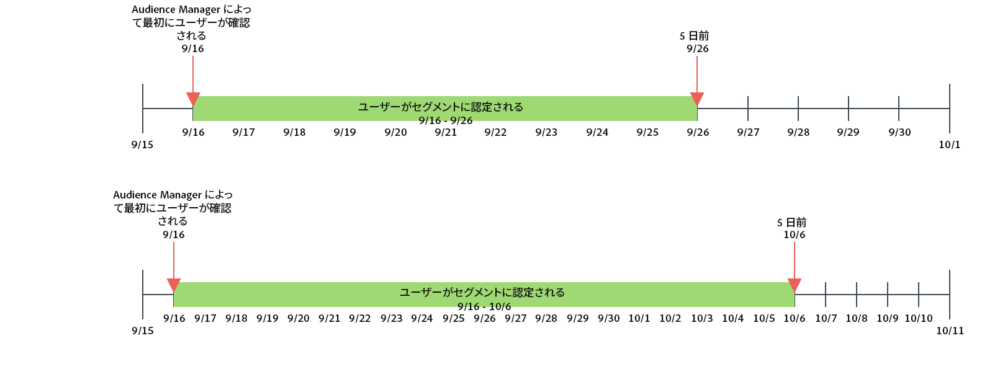

# 最新性と頻度 {#recency-and-frequency}

[!UICONTROL Segment Builder]では、最新性と頻度を使用すると、設定された日数ごとに繰り返されるアクションに基づいて訪問者をセグメント化することができます。

Audience Manager では、[!DNL recency] と [!DNL frequency] は次のように定義されています。

* **[!UICONTROL Recency]：**&#x200B;最近、ユーザーが 1 つ以上の特定を確認した、または[!UICONTROL traits]の対象として認定された最新性。
* **[!UICONTROL Frequency]：**&#x200B;ユーザーが 1 つ以上の特定を確認した、または[!UICONTROL traits]の対象として認定された割合。

[!UICONTROL Recency] と [!UICONTROL Frequency] の設定は、サイト、セクションまたは特定のクリエイティブに対する実際の（または認識された）関心レベルに基づいて訪問者をセグメント化するのに役立ちます。例えば、高い最新性／頻度要件でセグメントの対象として認定されるユーザーは、それほど頻繁に訪問していないユーザーよりも、サイトまたは製品に関心がある可能性があります。

## [!UICONTROL Recency and Frequency] 設定の場所  {#location}

[!UICONTROL Segment Builder]では、[!UICONTROL Recency]設定と[!UICONTROL Frequency]設定は、[!UICONTROL Traits]パネルの[!UICONTROL Basic View]セクションにあります。時計アイコンをクリックして、これらのコントロールを表示します。

## 制限とルール {#limitations-rules}

最新性と頻度をセグメントの特性に適用する場合は、以下の制限およびルールを確認および理解してください。

### [!UICONTROL Recency] {#recency}

<table id="table_026064124C694D75B7A960457D50170B"> 
 <thead> 
  <tr> 
   <th colname="col1" class="entry"> 制限またはルール </th> 
   <th colname="col2" class="entry"> 説明 </th> 
  </tr> 
 </thead>
 <tbody> 
  <tr> 
   <td colname="col1"> 
 <b>最小値</b> 
 </td> 
   <td colname="col2"> 
最新性は 0 より大きい値である必要があります。 
 </td> 
  </tr>
  <tr> 
   <td colname="col1"> 
 <b>特性タイプ</b> 
 </td> 
   <td colname="col2"> 
ルールベースおよびフォルダー特性にのみ最新性コントロールを適用できます。 
 </td> 
  </tr> 
  <tr> 
   <td colname="col1"> 
 <b>サードパーティ特性</b> 
 </td> 
   <td colname="col2"> 
個々のサードパーティ特性またはサードパーティ特性の特性グループに対して、最新性ルールを設定することはできません。最新性と頻度は、独自の特性にのみ適用されます。 
 </td> 
  </tr> 
 </tbody> 
</table>

### [!UICONTROL Frequency] {#frequency}

<table id="table_EBD621D26C8B4D03933E8C0753C892A7"> 
 <thead> 
  <tr> 
   <th colname="col1" class="entry"> 制限またはルール </th> 
   <th colname="col2" class="entry"> 説明 </th> 
  </tr> 
 </thead>
 <tbody> 
  <tr> 
   <td colname="col1"> 
 <b>サードパーティ特性</b> 
 </td> 
   <td colname="col2"> 
個々のサードパーティ特性またはサードパーティ特性の特性グループに対して、頻度ルールを設定することはできません。最新性と頻度は、独自の特性にのみ適用されます。 
 </td> 
  </tr> 
  <tr> 
   <td colname="col1"> 
 <b>特性タイプ</b> 
 </td> 
   <td colname="col2"> 
ルールベースおよびフォルダー特性にのみ頻度コントロールを適用できます。 
 </td> 
  </tr> 
  <tr> 
   <td colname="col1"> 
 <b>最新性の要件</b> 
 </td> 
   <td colname="col2"> 
最新性の要件を設<i>定せずに</i>、頻度の要件を設定できます。頻度の値を設定するだけで、最新性のフィールドは空のままにします。 
 </td> 
  </tr> 
  <tr> 
   <td colname="col1"> 
<b>プロファイル結合ルール</b> 
 </td> 
   <td colname="col2"> 
<a href="../../faq/faq-profile-merge.md#trait-freq-device-rules">特性頻度、デバイスグラフ、プロファイル結合ルール</a>を参照してください。 
 </td> 
  </tr> 
 </tbody> 
</table>

## 最新性の例 {#recency-examples}

以下に、UI での選択に応じた、最新性の仕組みの 2 つの例を示します。

### 次よりも小さいか等しい演算子（&lt;=）の使用

この例では、スクリーンショットに示すように、&lt;= 演算子を選択します。この場合は、3 つの[!UICONTROL traits]のいずれかについて過去 5 日間以内に 3 回以上認定された場合、[!UICONTROL segment]のユーザーを認定します。以下のタイムラインは、[!UICONTROL segment]作成時、10 月 1 日、および 10 日後の[!UICONTROL segment]認定を示します。

### 次よりも大きいか等しい演算子（=>）の使用

この例では、スクリーンショットに示すように、=> 演算子を選択します。この場合は、3 つの[!UICONTROL traits]のいずれかについて Audience Manager プラットフォームでの最初の認定と 5 日前の締め切り時間の間に 3 回以上認定された場合、[!UICONTROL segment]のユーザーを認定します。以下のタイムラインは、[!UICONTROL segment]作成時、10 月 1 日、および 10 日後の[!UICONTROL segment]認定を示します。

## 頻度キャップの例 {#frequency-capping}

頻度キャップ式では、[!UICONTROL trait]適合の数が目標値を下回っているすべてのユーザーを含めます。以下に、正しい例と間違った例を示します。

* 間違い - 式 `frequency([1000T]) <= 5` の場合は、ID「1000」の[!UICONTROL trait]に適合した回数が最大 5 回（[!UICONTROL trait]に適合しなかった場合も含む）のすべてのユーザーが含まれます。そのため、[!UICONTROL segment]に認定するユーザーが多くなってしまうため、Audience Manager では、パフォーマンスを理由にこの式を検証しません。

* [!UICONTROL trait]正しい - ID「1000」の特性を認識した回数が最大 5 回のすべてのユーザーを含めたい場合、式に別の条件を追加して、ユーザーが少なくとも 1 回[!UICONTROL trait]を認定されるようにします。`frequency([1000T]) >= 1  AND  frequency([1000T]) <= 5`

* 正しい - 最新性／頻度の要件が特定の回数または日数を下回る必要がある場合は、その[!UICONTROL trait]を `AND` 演算子で別の特性に結合します。最初の箇条書きの例を使用すると、この式は、`frequency([1000T]) <= 5 AND isSiteVisitorTrait` のように、別の[!UICONTROL trait]と結合した場合に有効になります。

* 正しい - 広告頻度キャップの使用例の場合、次のような[!UICONTROL segment]ルールを作成できます：`(frequency([1000T] <= 2D) >= 5)`この式では、過去 2 日間に ID 「1000」の[!UICONTROL trait]を 5 回以上認識したすべてのユーザーを含めます。広告サーバーで[!UICONTROL segment]に対して `NOT` を設定した広告サーバーにこの[!UICONTROL segment]を送信することで、頻度キャップを設定します。この方法は、頻度キャップと同じ目的を提供しますが、[!DNL Audience Manager] でより優れたパフォーマンスを達成します。

>[!MORELIKETHIS]
>
>* [セグメントビルダーのコントロール：「Traits」セクション](../../features/segments/segment-builder.md#segment-builder-controls-traits)
* [セグメント式エディターで使用するコード構文](../../features/segments/segment-code-syntax.md)

