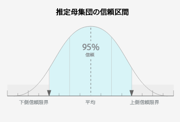

# セグメントビルダーにおける特性とセグメントのユーザー数データ {#trait-and-segment-population-data-in-segment-builder}

[!UICONTROL Segment Builder]で特性を追加または削除すると、実際のセグメントユーザー数データや推定セグメントユーザー数データと一緒に、実際の特性ユーザー数が表示されます。推定ユーザー数のデータは、キャンペーンに適したセグメントを作成するのに役立ちます。

## Trait Population Data {#trait-population-data}

[!UICONTROL Segment Builder]には、特性をセグメントに追加した日の前日の[!UICONTROL Total Trait Population]が表示されます。このデータは、「[!UICONTROL Basic View]」セクションで選択した特性の周囲の青色のフィールドに表示されます。

次の表は、特性母集団の指標です。

<table id="table_9D837CF9ACA04D04BEE5925EC0B4A5D2"> 
 <thead> 
  <tr> 
   <th colname="col1" class="entry"> 指標 </th> 
   <th colname="col2" class="entry"> 説明 </th>
  </tr> 
 </thead>
 <tbody> 
  <tr> 
   <td colname="col1"> 
  Total Trait Population 
 </td>
   <td colname="col2"> 
選択した特性がプロファイルにある一意の ID の数。 
 </td>
  </tr> 
 </tbody> 
</table>

## 実際のセグメント母集団と推定セグメント母集団の計算 {#calculating-real-estimated-populations}

新しいセグメントの作成時、または既存のセグメントの変更時は、Audience Manager で実際のリアルタイムセグメント母集団と合計セグメント母集団が表示されるまでに最大 24 時間かかります。

ただし、セグメントのリアルタイム母集団と合計母集団のサイズの予測は Audience Manager ですぐにおこなうことができます。この予測はサンプリングされた履歴データに基づいておこなわれ、95% の信頼区間で結果が返されます。

[!UICONTROL Segment Builder]では、推定母集団グラフの青色の棒はセグメントのサイズの範囲の上限と下限を表します。過去のパフォーマンスから将来の結果が保証されているわけではありませんが、推定データを使用すると新しいセグメントや編集したセグメントのサイズがどの程度になる可能性があるか把握できます。

## セグメント母集団データの概要 {#segment-populations}

[!UICONTROL Segment Builder]では、セグメントの作成時や編集時にセグメント母集団データが表示されます。

* 推定されたセグメント母集団データ（リアルタイムと合計）について、[!UICONTROL Segment Builder]でセグメントの特性の追加や削除を実行してもグラフは自動的には更新されません。「**[!UICONTROL Calculate Estimates]**」をクリックすると、推定された母集団の数値が表示（または更新）されます。

* 実際のセグメント母集団データ（リアルタイムと合計）について、[!UICONTROL Segment Builder]で既存のセグメントを読み込むと、セグメントのグラフが自動的に更新されます。新しいセグメントを作成した場合、または既存のセグメントに新しい特性を追加した場合、実際の母集団データはセグメントの作成から 24 時間が経過するまで更新されません。

以下の表で、推定されたセグメント母集団データと実際のセグメント母集団データの詳細を確認してください。

## 推定セグメント母集団データの定義 {#estimated-segment-population}

次の表は、推定母集団の指標です。

<table id="table_B24503F372E34B6BBDF5204181701A59"> 
 <thead> 
  <tr> 
   <th colname="col1" class="entry"> 指標 </th> 
   <th colname="col2" class="entry"> 説明 </th> 
  </tr>
 </thead>
 <tbody> 
  <tr> 
   <td colname="col1"> 
  Estimated Real-Time Population (Potential)  
 </td> 
   <td colname="col2"> 
指定した時間範囲にリアルタイムで認識され、また Audience Manager で認識された時点でセグメントについて認定された個別訪問者の推定数。 
 
セグメントビルダーでは、直近 30 日間の特性母集団（Total Trait Populations）は、特性と、リアルタイムに評価されたセグメントで異なります。 
 

     <ul id="ul_CAE803D09913462CAD413A665D85C1A2"> 
      <li id="li_3E64330D6F5B4D2F8F3456730A86894F">特性の場合、直近 30 日間の指標では、その 30 日間で特性に認定された個別ユーザーが計上されます。 </li>
      <li id="li_FF3CACD0B6C742CDB94D66200D77CE06">リアルタイムに評価されたセグメントの場合、直近 30 日間の指標では、過去のいずれかの時点で（当該セグメントの）特性について認定され、その 30 日間で Audience Manager により再度認識されたユーザーが計上されます。例えば、60 日前に特性について認定され、10 日前に再度認識されたユーザーがいるとします。このデータでは、このユーザーが特性について認定されてから 30 日間を超えているので、このユーザーは特性数に加算されません。ただし、リアルタイムに評価されたセグメントの過去 30 日間の数には含まれます。30 日間はセグメントの対象として認定されたからです。 </li>
     </ul> 
 
 
注意：Estimated Real-Time Population 指標には、<a href="../../features/profile-merge-rules/merge-rule-definitions.md#device-options">デバイスグラフオプション</a>を使用するプロファイル結合ルールにより実行された結合に基づきセグメントについて認定されたデバイスは含まれません。 
 
 </td> 
  </tr> 
  <tr> 
   <td colname="col1"> 
  Estimated Total Population (Potential) 
 </td> 
   <td colname="col2"> 
新しいセグメント、または変更されたセグメントに含まれる可能性がある個別訪問者の推定数。他の大部分の予測と同様に、過去のパフォーマンスから将来の結果が保証されているわけではありませんが、推定合計数は次の用途で使用できます。 
 
 
     <ul id="ul_0490DD08C7C8493DADFB11B5872A73BC"> 
      <li id="li_AE38C8C8A4B24021BAC724B51A4799E2">セグメントの作成時に、新しいセグメントや変更後のセグメントがリーチできるユーザーの数を把握する。 </li> 
      <li id="li_E830EC2B12DC46D4B0A4DD807A8936F6">目標に応じてセグメントを調整する。例えば、大規模なセグメントはブランド認知キャンペーンに便利で、小規模なセグメントは対象を限定したターゲティングやリターゲティングキャンペーンに便利です。 </li> 
     </ul> 
 
 
注意：Estimated Total Population 指標には、<a href="../../features/profile-merge-rules/merge-rule-definitions.md#device-options">デバイスグラフオプション</a>を使用するプロファイル結合ルールにより実行された結合に基づきセグメントについて認定されたデバイスは含まれません。 
 
 </td> 
  </tr> 
 </tbody> 
</table>

## 既存（実際）のセグメント母集団データの定義 {#existing-segment-population}

[!UICONTROL Profile Merge Rules]は、実際のリアルタイムおよび母集団合計数に影響を与えます。これらの合計は、セグメントが属する[!UICONTROL Profile Merge Rule]がデバイスグラフオプションを使用しているかどうかによって異なります。[定義済みのプロファイルの結合ルールオプション](../../features/profile-merge-rules/merge-rule-definitions.md)も参照してください。

### デバイスグラフオプションがない結合ルールのセグメント母集団データ

次の表は、デバイスグラフオプションを使用せずに作成された[!UICONTROL Profile Merge Rule]でセグメントが使用されている場合の、実際のリアルタイム母集団と合計母集団の指標を示しています。これはデバイスオプション設定の「**[!UICONTROL No Device Options]**」および「**[!UICONTROL Current Device Proflie]**」です。

<table id="table_A18C973855DB46A0B39B81F32E0E7540"> 
 <thead> 
  <tr> 
   <th colname="col1" class="entry"> 指標 </th> 
   <th colname="col2" class="entry"> 説明 </th> 
  </tr> 
 </thead>
 <tbody> 
  <tr> 
   <td colname="col1"> 
  Real-Time Population (Existing) 
 </td> 
   <td colname="col2"> 
指定した時間範囲にリアルタイムで認識され、また Audience Manager で認識された時点でセグメントについて認定された個別訪問者の実際の数。 
 
セグメントビルダーでは、直近 30 日間の特性母集団（Total Trait Populations）は、特性と、リアルタイムに評価されたセグメントで異なります。 
 
 
     <ul id="ul_50D1528DDDF347858F17DA3C033B0E3F"> 
      <li id="li_ABA2BFE68FF4430DBB425C4661E1836A">特性の場合、直近 30 日間の指標では、その 30 日間で特性に認定された個別ユーザーが計上されます。 </li> 
      <li id="li_1519068CBB1445E893657D12E8FE42AC">リアルタイムに評価されたセグメントの場合、直近 30 日間の指標では、過去のいずれかの時点で（当該セグメントの）特性について認定され、その 30 日間で Audience Manager により再度認識されたユーザーが計上されます。例えば、60 日前に特性について認定され、10 日前に再度認識されたユーザーがいるとします。このデータでは、このユーザーが特性について認定されてから 30 日間を超えているので、このユーザーは特性数に加算されません。ただし、リアルタイムに評価されたセグメントの過去 30 日間の数には含まれます。30 日間はセグメントの対象として認定されたからです。 </li> 
     </ul> 
 </td> 
  </tr> 
  <tr> 
   <td colname="col1"> 
  Total Population (Existing) 
 </td> 
   <td colname="col2"> 
前日のセグメントについて認定された個別訪問者の実際の数。 
 </td> 
  </tr> 
 </tbody> 
</table>

### デバイスグラフオプションを使用する結合ルールのセグメント母集団データ

次の表は、デバイスグラフオプションを使用して作成された[!UICONTROL Profile Merge Rule]でセグメントが使用されている場合の、実際のリアルタイム母集団と合計母集団の指標を示しています。これらは、[!UICONTROL Profile Link Device Graph]、[!DNL Adobe] デバイスグラフおよび他の使用可能なサードパーティのデバイスグラフのデバイス設定です。

<table id="table_157EC6E5B5C44EB899854CA10B090F60"> 
 <thead> 
  <tr> 
   <th colname="col1" class="entry"> 指標 </th> 
   <th colname="col2" class="entry"> 説明 </th> 
  </tr> 
 </thead>
 <tbody> 
  <tr> 
   <td colname="col1"> 
  Real-Time Population (Existing) 
 </td> 
   <td colname="col2"> 
現在のプロファイルのうち、デバイスグラフで連結された他の最大 3 台のデバイスプロファイルと結合された場合に、Audience Manager での認識時にセグメントについて認定する特性を含むプロファイルを使用する、リアルタイムで認識されるデバイスの実際の数。 
 </td>
  </tr>
  <tr> 
   <td colname="col1"> 
  Total Population (Existing) 
 </td> 
   <td colname="col2"> 
デバイスグラフで連結された他の最大 3 台のデバイスプロファイルで結合された場合にセグメントについて認定されたプロファイルを使用するデバイスの合計数。 
 </td>
  </tr>
 </tbody>
</table>

### セグメント母集団の見積もり時における最新性と頻度の式による制限

[!UICONTROL Segment Builder]では、最大 4 つの最新性と頻度の式を含むセグメントルールのセグメントサイズ見積もりをサポートしています。セグメントルールの作成時に選択する最新性と頻度の式が 4 つを超えると、母集団の見積もり時にセグメント見積もりの画面にエラーが表示されます。

### セグメント母集団の推定時における結合ルールによる制限

現在、セグメントサイズ見積もりでプロファイル結合ルールが考慮されていないことが原因の既知の制限があります。例えば、**認証プロファイルなし + 現在のデバイスプロファイル** [結合ルール](../../features/profile-merge-rules/merge-rule-definitions.md)を見てみましょう。現在のセグメント推定数の計算方法では、推定された母集団に認証済みプロファイルが含まれます。しかし、既存のセグメント母集団では、認証済みプロファイルが適切に無視されます。

>[!MORELIKETHIS]
>
>* [プロファイル結合ルールおよびデバイスグラフに関するよくある質問](../../faq/faq-profile-merge.md)
>* [Profile Link](../../features/profile-merge-rules/merge-rules-overview.md)

