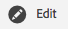
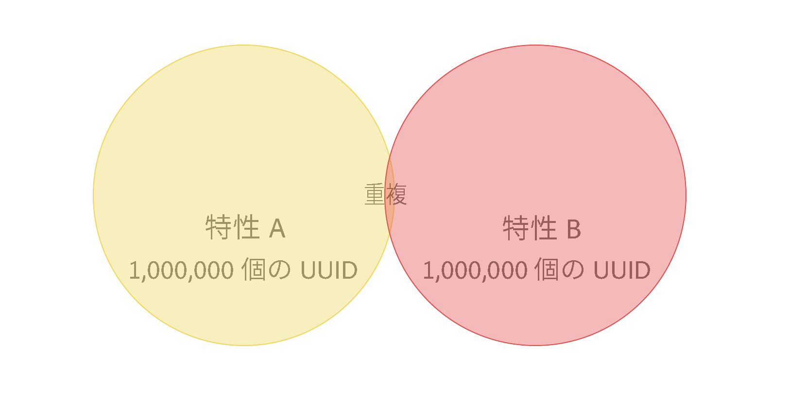
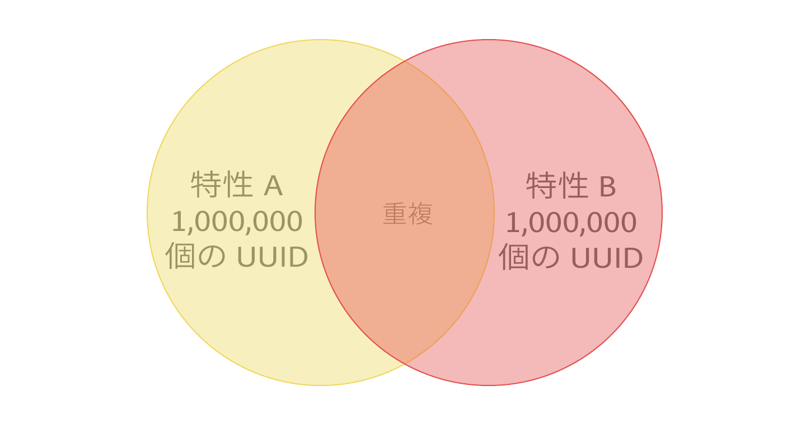

# 特性レコメンデーション

独自のファーストパーティ特性および [!UICONTROL Audience Marketplace] データフィードから、セグメントの作成時に有効な特性レコメンデーションを取得します。

## ビデオデモ

まず、以下の [!UICONTROL Trait Recommendations] のビデオを見てから、詳細をお読みください。ビデオデモでは、独自のファーストパーティ特性からのレコメンデーションの使用方法、*および既に購読している* [!UICONTROL Audience Marketplace] データフィードからの特性レコメンデーションの使用方法について説明します。

>[!VIDEO](https://video.tv.adobe.com/v/26228/)

次のビデオでは、[!UICONTROL Marketplace Recommendations] のワークフローの概要を説明し、[!UICONTROL Audience Marketplace] のデータフィードからのレコメンデーションに基づいて、セグメントに特性を追加する方法を示します。これらのレコメンデーションは、購読していないデータフィードに基づいています&#x200B;*。*

>[!VIDEO](https://video.tv.adobe.com/v/29363/)

## 概要

[!DNL Adobe Sensei] を活用した [!UICONTROL Trait Recommendations] により、データサイエンスを Audience Manager の毎日のワークフローに適用します。[セグメントビルダー](segment-builder.md)でセグメントをビルドまたは編集する際に [!UICONTROL Trait Recommendations] を使用すると、セグメントルールの Trait に似た、追加が可能な特性に関するレコメンデーションが表示されます。

Audience Manager では、ファーストパーティ特性からの特性レコメンデーションが&#x200B;**[!UICONTROL Recommendations]**&#x200B;セクションに、**[!UICONTROL Audience Marketplace]** からの特性レコメンデーションが&#x200B;**[!UICONTROL Recommendations from Marketplace]**&#x200B;セクションに表示されます。

推奨特性をセグメントに追加すると、ターゲットオーディエンスを増やすことができます。

**要約すると、以下のような機能です。**

* Audience Manager では、ファーストパーティ特性が「[!UICONTROL Recommendations]」セクションに表示されます。購読していない公開および非公開フィードからの Marketplace レコメンデーションは、「[!UICONTROL Recommendations from Marketplace]」セクションに表示されます。フィード名をクリックして [!UICONTROL Audience Marketplace] に移動し、購読します。
* Audience Manager には、セグメントルール内の特性に類似した特性が最大で 50 表示されます。
* レコメンデーションを表示する必要のないデータソースは除外できます。
* 類似性を計算する際、Audience Manager は過去 30 日間の特性の対象として認定できる [UUID](../../reference/ids-in-aam.md) を考慮に入れます。
* 「No similar traits found.Trait(s) may be too new」というエラーメッセージが表示された場合は、過去 30 日間にその特性に関するアクティビティが発生していないか、Audience Manager がその特性のレコメンデーションをまだ更新していません。24 時間後にもう一度試してみてください。

## ユースケース

[!UICONTROL Trait Recommendations] では、Audience Manager の使用状況に応じて、ワークフローを改善できます。

* マーケティング担当者は、類似した特性を活用して補完的な製品に関心のあるオーディエンスをすばやく見つけ、リーチを増やすことができます。
* Audience Manager をパブリッシャー（広告配信元）として使用した場合、[!UICONTROL Trait Recommendations]では、オーディエンスの行動を把握し、広告販売やユーザー獲得のためのより優れたセグメントを構築できます。
* [!UICONTROL Audience Marketplace] データ購入者の場合、大量のフィードを閲覧することなく、関連するサードパーティデータを見つけることができます。
* [!UICONTROL Audience Marketplace] データプロバイダーの場合、関連するデータを購入者にレコメンデーションできるので、最適な、関連するサブスクリプションから利益を得ることができます。

## 特性レコメンデーションとアルゴリズムモデルの違い

### アルゴリズムモデル

[!UICONTROL Algorithmic Models]は、最も影響力のある特性を見つけ、それらの特性に基づいてユーザーを評価し、各ユーザーに個別のスコアを割り当てます。次に、ユーザーをターゲットにするアルゴリズムの特性を作成します。[!UICONTROL Trait Builder]の精度コントロールとリーチコントロールを使用すれば、ターゲットに設定したい影響力のある特性を持つすべてのユーザーを指定できます。

[!UICONTROL Algorithmic Models]を使用すれば、様々な精度レベルでユーザーを選択したり、[!UICONTROL Audience Lab]でテストしたりでき、ユーザーのグループのコンバージョン率が向上します。[Audience Lab でのモデルの比較](../../features/audience-lab/audience-lab-use-cases.md#compare-models)の詳細なユースケースを参照してください。

[!UICONTROL Algorithmic Models] では、モデルは 8 日ごとに実行され、アルゴリズム特性の対象となるユーザーが更新されます。

### 特性レコメンデーション

[!UICONTROL Trait Recommendations]を使用すれば、セグメントの場合と同様、他の特性に関するインサイトを簡単に得ることができます。

[!UICONTROL Trait Recommendations] は次の場合に使用できます。

* セグメントの作成中に、すばやくインサイトを得る必要がある場合。
* 短時間のキャンペーンでセグメントを使用している場合、またはコンバージョンしたオーディエンスをすばやく抑制したい場合。
* リーチを最大化したい場合。

## ワークフロー

[セグメントビルダー](segment-builder.md)でセグメントを作成または編集する際に、セグメントルール内の特性に類似した特性を調べることができます。[セグメントビルダー](segment-builder.md)のワークフローは、以下に示すように、新規セグメントと既存セグメントで非常によく似ています。

### 新規セグメント

1. **Audience Data／Segments** に移動し、「**Add New**」をクリックします。
1. **Traits** ドロップダウンボックスで、少なくとも 1 つの特性をセグメントルールに追加します。
1. ファーストパーティの推奨特性および購読しているフィードからの [!UICONTROL Audience Marketplace] 特性レコメンデーションが、**[!UICONTROL Recommendations]**&#x200B;セクションに表示されます。**[!UICONTROL Recommendations from Marketplace]**&#x200B;セクションには、購読していないフィードからの特性レコメンデーションが表示されます。これらすべてのレコメンデーションは、セグメントルールに追加した特性に類似しています。下にスクロールして、推奨されるすべての特性を表示します。
1. （オプション）特定のデータソースのファーストパーティ推奨特性を除外するには、除外するデータソースの **X** 記号をクリックします。

   >[!NOTE]
   >
   >除外したデータソースは、推奨特性のリストのすぐ上に表示されます。灰色のボックスの **X** をクリックすると、除外したデータソースが削除され、各データソースの結果が再度表示されます。
1. セグメントルールに推奨特性を追加するには、**+** 記号をクリックします。

>[!IMPORTANT]
>
>[!UICONTROL Marketplace] 特性をセグメントに追加する場合、その特性は、対応するデータフィードを購読するまで、セグメント推定にのみ使用されます。購読していないデータフィードからの特性は、特性リストで、買い物かごアイコンでマークされます。特性名をクリックしてデータフィードページに移動し、購読します。
>
>
>
>対応するデータフィードを購読した場合のみ、サードパーティ特性と共にセグメントを保存できます。

### 既存セグメント

1. **[!UICONTROL Audience Data]／[!UICONTROL Segments]** に移動し、編集したいセグメントを選択して、「」をクリックします。
1. 下にスクロールして[!UICONTROL Traits]ドロップダウンボックスを表示します。
1. セグメントルールに既に含まれている特性に類似した推奨特性が表示されています。下にスクロールして、推奨されるすべての特性を表示します。
1. （オプション）特定のデータソースの推奨特性を除外するには、除外するデータソースの **X** 記号をクリックします。

   >[!NOTE]
   >
   >除外したデータソースは、推奨特性のリストのすぐ上に表示されます。灰色のボックスの **X** をクリックすると、除外したデータソースが削除され、各データソースの結果が再度表示されます。
1. セグメントルールに推奨特性を追加するには、**+** 記号をクリックします。

セグメントを作成または編集し、セグメントルールに特性を追加すると、追加した特性に類似した特性が最大で 50 表示されます。セグメントルールに複数の特性が含まれている場合、Audience Manager はラウンドロビン方式により、各特性に最も一致する特性、2 番目に一致する特性という順に、セグメントルール内の、母集団が大きい方から順に 50 の特性が表示されます。

例えば、セグメントルール内に 3 つの特性がある場合、推奨特性は以下のようになります。

1. 特性 3（母集団が最も大きい特性）に最も一致する特性
1. 特性 1 に最も一致する特性
1. 特性 2 に最も一致する特性
1. 特性 3 に 2 番目に一致する特性
1. 特性 1 には 2 番目に一致する特性など、特性が 50 までになるまで続きます。

特定の特性に対するレコメンデーションを取得するには、セグメントルール内（1）または特性レコメンデーションビュー内（2）の特性をクリックします。

下の画像に示すように、ファーストパーティ特性をクリックすると、ポップアップウィンドウが開きます。推奨特性がセグメントに含まれていない場合は、**+** を押すと、その特性をセグメントに追加できます。

>[!TIP]
>
>メインページから除外されたデータソースは、特性情報のポップアップウィンドウ内でレコメンデーションが生成される際に、その対象として考慮されます。また、このビューでデータソースを除外すると、それがメインページに適用されます。

>[!NOTE]
>
>推奨特性は、[!UICONTROL Audience Marketplace] の購読しているデータフィードからのファーストパーティ特性の場合もあれば、サードパーティ特性の場合もあります。

## 仕組み

特性レコメンデーションを生成するために、Audience Manager では、ターゲット特性と、アカウントからアクセスできる他のすべての特性（サードパーティデータを含む）の [Jaccard 類似性](https://en.wikipedia.org/wiki/Jaccard_index)を計算します。Audience Managerには、類似性が最も高い 50 個までの特性が表示されます。

## 特性類似性スコア  {#trait-similarity-score}

Audience Manager は、[!UICONTROL UUID] の数に関して積集合と和集合を計算し、その 2 つを除算することにより、2 つの特性間の[!UICONTROL Trait Similarity Score]を算出します。2 つの特性 A と B の計算は次のようになります。

以下の 2 つの例も確認してください。

### 例 1 - 低い特性類似性スコア

2 つの特性 A、B があると仮定して、それぞれの特性に 1,000,000 個の [!UICONTROL UUID] の母集団があり、そのうち 25,000 個の [!UICONTROL UUID] が両方の特性の対象として認定できるとします。
上記の数式を使用すると、この結果は 25,000/1,975,000=0.012 になります。この[!UICONTROL Trait Similarity Score]は低いため、2 つの特性の類似性は非常に低くなります。

### 例 2 - 特性類似性スコア

同じ特性 A と B で、400,000 個の [!UICONTROL UUID] が両方の特性の対象として認定できる場合、[!UICONTROL Trait Similarity Score] は、次のようにはるかに高くなります。
400,000 / 1,600,000 = 0.25

### 特性類似性スコアの解釈の方法

以下の表を、特性類似性についての大まかなガイドとして使用してください。このガイドは、大部分の特性で確認された類似性スコアに基づいています。

| [!UICONTROL Trait Similarity Score] | 有意性 |
---------|----------|
| 0.1 以上 | 特性間の類似性が高い |
| 0.03～0.1 | 特性間の類似性が中程度 |
| 0.01～0.03 | 特性間の類似性が低い |
| 0～0.01 | 特性間の類似性が非常に低い |

## ロールベースのアクセス制御（RBAC）

[!UICONTROL Role-Based Access Controls]（[!UICONTROL RBAC]）を使用する企業では、推奨特性を表示するために、セグメントを作成および編集する権限が必要です。表示される推奨特性は、[!UICONTROL RBAC] を介してアクセスできるデータソースの特性に限られます。

>[!IMPORTANT]
>
>[!UICONTROL Marketplace Recommendations] をセグメントに追加するには、最初に対応するデータフィードを購読する必要があります。管理者権限のあるユーザーのみ、[!UICONTROL Audience Marketplace] データフィードを購読できます。

[!UICONTROL RBAC] 制御について詳しくは、[こちら](../administration/administration-overview.md)を参照してください。

## 制限事項

* 現在、Audience Manager では、推奨特性としてフォルダー特性は表示されません。フォルダー特性について詳しくは、[こちら](../traits/manage-folder-traits.md)を参照してください。
* Audience Manager は、特性レコメンデーションを表示するときにセグメントルール内の [!DNL Boolean] 演算子（[!DNL AND]、[!DNL OR]、[!DNL NOT]）を考慮に入れません。
