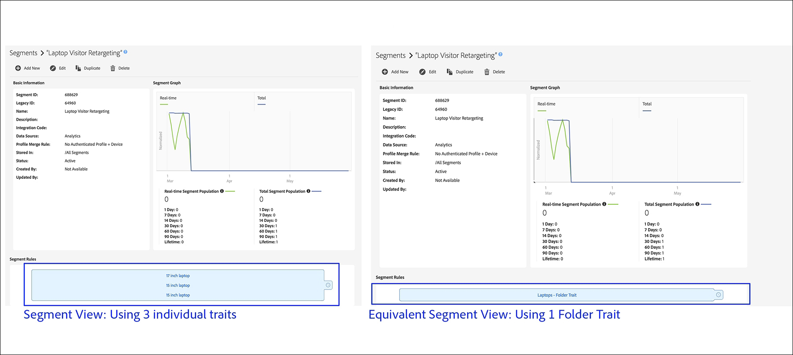
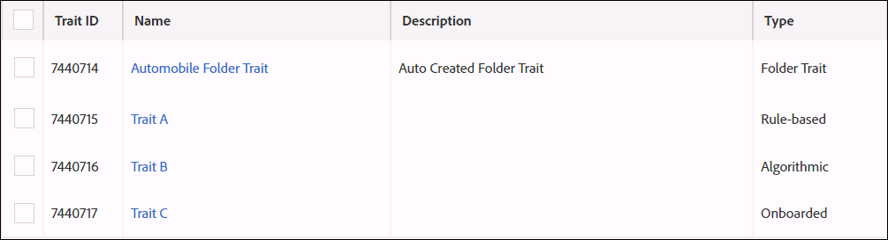

# フォルダー特性：詳細 {#folder-traits-about}

[!UICONTROL Folder traits]を使用すると、同じフォルダーとそのすべての子フォルダーに存在する特性を自動的に集計して、ターゲット可能なセグメントにすることができます。

## フォルダー特性を使用するメリット {#benefits}

[!UICONTROL folder trait]には、親フォルダーおよびその配下の子フォルダー内のすべての特性が含まれます。これにより、異なるフォルダーレベルのユーザーを自動でセグメント化し、ターゲットにできます。例えば、次のようなフォルダー構造があったとします。

`*`電子機器（親）

    `*`ノートパソコン（子）

        `*`ブランド（孫）

[!UICONTROL Folder traits]によって、これらのフォルダーのすべてのユーザーは、自動作成された [!DNL Electronics] [!UICONTROL Folder Trait]（親フォルダーの名前に基づく）の対象として認定されます。また、同じプロセスがファイル構造の下のレベルに向かって繰り返されます。この例では、フォルダー特性は、自動作成されたノートパソコンの[!UICONTROL Folder Trait] の、ノートパソコンおよびブランドフォルダーのすべてのユーザーを取り込みます。

[!UICONTROL Folder traits] は、セグメント式で選択可能です。[!UICONTROL folder trait]の選択は、そのフォルダーおよび配下のサブフォルダー内のすべての特性を [!UICONTROL OR] によるグループ化で選択する場合と同じです。

## フォルダー特性の適合 - 最新性と頻度 {#folder-traits-realization}

フォルダー特性の頻度は、そのフォルダーおよびサブフォルダー内の特性が適合した合計数となります。下の図は、自動車フォルダー内の特性 A、B および C を示します。各特性の適合数は以下のとおりであるとします。

* 特性 A：5
* 特性 B：1
* 特性 C：1

この場合、[!DNL Automobile Folder Trait] の適合数は 7 となります。

## フォルダー特性のレポート {#folder-traits-reporting}

[!UICONTROL Folder traits]では、配下のフォルダー構造内の特性のすべてのユーザーが対象となります。あるフォルダーから別のフォルダーに特性を移動すると、その変更は、特性ルールの変更と同様に、[データ収集サーバー](../../reference/system-components/components-data-collection.md)に反映されます。次のレポート実行のタイミングで、すべての日付範囲（1、7、14、30、60、90）にわたってこの変更が反映されるようレポートが更新されます。これより前にレポートされた数値は変更されません。

## ロールベースのアクセス制御（RBAC）の権限 {#role-based-access-controls}

[!UICONTROL Role-Based Access Controls]（[!UICONTROL RBAC]）を使用している会社の場合、適切な [!UICONTROL RBAC] 権限を持つユーザーは、[!UICONTROL folder trait] と関連付けられたデータソースを変更することができます。ユーザーは以下のいずれかを持つグループに属している必要があります。

* 特性のデータソースに対する `READ` および `WRITE` グループ権限。
* 特性のデータソースに対する `VIEW_ALL_TRAITS` および `EDIT_ALL_TRAITS` ワイルドカード権限。

[!UICONTROL RBAC] 権限の割り当て方法については、[管理に関するドキュメント](../../features/administration/administration-overview.md#create-group)を参照してください。

## 制限およびその他の考慮事項 {#limits}

| 項目 | 説明 |
|---|---|
| 特性タイプ | [!UICONTROL Onboarded traits] および [!UICONTROL algorithmic traits]は、最大 1 つの適合を、[!UICONTROL folder trait] の頻度に投稿します。 |
| フォルダー間での特性の移動 | あるフォルダーから別のフォルダーに特性を移動した場合、元のフォルダー特性の対象としての認定は解除され、新しい[!UICONTROL folder trait]の対象として認定されます。つまり、フォルダーから特性を削除または移動した場合、その特性の母集団のユーザーは、セグメントの式でそのフォルダー特性を使用しているセグメントから解除されます。 Adobe Analytics セグメントまたはレポートスイートをExperience Cloud 組織にマッピングする場合、Audience Manager は、対応する新しい、読み取り専用のセグメントおよび特性を自動的に作成します。Audience Manager からこれらの特性の保管場所を編集または変更することはできません。ただし、マッピングされた Adobe Analytics セグメントまたはレポートスイートに対する変更は、Audience Manager に反映されます。 |
| システム変数 | `d_sid` パラメーターを使用するイベントの呼び出しにおいて、[!UICONTROL Folder traits]への適合はおこなわれません。 |
| レポート | [!UICONTROL Folder traits] は自動計算された特性であり、**[!UICONTROL Overlap Reports]** には表示されません。 |
