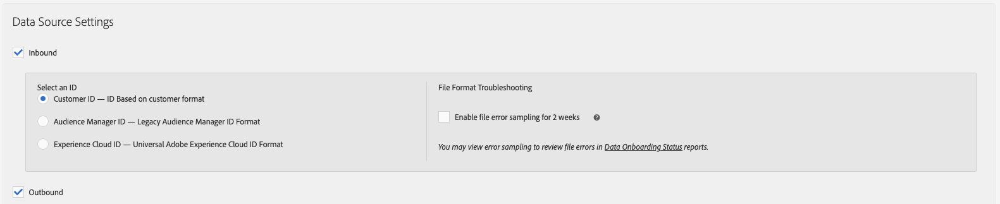

# アクティブオーディエンス特性とデータソース同期特性 {#active-audience-traits-and-data-source-synced-traits}

これらは、[!UICONTROL Addressable Audiences]で使用される特別な特性です。[!UICONTROL Active Audience] と [!UICONTROL Data Source Synced Traits] は [!UICONTROL Audience Data > Traits > Audience Traits] にあります。

>[!NOTE]
>
>アクセスには管理者権限が必要です。

## アクティブオーディエンス特性 {#active-audience-traits}

[!UICONTROL Active Audience]特性には、[!DNL Audience Manager] アカウントで管理下にあるすべてのデバイスが含まれています。セグメントの作成または編集時に、[!UICONTROL Active Audience Trait]特性を他の特性と同じように使用できます。また、[アドレス可能なオーディエンス](../../features/addressable-audiences.md)では、重複データの生成にこの特性が必要です。すべてのアカウントには、デフォルトで[!UICONTROL Active Audience]特性があります。この特性は削除できません。

## データソース同期特性 {#data-source-synced-traits}

[!UICONTROL Data Source Synced Traits]は、[データソースを作成または編集](../../features/manage-datasources.md#create-data-source)し、以下のいずれかの設定を適用すると、[!UICONTROL Audience Traits] フォルダー内に表示されます。

[!UICONTROL Data Source Synced Traits] は、データソースと関連付けられているすべてのユーザーを追跡します。セグメントの作成または編集時に、[!UICONTROL Data Source Synched Trait]を他の特性と同じように使用できます。[!UICONTROL Data Source Synced Trait]を作成すると、その特性名は、データソースで使用されている名前に一致します。データソースを編集すると、特性名が変更されます。この特性は削除できません。

>[!TIP]
>
>[!UICONTROL Data Source Synced Traits] はトラブルシューティングに役立ちます。特性名をクリックして、特性概要ページで指標を確認します。選択した特性がデータを返す場合は、ID 同期プロセスが適切にセットアップされて [!DNL Audience Manager] にデータを送信しています。

>[!MORELIKETHIS]
>
>* [アドレス可能なオーディエンス](../../features/addressable-audiences.md)

