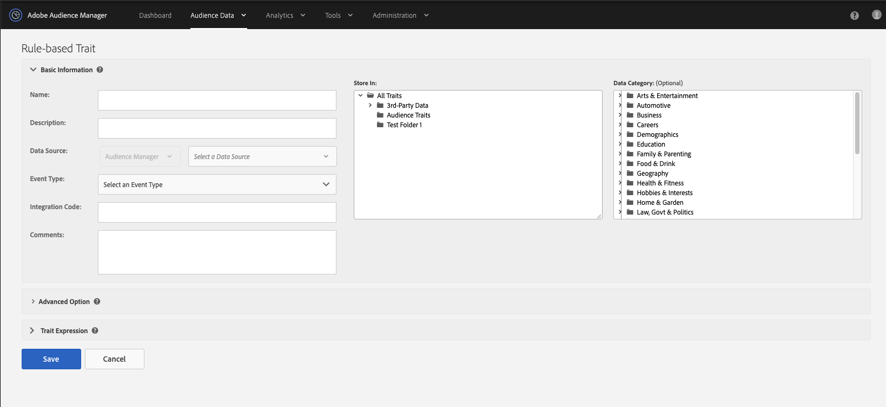

# 必要に応じてページアプリを作成 [!UICONTROL Rules-Based] [!UICONTROL Onboarded Traits] {#create-rules-based-or-onboarded-traits}

[!UICONTROL rules-based]および[!UICONTROL onboarded]特性の作成プロセスに特有のセットアップ手順や機能について説明します。

<!-- c_tb_rules_traits.xml -->

## 特性の基本情報 {#basics}

[!UICONTROL Trait Builder] では、[!UICONTROL Basic Information]設定を使用して、新しい[!UICONTROL traits]を作成したり、既存の特性を編集したりできます。[!UICONTROL Basic Information] 設定は、[!UICONTROL rules-based]、[!UICONTROL onboarded]、および [!UICONTROL algorithmic traits] で同じです。新しい[!UICONTROL trait]を作成するには、名前（特殊文字は使用しない）、[!UICONTROL data source]を指定し、「[!UICONTROL storage folder]」を選択します。それ以外の[!UICONTROL Basic Information]フィールドはオプションです。

<!-- c_tb_basics.xml -->

### 基本情報フィールドの定義

<table id="table_42AEC7A5B22346C5BB996D2D36C56229"> 
 <thead> 
  <tr> 
   <th colname="col1" class="entry"> インターフェイス要素 </th> 
   <th colname="col2" class="entry"> 説明 </th> 
  </tr> 
 </thead>
 <tbody> 
  <tr> 
   <td colname="col1"> <b> Name</b> </td> 
   <td colname="col2"> 
特性名。必須。 
 
最大長： 255 文字。 
 
 
注意：特性に名前を付ける場合、以下の特殊文字は使用しないでください。 
      <ul id="ul_AB38A333F21A4AA9B5656CBA69BA65E3"> 
       <li id="li_0E5033B540BC41E799075845388E85A7">コンマ </li> 
       <li id="li_B1A6C3E3FB98473A91E4675EE09460F0">ダッシュ </li> 
       <li id="li_579302FE34B64FE0AE3C751012839229">ハイフン </li> 
       <li id="li_44890F738CC64E449CC2545D701ECBC7">タブ </li> 
       <li id="li_C203837501A94342923C99A7DAD1ED61">縦棒またはパイプ記号 </li> 
      </ul> 
 
 
これは、<a href="../../integration/sending-audience-data/batch-data-transfer-explained/inbound-file-contents.md">受信データファイル転送</a>を設定する際の処理エラーを削減するのに役立ちます。 
 </td> 
  </tr> 
  <tr> 
   <td colname="col1"> <b> Description</b> </td> 
   <td colname="col2"> 特性の目的や機能を説明する短い文章。オプションです。 </td> 
  </tr> 
  <tr> 
   <td colname="col1"> <b> Data Source</b> </td> 
   <td colname="col2"> 特性を特定のデータプロバイダーに関連付けます。必須。 
最初のドロップダウンメニューを使用して、Audience Manager のデータソース、Adobe Analytics のレポートスイート、またはその両方をフィルタリングします。次に、2 番目のドロップダウンメニューを使用して、データソースを選択します。

 Adobe Analytics レポートスイートを使用しない場合、データソースタイプセレクターは無効になり、デフォルトで Audience Manager データソースのみに設定されます。
  </td> 
  </tr>
   <tr> 
   <td colname="col1"> <b> Event Type</b> </td> 
   <td colname="col2"> 通常、関数（例：コンバージョン、サイト訪問者、パートナー、ページビューなど）に従って、特性をタイプまたはカテゴリに割り当てます。オプションです。 
 コンバージョン特性の作成方法について詳しくは、<a href="https://docs.adobe.com/content/help/ja-JP/audience-manager-learn/tutorials/build-and-manage-audiences/traits-and-segments/creating-conversion-traits.html">Audience Manager でのコンバージョン特性の作成のビデオ</a>を参照してください。 
</td> 
  </tr> 
  <tr> 
   <td colname="col1"> <b> Integration Code</b> </td> 
   <td colname="col2"> ID、SKU または社内ビジネスプロセスで使用されるその他の値のためのフィールド。オプションです。 </td> 
  </tr> 
  <tr> 
   <td colname="col1"> <b> Comments</b> </td> 
   <td colname="col2"> 特性に関する一般的なメモ。オプションです。 </td> 
  </tr> 
  <tr> 
   <td colname="col1"> <b> Store In</b> </td> 
   <td colname="col2"> 特性が属するストレージフォルダーを決定します。必須。 </td> 
  </tr> 
  <tr> 
   <td colname="col1"> <b> Data Category</b> </td> 
   <td colname="col2"> 一般的に理解されているカテゴリに従って、特性を分類します。 
注意：特性は、単一のカテゴリのみに属します。オプションです。 
 </td> 
  </tr> 
 </tbody> 
</table>

## [!UICONTROL Trait]の有効期間の設定 {#set-expiration-interval}

[!UICONTROL Trait Builder]で[!UICONTROL Advanced Options]を使用すると、[!UICONTROL trait] の有効期間（[!DNL TTL]）を設定できます。[!DNL TTL] は、対象として認定された訪問者が[!UICONTROL trait]にとどまる日数を定義します（120 日がデフォルト）。これを 0 に設定すると、[!UICONTROL trait]メンバーシップは有効期限なしになります。

<!-- t_tb_ttl.xml -->

### [!UICONTROL trait] の TTL を設定する 

1. 「[!UICONTROL Advanced Options]」セクションを展開して、数値を入力し、[!UICONTROL trait]の [!DNL TTL] 値を設定します。
1. 「**[!UICONTROL Save]**」をクリックします。

   

>[!MORELIKETHIS]
>
>* [セグメント有効期間の説明](../../features/traits/segment-ttl-explained.md)

