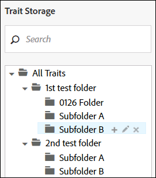
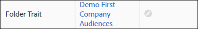

# フォルダー特性の管理 {#manage-folder-traits}

フォルダー特性を作成、編集および削除します。

## フォルダー特性の作成 {#create-folder-trait}

分類に新規フォルダーを作成すると、[!UICONTROL folder trait] が自動的に作成されます。

<!-- create-folder-trait.xml -->

1. **[!UICONTROL Audience Data > Traits]** へ進み、**Traits** ダッシュボードに移動します。
1. [!UICONTROL Trait Storage] ウィンドウで、

   * 「All Traits」テキストの上にマウスポインターを当て、新規のルートレベルフォルダーを追加します。
   * 既存の親フォルダーの下に、新規のサブフォルダーを追加します。

   

1. 「+」アイコンをクリックして、フォルダーを作成します。分類には、最大 2000 個のフォルダーを作成できます。詳細については、[使用制限](../../features/administration/usage-limits.md) のドキュメントを参照してください。
1. フォルダーの名前を指定して「**Save**」をクリックします。例えば、Electronics という名前のフォルダーが「Electronics Folder Trait」というフォルダー特性を持ちます。特性ダッシュボードで新規のフォルダー特性を表示したり選択したりすることができます。
1. 新規のフォルダー特性は、[!DNL Audience Manager] で生成されたデータソースに自動的に割り当てられます。適切な[!UICONTROL Role-Based Access Control]（[!DNL RBAC]）権限を持つユーザーは、フォルダー特性編集ワークフローでデータソースを変更できます。[フォルダー特性の編集](../../features/traits/manage-folder-traits.md#edit-folder-trait)を参照してください。

## フォルダー特性の編集 {#edit-folder-trait}

[!UICONTROL folder trait] の編集方法について説明します。

<!-- edit-folder-trait.xml -->

1. [!UICONTROL Traits] ダッシュボードで、編集するフォルダー特性の **[!UICONTROL Actions]** 列の上にマウスポインターを置きます。
1. 鉛筆アイコンをクリックして、特性を編集します。

   

1. **[!UICONTROL Edit]**&#x200B;ワークフローでは、フォルダー特性のデータソースを変更できます。目的のデータソースを選択して「**[!UICONTROL Save]**」をクリックします。データソースはドロップダウンボックスで [!DNL DPID] の数値順にソートされています。

   [!UICONTROL Role-Based Access Rights (RBAC)]を使用している企業の場合は、ユーザーは特性データソースへの[アクセス権限](../../features/traits/about-folder-traits.md#role-based-access-controls)が必要になります。

>[!NOTE]
>
>フォルダー特性の名前は直接変更できません。フォルダー特性の名前を変更するには、[関連付けられているストレージフォルダーの名前を変更](../../features/traits/trait-storage.md#rename-delete-trait-storage-folder)します。

## フォルダー特性の削除 {#delete-folder-trait}

フォルダー特性を削除するには、その特性が属するストレージフォルダーを削除します。

<!-- delete-folder-trait.xml -->

1. **Audience Data／Traits** を選択して、**Traits** ダッシュボードに移動します。
1. [!UICONTROL Trait Storage] ウィンドウで、フォルダーの上にマウスポインターを置いて「X」アイコンをクリックすると、そのフォルダーが削除されます。

   

>[!NOTE]
>
>セグメント式で使用されている場合は、フォルダー特性を削除できません。[特性ビュー](../../features/traits/trait-details-page.md)セクションに移動すれば、どのセグメントでフォルダー特性が使用されているかがわかります。その後、セグメント名をクリックして[セグメント概要ビュー](../../features/segments/segment-summary-view.md)を開けば、セグメント式から特性を削除できます。
