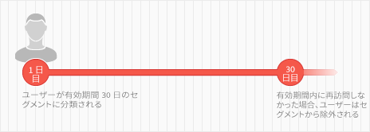
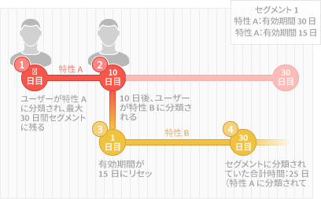

# Segment and Trait Time-to-Live Explained {#segment-time-to-live-explained}

How trait [!UICONTROL time-to-live] ([!DNL TTL]) interval affects segment membership.

<!-- segment-ttl-explained.xml -->

## 有効期間

[!DNL TTL] は、最後の特性資格認定イベントの後、サイト訪問者がセグメントにとどまっている期間を定義します。[!DNL TTL] は、セグメントではなく、特性に対して設定されます。訪問者は、[!DNL TTL] 期間が終了するまでに対象となる特性が確認されない場合、セグメントから除外されます。新しい特性に対するデフォルトの [!DNL TTL] は 120 日です。0 日に設定すると、特性は有効期限なしになります。[TTL 値を設定](../../features/traits/create-onboarded-rule-based-traits.md#set-expiration-interval)します（特性作成インターフェイスの「」セクションで特性を作成または編集する場合）。[!UICONTROL Advanced Options]

## [!DNL TTL] とセグメントからのドロップアウト

ユーザーは、[!DNL TTL] 期間内にいずれの特性も確認されない場合、セグメントから除外されます。例えば、[!DNL TTL] が 30 日の 1 つの特性セグメントがある場合、30 日以内に再びその特性が確認されないと、ユーザーはそのセグメントからドロップアウトします。

## [!DNL TTL] とセグメントの更新

[!DNL TTL] 期間内にそのセグメントの特性が確認されると、[!DNL TTL] がリセットされ、ユーザーはセグメントにとどまります。また、ほとんどのセグメントにはそれぞれ独自の [!DNL TTL] 期間を持つ複数の特性が含まれているので、ユーザーは、セグメントに関連付けられた任意の特性が確認され続けている限り、セグメントにとどまることができます（[!DNL TTL] 期間はリセットされます）。例えば、特性 A（30 日の [!DNL TTL]）と特性 B（15 日の [!DNL TTL]）で構成されるセグメント 1 があるとします。ユーザーについて各特性が 1 回だけ確認されていると仮定した場合の、[!DNL TTL] 更新プロセスおよびセグメントに属している期間の合計を以下の図で説明します。

## [!DNL Audience Manager] ttlsは、サードパーティのTTL設定とは独立しています

Remember, the [!DNL TTL] set on your [!DNL Audience Manager] pixel operates independently from the [!DNL TTL] set on other pixels used by third parties ([!DNL DSP]s, ad networks, etc.).

>[!MORE_LIKE_THIS]
>
>* [特性の有効期間の設定](../../features/traits/create-onboarded-rule-based-traits.md#set-expiration-interval)

