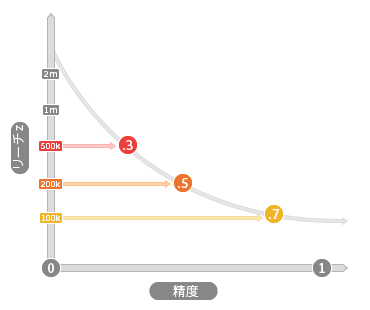

# 精度とリーチ {#accuracy-and-reach}

アルゴリズムの特性における精度とリーチの関係について説明します。

<!-- c_accuracy_reach.xml -->

## 精度とリーチに関して

アルゴリズムの特性の使用にあたっては、精度とリーチの間の関係を理解することが重要となります。精度は、ユーザーがどれ位ベースラインに類似しているかを示すスコア値によって表現されます。精度の範囲は 0（最も低い精度）から 1（最も高い精度）の間となります。リーチとは単に、特性に含めるユニークユーザーの数を示す値となります。リーチと精度はそれぞれ逆相関の関係にあります。特性の精度が高くなると、リーチできるユーザーが少なくなり、リーチ数が多い特性の精度は低くなります。下の図はこの概念を説明したものです。

## 精度とリーチが持つオーディエンスサイズへの影響

アルゴリズムの特性を使用するにあたって、精度とリーチに関する適切な判断はビジネス目標に照らしておこなうことができます。精度を目標とする場合、モデルが実行されるたびに特性の母集団が増加または削減することがあります。各評価期間にアルゴリズムが下す判断に応じて母集団が変化します。アルゴリズムによって、ある処理サイクル内ではより多くの適合ユーザーが検出されることもあれば、別の処理サイクル内ではより少ない数が検出されることもあります。結果は、モデルの作成に使用されたベースライン、および前回のモデル実行以降に発生した新規訪問者数と特性への適合数に基づき決定されます。一方、リーチの処理においてはユーザー母集団の数は一定となります。例えば、10,000 ユーザーにリーチする場合、モデルが実行されるたびに、アルゴリズムによって必ずこの数に達するようになります。

## 精度とリーチの一般的なユースケース

精度またはリーチのどちらに注目するかは、特定のセグメントで何を達成したいかによって決まります。次の表は、特性の作成時に精度とリーチを評価する際に役立ちます。

| 特性の決定で優先されるもの | 検出できるもの |
|---|---|
| **精度** | モデルのベースラインとなる顧客に類似するユーザー。ある特定のオーディエンスにリーチするターゲットキャンペーンに効果的です。 |
| **リーチ** | 実行された各データについての具体的なユーザー数。ある特定サイズのオーディエンスにリーチすることを目的とするブランドキャンペーンに効果的です。 |