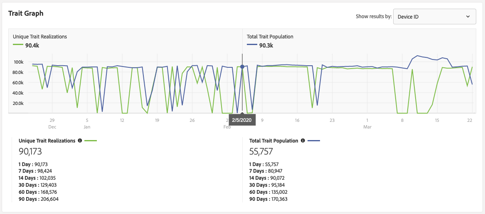
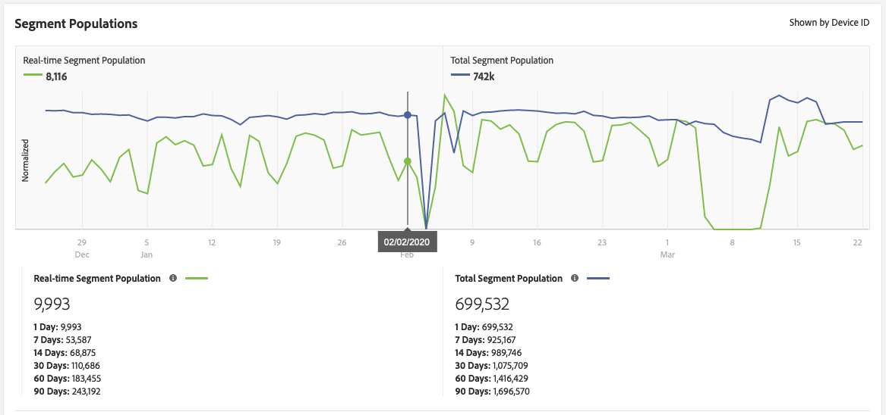

# 特性およびセグメントの選定に関するリファレンス {#trait-qualification-reference}

Audience Manager では、特性選定（特性の満足）の処理方法は特性のタイプによって異なります。特性タイプの選定について詳しくは、「[特性タイプ別の特性選定](#trait-type)」を参照してください。

また、セグメントの選定について詳しくは、[リアルタイムセグメント母集団と合計セグメント母集団](#real-time-segment)を参照してください。

## 特性タイプ別の特性認定 {#trait-type}

| 特性タイプ | 選定条件 |
|---|---|
| ルールベースの特性 | 特性認定は、ユーザーがブラウザーで特性について認定されるとリアルタイムで発生します。ユーザーのルールベースの特性認定は、お客様が UI で[その特性を作成してから](create-onboarded-rule-based-traits.md#create-rules-based-or-onboarded-traits)約 4 時間後に始まります。ルールベースの特性では、広告頻度キャップやその他のユースケース向けに[最新性と頻度](../segments/recency-and-frequency.md)のコントロールを使用できます。 |
| オンボードの特性 | 特性の選定は、インバウンドファイルが処理された後に行われます。つまり、インバウンドファイルは[Audience Manager](../../faq/faq-inbound-data-ingestion.md)に読み込まれ、特性の選定が行われます。 オンボードの特性を作成してから受信ファイルをアップロードして処理するまでに、約 4 時間待つ必要があります。オンボードの特性では、ユーザープロファイルごとの最大認定数は 1 件です。 |
| アルゴリズム特性 | アルゴリズム特性では、ユーザープロファイルごとの最大認定数は 1 件です。 |
| フォルダー特性 | フォルダー特性では、含まれる特性の特性選定が累積します。詳細は、[フォルダー特性について](about-folder-traits.md)をお読みください。 |
| アクティブオーディエンス特性とデータソース同期特性 | [!UICONTROL Active Audience] 特性には、Audience Manager アカウントで管理下にあるすべてのデバイスが含まれています。[!UICONTROL Data Source Synced Traits] は、データソースと関連付けられているすべてのユーザーを追跡します。詳しくは、[アクティブオーディエンス特性とデータソース同期特性](client-activity-synced-audience-traits.md)を参照してください。 |

## 一意の特性適合および特性母集団の総数 {#unique-trait-realizations}

グラフに表示する結果のタイプ（[!UICONTROL Device ID] または [!UICONTROL Cross-Device ID]）に応じて、指標の意味は異なります。

結果を [!UICONTROL Device ID] でフィルタリングする場合：

* [!UICONTROL Unique Trait Realizations] は、様々な期間において、特性を自分のプロファイルに追加した匿名デバイス訪問者の数を表します。
* [!UICONTROL Total Trait Population] は、プロファイルにこの特性がある匿名デバイス訪問者の数を表します。

結果を [!UICONTROL Cross-Device ID] でフィルタリングする場合：

* [!UICONTROL Unique Trait Realizations] は、様々な期間において、特性を自分のプロファイルに追加した認証済み訪問者の数を表します。
* [!UICONTROL Total Trait Population] は、プロファイルにこの特性がある認証済み訪問者の数を表します。

これらの数字については次のように考えます。上の画像では、[特性の詳細](../../features/traits/trait-details-page.md) ビューから、90,173は、昨日プロパティにアクセスしたアクティブなデバイスの数を表しています。 [!UICONTROL Total Trait Population] は 55,757 ですが、これは現在この特性の対象として認定されているユーザーの数を表します。[!UICONTROL Total Trait Population] の数は、セグメント化／ターゲティングに使用できるユーザーの合計数を表しています。通常、ユーザーが特性の一部となっている期間は 120 日間です。

2 つの母集団の計算にはそれぞれ異なる 2 つの演算ジョブを実行しているので、[!UICONTROL Total Trait Population] は常に [!UICONTROL Unique Trait Realizations] より 24 時間遅れることになります。上のグラフでは、2 月 5 日時点での [!UICONTROL Unique Trait Realizations] は 約 90,400、[!UICONTROL Total Trait Population] は約 90,300 となっています。次の日に、90,400 件のプロファイルが [!UICONTROL Total Trait Population] に加算されます。

つまり、現時点で 10,000 人の訪問者があった場合、この訪問者数は翌日の [!UICONTROL Unique Trait Realizations] に反映されますが、[!UICONTROL Total Trait Population] に反映されるのはその 24 時間後になります。

特性適合の変更は、セグメントの母集団に反映されます。

## リアルタイムのセグメント母集団と合計セグメント母集団 {#real-time-segment}

[!UICONTROL Real-time Segment Population] は、指定した期間内に選択したセグメントの対象となり、プロパティに到達したデバイスの数を表します。

[!UICONTROL Total Segment Population] は、指定した期間内に選択したセグメントの対象となるデバイスの数を表します。この [!UICONTROL 1 Day] レポートは、最新のセグメント母集団数を表します。

これらの数字については次のように考えます。上の画像では、[ セグメントの詳細](../../features/segments/segment-summary-view.md) ビューから、9,993は、アクティブなデバイスの数、昨日プロパティにアクセスし、セグメントに適格なデバイスの数を表します。 [!UICONTROL Total Segment Population] は 699,532 ですが、これは現在このセグメントの対象として認定されているデバイスの合計数を表します。[!UICONTROL Total Segment Population] の数は、セグメント化／ターゲティングに使用できるデバイスの合計数を表しています。

2 つの母集団の計算にはそれぞれ異なる 2 つの演算ジョブを実行しているので、[!UICONTROL Total Segment Population] は常に [!UICONTROL Real-time Segment Population] より 24 時間遅れることになります。上のグラフでは、2 月 2 日時点での [!UICONTROL Real-time Segment Population] は 8,116、[!UICONTROL Total Segment Population] は 742,000 となっています。次の日に、8,116 件のプロファイルが [!UICONTROL Total Segment Population] に加算されます。

つまり、現時点で 10,000 人の訪問者があった場合、この訪問者数は翌日の [!UICONTROL Real-time Segment Population] に反映されますが、[!UICONTROL Total Segment Population] に反映されるのはその 24 時間後になります。

## 特性認定の上限 {#trait-qualification-limit}

各ユーザープロファイルには、それが認証済みプロファイル（[DPUUID](../../reference/ids-in-aam.md)）とデバイス ID（[UUID](../../reference/ids-in-aam.md)）のどちらであっても、150,000 の特性選定制限が適用されます。DPUUID は [!DNL Audience Manager] の特定のインスタンスに固有のものですが、UUID は [!DNL Audience Manager] プラットフォーム全体で共有されます。[!UICONTROL UUID] の場合、特性選定の保存時には公平性ポリシーが適用されます。所定のアルゴリズムにより、[!DNL Audience Manager] のすべてのインスタンスで、[!UICONTROL UUID] プロファイルの均等配分ができます。
