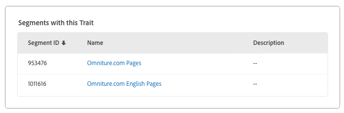

# [!UICONTROL Trait]の詳細ページ {#trait-details-page}

個々の[!UICONTROL trait]の詳細ページには、[!UICONTROL trait]名、ID、パフォーマンス指標、[!UICONTROL trait]を定義する式、特性が属するセグメント、[!UICONTROL trait]監査ログなど、[!UICONTROL trait]の詳細の概要が表示されます。これらの詳細を表示するには、**[!UICONTROL Audience Data]**／**[!UICONTROL Traits]** を選択し、対象となる[!UICONTROL trait]の名前をクリックします。

## [!UICONTROL Trait]管理ツール {#trait-management-tools}

[!UICONTROL trait]の詳細ページの上部に、[!UICONTROL traits]を管理するために使用できるツールがあります。

1. **[!UICONTROL Add New]**：このオプションを使用して、新規 [!UICONTROL rule-based]、[!UICONTROL algorithmic]または[!UICONTROL onboarded traits]を作成します。
2. **[!UICONTROL Edit]**：このオプションを使用して、現在の[!UICONTROL trait]の設定を変更します。
3. **[!UICONTROL Delete]**：このオプションを使用して、Audience Manager アカウントから現在の[!UICONTROL trait]を削除します。
4. **[!UICONTROL Marketplace Recommendations]**：このオプションを使用して、購読していない[!UICONTROL traits]データフィードから、表示している[!UICONTROL Audience Marketplace]に類似した特性を見つけます。[!UICONTROL Marketplace]へのナビゲート方法および類似した特性を見つける方法について詳しくは、[データ購入者向けの Audience Marketplace](../audience-marketplace/marketplace-data-buyers/marketplace-data-buyers.md) を参照してください。

## [!UICONTROL Trait] 情報 {#basics}

「[!UICONTROL Trait Information]」セクションには、[!UICONTROL trait] の作成時に入力した必須フィールドとオプションフィールドの詳細が表示されます。これには、[!UICONTROL trait] タイプ、[!UICONTROL trait] ID、説明、[!UICONTROL data source]、その他のメタデータなどが含まれます。これらの詳細は、[!UICONTROL trait] タイプ（[!UICONTROL folder]、[!UICONTROL onboarded]または [!UICONTROL rule-based]）によって異なります。

## [!UICONTROL Trait Graph] {#trait-graph}

[!UICONTROL Trait Graph]は、選択した[!UICONTROL trait]のパフォーマンス指標をわかりやすく示しています。トレンドラインにカーソルを移動すると、選択した[!UICONTROL trait]の追加データが表示されます。

「[!UICONTROL Unique Trait Realizations]」は、特定の期間内にこの[!UICONTROL trait]をプロファイルに追加したユニークユーザーの数を表します。「[!UICONTROL Total Trait Population]」は、現在この[!UICONTROL trait]について認定されているユニークユーザーの数を表します。

[!UICONTROL rule-based traits]の場合、[!UICONTROL trait]認定は、ユーザーがブラウザーで[!UICONTROL trait]について認定されるとリアルタイムで発生します。

[!UICONTROL onboarded traits]の場合は、受信ファイルの処理後に認定がおこなわれます。（例：[!UICONTROL trait]受信ファイルが [Audience Manager に送られ](../../faq/faq-inbound-data-ingestion.md)、[!UICONTROL trait]認定がおこなわれたとき）

[!UICONTROL Trait Graph]には、次の情報が表示されます。

* **[!UICONTROL Show results by]**
   * **[!UICONTROL Cross-Device ID]**：認証済みプロファイルのデータを収集している[!UICONTROL traits]の結果を表示するには、このオプションを選択します。このオプションを選択すると、[!UICONTROL Cross-Device ID] レポートにはデータのみが表示され、[!UICONTROL Device ID] レポートにはデータは表示されません。
   * **[!UICONTROL Device ID]**：デバイスプロファイルのデータを収集している[!UICONTROL traits]の結果を表示するには、このオプションを選択します。このオプションを選択すると、[!UICONTROL Device ID] レポートにはデータのみが表示され、[!UICONTROL Cross-Device ID] レポートにはデータは表示されません。

      

* **[!UICONTROL Unique Trait Realizations]**：特定の期間にこの[!UICONTROL trait]をプロファイルに追加したユニークユーザーの数。
* **[!UICONTROL Total Trait Population]**：現在この[!UICONTROL trait]で絞り込まれているユニークユーザーの数。

* **[!UICONTROL Identity Type Breakdown]**：最初の 3 つのエントリには、[!UICONTROL trait]に適合する母集団が最も大きい、上位 3 つの[!UICONTROL cross-device data sources]が降順に表示されます。4 番目のエントリには、上位 3 つにない[!UICONTROL cross-device data sources]から[!UICONTROL trait]に適合するその他すべての [!DNL DPUUIDs]（[!DNL CRM IDs]）の合計が表示されます。このレポートは、ページの右上にある [!UICONTROL Show Results By] ドロップダウンメニューで「[!UICONTROL Cross-device ID]」を選択した場合にのみ表示されます。デフォルトのドロップダウンオプションは [!UICONTROL Device ID] で、このレポートは表示されません。

   

   >[!NOTE]
   >
   >Audience Manager では、[!UICONTROL trait]に適合する[!UICONTROL cross-device] ID がある場合にのみ、[!UICONTROL Identity Type Breakdown]レポートが表示されます。

   >[!VIDEO](https://video.tv.adobe.com/v/27977/?captions=jpn)

## [!UICONTROL Trait] 式 {#trait-expression}

「[!UICONTROL Trait Expression]」セクションには、ユーザーが[!UICONTROL trait]について認定されるために満たさなければならない条件が表示されます。これらのルールは、[特性を作成または編集](../../features/traits/about-trait-builder.md)するときに設定されます。

## [!UICONTROL Trait]セグメント {#trait-segments}

「[!UICONTROL Segments with this Trait]」セクションには、選択した[!UICONTROL trait]が属するすべてのセグメントのリストが表示されます。セグメント名をクリックすると、そのセグメントの詳細が表示されます。

## [!UICONTROL Trait]監査／履歴ログ {#trait-audit-history}

[!UICONTROL rule-based]および[!UICONTROL onboarded traits]の場合、「[!UICONTROL Trait Expression Change History]」には、[!UICONTROL trait]式ルールに対する直近 10 件の変更と、その変更をおこなったユーザーが表示されます。[!UICONTROL trait]に対する変更が 10 件を超える場合、**[!UICONTROL Export to CSV]**&#x200B;をクリックすると監査ログ全体をダウンロードできます。[!UICONTROL folder]または[!UICONTROL algorithmic traits]で監査ログを使用できません。

>[!NOTE]
>
>[!UICONTROL By User] 列に「[!UICONTROL Not Available]」と表示される場合、そのユーザーのアカウントが削除されていることを表します。

